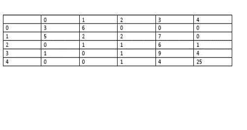

# 高中数学成绩预测

> 原文：<https://medium.com/analytics-vidhya/high-school-math-performance-prediction-a10a990be886?source=collection_archive---------8----------------------->


安托万·道特里在 [Unsplash](https://unsplash.com?utm_source=medium&utm_medium=referral) 上拍摄的照片

**简介**

在数学教育领域，大学和教育工作者面临的一个主要问题是，学生在数学方面没有达到令人满意的水平，也没有以令人满意的速度取得成功。大学和教育工作者抱怨学生的高失败率、退学率和退学率。这对学生来说是一个问题，因为数学成绩差阻碍了他们追求学位和职业。这对大学和教育工作者来说是一个问题，因为这意味着大学或教育工作者没有成功地教授学生，没有留住学生，没有满足学生的需求——这些问题损害了大学和教育工作者的盈利能力和吸引力。

如果我们能够获得一些关于哪些因素最有助于或损害学生数学成绩的见解，我们就有可能解决上述问题。如果我们能够产生预测模型，预测学生是否会通过或失败，预测学生在数学评估中的数字分数，预测学生的整体实力和前途，那么大学和教育工作者将能够使用这些模型更好地将学生置于适当的能力水平，更好地选择录取学生，并更好地了解可以改善的因素，以帮助学生取得成功。

在本文中，我们将对代表两所葡萄牙高中学生数学成绩的数据集进行数据科学和机器学习。

在之前的一篇文章中，可以在[高中数学成绩回归](/analytics-vidhya/high-school-math-performance-523d5839d7d7)中找到，我对数据集应用了回归方法来预测 G3 的值。在本文中，我想将 G3 分数分为五个等级，并尝试根据学生的 G3 分数将他们归入五个等级中的一个。这就变成了一个 5 类分类问题，我们可以把机器学习的分类方法应用到这个问题上。

**数据准备**

数据文件用分号而不是逗号分隔。我用逗号代替了分号。然后，将所有内容复制并粘贴到记事本中。然后，使用以下链接中的步骤转换为 csv 文件:

[https://knowledge base . constant contact . com/articles/knowledge base/6269-convert-a-text-file-to-a-excel-file？lang=en_US](https://knowledgebase.constantcontact.com/articles/KnowledgeBase/6269-convert-a-text-file-to-an-excel-file?lang=en_US)

现在，我有一个很好的 csv 文件。

共有 30 个属性，包括学生年龄、父母的教育程度、父母的工作、每周学习时间、缺席次数、以往课程失败次数等。有一年级、二年级和三年级；这些由 G1、G2 和 G3 表示。分数从 0 到 20 不等。G1 和 G2 可以用作输入特征，而 G3 将是主要的目标输出。

一些属性是顺序的，一些是二进制的是-否，一些是数字的，一些是名义的。我们确实需要做一些数据预处理。对于二进制的是-否属性，我将使用 0 和 1 对它们进行编码。属性 famrel、freetime、goout、Dalc、Walc 和 health 是有序的；这些值的范围从 1 到 5。属性 Medu、Fedu、traveltime、studytime、failures 也是有序的；值的范围从 0 到 4 或 1 到 4。属性“缺席”是一个计数属性；值的范围从 0 到 93。属性 sex、school、address、Pstatus、Mjob、Fjob、guardian、famsize、reason 是名义上的。对于名义属性，我们可以使用一键编码。年龄、G1、G2 和 G3 属性可视为区间属性。

我一次性编码了每个名义属性，一次一个。我每次都将数据帧导出为 csv 文件，并在导出过程中重新标记列。最后，我对列进行了重新排序。

以下是 python 代码:

```
import numpy as npimport pandas as pddataset = pd.read_csv(‘C:\\Users\\ricky\\Downloads\\studentmath.csv’)X = dataset.iloc[:,:-1].valuesY = dataset.iloc[:,32].valuesfrom sklearn.preprocessing import LabelEncoder, OneHotEncoderlabelencoder_X = LabelEncoder()# Encoding binary yes-no attributesX[:,15] = labelencoder_X.fit_transform(X[:,15])X[:,16] = labelencoder_X.fit_transform(X[:,16])X[:,17] = labelencoder_X.fit_transform(X[:,17])X[:,18] = labelencoder_X.fit_transform(X[:,18])X[:,19] = labelencoder_X.fit_transform(X[:,19])X[:,20] = labelencoder_X.fit_transform(X[:,20])X[:,21] = labelencoder_X.fit_transform(X[:,21])X[:,22] = labelencoder_X.fit_transform(X[:,22])# Encoding nominal attributesX[:,0] = labelencoder_X.fit_transform(X[:,0])X[:,1] = labelencoder_X.fit_transform(X[:,1])X[:,3] = labelencoder_X.fit_transform(X[:,3])X[:,4] = labelencoder_X.fit_transform(X[:,4])X[:,5] = labelencoder_X.fit_transform(X[:,5])X[:,8] = labelencoder_X.fit_transform(X[:,8])X[:,9] = labelencoder_X.fit_transform(X[:,9])X[:,10] = labelencoder_X.fit_transform(X[:,10])X[:,11] = labelencoder_X.fit_transform(X[:,11])onehotencoder = OneHotEncoder(categorical_features = [0])X = onehotencoder.fit_transform(X).toarray()from pandas import DataFramedf = DataFrame(X)export_csv = df.to_csv (r’C:\Users\Ricky\Downloads\highschoolmath.csv’, index = None, header=True)
```

此时，数据集的最后一列由 G3 的整数组成。分数 16-20 将形成等级 1，分数 14-15 将形成等级 2，分数 12-13 将形成等级 3，分数 10-11 将形成等级 4，分数 0-9 将形成等级 5。我们可以通过将每个分数转换为其中一个类别来创建类别 1–5 的最终列。

下面是实现这一点的 python 代码:

```
#Defining a function that converts G3 to one of the five classesdef filter_class(score):if score<10:return 5elif score<12:return 4elif score<14:return 3elif score<16:return 2else:return 1#defining a new column called 'class' and dropping column 'G3'dataset_trap['class'] = dataset_trap['G3'].apply(filter_class)dataset_trap = dataset_trap.drop(['G3'], axis=1)
```

现在，我们的数据集已经准备好应用分类方法了。

**逻辑回归**

我们用 dataset_trap 定义 X 和 Y。然后，我们将数据集分为训练集和测试集，对 X_train 和 X_test 应用特征缩放，对训练集进行逻辑回归拟合，并预测测试集结果。

以下是 python 代码:

```
#Define X and Y using dataset_trapX = dataset_trap.iloc[:,:-1].valuesY = dataset_trap.iloc[:,-1].values#Splitting the dataset into the Training set and Test setfrom sklearn.model_selection import train_test_splitX_train, X_test, Y_train, Y_test = train_test_split(X,Y,test_size = 0.2, random_state = 0)#Feature Scalingfrom sklearn.preprocessing import StandardScalersc_X = StandardScaler()X_train = sc_X.fit_transform(X_train)X_test = sc_X.fit_transform(X_test)#Fitting Logistic Regression to the Training setfrom sklearn.linear_model import LogisticRegressionclassifier = LogisticRegression()classifier.fit(X_train,Y_train)#Predicting the Test set resultsY_pred = classifier.predict(X_test)
```

现在，我们有了测试集 Y 值的预测 Y 值。通过查看混淆矩阵，我们可以看到我们的模型有多准确:



混淆矩阵对角线上的数字表示正确分类的数量。因此，为了发现我们的模型有多精确，我们将添加对角线条目并除以测试集结果的总数，即 79。

以下是创建混淆矩阵的 python 代码:

```
#Making the confusion matrixfrom sklearn.metrics import confusion_matrixcm = confusion_matrix(Y_test, Y_pred)cm.trace()/79
```

模型的准确性可以通过正确预测的数量除以测试集结果的总数来衡量。在这种情况下，准确率为 50%。这不是很令人印象深刻。

**K 个最近邻居**

使用欧几里德距离和 k=5 个邻居在我们的训练集上训练 k-最近邻居模型。python 代码与逻辑回归代码非常相似，只是我们用 k 近邻模型替换了逻辑回归模型。以下是完整的 python 代码:

```
#Importing the librariesimport numpy as npimport pandas as pdimport matplotlib.pyplot as plt#Importing the datasetdataset = pd.read_csv("studentmathdummified.csv")#Avoiding the dummy variable trap#Dropping GP, Male, urban,LE3, Apart,mother_at_home, father_at_home, reason_course, guardian_otherdataset_trap = dataset.drop(dataset.columns[[0,2,4,6,8,10,15,20,26]],axis=1)#Defining a function that converts G3 to one of the five classesdef filter_class(score):if score<10:return 5elif score<12:return 4elif score<14:return 3elif score<16:return 2else:return 1#defining a new column called 'class' and dropping column 'G3'dataset_trap['class'] = dataset_trap['G3'].apply(filter_class)dataset_trap = dataset_trap.drop(['G3'], axis=1)#Define X and Y using dataset_trapX = dataset_trap.iloc[:,:-1].valuesY = dataset_trap.iloc[:,-1].values#Splitting the dataset into the Training set and Test setfrom sklearn.model_selection import train_test_splitX_train, X_test, Y_train, Y_test = train_test_split(X,Y,test_size = 0.2, random_state = 0)#Feature Scalingfrom sklearn.preprocessing import StandardScalersc_X = StandardScaler()X_train = sc_X.fit_transform(X_train)X_test = sc_X.fit_transform(X_test)#Fitting K nearest neighbors to the Training setfrom sklearn.neighbors import KNeighborsClassifierclassifier = KNeighborsClassifier(n_neighbors = 5, metric = 'minkowski', p =2)classifier.fit(X_train,Y_train)#Predicting the Test set resultsY_pred = classifier.predict(X_test)#Making the confusion matrixfrom sklearn.metrics import confusion_matrixcm = confusion_matrix(Y_test, Y_pred)cm.trace()/79
```

我们模型的准确率是 28%，真的很差。

**支持向量机**

支持向量机被设计成当只有两个类别时执行分类。然而，当有两个以上的类时，有一种方法可以使用 svm，就像我们有五个类的情况一样。一种方法是使用所谓的一对一方案。在一对一方案中，我们为每一对可能的类建立一个 svm 模型。对于 K 级分类，有 K 个选择 2 对。因此，在我们的例子中，有 10 对类。我们可以应用构建 10 个支持向量分类器，并通过将所有 10 个支持向量分类器应用于测试点并选择测试点被分类为该类的次数最高的类来预测给定测试点的类。python 代码与之前的分类器相同，只是我们用支持向量分类器替换了分类器:

```
#Fitting support vector classifier to the Training set using one-versus-onefrom sklearn.svm import SVCclassifier = SVC(kernel='linear')classifier.fit(X_train,Y_train)
```

我们模型的准确率是 62%。

当有两个以上的类时，使用 svm 的另一种方法是使用一对所有的方案。在这个方案中，K 个模型是通过将每个类与其他类配对来构建的。在我们的例子中，制造了 5 个模型。为了预测给定测试点的类别，我们将所有 5 个模型应用于该测试点，并选择该测试点与该类别的相应模型的最大边缘超平面的垂直距离最大的类别。换句话说，我们选择相应的模型最有把握将测试点分类为该类的类。以下是 python 代码:

```
#Fitting support vector classifier to the Training set using one-versus-restfrom sklearn.svm import LinearSVCclassifier = LinearSVC()classifier.fit(X_train,Y_train)
```

我们模型的准确率是 56%。

我尝试使用 rbf 内核，获得了 44%的准确率。

```
#Fitting support vector classifier to the Training set using one-versus-one and rbf kernelfrom sklearn.svm import SVCclassifier = SVC(kernel='rbf', random_state=0)classifier.fit(X_train,Y_train)
```

默认的正则化参数 C 是 1。我将正则化参数提高到 4，得到了 45.5%的准确率。将正则化参数提高到 10 给出 48%的准确度。

```
#Fitting support vector classifier to the Training set using one-versus-one and rbf kernel and C=10from sklearn.svm import SVCclassifier = SVC(kernel='rbf', C=10, random_state=0)classifier.fit(X_train,Y_train)
```

增加 C 的值意味着我们对有多少点被错误分类更加严格；它对应于具有较小边界的分离超平面。换句话说，通过增加 C，我们减少了违反保证金的余地。降低 C 的值对应于对错误分类更加宽容；它对应于具有更大间隔的分离超平面。随着 C 值的增加，我们看到精度上升。

我还尝试了 sigmoid 内核，C=30，得到了 62%的准确率。将 C 的值降低到小于 30 或者将 C 的值提高到大于 30 会降低精确度。

```
#Fitting support vector classifier to the Training set using one-versus-one and sigmoid kernel and C=30from sklearn.svm import SVCclassifier = SVC(kernel='sigmoid', C=30, random_state=0)classifier.fit(X_train,Y_train)
```

**决策树**

在这个方法中，我们要种一棵树。分裂标准被选择为熵，并且特征缩放是不必要的。当我将决策树分类器应用于测试集时，我获得了 72%的准确率。

```
#Fitting decision tree classifier to the Training setfrom sklearn.tree import DecisionTreeClassifierclassifier = DecisionTreeClassifier(criterion=’entropy’)classifier.fit(X_train,Y_train)
```

我将分割内部节点所需的最小样本数设置为 10，将叶节点所需的最小样本数设置为 5。这将准确率提高到了 77%。

```
#Fitting decision tree classifier to the Training set with minimum number of samples required to split 10 and minimum number of leaf samples 5from sklearn.tree import DecisionTreeClassifierclassifier = DecisionTreeClassifier(criterion='entropy', min_samples_split=10, min_samples_leaf=5)classifier.fit(X_train,Y_train)
```

**随机森林**

用这种方法，我们要种一堆树。分裂标准被选择为熵，并且不使用特征缩放。当我使用 10 棵树将随机森林分类器应用于测试集时，我得到了 62%的准确率:

```
#Fitting random forest classifier to the Training setfrom sklearn.ensemble import RandomForestClassifierclassifier = RandomForestClassifier(criterion='entropy', n_estimators=10)classifier.fit(X_train,Y_train)
```

我将分割内部节点所需的最小样本数设置为 10，将叶节点所需的最小样本数设置为 5。我还把树的数量增加到了 100 棵。这将准确率提高到了 74%:

```
#Fitting random forest classifier to the Training set with 100 trees and minimum samples required to split 10 and minimum samples at a leaf 5from sklearn.ensemble import RandomForestClassifierclassifier = RandomForestClassifier(criterion='entropy', n_estimators=100, min_samples_split=10, min_samples_leaf=5)classifier.fit(X_train,Y_train)
```

为了进一步提高准确性，我将 max_features 设置为 None:

```
#Fitting random forest classifier to the Training set with 100 trees, min_samples_split=10, min_samples_leaf=5, and max_features=Nonefrom sklearn.ensemble import RandomForestClassifierclassifier = RandomForestClassifier(criterion='entropy', n_estimators=100, max_features=None, min_samples_split=10, min_samples_leaf=5)classifier.fit(X_train,Y_train)
```

我得到了 78%的准确率。

**型号选择**

为了确定哪个模型是最好的，我们将对每个模型执行 k 重交叉验证(k=10 ),并选择具有最佳准确性的模型。

对于逻辑回归，我得到了 57%的准确率。

对于 k=5 的 k 近邻，我得到了 43%的准确率。

对于支持向量分类器，一对一，我得到了 64%的准确率。

对于支持向量分类器，一对休息，我得到了 57%的准确率。

对于支持向量分类器，一对一与 rbf 核，我得到了 53%的准确率。

对于支持向量分类器，一对一与 rbf 核和 C=10，我得到了 57%的准确率。

对于支持向量分类器，一对一的 sigmoid 核和 C=30，我得到了 60%的准确率。

对于单个决策树，我得到了 66%的准确率。

对于 min_samples_split=10 和 min_samples_leaf=5 的单个决策树，我得到了 69%的准确率。

对于有 10 棵树的随机森林，我得到了 64%的准确率。

对于有 100 棵树的随机森林，min_samples_split=10，min_samples_leaf=5，我得到了 70%的准确率。

对于有 100 棵树的随机森林，min_samples_split=10，min_samples_leaf=5，max_features=None，我得到了 76%的准确率。

以下是应用 k 重交叉验证的 python 代码:

```
#Applying k-fold cross validationfrom sklearn.model_selection import cross_val_scoreaccuracies = cross_val_score(estimator=classifier,X=X_train, y=Y_train, cv=10)accuracies.mean()
```

比较每个模型的精度，我们看到具有 100 棵树的随机森林，min_samples_split=10，min_samples_leaf=5，max_features=None 具有最高的精度。我们可能想知道熵是否是分裂的最佳标准，100 棵树是否是使用的最佳树数；我们可能还想知道 max_features 的最佳值是多少。我在熵和基尼系数中进行了网格搜索，在 10，100，500 中进行了 n 估计，在“自动”、“无”、“log2”和“1”中进行了最大特征搜索。

```
#grid searchfrom sklearn.model_selection import GridSearchCVparameters = [{'criterion':['entropy'],'n_estimators':[10,100,500],'max_features':['auto',None,'log2',1]},{'criterion':['gini'],'n_estimators':[10,100,500],'max_features':['auto',None,'log2',1]}]grid_search=GridSearchCV(estimator = classifier, param_grid=parameters, scoring='accuracy',cv=10)grid_search=grid_search.fit(X_train, Y_train)best_accuracy=grid_search.best_score_best_parameters=grid_search.best_params_
```

结果是最佳精度为 76.9%，最佳参数标准=“基尼”，最大特征=无，n 估计值=500。

对于标准='gini '的随机森林，500 棵树，min_samples_split=10，min_samples_leaf=5，max_features=None，我得到了 77.5%的准确率。我将 min_samples_split 增加到 50，得到了 78.2%的准确率。

**结论**

在本文中，我们将逻辑回归、k-最近邻、支持向量分类器、决策树和随机森林应用于 5 类分类问题，以预测每个学生的第三年分数将属于 5 类中的哪一类。我们发现，在我们检查的模型中，性能最好的模型是随机森林分类器，其标准='gini '，500 棵树，min_samples_split=50，min_samples_leaf=5，max_features=None。达到的准确率为 78.2%。

在我们以前的论文中对数据集的回归分析中，我们发现一些最重要的属性是第一年和第二年的成绩、家庭关系的质量、年龄和缺勤次数。500 棵树的随机森林回归证明是表现最好的模型之一，准确率为 87–88%(R 平方)。我们还发现，第三年的成绩与第一年和第二年的成绩之间有很强的线性关系。

G1、G2、家庭关系质量、年龄和缺课次数这些属性在每个学校、每个时间段和每个国家是否总是重要的，这是一个公开的问题。在这里收集到的见解可以推广到我们考虑的两所葡萄牙高中以外吗？除了我们考虑的因素之外，还有哪些因素对数学成绩有重要影响？这些是值得探究的开放性问题，以进一步理解和解决数学成绩差的问题。

该数据集可在以下位置找到:

https://archive.ics.uci.edu/ml/datasets/student+performance

页（page 的缩写）科尔特斯和 a .席尔瓦。使用数据挖掘预测中学生成绩。在 a .布里托和 j .特谢拉编辑的。，第五届未来商业技术会议论文集(FUBUTEC 2008)第 5–12 页，葡萄牙波尔图，2008 年 4 月，EUROSIS，ISBN 978–9077381–39–7。
[【网页链接】](http://www3.dsi.uminho.pt/pcortez/student.pdf)