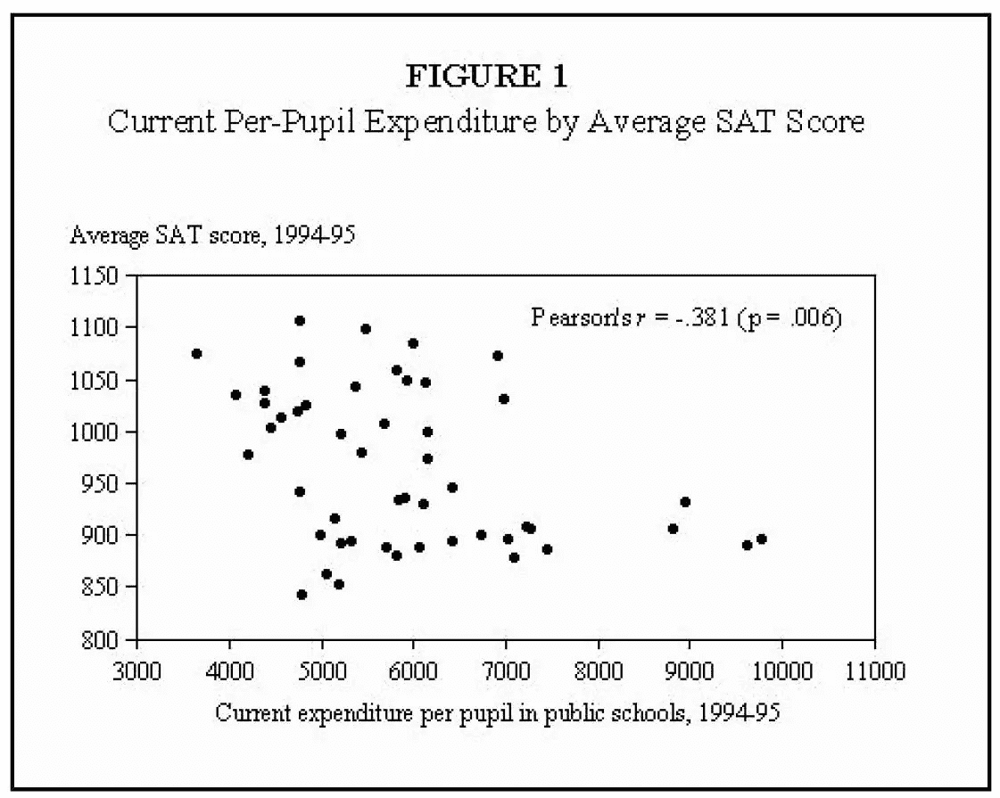
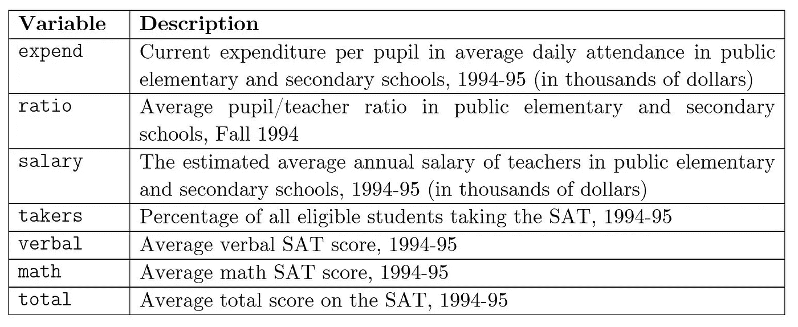
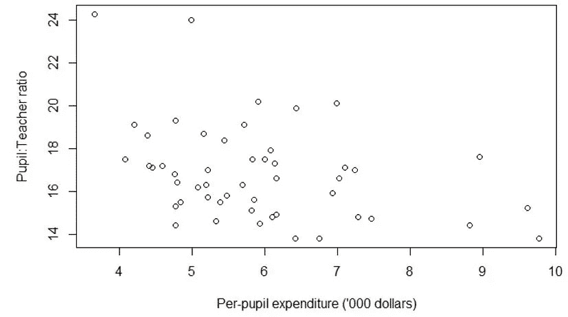
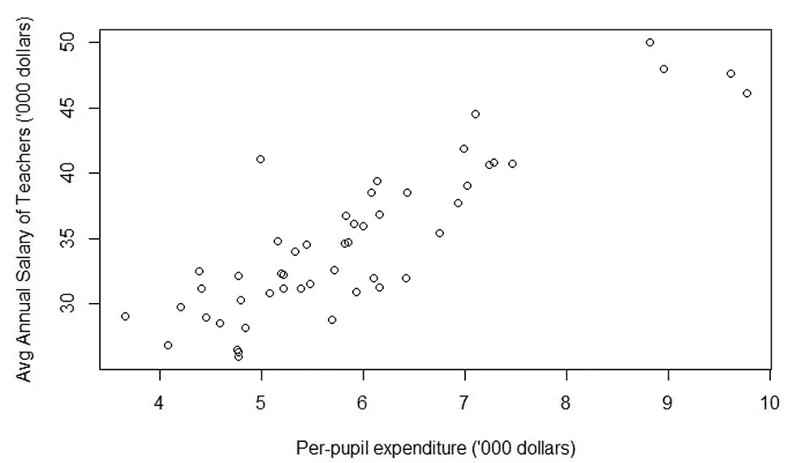
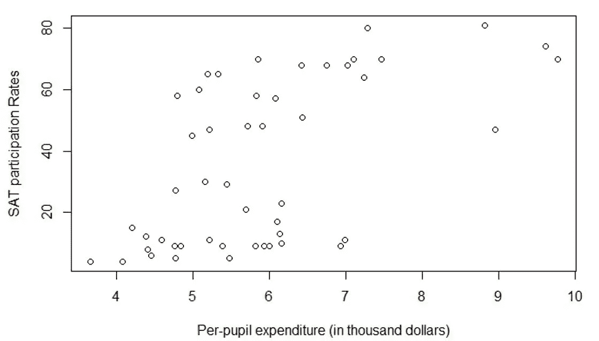
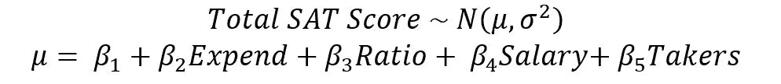
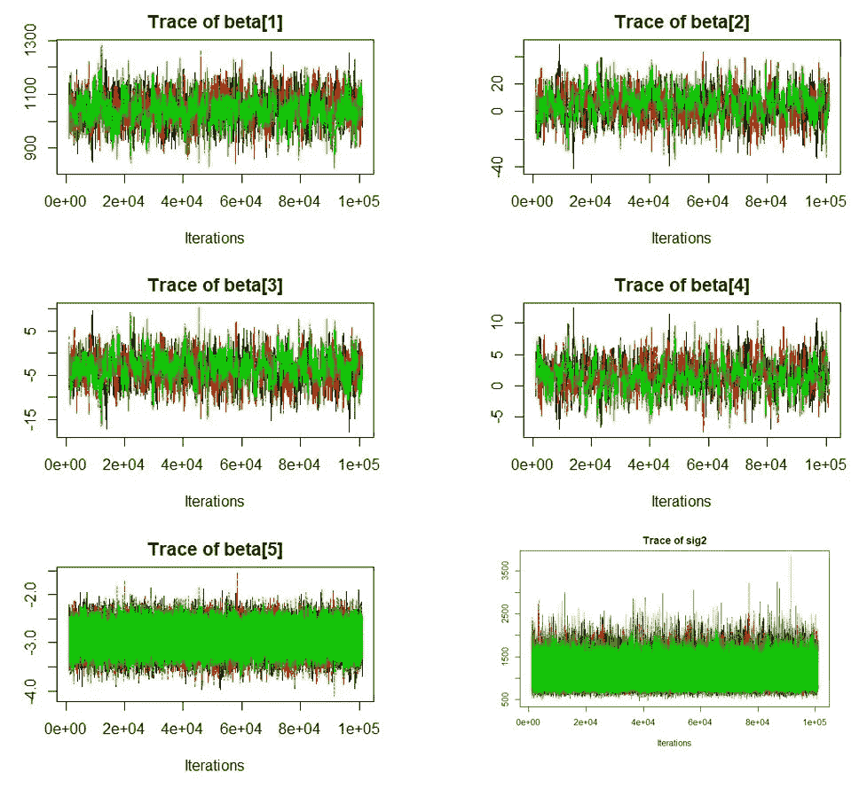
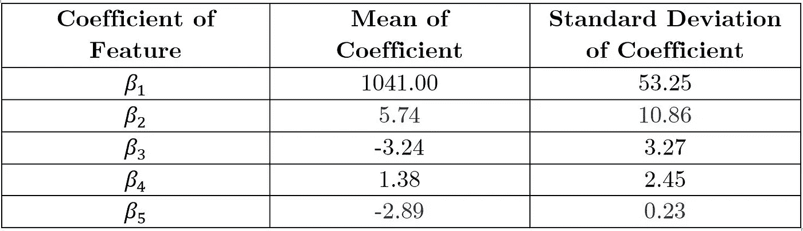

# 更高的支出导致更差的教育？使用蒙特卡罗技术的贝叶斯统计项目

> 原文：<https://medium.com/analytics-vidhya/higher-spending-leads-to-poorer-education-a-bayesian-statistics-project-using-rjags-b50b213c6961?source=collection_archive---------10----------------------->

如果一个州在教育上投入更多，它的学生会表现得更好吗？

这一直是美国许多政治家和研究人员争论的焦点。提议大幅削减联邦教育预算的[川普政府和年复一年坚决拒绝这一提议的](https://www.forbes.com/sites/wesleywhistle/2020/02/10/trump-budget-proposes-cuts-to-education/#e73a908708d5)[国会之间的拉锯战加剧了这场讨论。](https://www.theatlantic.com/education/archive/2019/03/trump-administration-would-cut-education-budget-again/584599/)


教育部长贝琪·德沃斯和唐纳德·川普与学生在白宫

我们的直觉可能会本能地认同更多的教育支出会带来更好的教育结果这一观点。毕竟，更大的教育资金可以让学校提供优质的学习资源，帮助学生学得更好，从而在标准化考试中表现更好。这一思路似乎也得到了研究的支持:美国国家经济研究局发现，从长远来看，向最贫困学区提供高等教育资助的州比那些没有提供资助的州在教育成果方面取得了更多的学术进步。



[Guber (1999)](https://www.researchgate.net/publication/327474149_Getting_What_You_Pay_For_The_Debate_Over_Equity_in_Public_School_Expenditures) 指出，1994 年 SAT 平均成绩与支出成反比。

然而，其他人使用数据指出了相反的情况，这是正确的。Guber (1999)发现，在一个州的水平上，较高的人均公立学校支出与 1994 年至 1995 年间 SAT 的较差表现相关(图 1)。

在这篇文章中，我将试图揭穿这一假设，即*教育公共资金的增加与学生在标准化考试中的表现无关，同时使用 rJAGS 包在 R 中实现的贝叶斯统计来控制其他因素*。这分 5 步完成。

1.  选择数据
2.  可视化数据
3.  数据建模
4.  分析模型

# **1。选择数据**

所用的数据集来自 Guber (1999)在他的论文《得到你所付出的:关于公立学校支出公平性的辩论》中的数据集。选择这些数据是因为它包含了描述 1994-1995 年各州每个学生的教育支出和教育成果(SAT 分数)的数据。通过对这些数据建模，我们可以找出支出和教育成果之间的关系。

为了使用 R 的*远程*库检索 SAT 数据，在 R 中实现了以下代码。

```
library(faraway) 
data(sat) #retrieves the Guber (1999) data set
```

下表显示了数据集的描述。



表 1:对 Guber (1999)数据集的描述

# **2。可视化数据**

在开始分析数据之前，我们希望了解数据集中各要素之间的关系。为此，我们在表 1 中列出的变量之间创建散点图。从那里，我们可以提取一些观察。

> 观察 1:不出所料，随着学生人均支出的增加，师生比也会增加(图 3)，教师的薪酬也会提高(图 4)。



图 3(和图 4):学生:教师比率(和平均年薪)与学生人均支出的图表

> 观察 2:随着学生人均支出的增加，SAT 参与率也增加(图 5)。换句话说，这些支出增加了 SAT 对更多学生的普及性。

额外的支出本可以为贫困学区的学生提供以前无法获得的教育资源。上述资源有助于他们准备 SAT 考试。



图 SAT 参与率与学生人均支出的散点图

# 3.数据建模

## 3.1 建模的一般方法

为了对这个数据集建模，我们首先假设数据的概率分布。然后，我们使用贝叶斯统计方法来推断概率分布的参数，这可以用作支持或反对增加资金导致教育成果改善这一假设的证据。

贝叶斯统计方法可以使用马尔可夫链蒙特卡罗抽样来实现，这是一种将观察到的数据近似为分布的算法。MCMC 采样可以利用 rJAGS 封装实现。

## 3.2 实际数据的建模

在这个例子中，我将使用截距和五个特征对 SAT 分数进行**常见的线性回归:支出*(‘expend’)*、师生比*(‘ratio’)*、工资*(‘salary’)*，以及 SAT 参与率(*考生)*。**

这相当于说，SAT 总成绩被建模为具有均值μ和方差σ的正态分布。μ又可以用截距、支出、比率、工资和接受者的线性组合来描述。每个特征的系数是β。

数学上，这可以表示为



在这个项目中，我们的目标是找到β的平均值，并找到证明“更高的支出不会带来更好的结果”这一假设的证据。在本分析中，系数β₂很重要，因为它描述了支出(“expend”)和 SAT 分数(“μ”)之间的(线性)关系。这将在后面的分析部分详细阐述。

rJAGS 的相应代码块如下所示(注意:变量的名称如表 1 所示)

```
 for (i in 1:length(total)) {total[i] ~ dnorm(mu[i], prec) #SAT Score is modelled.mu[i] = beta[1] + beta[2] * expend[i] + beta[3] * ratio[i] + beta[4] * salary[i] + beta[5] * taker[i]}
```

由于我们没有太多关于每个特征对 SAT 分数的影响的先验信息，我们假设系数β具有不包含太多信息的先验，也称为*非信息先验*。特别是，假设β系数遵循均值为 0 且方差为 10⁻⁶的正态分布，这实际上产生了一个几乎平坦的分布。这可以用数学公式和代码表示为


```
for (i in 1:5) {beta[i] ~ dnorm(0, 1e-6)}
```

另一方面，σ系数假定遵循反伽马分布，有效样本大小为 1，初始猜测值为 20。


```
tau ~ dgamma(1/2,1*20/2.0)  #precision is a gamma distribution.sig2 = 1 / tau              #variance is an inverse gamma distribution.
```

从这个模型中，我们将能够实现两个目标。

1.  产生平均 SAT 分数μ和支出之间的系数为正的后验概率。从数学上来说，这意味着 P(β₂>0).
2.  此外，我们还可以使用在两个假设的美国州创建的模型来模拟 SAT 分数的后验预测分布，一个是高支出，另一个是低支出。这让我们可以看到在调整其他因素后教育的影响。

## 用 rJAGS 实现 R 语言

下面的代码总结了上面提到的内容。在 rJAGS 中，模型必须用字符串(mod_string)来描述。

```
library('rjags')mod_string =' model {
  for (i in 1:length(total)) {
    total[i] ~ dnorm(mu[i], prec) #SAT Score is modelled.
    mu[i] = beta[1] + beta[2] * expend[i] + beta[3] * ratio[i] + beta[4] * salary[i] + beta[5] * taker[i]
  } for (i in 1:5) {
     beta[i] ~ dnorm(0, 1e-6)
  } tau ~ dgamma(1/2,1*20/2.0)  #precision
  sig2 = 1 / tau              #variance }'
```

既然已经完整地描述了模型，我们将运行 MCMC 链。这可以是

然后，我们使用下面的代码运行马尔可夫链。这可以分解成几个更简单的步骤。

```
data_jags = list(total = sat$total, expend = sat$expend, ratio = sat$ratio, salary = sat$salary, takers = sat$takers)mod = jags.model(textConnection(mod_string), data=data_jags, n.chains=3)
```

2.产生 1000 个样本的“老化”。这意味着从模拟分布中抽取的前 1，000 个样本将被处理掉。

我们经营 3 家连锁店。

```
params = c('beta','sig2')data_jags = list(total = sat$total, expend = sat$expend, ratio = sat$ratio, salary = sat$salary, takers = sat$takers)mod = jags.model(textConnection(mod_string), data=data_jags, n.chains=3)update(mod, 1000) #burn in of 1,000 samples
```

3.运行模拟。在这里，我们运行 10，000 次迭代

```
mod_sim = coda.samples(model = mod, variable.names = params, n.iter= 1e5)mod_csim = do.call(rbind, mod_sim)
```

4.使用轨迹图检查是否达到了稳定分布。轨迹图告诉我们在链的迭代中参数值的历史。创建跟踪图的命令是

```
traceplot(mod_sim)
```

如果参数的轨迹图中没有明显的上升或下降趋势(图 6)，则链已经收敛，然后达到稳定分布。在这种情况下，这意味着近似分布的参数β₁ β₂ β₃ β₄、β₅和μ已经收敛。这告诉我们，即使我们运行模拟时间更长，参数值也不太可能发生显著变化。如图 6 所示，其中 6 个参数的轨迹图围绕一条水平线波动。



图 6::显示马尔可夫链收敛的 6 个参数的轨迹图。

*   旁注:检查 MCMC 链收敛的另一种方法是 Gerlman 诊断。它计算潜在的规模缩减系数，可以解释为链内和链间差异的比率。缩减系数偏离 1 表示不收敛。它可以通过下式计算

```
autocorr.diag(mod_sim)
```

5.建模完成。我们现在可以查看模拟结果和分布摘要了。这是由代码完成的

```
summary(mod_csim)
```

有了这个摘要(表 2)，我们就可以提取相关信息并进行分析。

# 4.分析模型

让我们提醒自己在步骤 2(数据建模)中提出的模型。



表 rJAGS 建模的结果

## 4.1β₂分析

在分析 SAT 分数和支出之间的(线性)关系时，β₂很重要，如步骤 2 所述。这里，我们看到系数β₂的平均值为正(5.74) 。从物理上来说，这意味着所有其他因素保持不变，每个学生的支出每增加 1 美元，SAT 成绩的平均值就会增加 5.737。

然而，我们看到**β₂的标准差相对于平均值(5.74)** 较大(10.86)。这表明该模型并不十分确定支出对 SAT 分数的影响。我们可以确认这一点，因为β₂ 为阳性的后验预测概率为 66.94%，即 P(β₂ > 0) =66.94%。这是使用命令获得的

```
mean(mod_csim[,c(2)]>0
```

此命令计算大于 0 的β₂的平均模拟样本数。这告诉我们，平均而言，66.94%的β₂模拟样本是阳性的。这并不是一个非常大的数字，这表明了β₂.价值的不确定性

**因此，结论是我们不能很有把握地否定“增加资金并不会导致教育成果的改善”这一假设。**

## 4.2 其他系数的分析

β₅是 SAT 参与率的系数。因此，β₅=-2.89 系数(表 2)告诉我们，当 SAT 参与率增加 1%时，该州的平均 SAT 总分数会下降-2.89。

然后我们观察到，相对于其平均值(-2.89)，系数β₅具有相对较小的标准偏差(0.23)(表 2)。**这表明模型对β₅** 的值是相对确定的，这告诉我们对 SAT 参与率对 SAT 成绩的影响是确定的。

的确，β₅值的 99.99%的最高后验密度在[-4.12，-1.88]的范围内都是负的。物理上，这意味着我们 99.99%确定β₅在[-4.12，-1.88]范围内。因此，几乎可以 100%确定β₅是阴性的——这告诉我们，随着合格学生比例的增加，平均 SAT 分数会下降。这是使用命令获得的

```
HPDinterval(mod_sim, 1)
```

## 4.3.分析增加的资助≠提高的 SAT 分数

我们可以通过提醒自己过去的观察来解释为什么增加资助和提高 SAT 分数没有高度的相关性。

1.  从第 2 节中，我们看到**随着每个学生支出的增加，SAT 参与率也增加**(图 5)。
2.  从第 4.2 节，我们可以确定**增加 SAT 参与率会降低平均 SAT 分数。**

因此，我们把这些点联系起来说，增加资金与增加参与率相关，参与率会降低 SAT 的平均分数。为什么会这样呢？

我们假设只有准备最充分的学生参加 SAT 考试，而一小部分合格的学生参加 SAT 考试。这些学生更有可能在考试中取得高分。当更大比例的合格学生参加 SAT 考试时，即使那些*准备不足的学生也会参加考试，因此 SAT 平均分数可能会下降。*

# 5.模型的结论

根据第 4.1 节，**我们得出结论，我们不能很有把握地说增加资金与提高 SAT 成绩相关。**更准确地说，我们不能很有把握地否定“增加资金与提高教育成果不相关”的假设。

这个项目是作为我所学课程[贝叶斯统计:从概念到数据分析](https://www.coursera.org/learn/bayesian-statistics/home/welcome)和[贝叶斯统计:技术和模型](https://www.coursera.org/learn/mcmc-bayesian-statistics/home/welcome)的顶点项目而创建的。如果你想学习更多关于贝叶斯统计、MCMC 建模和 rJAGS 的知识，我强烈推荐这些课程。

接下来，我将撰写一篇博文，解释支撑 MCMC 建模技术的理论。