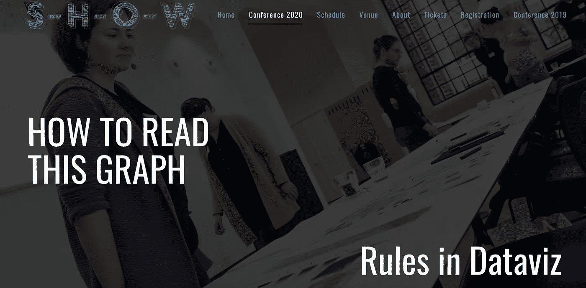

# 由 13 位不同的数据专家分享的数据可视化课程

> 原文：<https://medium.com/analytics-vidhya/highlights-from-s-h-o-w-conference-2020-7eb8e8039bf7?source=collection_archive---------18----------------------->

## 由图形猎人组织

## 我们都检查、学习和讨论了规则

图片来源于 S-H-O-W 会议的[网站](https://graphichuntersshow.nl/)。

C OVID-19 创造了我们，把我们束缚在四面墙内，上网成了探索世界的窗口。几周前，我在南丁格尔研究了莫丽·佩迪特的[博客](/nightingale/data-visualization-conferences-winter-2020-2021-ab26a7ea890e),然后我开始…