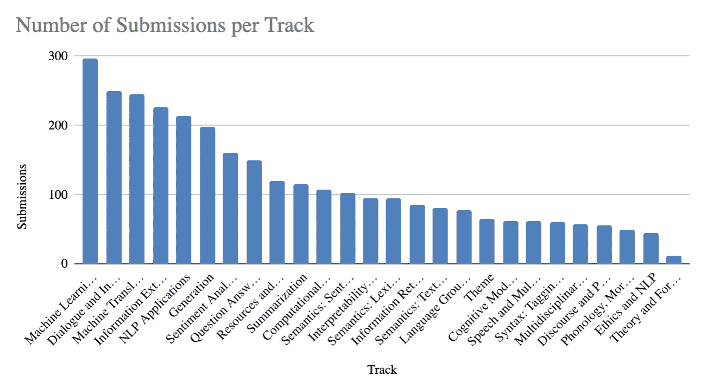

# ACL 2020 的亮点

> 原文：<https://medium.com/analytics-vidhya/highlights-of-acl-2020-4ef9f27a4f0c?source=collection_archive---------1----------------------->

随着今年 ACL 变得虚拟化，我很不幸地花了更少的时间与同事交流，但是作为一线希望，我比平时看了更多的演讲。我决定分享我做的笔记，并讨论一些总体趋势。这个列表并不详尽，只是基于我的研究兴趣。我推荐你也去看看[的最佳论文](https://acl2020.org/blog/ACL-2020-best-papers/)。

# 多年来的总体趋势

在我开始讨论我所观察的谈话中的趋势之前(这些趋势明显受到抽样偏差的影响)，让我们来看看 ACL 博客中的一些总体统计数据。今年，提交数量最高的曲目是**NLP 的机器学习、** **对话和交互系统**、**机器翻译**、**信息提取**、 **NLP 应用**和**生成**。

来自 [ACL 博客的每条赛道的提交数量。](https://acl2020.org/blog/general-conference-statistics/)

与往年相比如何？由[万向车](https://public.flourish.studio/visualisation/2431551/)拍摄的这张出色的可视化图片显示了自 2010 年以来每个领域的论文数量:

来源:[https://public.flourish.studio/visualisation/2431551/](https://public.flourish.studio/visualisation/2431551/)

总的来说，有一种从低级任务向高级任务转移的趋势，即从句法到单词级语义、句子级语义、语篇，再到对话。随着越来越多的论文提出在多项任务上进行评估的通用模型，“机器学习”的轨道正在稳步增长。

# ACL 2020 的趋势

## Less“我在任务 X 上对 BERT 进行了微调，它提高了基准 Y”论文的性能

在 NLP 研究中有一个重复出现的模式:( 1)引入新的架构/模型；(2)通过改进架构/模型或将其应用于各种任务来发布低挂成果；(3)发表显示其弱点的分析论文；(4)发布新的数据集。我想说我们目前在 2 和 3 之间，尽管一些事情同时发生。同样，我可能是基于我对论文的选择而得出这个结论的，我的选择已经在很大程度上过滤掉了这类论文。所以一个更温和的结论应该是“ACL 2020 上有足够多的论文不是这种类型的”。

## 远离巨大的标签数据集

在过去的两年里，我们已经看到[向](https://thegradient.pub/nlp-imagenet/)转变，以自我监督的方式对未标记的文本进行预训练，然后用(潜在的)更小的特定任务数据集进行微调。在这次会议上，许多论文都集中在监督较少的培训模式上。以下是在大型数据集上进行训练的一些替代方法，以及示例论文:

**无监督:** [Yadav 等人](https://www.aclweb.org/anthology/2020.acl-main.414.pdf)提出了一种基于检索的问答方法，迭代地将查询提炼为知识库，以检索回答某个问题的证据。 [Tamborrino 等人](https://www.aclweb.org/anthology/2020.acl-main.357.pdf)通过使用掩蔽 LM 计算每个候选答案的似真性得分，在常识性多项选择任务中取得了令人印象深刻的结果。

**数据扩充:** [Fabbri 等人](https://www.aclweb.org/anthology/2020.acl-main.413.pdf)提出了一种自动生成(上下文、问题、答案)三元组来训练 QA 模型的方法。它们检索与原始数据集中的上下文相似的上下文，为这些上下文生成是/否和模板化的 WH 问题，并在合成三元组上训练模型。 [Jacob Andreas](https://www.aclweb.org/anthology/2020.acl-main.676.pdf) 提出用出现在相似上下文中的更频繁的短语替换罕见短语，以提高神经网络中的组合泛化能力。 [Asai 和 Hajishirzi](https://www.aclweb.org/anthology/2020.acl-main.499.pdf) 用从原始训练数据逻辑推导出的合成例子来扩充 QA 训练数据，以加强对称性和传递性一致性。

**元学习:** [于等](https://www.aclweb.org/anthology/2020.acl-main.336.pdf)利用元学习将高资源语言到低资源语言的上下位关系检测知识转移。

**主动学习:** [李等](https://www.aclweb.org/anthology/2020.acl-main.738.pdf)开发了一个高效的共指消解标注框架，通过主动学习选择最有价值的样本进行标注。

## 你需要的不仅仅是语言模型——检索又回来了

我们已经知道来自语言模型的知识是缺乏和不准确的。在这次会议上，来自 [Kassner 和 Schütze](https://www.aclweb.org/anthology/2020.acl-main.698.pdf) 和 [Allyson Ettinger](https://www.mitpressjournals.org/doi/pdf/10.1162/tacl_a_00298) 的论文表明，LMs 对否定不敏感，并且容易被错误定位的探针或相关但不正确的答案混淆。目前采用了各种解决方案:

**检索:**在 [Repl4NLP 研讨会](https://sites.google.com/view/repl4nlp2020/home)上的两个受邀演讲提到了检索增强 LMs。Kristina Toutanova 谈到了 Google 的[领域](https://arxiv.org/abs/2002.08909)，以及用关于实体的知识来增强 LMs(例如，这里的，这里的)。迈克·刘易斯谈到了改进事实知识预测的[最近邻 LM](https://openreview.net/forum?id=HklBjCEKvH) ，以及脸书的 [RAG model](https://arxiv.org/abs/2005.11401) 结合了生成器和检索组件。

**使用外部 KBs:** 这种做法已经普遍使用了好几年。[关等](https://www.mitpressjournals.org/doi/pdf/10.1162/tacl_a_00302)用常识知识库中的知识增强 2 进行常识性任务。[吴等](https://www.aclweb.org/anthology/2020.acl-main.515.pdf)使用这样的知识库进行对话生成。

**用新的能力增强 LM:**[周等人](https://www.aclweb.org/anthology/2020.acl-main.678.pdf)使用通过用模式和进行信息提取而获得的训练实例来训练 LM 捕获时间知识(例如，关于事件的频率和持续时间)。杰瓦和古普塔通过对使用模板生成的数字数据和需要数字推理的文本数据进行微调，为 BERT 注入了数字技能。

## 可解释的自然语言处理

今年，关注注意力权重似乎已经不流行了，取而代之的是关注文本推理，最好是忠实的推理——即反映有辨别力的模型的决定。 [Kumar 和 Talukdar](https://www.aclweb.org/anthology/2020.acl-main.771.pdf) 通过为每个标签生成候选解释，并使用它们来预测标签，来预测 NLI 的可靠解释。 [Jain 等人](https://www.aclweb.org/anthology/2020.acl-main.409.pdf)开发了一个忠实的解释模型，该模型依靠事后解释方法(不一定是忠实的)和启发式方法来生成训练数据。为了评估解释模型，[哈斯和班萨尔](https://www.aclweb.org/anthology/2020.acl-main.491.pdf)建议测量用户在有和没有给定解释的情况下预测模型行为的能力。

## 反思当前的成就、局限性以及对 NLP 未来的思考

ACL 今年有一个主题跟踪，主题是“盘点
我们已经去过的地方和我们将要去的地方”，这产生了一些发人深省的论文。其他见解来自特邀演讲人和其他领域的论文。以下是几个结论。

**我们解决的是数据集，而不是任务。**这种说法在过去几年中反复出现，但是，我们的主要范式是训练大型模型，并在与我们的训练集过于相似的众包测试集上评估它们。Tal Linzen 的荣誉奖主题论文认为，我们在大量数据上训练模型，这些模型可能不会从人们可以获得的大量数据中学习任何东西，这些模型会在数据中找到人类可能认为不相关的统计模式。他建议，今后，我们应该标准化中等规模的预训练语料库，使用专家创建的评估集，并奖励成功的少数镜头学习。

Kathy McKeown 的精彩主题演讲也提到了这一点，并补充说排行榜并不总是有助于推动该领域的发展。基准通常捕捉分布的头部，而我们需要观察尾部。此外，很难用通用模型(如 LMs)来分析特定任务的进度。在她的终身成就奖采访中，Bonnie Webber 强调了查看数据和分析模型错误的必要性。即使是像查看精确度和召回率这样的小事，而不仅仅是 F1 总分，也有助于理解模型的弱点和优点。

当前的模型和数据存在固有的局限性。 Bonnie 还表示，神经网络能够解决不需要深入理解的任务，但更具挑战性的目标是识别隐含的含义和世界知识。除了上面提到的那些论文之外，还有几篇论文揭示了当前模型的局限性:例如， [Yanaka 等人](https://www.aclweb.org/anthology/2020.acl-main.543.pdf)和 [Goodwin 等人](https://www.aclweb.org/anthology/2020.acl-main.177.pdf)都指出神经 NLU 模型缺乏系统性，很难概括习得的语义现象。艾米丽·本德和亚历山大·柯勒的最佳主题论文认为，仅仅从形式中学习意义是不可能的。比斯克等人在预印本中提出了类似的主张，主张使用多种方式来学习意义。

**我们需要远离分类任务。**近年来，我们已经看到多种证据表明，分类和多项选择任务很容易实现，并且模型可以通过学习浅层数据特定模式来实现良好的准确性。另一方面，生成任务很难评估，人工评估目前是唯一的信息性指标，但成本很高。作为分类的替代，[陈等人](https://www.aclweb.org/anthology/2020.acl-main.774.pdf)将任务从三向分类转换为一个更软的概率性任务，旨在回答“给定前提，假设为真的可能性有多大？”。帕夫利克和科维亚特科夫斯基进一步表明，即使是人类也不同意某些句子对的蕴含标签，在某些情况下，不同的解释可以证明不同的标签是合理的(平均注释可能会导致错误)。

我们需要学会处理模糊和不确定性。 Ellie Pavlick 在 [Repl4NLP](https://sites.google.com/view/repl4nlp2020/home) 的演讲讨论了明确定义语义研究目标的挑战。天真地将语义理论翻译成 NLI 式的任务是注定要失败的，因为语言是建立在更广泛的语境中的。[盖伊·爱默生](https://www.aclweb.org/anthology/2020.acl-main.663/)定义了分布式语义的理想属性，其中之一就是捕捉不确定性。[冯等人](https://www.aclweb.org/anthology/2020.acl-main.182.pdf)设计了对话响应任务和模型，其中包括“以上均非”响应。最后， [Trott 等人](https://www.aclweb.org/anthology/2020.acl-main.462.pdf)指出，虽然语义任务涉及识别两个话语具有相同的意义，但识别措辞差异如何影响意义也很重要。

## 关于伦理的讨论(这很复杂)

我认为，在短短几年内，NLP 中的伦理学如何从几个专注的研究人员研究的利基主题转变为 ACL 中的一个轨道，并成为我们所有人向其他轨道提交论文的考虑因素，这是非常值得注意的。事实上，作为一个社区，我们现在已经转向批评那些旨在揭示一个重要的公平问题的论文，当它们未能解决其他道德问题时(我希望这篇论文将被修改而不是被撤回！).

我强烈推荐观看 Rachael Tatman 在 [WiNLP](http://www.winlp.org/) 工作坊中发表的见解深刻的【我不会构建什么】[主题演讲](https://slideslive.com/38929585/what-i-wont-build)。Rachael 详细说明了她个人不会帮助构建的系统类型(监视系统、欺骗与之交互的用户的应用程序以及社交类别检测器)。她提供了以下问题列表，研究人员可以使用这些问题来决定是否应该建立一个系统:

1.  谁从这个系统中受益？
2.  谁会因此受到伤害？
3.  用户可以选择退出吗？
4.  这个制度是强化还是恶化了系统性的不平等？
5.  它是否普遍改善了世界？

Leins 等人提出了许多有趣但尚未解答的伦理问题，如 NLP 中的伦理研究是什么，由谁决定以及如何决定？谁负责模型的预测？ACL 应该试图将自己定位为一个道德守门人吗？文件中讨论的一个问题是双重用途:一种既可用于好的目的也可用于坏的目的的模式。事实上，在会议期间，还就李等人的最佳演示论文进行了一场推特辩论。，关于一个令人印象深刻多媒体知识提取系统。

## 多方面的

这里有一些我喜欢的不属于以上任何一类的论文。Cocos 和 Callison-Burch 创造了大量带有意义标签的句子资源，其中意义通过释义来表示，例如“窃听器-麦克风”。【张等提出了一种追溯文本出处的方法，包括其作者和其他来源的影响。 [Chakrabarty 等人](https://www.aclweb.org/anthology/2020.acl-main.711.pdf)致力于将非讽刺性句子翻译成讽刺性句子，并基于对讽刺的深刻观察建立了一个模型。 [Wolfson 等人](https://www.mitpressjournals.org/doi/pdf/10.1162/tacl_a_00309)介绍了问题理解的独立任务，该任务遵循人类的方式，通过将复杂问题分解为更简单的问题来回答复杂问题。[戈宁等人](https://www.aclweb.org/anthology/2020.acl-main.51.pdf)提出了一种非常直观且可解释的方法，通过查看单词的分布最近邻来测量单词含义的变化。 [Anastasopoulos 和 Neubig](https://www.aclweb.org/anthology/2020.acl-main.766.pdf) 表明，虽然使用英语作为跨语言嵌入式学习的中心是最佳实践，但它通常不是最佳的，并建议选择更好的中心的一般准则。最后，[张等人](https://www.aclweb.org/anthology/2020.acl-main.508.pdf)众包解释了 Winograd 模式挑战，并分析了解决任务所需的知识类型以及现有模型在每个类别上的成功程度。

# 结论和其他想法

论文和主题演讲加强了我的感觉，尽管过去几年取得了巨大的进步，但我们还没有完全走上正确的方向，也没有非常可行的前进道路。我认为主题曲目是一个积极的变化，是鼓励报纸不要关注眼前的小收益，而是着眼于大局的好方法。

我喜欢能够在自己的时间里(以我喜欢的速度)观看这么多的演讲，但我确实怀念互动，而且我不认为与不同时区的参与者举行缩放会议和聊天室是令人满意的替代品。我真的希望疫情会议后的未来会议将再次举行，但希望同时也允许远程与会者降低注册费。希望明年能看到你们排队买劣质咖啡！