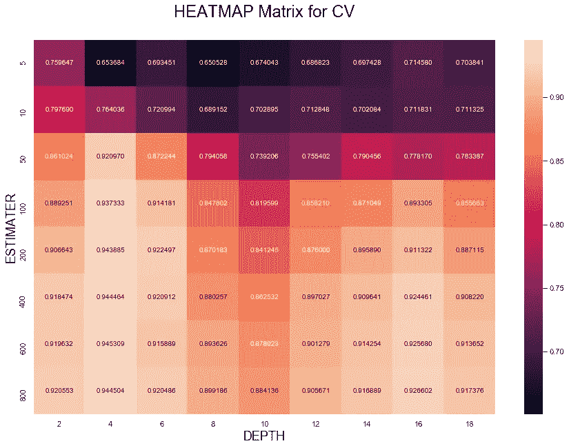

# 高度不平衡的数据集—端到端解决方案

> 原文：<https://medium.com/analytics-vidhya/highly-unbalanced-data-set-end-to-end-solution-44822bc5ee85?source=collection_archive---------11----------------------->

**高度不平衡的数据集** — >其中一个类别高度支配另一个类别和类别比率(如总共 10 个数据点中的 9 个正和 1 个负)。

在讨论解决方案之前，让我们先了解一些性能指标的知识。

**准确性**→在所有实际点中，有多少被正确分类。


**特异性**→从所有实际阴性点中，有多少被正确预测为阴性。

**精度**→从所有预测的阳性点中，有多少是实际阳性。


**回忆**→从所有实际阳性点中，有多少被正确预测为阳性。

**F1-得分**→是精度和召回率的调和平均值。它用在我们既需要精确又需要回忆的地方。


**注:**精度、召回率和 F1_score 只关心正分。精确度、召回率和 F1_score 也用于信息检索。

If (Precision=Recall) THEN ( F1 得分=PRECISION=RECALL)

**AUC-ROC 得分**:如果曲线的 AUC 为(0.75)，则意味着:


如果我们有两个不同类别，我们不知道哪个是阳性的，哪个是阴性的，如果我们通过 AUC (0.75)的模型传递这些点，那么我们的模型将有机会正确地分类 75%的点。

注:随机模型的 AUC 为(0.5)。如果我们找到 AUC (0.2)的模型，则交换类别标签。

AUC 不关心实际值，即它不依赖于预测得分，它依赖于数据的排序。

# **让我们深入探讨这个问题:**

**设**有两个分类问题，一个是正类，另一个是负类。在这里，一个阶级高度支配另一个阶级。例如，一个等级超过 90%，另一个等级低于 10%。

众所周知，准确度是最简单的矩阵，我们在 8 年级左右的时候都学过……但我们在这里不会用准确度作为矩阵。

**为什么不精确**:让我们有一组数据，一组是 95%，另一组是 5%。现在把它想成，一个人要去写只有对和错的答案的考试。现在假设一个人没有任何准备就去参加考试，并把所有答案都标为真，实际的考试答案也是 9 对 1 错。所以现在一个没有准备就去考试的人会得 90 分。这是不应该接受的。

同样，如果我们的模特很笨/表现不好…在此之后，它可以给我们一个非常好的准确率约 90%的高度不平衡的数据集。**所以我们在这里不会用准确度作为一个矩阵。**

这里，我们将使用精确度、召回率、F1 分数和 AUC-ROC 曲线作为矩阵，如上所述。我们还将使用 TP、FP、TN、FN 的混淆矩阵进行解释和测量。


现在我们将在 drop 和 Yi，s=yees 之后分离 Xi，s=df_tr，然后用分层进行拆分


然后，我们将检查 NaN 值，并用平均值替换它们，然后进行数据标准化。


最后我们得到了准备好的建模数据

## 现在，重要的问题是我们应该采取哪种模式:

这里我们只有 64 个特征和大约 30，000 行，因为我们的特征数量较少，所以我们将使用决策树和梯度提升树来完成分类任务。

## **如何从下面的混淆矩阵中为我们的模型选择最佳超参数**

选择最佳超参数的技术可能是肘方法。也就是说，我们将看到:

1:我们将看到混淆矩阵，并看到相应单元之间的间隙在哪里最小。

2:我们还会看到哪里的值偏差最小。

3:如果我们在图中只有 1 个超参数，我们也可以使用肘方法。

4:我们也可以使用网格搜索 CV 来减少参数数量，使用随机搜索 CV 来增加参数数量。


超参数调谐代码


SEABORN 热图代码


通过观察上图，决策树的最佳超参数是:估计数= 50，深度=8。

# 训练和测试模型的代码:

```
rf = RandomForestClassifier(n_estimators=100,max_depth=6)# fitting the model
rf.fit(Xbow_tr_std, y_tr)# predict the response
pred = rf.predict(Xbow_test_std)# evaluate accuracy
acc = accuracy_score(y_test, pred) * 100precision_score1=precision_score(y_test, pred )recall_score1=recall_score(y_test, pred )f1 = f1_score(y_test, pred)print(‘\nThe accuracy of the Random forest classifier for n_estimaters=%f and Depth = %f is %f%%’ % (100,6, acc))print(‘\nThe precision_score of the Random forest classifier for n_estimaters=%d and Depth = %d is %f’ % (100,6,precision_score1))print(‘\nThe recall_score of the Random forest classifier for n_estimaters=%d and Depth = %d is %f’ % (100,6,recall_score1))print(‘\nThe f1_score of the Random forest classifier for n_estimaters=%d and Depth = %d is %f’ % (100,6,f1))The accuracy of the Random forest classifier for n_estimaters=100.000000 and Depth = 6.000000 is 86.638253%

The precision_score of the  Random forest classifier  for n_estimaters=100 and Depth = 6 is 0.222453

The recall_score of the  Random forest classifier  for n_estimaters=100 and Depth = 6 is 0.708609

The f1_score of the  Random forest classifier  for n_estimaters=100 and Depth = 6 is 0.338608
```


## 训练和测试之间的 AUC_ROC 曲线:


正如我们所见，训练和测试 AUC 之间没有这种差异，这意味着我们的模型做得很好。

在上面的模型中，我们可以看到我们的召回和 F1 分数非常少，所以我们将尝试 XG boost 模型，因为它比决策树更强大。

# 应用 XG BOOST 改进我们的模型:

**为超级参数调整创建热图:**


调整超参数后，我们的估计数=50，深度=8


## 训练和测试之间的 AUC_ROC 曲线:


正如我们所见，训练和测试 AUC 之间没有这种差异，这意味着我们的模型做得很好。

在数据集上使用我们的模型决策树和 X.G boost，我们的性能没有显著变化。

# 技巧 1:

## 为什么不在样本多数下上课:

如果我们将样本置于多数类之下，我们将丢失大部分信息。

**注**:如果我们有大量来自少数类的数据，即拥有 v.large 数据集，我们也可以对多数类使用欠采样，或者我们也可以使用两者的组合(过采样少数类和欠采样多数类)。

在这里，我们将使用称为 SMOTE(少数过采样技术)的技术，通过过采样点的少数类来解决问题。了解更多:Referencing([https://youtu.be/FheTDyCwRdE](https://youtu.be/FheTDyCwRdE))([https://docs . Microsoft . com/en-us/azure/machine-learning/studio-module reference/smote](https://docs.microsoft.com/en-us/azure/machine-learning/studio-module-reference/smote))。

# 使用 SMOTE 应用决策树:


train_test_split、缺失值插补以及 SMOTE 和标准化的代码。

同样，我们将调整 hyper 参数，并像之前一样执行所有其他步骤


在这里，我们得到了更好的结果后，应用 SMOTE 技术。我们的召回率和 F1 分数大幅提高。


## 训练和测试之间的 AUC_ROC 曲线:


正如我们所见，训练和测试 AUC 之间没有这种差异，这意味着我们的模型做得很好。

在这里，我们得到了更好的结果，但我们将尝试用同样的技术来提高我们的结果。

# 使用 SMOTE 应用 X.G-BOOST:

## 超参数调整和训练模型:


在这里，我们得到了更好的召回率，但我们的精度和 F1 值明显下降。


## 训练和测试之间的 AUC_ROC 曲线:


正如我们所见，训练和测试 AUC 之间没有这种差异，这意味着我们的模型做得很好。

我们用两种方法进行了观察，一种是 SMOTE，另一种是按原样取数据，SMOTE 得到了更好的结果。让我们再做一些实验。

# 技巧 2:

现在我们将随机抽样少数民族点计数 UPTO 多数阶级:


## 对少数类进行上采样，并使两个类的计数相等:


## 用随机上采样技术实现决策树。

## 超参数调整和训练模型:



**这里我们得到调整后的估计数=100，深度= 6**


这里我们没有得到像 SMOTE 一样好的结果，现在我们将通过 X.G BOOST 来实现


## 训练和测试之间的 AUC_ROC 曲线:


正如我们所见，训练和测试 AUC 之间没有这种差异，这意味着我们的模型做得很好。

## 用随机上采样技术实现 X.G Boost。

## 超参数调整和训练模型:


在这里，我们可以看到，我们得到了轻微的增加召回，但我们的精度和召回是下降的


## 训练和测试之间的 AUC_ROC 曲线:


正如我们所见，训练和测试 AUC 之间没有这种差异，这意味着我们的模型做得很好。


# 最后意见:

正如我们在上面漂亮的表格中看到的:

如果我们需要 v.good F1 分数，那么与其他模型相比，带有 SMOTE 的决策树做得非常好。

如果我们需要很好的精度值，那么与其他模型相比，上采样决策树做得很好。

如果我们需要 v.good 召回值，那么与其他模型相比，XGB 和 SMOTE 做得非常好。

注:如果我们有两个型号的得分相差不大，那么我们将选择成本较低或重量较轻的型号。例如，在上面的例子中，我们更喜欢决策树而不是 X.G Boost。

如果我们需要在精确度和召回率之间取得良好的平衡，那么我们将考虑 F1 的分数。

参见 https://github.com/himanshuknegi/HIGHLY-UNBALANCED-DATA-SET[端到端解决方案](https://github.com/himanshuknegi/HIGHLY-UNBALANCED-DATA-SET--END-TO-END-SOLUTION)的代码文件