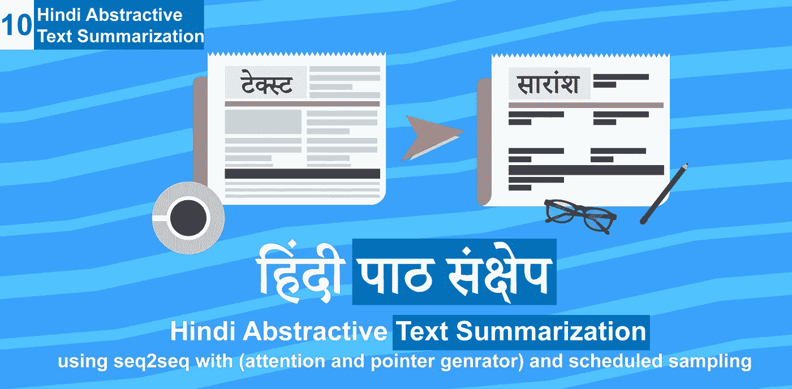
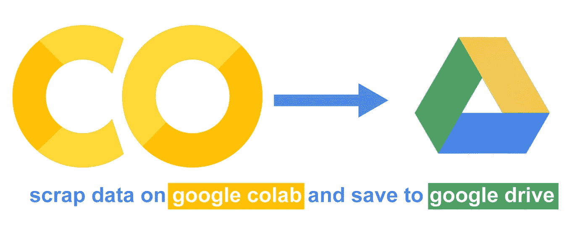
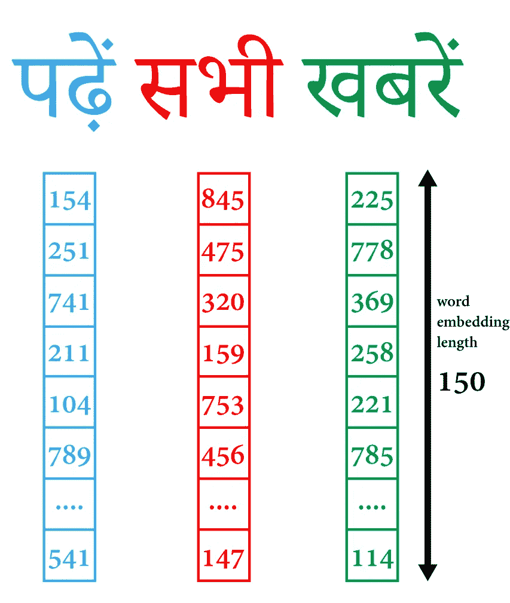
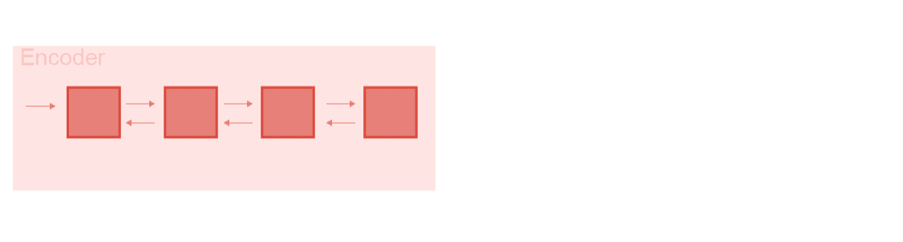
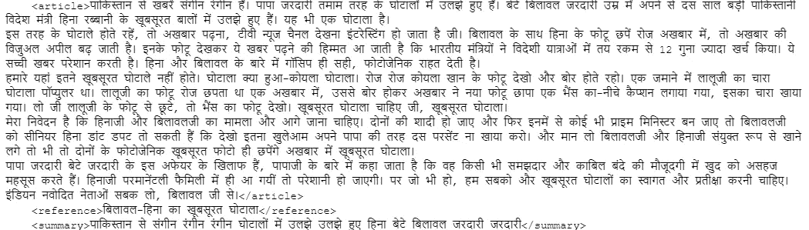
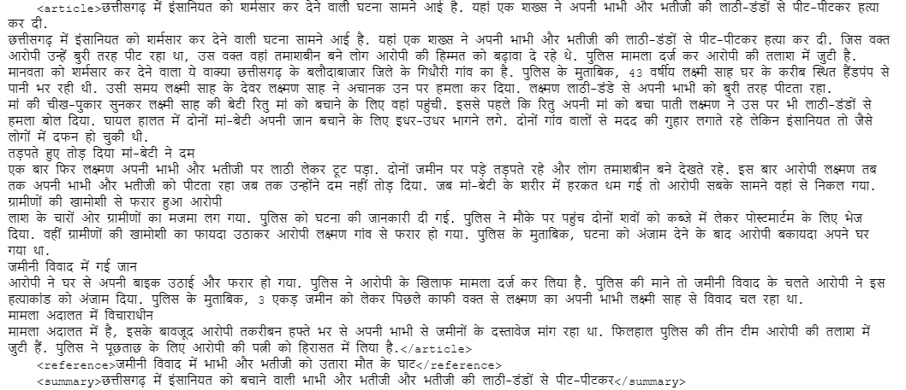

# 印地语抽象文本摘要(教程 10)

> 原文：<https://medium.com/analytics-vidhya/hindi-abstractive-text-summarization-tutorial-10-eac471bdafad?source=collection_archive---------1----------------------->



印地语文本摘要

本教程是**抽象文本摘要制作简易** [**教程系列**](https://github.com/theamrzaki/text_summurization_abstractive_methods#blogs) **的第十期。**今天我们将构建**一个印地语文本摘要器，**使用 google research 引入的新方法，即使用[课程学习计划抽样](http://bit.ly/2My51kX)方法和 [seq2seq](https://hackernoon.com/tutorial-3-what-is-seq2seq-for-text-summarization-and-why-68ebaa644db0?source=post_stats_page---------------------------) ，我们还在我们的文本摘要模型中结合了[注意力](/@theamrzaki/beam-search-attention-for-text-summarization-made-easy-tutorial-5-3b7186df7086)和[指针生成器](http://bit.ly/2EhcRIZ)模型，这个系列的所有代码可以在这里找到，本教程的 c **ode 可以在** [找到](https://github.com/theamrzaki/text_summurization_abstractive_methods/tree/master/Hindi)

今天，我们将学习如何从以下内容构建印地语文本摘要模型:

1.  收集/废弃数据
2.  构建单词嵌入模型
3.  训练 seq2seq 计划抽样模型

> 这个博客是基于这些惊人项目的工作，我们使用了[新闻-请](https://github.com/fhamborg/news-please)废弃数据，我们的模型是基于 [Bengio 等人](https://arxiv.org/abs/1506.03099)来自 google 的，并使用 [yaserkl](https://github.com/yaserkl) 的惊人的[库](https://github.com/yaserkl/RLSeq2Seq)实现。
> 
> 我真的想感谢他们所有人的出色工作。

这个系列教程帮助你了解构建抽象文本摘要的最新方法，这里是系列教程的[列表，我们也提供了免费使用的](https://github.com/theamrzaki/text_summurization_abstractive_methods#blogs) [api](http://bit.ly/2Ef5XnS) 到 [eazymind](http://bit.ly/2VxhPqU) 的文本摘要。


EazyMind 自由文本摘要和对象检测

现在让我们开始:D

# 1-收集/废弃数据集并处理为 csv



废弃 google colab 上的数据并保存到 google drive

为了构建我们的文本摘要模型，我们需要有一个所需语言的数据集，该数据将是带标题的文本格式，以便训练模型将文本摘要到标题。对于我们的目标来说，最有效的数据集之一是新闻，因为每篇新闻文章都有一篇大文章，标题是对它的总结。

因此，我们需要一种方法来收集印地语的在线新闻，我发现的最有用的方法之一是使用惊人的 scraper[**news-please**](https://github.com/fhamborg/news-please)**，这个 scraper 将允许您指定需要废弃的网站，它将递归地废弃数据并将其放入 json 格式。**

**我建议废弃 google colab，这样不会浪费带宽，而且只下载生成的 json 文件比废弃整个 html 文件要小得多。**

## **1-在您的(google colab)上运行[此笔记本](https://github.com/theamrzaki/text_summurization_abstractive_methods/blob/master/Hindi/1_NewsCrawler%20(googel%20colab).ipynb)**

**了解更多关于如何从 github 复制到 google colab [这里](https://hackernoon.com/begin-your-deep-learning-project-for-free-free-gpu-processing-free-storage-free-easy-upload-b4dba18abebc)，这个[笔记本](https://github.com/theamrzaki/text_summurization_abstractive_methods/blob/master/Hindi/1_NewsCrawler%20(googel%20colab).ipynb)会安装 [news-please](https://github.com/fhamborg/news-please) python 包，它会把数据废弃到你的 google drive**

## **1-B 设置配置(google colab)**

**在 google colab 中，在文件选项卡中，向上一级，然后在根目录下创建名为 news-please-repo 的目录，然后在它下面创建 config 目录。**

**在这里你将创建 2 个文件(它们的内容可以在笔记本中找到)，1 个文件(config.cfg)将设置保存 json 文件的目录，我喜欢将它们保存到 google drive，所以可以随意设置自己的路径(这个选项可以在名为 **working_path** 的变量中找到**

**第二个文件将设置网站的名称，我使用了大约 9 个网站(它们的名称可以在[笔记本](https://github.com/theamrzaki/text_summurization_abstractive_methods/blob/master/Hindi/1_NewsCrawler%20(googel%20colab).ipynb)中找到)，可以随意添加和修改自己的新闻网站。**

> **我建议您修改 sites.hjson，使每个 google colab 会话包含几个站点，这样每个 google colab 会话将从几个站点中删除，而不是同时删除所有站点**

## **1-C 从 google drive 下载以在本地处理(google colab)**

**在运行 news-please 命令几个小时(或几个 google colab 会话)并将生成的 json 文件保存到您的 google drive 后，我建议将数据从 google drive 下载到您的本地计算机，以便在本地处理文件，因为从 google colab 访问文件会非常慢(我认为这与 google colab 和 google drive 之间的文件 i/o 缓慢有关)**

**下载压缩文件只需在 google drive 中选择文件夹并下载，它会自动压缩文件**

## **一维本地处理下载的 zip 文件(本地)**

**下载完压缩文件后，解压并安装**

```
pip install langdetect
```

**然后运行这个[脚本](https://github.com/theamrzaki/text_summurization_abstractive_methods/blob/master/Hindi/2_process%20(local).py)(为了快速访问文件，请不要忘记在脚本中修改解压后的 zip 文件的位置)，这个脚本将遍历所有废弃的 json 文件，检查它们是否是印地语的，然后将它们保存到 csv 文件中**

## **1-E 上传生成的 csv**

**现在，运行完脚本后，将它上传到您的 google drive**

# **2-生成单词嵌入模型和 vocab**

****

**印地语单词嵌入**

**对于我们的文本摘要模型，我们需要一个专门为印地语构建的**单词嵌入模型**，这将帮助我们的模型理解该语言，[了解更多关于文本摘要的单词嵌入的信息](/hackernoon/abstractive-text-summarization-tutorial-2-text-representation-made-very-easy-ef4511a1a46)**

**我们可以使用已经构建的单词嵌入，也可以构建我们自己的单词嵌入模型。**

**所以让我们选择建立我们自己的模型，**

## **2-构建单词嵌入**

**这个[笔记本](https://github.com/theamrzaki/text_summurization_abstractive_methods/blob/master/Hindi/3_Build_Word2Vec_VocabDict%20(google%20colab).ipynb)使用 gensim python 包来构建我们将在文本摘要模型中使用的单词嵌入模型，我们将构建长度为 150 的模型。(将此笔记本连接到 google drive，在 google colab 上运行，以读取您最近上传的 csv 文件)**

## **2-B 构建词汇词典**

**在同一个[笔记本](https://github.com/theamrzaki/text_summurization_abstractive_methods/blob/master/Hindi/3_Build_Word2Vec_VocabDict%20(google%20colab).ipynb)中，我们能够建立一个词汇文件，它包含所有不同的单词(包含 20 万个单词)，每个单词及其计数，这个生成的文件(vocab 文件对于我们的文本摘要模型是必不可少的)。**

# **3-建立文本摘要模型**

**现在我们有了**

1.  **报废数据，**
2.  **在 csv 中处理**
3.  **构建单词嵌入模型**
4.  **已建 vocab**

**我们现在能够开始构建我们的文本摘要模型，实际上有多种方法来构建我们的模型，您可以在这里 了解更多[，我们将选择构建**seq 2 seq with scheduled sampling，**](https://hackernoon.com/text-summarizer-using-deep-learning-made-easy-490880df6cd?source=post_stats_page---------------------------) [在这里了解更多关于 scheduled sampling 的信息](http://bit.ly/2My51kX)，这个概念已经由来自 google 的 [Bengio 等人](https://arxiv.org/abs/1506.03099)引入，并使用 [yaserkl](https://github.com/yaserkl) 的惊人的[库](https://github.com/yaserkl/RLSeq2Seq)来实现。**

**这个 [**笔记本**](https://github.com/theamrzaki/text_summurization_abstractive_methods/blob/master/Hindi/4_Model_5_CL_CSV_py3_Scheduled_Sampling%20(google%20colab).ipynb) 是对 [yaserkl](https://github.com/yaserkl) 的惊人的[库](https://github.com/yaserkl/RLSeq2Seq)的修改，我们已经使代码能够在 python3 上运行，我们已经将代码转换为 ipynb 以便在 google colab 上无缝运行，我们还使数据集能够以简单的 csv 格式读取，而不需要复杂的二进制预处理。**

**[**预定抽样模式**](https://github.com/theamrzaki/text_summurization_abstractive_methods/blob/master/Hindi/4_Model_5_CL_CSV_py3_Scheduled_Sampling%20(google%20colab).ipynb) **:****

**建立在[注意力模型](/@theamrzaki/beam-search-attention-for-text-summarization-made-easy-tutorial-5-3b7186df7086)和[指针生成器](http://bit.ly/2EhcRIZ)模型的基础上，以帮助解决暴露偏差问题，这只是使用参考句子训练模型，而在测试中，我们在没有参考句子的情况下进行测试，这导致了暴露偏差问题。**

****计划抽样**是解决这个问题的一个简单而聪明的方法，它是在训练时将模型暴露给它自己的输出，以使模型从它在训练中的错误中学习，你可以在这里了解更多关于这项研究的信息[(感谢](http://bit.ly/2My51kX) [Bengio 等人](https://arxiv.org/abs/1506.03099)的这项惊人的研究)。**

****

**借用谷歌搜索结果的硬币动画**

**所以在每个训练步骤中，我们会抛硬币，一次我们会选择参考句子，另一次我们会选择从模型输出本身进行训练(了解更多[此处](http://bit.ly/2My51kX)**

**文本摘要的一些结果是(摘要是生成的摘要)**

****

**示例 1**

****

**示例 2**

# **关于该系列的更多信息**

**这是一系列教程，可以帮助你在多种方法中使用 tensorflow 构建一个抽象的文本摘要器，我们称之为抽象，因为我们教导神经网络生成单词，而不仅仅是复制单词**

**到目前为止我们已经讨论过了(这个系列的代码可以在[这里](https://github.com/theamrzaki/text_summurization_abstractive_methods)找到)**

**0.[深度学习免费生态系统概述](https://hackernoon.com/begin-your-deep-learning-project-for-free-free-gpu-processing-free-storage-free-easy-upload-b4dba18abebc)(如何使用 google colab 和 google drive)**

1.  **[文本摘要任务的概述以及用于该任务的不同技术](https://hackernoon.com/text-summarizer-using-deep-learning-made-easy-490880df6cd)**
2.  **[使用的数据以及如何表示我们的任务](https://hackernoon.com/abstractive-text-summarization-tutorial-2-text-representation-made-very-easy-ef4511a1a46)(本教程的先决条件)**
3.  **[什么是 seq2seq 文本摘要，为什么](https://hackernoon.com/tutorial-3-what-is-seq2seq-for-text-summarization-and-why-68ebaa644db0)**
4.  **[多层双向 LSTM/GRU](/@theamrzaki/multilayer-bidirectional-lstm-gru-for-text-summarization-made-easy-tutorial-4-a63db108b44f)**
5.  **[波束搜索&注意文本摘要](/@theamrzaki/beam-search-attention-for-text-summarization-made-easy-tutorial-5-3b7186df7086)**
6.  **[建立 seq2seq 模型注意&波束搜索](https://hackernoon.com/build-an-abstractive-text-summarizer-in-94-lines-of-tensorflow-tutorial-6-f0e1b4d88b55)**
7.  **[用于文本摘要的抽象&提取方法的组合](http://bit.ly/2EhcRIZ)**
8.  **[使用深度课程学习来教导 seq2seq 模型从它们的错误中学习](http://bit.ly/2My51kX)**
9.  **[简化抽象文本摘要的深度强化学习(DeepRL)](http://bit.ly/2MDlUHC)**

> **我真心希望你喜欢阅读这篇教程，并且我希望我已经把这些概念讲清楚了。这一系列教程的所有代码都可以在 [*这里*](https://github.com/theamrzaki/text_summurization_abstractive_methods) *找到。您可以简单地使用 google colab 来运行它，请查看教程和代码并告诉我您对它的看法，别忘了尝试一下*[*eazymind*](http://bit.ly/2VxhPqU)*免费文本摘要生成，希望再次见到您。***