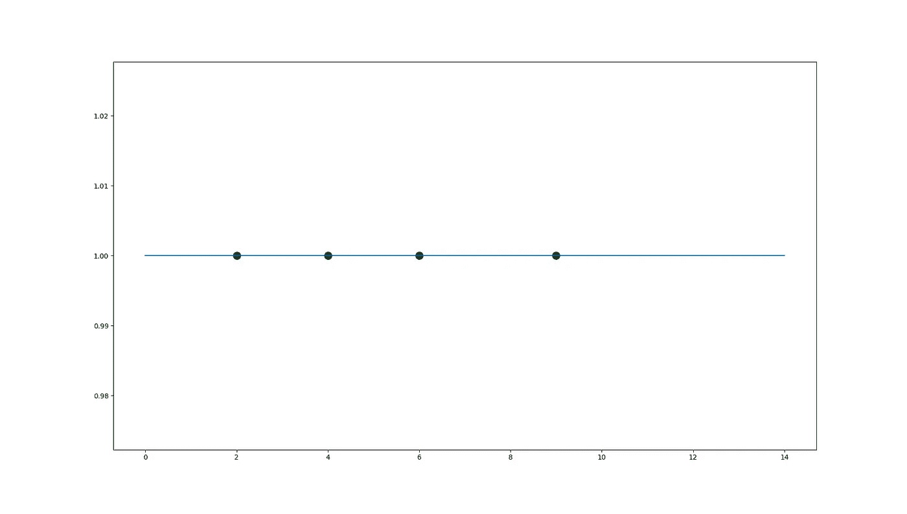
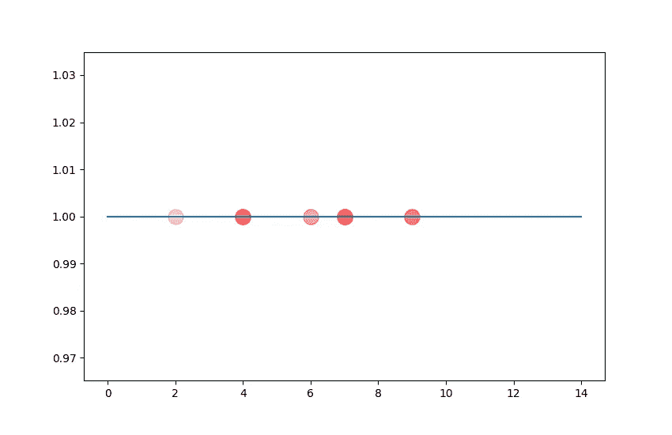
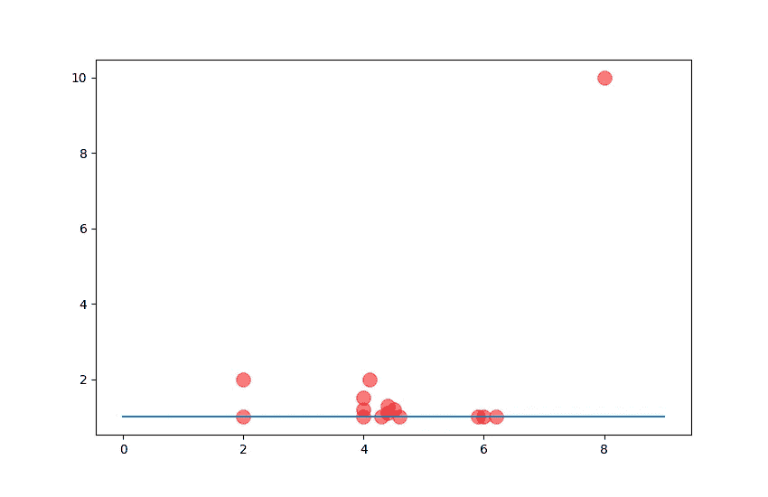
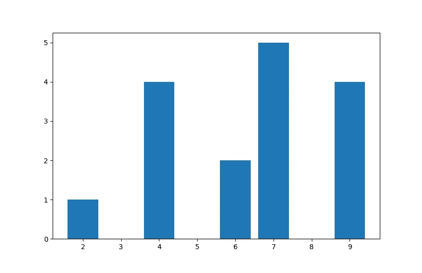
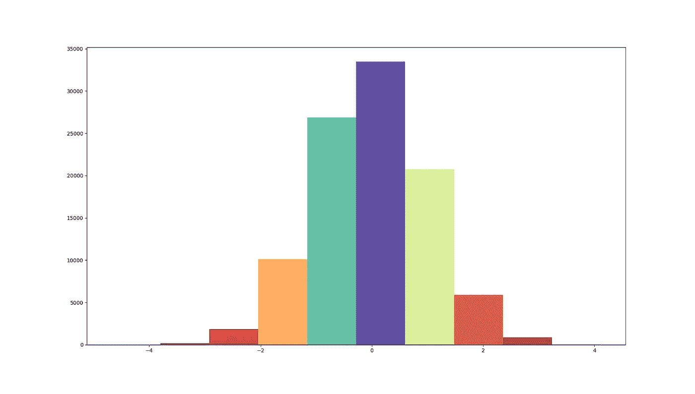
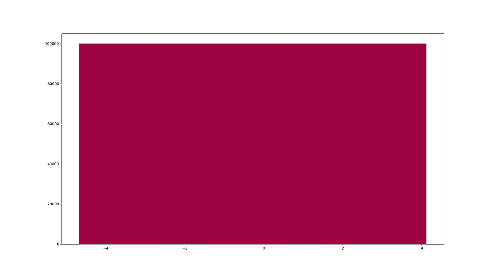
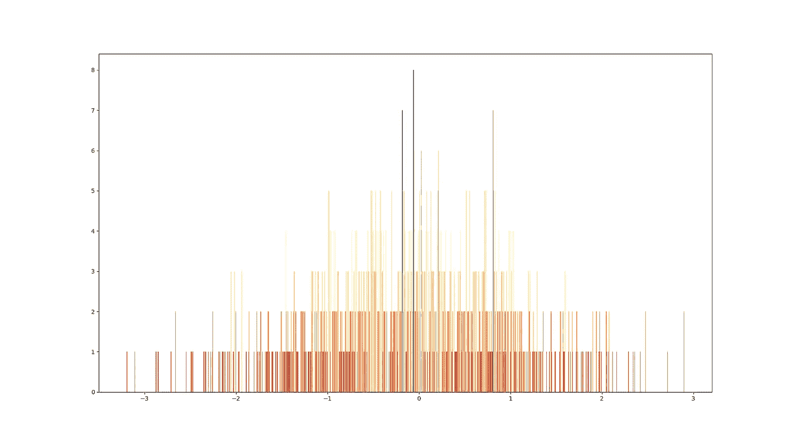
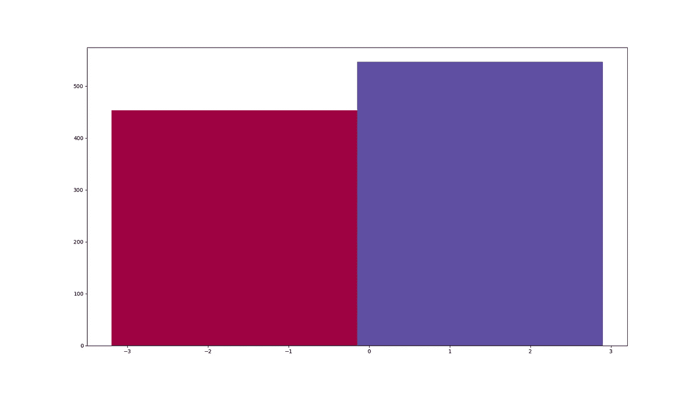

# 直方图

> 原文：<https://medium.com/analytics-vidhya/histograms-a24eb1c63177?source=collection_archive---------21----------------------->

对于任何不熟悉统计学的人来说，他们可能会觉得直方图有点有趣。这些是什么？它们类似于条形图吗？为什么我们会有它们？

首先，我们先建立一个直觉。

图:数字线

我们在学校学过数轴，每个数字都在数轴上找到自己的位置。这里，数线在某种意义上是连续的，线上的每一点都代表一个不同的实数。此外，我们知道每个点只代表一个数字，也就是说，数字不会在同一点上相互堆叠。这里，我们将数据(一个无限实数系统)表示为一维直线。

现在，考虑一种情况，我们需要描述数据的唯一属性是**age**。显然，在这个问题上，我们上面的行不能帮助我们。为什么？

图:2D 的堆积点

图:3D 上的堆叠点

随着数据量的增加，我们发现自己在彼此之上堆积了点(在本例中，一个点代表一个人)。这并没有以清晰的格式表示数据，也没有帮助我们做任何进一步的分析。因此，我们用条形图来描述我们的数据。**记住，在这里，我们的问题陈述处理的是离散数据。**

图:条形图

哇哦。这张图表可用于有用的分析。

这很简单。但是，我们如何解决一个有连续数据点的问题呢？比如说，我们想把人的身高作为唯一属性来分析。现在，很明显，我们可以考虑无限多的高度，这类似于我们在**数轴上的第一个问题。**然而，我们有可能堆叠相同高度的人，这类似于我们在**条形图**上的第二个问题。

嗯。所以，这个问题是我们两个初始问题的混合版本。我们如何解决这个问题来描述数据呢？

图:直方图

现在，我们讨论的话题来了，**柱状图**来救援了！

因此，直方图基本上是连续的模型化条形图。因此，这里我们将连续数据建模为离散数据。例如，我们的最小高度为 130 厘米，最大高度为 190 厘米。在这里，我们可以根据 10 厘米的差距划分数据，即 130-140 厘米属于一个条形，依此类推。**注:**在直方图中，我们将条形称为柱。

因此，我们基本上可以说，我们的直方图随着仓数量的变化而变化。关于箱子的数量没有硬性规定。取 bins = 1 只会将所有数据放在一个 bin 中，这根本没有用。此外，采用 bin=(数据样本的数量)会给每个数据点分配一个 bin，这也是没有帮助的。因此，一般的经验法则是试凑多个箱以获得有用的分布或分析。

图:柱=1 的直方图

图:柱数=N 的直方图

图:柱=2 的直方图

直方图是数据分析中非常有用的工具，可以推断出对连续数据的深刻见解。如果我们想用一个**分布**来近似我们的数据，那么，直方图是一个非常好的方法来证明我们的决定。

更多关于*的发行*在下一篇博客。😀