# 历史数据可视化—一切从何开始？

> 原文：<https://medium.com/analytics-vidhya/historic-data-visualizations-where-did-it-all-begin-3cd6971a462f?source=collection_archive---------18----------------------->

世界上唯一的新事物是你不知道的历史——哈利·S·杜鲁门

数据可视化甚至在它变形为今天这样广为人知的实体之前就已经存在了。历史上，学者们用它来强调他们的计划、方向和观点。尽管这些图表中的大多数已经发展成了更复杂的图表类型，但值得注意的是，数据可视化已经被用作一种工具来传达见解和信息达几个世纪之久。

> 【1858 年——死亡原因图

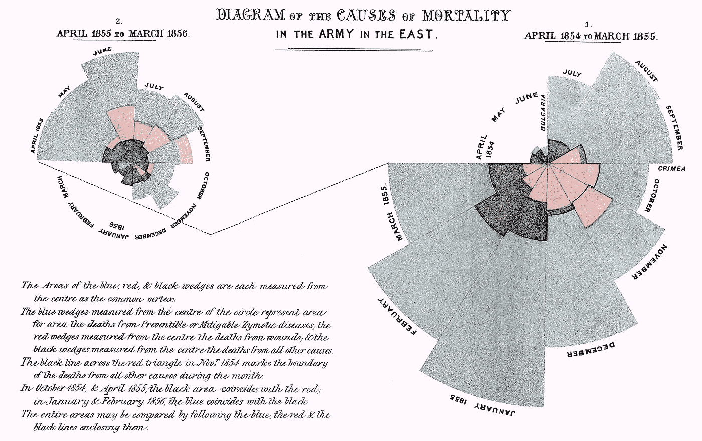

**死亡原因示意图**([https://upload . wikimedia . org/Wikipedia/commons/1/17/Nightingale-Mortality . jpg](https://upload.wikimedia.org/wikipedia/commons/1/17/Nightingale-mortality.jpg))

这张由佛罗伦萨·南丁格尔策划的图表突出了英国军队的死亡原因。这幅图发表在“*关于影响英军健康、效率和医院管理事项的说明”*上，并于 1858 年送给维多利亚女王。

图中的蓝色楔形表示由可预防或可缓解疾病导致的死亡面积。红色楔形表示因伤死亡，黑色楔形表示因其他原因死亡。

1854 年 11 月红三角上的黑线标志着该月所有其他原因死亡的界限。

在 1854 年 10 月和 1855 年 4 月，黑色区域与红色重合，在 1856 年 1 月和 2 月，蓝色与黑色重合。

> **1821 年——季度小麦价格和每周劳动力工资**

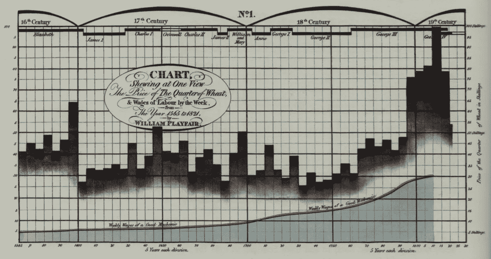

**每季度小麦的价格和每周劳动力的工资(**[https://upload . wikimedia . org/Wikipedia/commons/2/2e/Chart _ Shewing _ The _ Value _ of _ The _ Quarter _ of _ Wheat _ in _ 先令 _ % 26 _ in _ Days _ Wages _ of _ Good _ Mechanic _ from _ 1565 _ to _ 1821 . jpg](https://upload.wikimedia.org/wikipedia/commons/2/2e/Chart_Shewing_the_Value_of_the_Quarter_of_Wheat_in_Shillings_%26_in_Days_Wages_of_a_Good_Mechanic_from_1565_to_1821.jpg)

比较上面的“一个好技工的周工资”和“四分之一小麦的价格”随时间变化的图表，William Playfair 是第一个使用组合图的人，在同一视图中包括条形图和面积图。

线形图显示了周工资，而条形图显示了一季度小麦的价格。

大约 200 年前，William Playfair 是第一个使用图形、图表和数据来说服和说服人们从数据中获得发现的人之一！

> **1825 年——巴黎大道年表。**

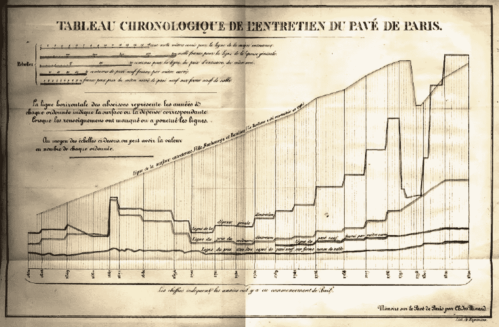

**Tableau chronologique de l ' entretien de Pave de Paris(**[https://upload . wikimedia . org/Wikipedia/commons/c/C5/Projet _ de _ canal _ et _ de _ chemin _ de _ fer _ pour _ le _ transport _ des _ pav % C3 % A9s _ % C3 % A0 _ Paris % 2C _ 1826 . jpg](https://upload.wikimedia.org/wikipedia/commons/c/c5/Projet_de_canal_et_de_chemin_de_fer_pour_le_transport_des_pav%C3%A9s_%C3%A0_Paris%2C_1826.jpg)**)**

下图是由 Charles Minard 策划的，他是一位因其对信息制图的贡献而备受推崇的著名法国土木工程师。他是多种传奇图形和图表的作者，下面列出了其中一些。

这张图是米纳德已知的最早的图表，第一张统计图，是他为巴黎的一个运河项目和运输鹅卵石的铁路而绘制的。该图描绘了多个“时间序列”图表，正如我们今天所知，这些图表与之前两个世纪的巴黎路面维护相关。

> 【1869 年——拿破仑俄国战役的地图

**拿破仑俄军战役地图(**[https://upload . wikimedia . org/Wikipedia/commons/2/29/minard . png](https://upload.wikimedia.org/wikipedia/commons/2/29/Minard.png)**)**

这是查尔斯·密纳德最著名的作品。这张地图显示了 1812-1813 年俄国战役中法国军队的连续损失。

可视化描绘了拿破仑的军队离开波兰和俄罗斯边境。棕色的粗条纹显示了拿破仑军队在前进和撤退过程中特定地理位置的规模。

该图表以二维形式显示了六种数据:拿破仑军队的数量；走过的距离；温度；经纬度；行进的方向；和相对于特定日期的位置。

现代信息科学家表示，1869 年拿破仑的俄罗斯战役地图可能是有史以来绘制的最好的统计图表。一些人认为米纳德的地图是信息图形中的“宝石”，提名它为“世界冠军图”。《经济学人》也将其描述为“历史上最好的三张”图表之一。

> **1858 年——世界移民**

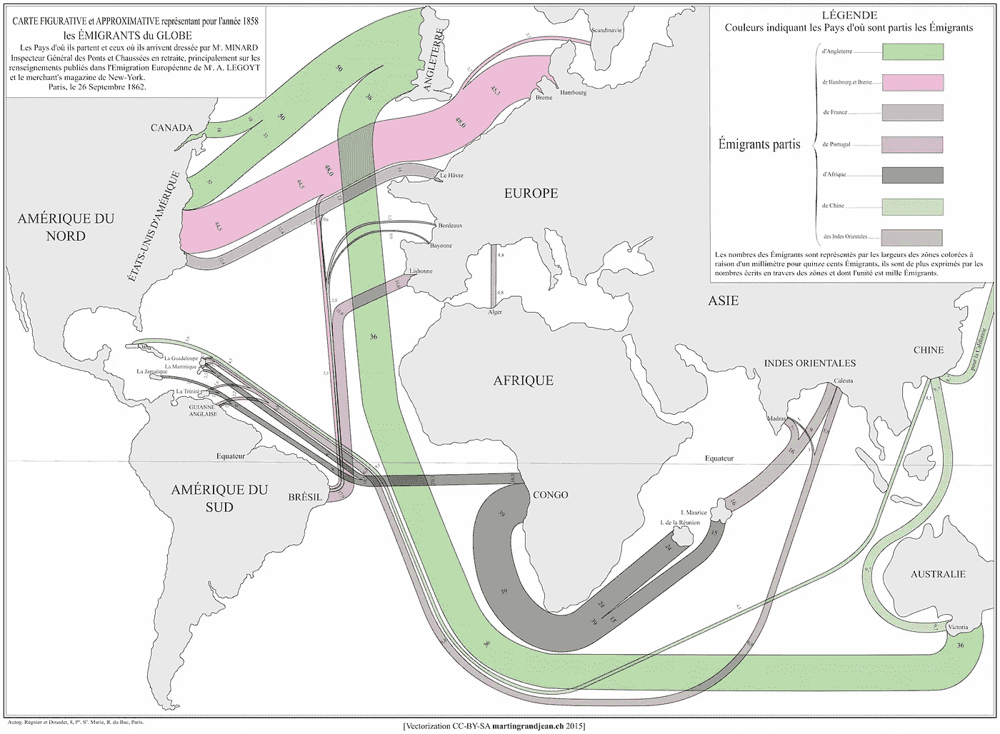

**世界移民(**[http://www . martingrandjen . ch/historical-data-visualization-mapping-migration-in-1862/](http://www.martingrandjean.ch/historical-data-visualization-mapping-migration-in-1862/)**)**

这是 Charles Minard 天才的另一个例子，它直观地显示了 1858 年来自欧洲、非洲、中国和南亚的移民数量和目的地的地图。每条线的粗细代表移民的数量。查尔斯出色地展示了从世界不同地方来的移民的不同流向。

> 【1861 年——绘画作品

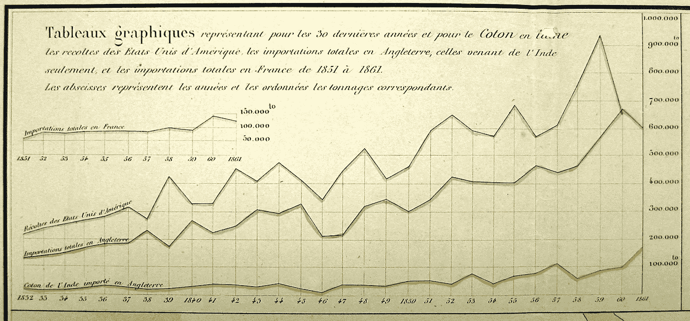

**Tableaux Graphiques**([https://upload . wikimedia . org/Wikipedia/commons/b/BC/Line _ chart _ of _ cotton _ and _ wool _ production _ and _ import % 2C _ 1858-61 . jpg](https://upload.wikimedia.org/wikipedia/commons/b/bc/Line_chart_of_cotton_and_wool_production_and_import%2C_1858-61.jpg))

米纳德绘制了 30 年来棉花和羊毛生产和进口的图表。这张图表本身就很吸引人，因为它展示了工业革命和轧棉机是如何大幅增加棉花的需求和产量的。

> 【1866 年——布列塔尼地区的乡村社区协会

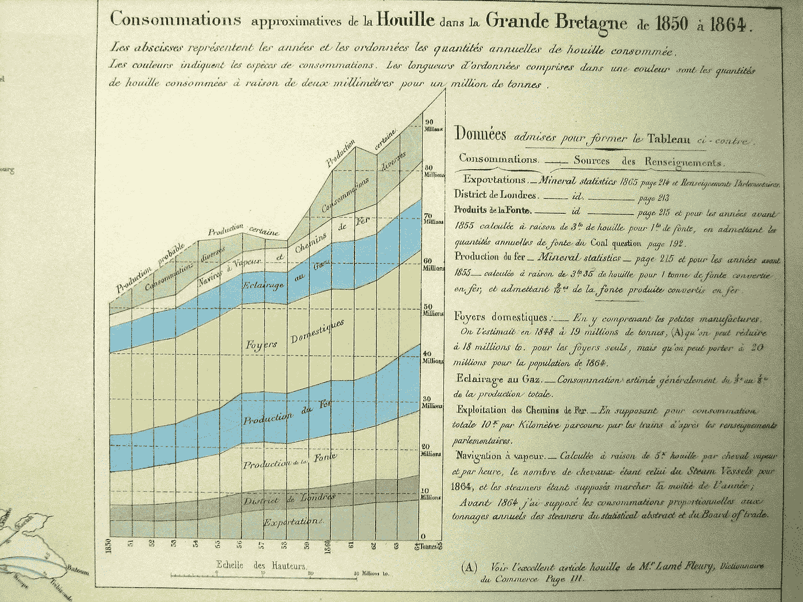

**布列塔尼地区城镇居民联合会**

Minard 图形的另一个例子是堆积面积图，这是他在堆积图正式形成之前很久创建的。

> **19 世纪 50 年代中期—港口和河流吨位图**

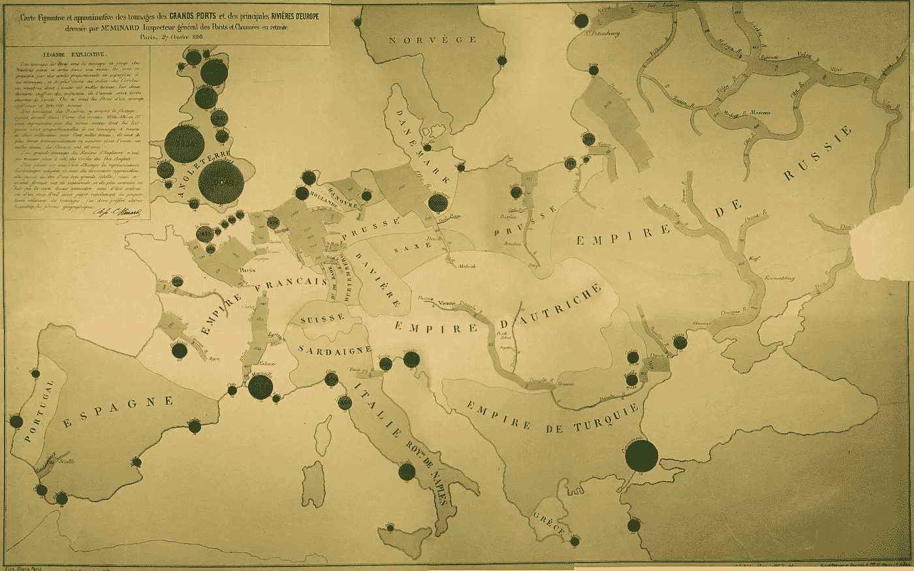

**港口及河流吨位图**([https://cartographia . files . WordPress . com/2008/06/Port-and-River-tongue . jpg](https://cartographia.files.wordpress.com/2008/06/port-and-river-tonnage.jpg))

另一个著名的地图分层气泡图的根本例子是几个世纪前查尔斯·密纳德的发明。在这幅图中，密纳德用代表欧洲港口和欧洲河流的线条和圆圈的大小描绘了这些船只的吨位。

每个圆圈上的数字表示装运的产品量，以千吨计。

整个大陆的商业活动通过河流的厚度和港口的面积表现出来。

> **1860 年——美国南部各州奴隶人口分布图**

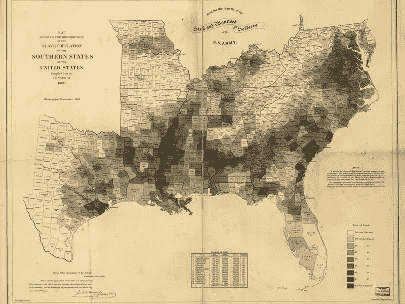

**美国南部各州奴隶人口分布图**([https://www . census . gov/history/pdf/1860 _ Slave _ distribution . pdf](https://www.census.gov/history/pdf/1860_slave_distribution.pdf))

1860 年，为了给受伤和生病的士兵筹集资金，美国人口普查局根据 1860 年的人口普查制作了这张地图，显示了美国南部各州奴隶人口的分布情况。这也让人们注意到，这张图可能是有史以来策划和出版的最早的地图密度图之一。

> 1786 年——革命时期国债的利息。

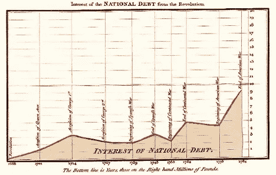

**来自革命的国债利息**([https://upload . wikimedia . org/Wikipedia/commons/6/65/1786 _ Playfair _-_ 25 _ Interest _ of _ the _ National _ Debt _ from _ the _ Revolution . jpg](https://upload.wikimedia.org/wikipedia/commons/6/65/1786_Playfair_-_25_Interest_of_the_national_Debt_from_the_Revolution.jpg)

这幅由威廉·普莱费尔于 1786 年绘制的描绘革命时期国债的图表被认为是有史以来最早的区域图表之一，威廉·普莱费尔被认为发明了同样的图表。

以下所有的面积图都是由威廉·普莱费尔在他 1786 年出版的书*商业和政治地图集*中绘制和出版的。

> 【1786 年——出口&北美所有地区的进口

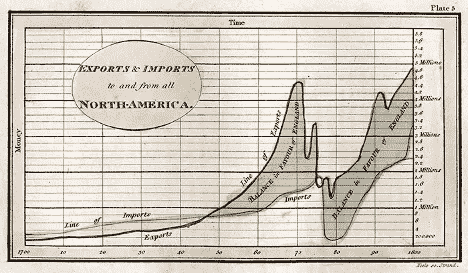

**出口&所有北美地区进出口**([https://upload . wikimedia . org/Wikipedia/commons/3/3f/1786 _ play fair _-_ 5 _ Export _ % 26 _ Import _ to _ and _ from _ all _ North _ America _ from _ 1700 _ to _ 1800 _ % 28 from _ 3e _ edition % 2C _ 1801% 29 . jpg](https://upload.wikimedia.org/wikipedia/commons/3/3f/1786_Playfair_-_5_Export_%26_Import_to_and_from_all_North_America_from_1700_to_1800_%28from_3e_edition%2C_1801%29.jpg)

这张图表说明了英国和它的殖民地之间的贸易，以及在战争期间它是如何陷入停顿的，然而，它很快恢复并在战后迅速扩大。

> **1786 年——英国所有进出口贸易图表**

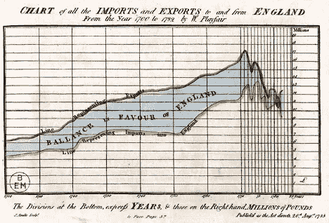

**英国所有进出口图表**([https://upload . wikimedia . org/Wikipedia/commons/4/4f/1786 _ play fair _-_ 1 _ Chart _ of _ all _ the _ import _ and _ Exports _ to _ and _ from _ England _ from _ the _ year _ 1700 _ to _ 1782 . jpg](https://upload.wikimedia.org/wikipedia/commons/4/4f/1786_Playfair_-_1_Chart_of_all_the_import_and_exports_to_and_from_England_from_the_year_1700_to_1782.jpg)

这张图表描绘了从 1700 年到 1782 年英国的进出口情况。两条曲线之间的面积显示了它们之间的差异，并且是贸易平衡的一个有见地的表示。

> **1786 年——英格兰国债图表**

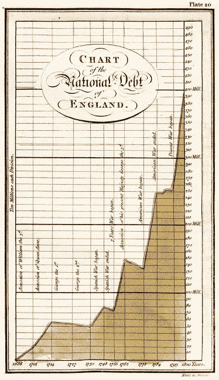

**英格兰国债图表**([https://upload . wikimedia . org/Wikipedia/commons/e/E2/1786 _ play fair _-_ 20 _ Chart _ of _ the _ National _ Debt _ of _ England _ % 28 from _ 3e _ edition % 2C _ 1801% 29 . jpg](https://upload.wikimedia.org/wikipedia/commons/e/e2/1786_Playfair_-_20_Chart_of_the_National_Debt_of_England_%28from_3e_edition%2C_1801%29.jpg))

这张英国国债的**图**清楚地表明了战争和国债增长之间的密切关系。

尽管没有数据可视化的“历史”,但有足够的证据表明，通过数据可视化和图形提供洞察力的基础早在它被形式化为字段、流或实体之前就已经奠定了，如果我们将这些点连接起来，我们可能会遇到一些有趣的图形和古代的启示。

敬请关注数据世界中的更多此类故事…