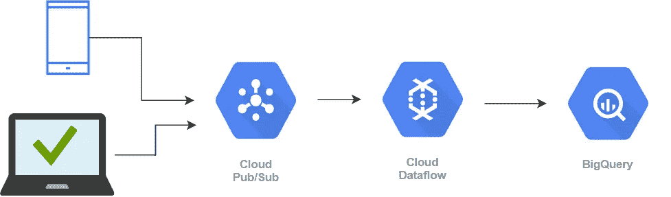
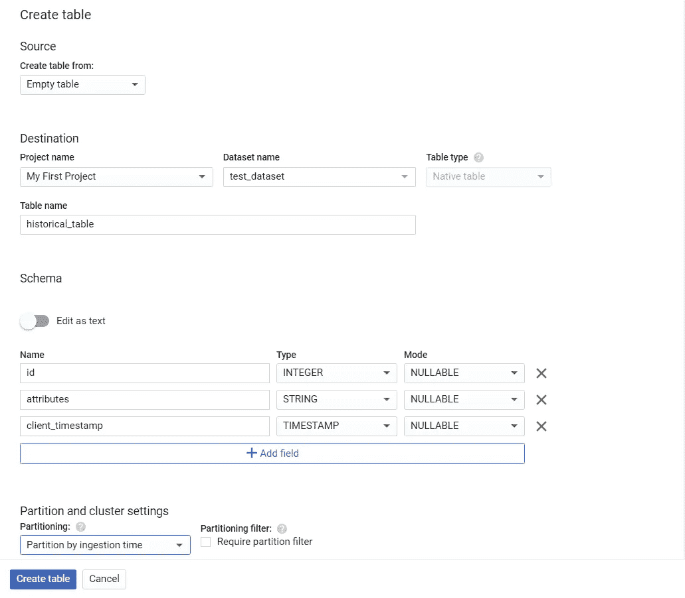
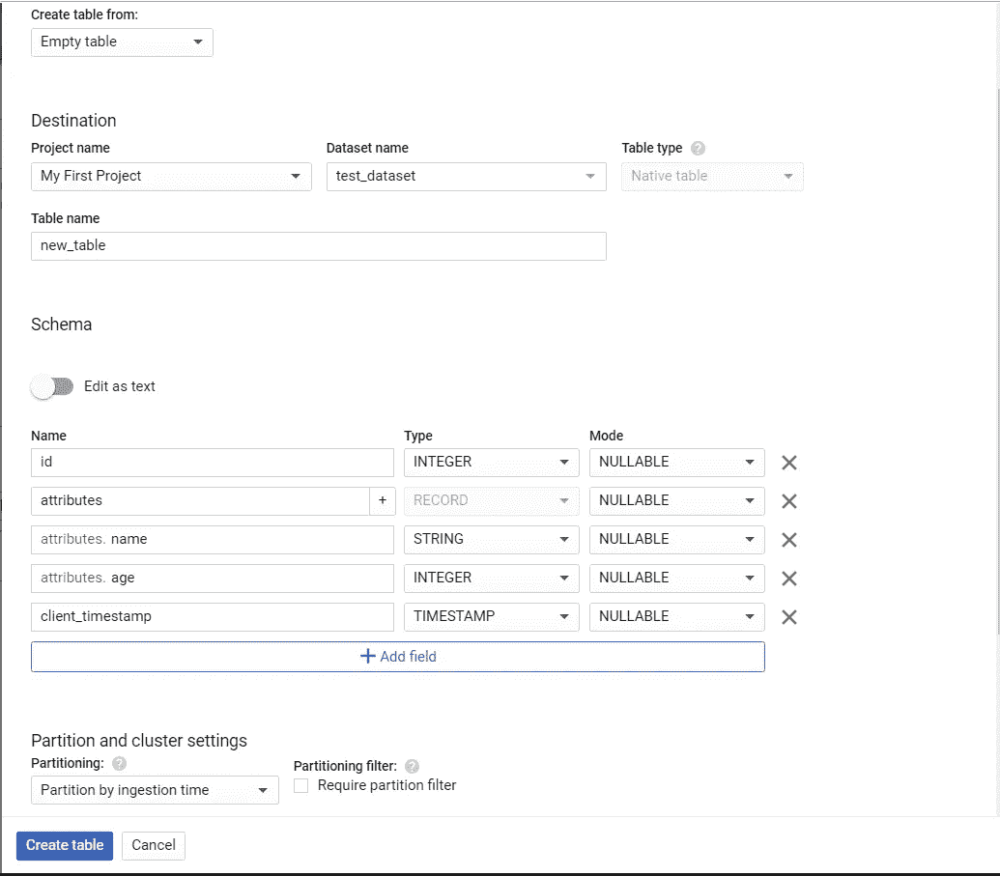
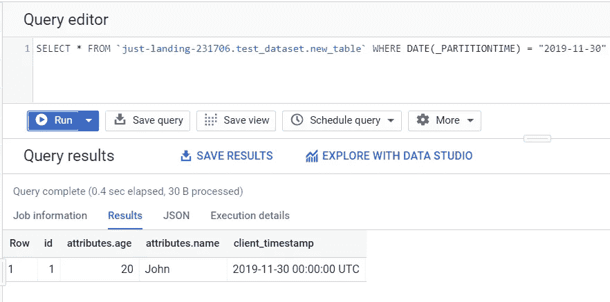
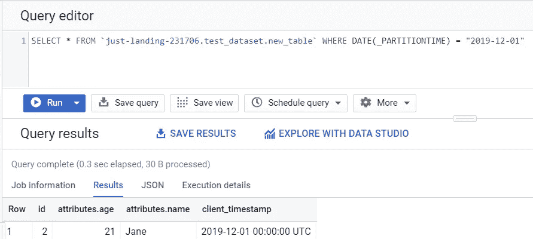

# 使用数据流将历史加载到摄取时间分区的 BigQuery 表中

> 原文：<https://medium.com/analytics-vidhya/historical-load-into-ingestion-time-partitioned-bigquery-table-using-dataflow-3242b3f2739?source=collection_archive---------3----------------------->

# 1.介绍

在我目前的组织中，我们严重依赖 Google Cloud 的服务来运行我们的大规模数据管道。我们使用 PubSub 每秒接收近 12 万个事件，并将它们存储到 BigQuery 中，以满足分析和报告需求。我们从我们的移动应用和网站获取点击流数据，并通过 BigQuery 以尽可能低的延迟查询这些数据。点击流数据是用户行为的最佳指标，对几个下游流程至关重要。

我们从 mobile 和 web SDK 接收 JSON 事件，过去我们将复杂的数据类型(数组和嵌套对象)作为字符串存储在 BigQuery 列中。因此，所有下游流程都必须在 BigQuery 或应用程序中解析这些列值，以获取它们感兴趣的值。这导致了依赖这些数据的不同团队之间的代码和工作的大量重复。将这些复杂的字段存储为字符串也意味着没有对其中的值进行验证，这也是一个数据质量问题。

最近，我们决定利用 BigQuery 的记录和重复类型来存储这些值，以保持数据的正确形状。我们调整了数据流管道，开始解析复杂类型，并将其推送给 BigQuery。由于新模式与旧表不兼容，我们必须用新模式创建新的下游表。

实现这一更改后，面临的挑战是将历史数据批量加载到这些新表中。BigQuery 中的所有表都是摄取时间分区的，将历史数据批量加载到较新的表中意味着我们要么丢失分区信息，要么使用[表装饰器](https://cloud.google.com/bigquery/table-decorators)逐个分区地加载数据。我们不能浪费分区时间，因为我们的许多下游进程对特定分区中的数据很敏感，因此我们决定走另一条路。

当我实现这个一次性批处理管道时，我在 Beam 中遇到了一个漂亮的小 API，叫做[*serializable function*](https://beam.apache.org/releases/javadoc/2.5.0/org/apache/beam/sdk/transforms/SerializableFunction.html)，它让我们基于当前窗口中的记录返回一个定制的表名。使用这个特性意味着我可以一次加载全部历史数据，而不用遍历分区。

在这篇文章中，我将分享如何使用 [SerializableFunction](https://beam.apache.org/releases/javadoc/2.0.0/org/apache/beam/sdk/io/gcp/bigquery/BigQueryIO.Write.html#to-org.apache.beam.sdk.transforms.SerializableFunction-) 将数据加载到 BigQuery 表的正确分区中。



# 2.设置

出于本文的目的，我将设置两个表(1 个历史表和 1 个新表)。历史表将 JSON 数据存储为字符串，而新表将记录和重复类型列。这两个表都将按摄取时间进行分区。

## 历史表

我们将使用 BigQuery 控制台来创建表。您也可以使用`bq`命令行工具或 API 来创建表格。



历史表创建

我们的历史表包含以下各列:

**id:** 用于识别客户的唯一 id

**属性:**客户的属性，如姓名、年龄等。

**客户端时间戳:**事件在设备上发生时的时间戳。

> 我们将使用 client_timestamp 来标识新表中的正确分区。

接下来，我们将在这个表中插入一些历史数据。目前在 UI 中不支持使用表装饰器插入数据，因此我们将编写一个小的 python 脚本来将数据插入到我们的历史表中。

使用 pip 安装 [BigQuery 客户端库](https://pypi.org/project/google-cloud-bigquery/)。

```
pip install google-cloud-bigquery
```

然后执行以下 python 脚本，将 2 条记录加载到两个不同的分区中。

运行脚本，您应该在输出中看到`New Rows have been added.`。

插入后，通过从控制台执行 SQL，仔细检查数据是否已插入正确的分区。

```
SELECT *  FROM `just-landing-231706.test_dataset.historical_table` where DATE(_PARTITIONTIME) = '2019-11-30'SELECT *  FROM `just-landing-231706.test_dataset.historical_table` where DATE(_PARTITIONTIME) = '2019-12-01'
```

您应该在每个查询中看到 1 行。这确认了我们的数据已经被插入到正确的分区中。

> 您的行可能需要一些时间才能显示在正确的分区中。流式插入首先放入缓冲区，然后放入正确的分区。

## 新表格

让我们现在创建我们的新表。



带有记录类型列的新表

新表的记录类型为`attribute`列，字段为`name`和`age`。

# 3.数据流作业

表设置完成后，让我们编写数据流作业，将数据从`historical_table`加载到`new_table`。

如果你想为数据流开发和工作提交设置你的系统，请参考我之前的博客文章。

[](/@Sushil_Kumar/hello-world-in-dataflow-the-bohemian-approach-e6ce8b2092e) [## 数据流中的 Hello World 波西米亚风格

### 这个周末，我参加了谷歌在 Coursera 上的无服务器课程，他们介绍了数据流，一个完全管理的…

medium.com](/@Sushil_Kumar/hello-world-in-dataflow-the-bohemian-approach-e6ce8b2092e) 

您可以从我的 repo 中克隆数据流作业。我将一段一段地向你介绍代码。请记住将项目和数据集变量更改为您的值。

[](https://github.com/kaysush/dataflow-bigquery-historical) [## kaysush/数据流-大查询-历史

### 此时您不能执行该操作。您已使用另一个标签页或窗口登录。您已在另一个选项卡中注销，或者…

github.com](https://github.com/kaysush/dataflow-bigquery-historical) 

你需要注意的主要部分是`BigQueryIO.write.to()`函数调用中`SerializableFunction`类的匿名初始化。

我们需要覆盖`SerializableFunction`类的`apply()`函数并返回一个`TableDestination`对象。我们在这个函数中所做的是从`TableRow`对象中获取`client_timestamp`并用表装饰器`$`创建`tableName`并修正分区值。因此 tableName 的一个样本值将是`projectID:dataset.table_name$partition_date`。使用表名，我们返回一个`TableDestination`的实例。

另一段重要的代码是对`withFormatFunction`的调用。该函数也接受输入 a `SerializableFunction`，但它返回的不是`TableDestination`，而是`TableRow`。

在这里，我们获取`historical_table`的所有字段，解析`attributes`字段中的 JSON，并创建一个输出表行，将`age`和`name`作为单独的记录字段。

通过传入以下程序参数来运行该程序。

```
--tempLocation=gs://<YOUR-BUCKET>/temp/ --project=<YOUR-PROJECT-ID>
```

程序应该会成功执行。

尝试用特定的`_PARTITIONTIME`查询`new_table`。您应该在正确的分区中看到这两行。



分区 1 中的记录



分区 2 中的记录

现在你知道了。我们成功地将历史数据上传到正确的分区中，即使我们的表是按摄取时间分区的。

# 4.结论

`SerializableFunction`是 BigQueryIO 中一个强大的构造，当您希望将行路由到不同的 BigQuery 表时，它非常有用。然而，需要注意的一点是，所有这些表都需要有相同的模式。如果您希望将行写入具有不同模式的不同表中，有一个名为`DynamicDestinations`的不同构造。使用`DynamicDestination`,您不仅返回名称，还返回表的模式。你可以在这里[阅读更多关于它们的内容](https://beam.apache.org/releases/javadoc/2.0.0/org/apache/beam/sdk/io/gcp/bigquery/DynamicDestinations.html)，我将在我即将发布的帖子中尝试介绍它们，因为我们在数据管道中大量使用它们。

如果您发现我的代码中有任何错误，或者有任何问题或建议，请随时在下面发表评论。

到那时，快乐的编码！:)