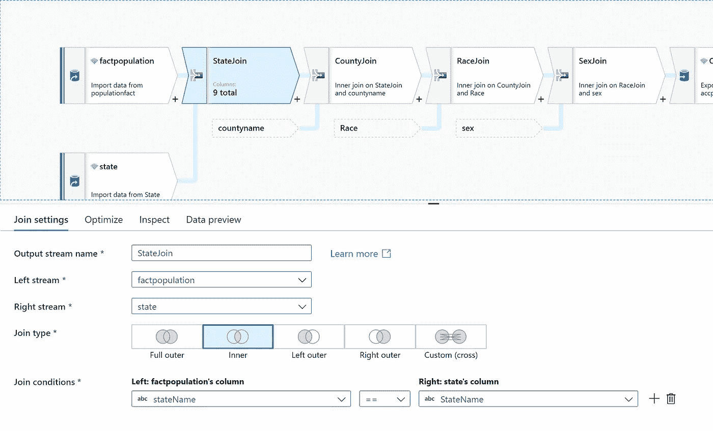
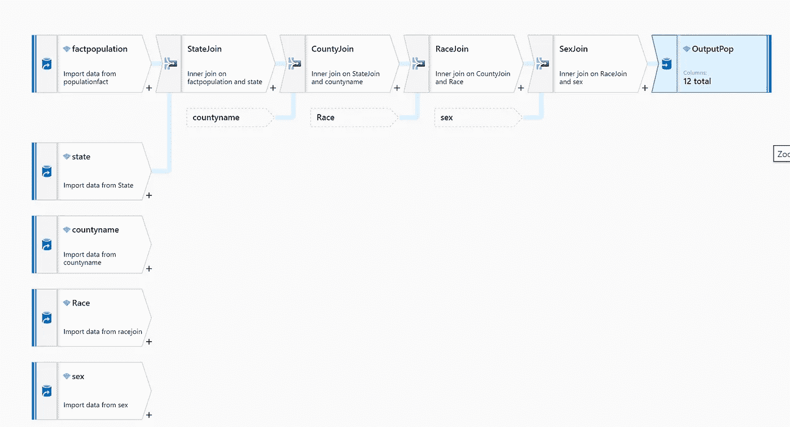
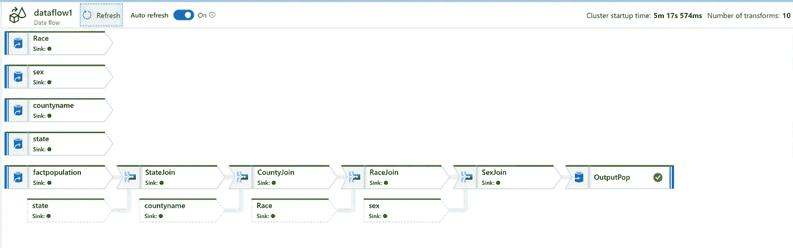
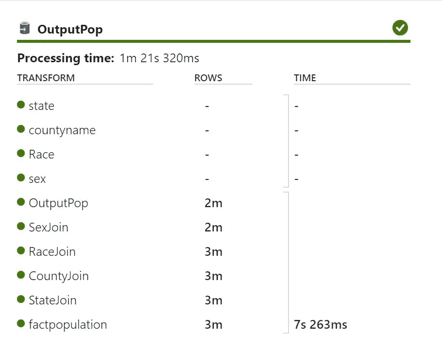
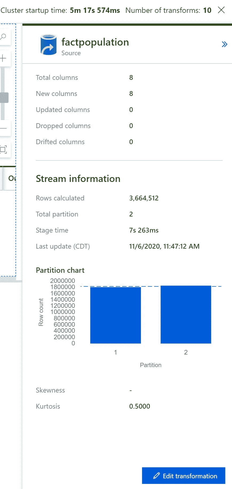
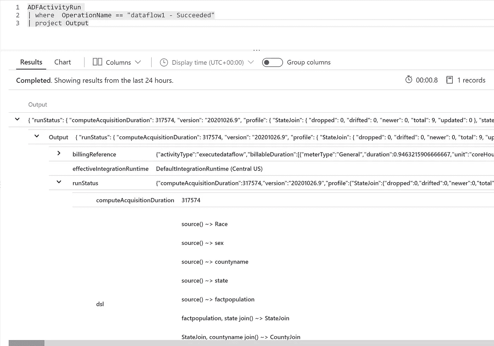
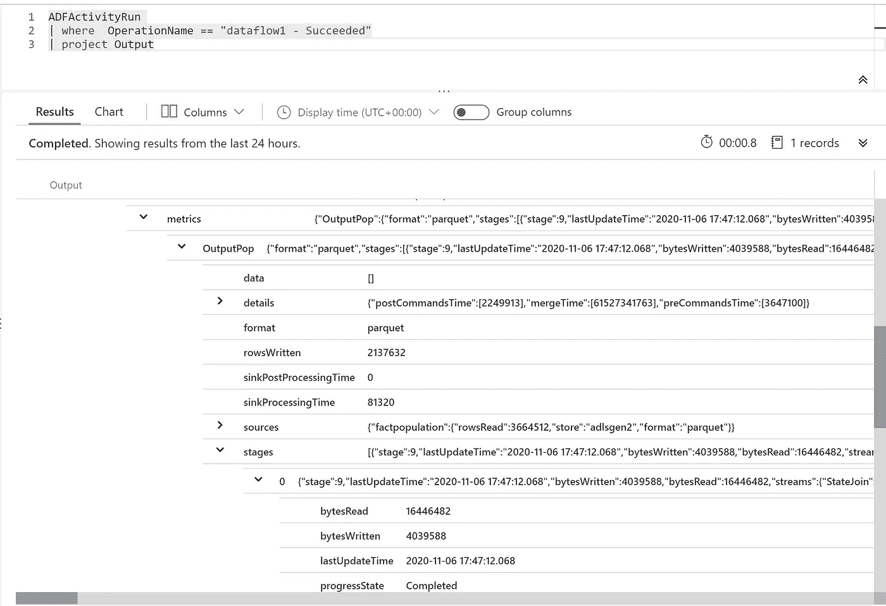
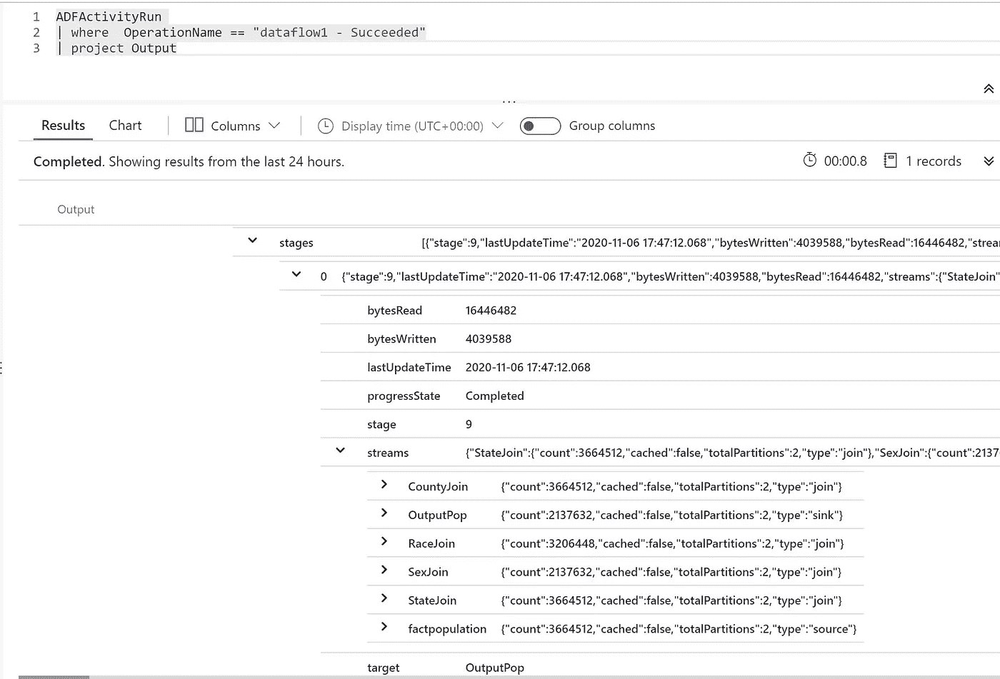

# Hive QL 到 Azure 数据工厂数据流

> 原文：<https://medium.com/analytics-vidhya/hive-ql-to-azure-data-factory-data-flow-c8132d843fd4?source=collection_archive---------27----------------------->

这里考虑一个包含 5 个连接的 sql select 查询。我有一个事实和 4 个维度要加入

*   事实人口
*   维度状态
*   维度 Countyname
*   维度竞赛
*   维度性
*   首先创建一个管道
*   创建新的数据流
*   首先连接到事实作为源
*   选择联接
*   将状态配置为另一个源
*   连接联接列
*   对其他尺寸做同样的操作，如下图所示。

*   创建连接后，保存并发布
*   然后转到管道并触发一次

*最初发表于*[*【https://github.com】*](https://github.com/balakreshnan/Accenture/blob/master/cap/adfmultijoin.md)*。*