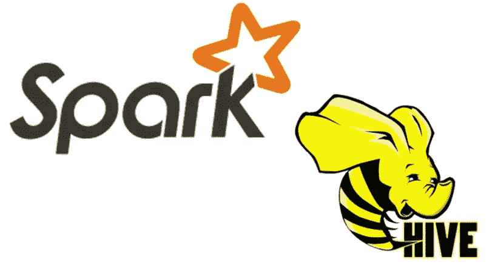

# 使用 S3 和 Scala 的 Hive

> 原文：<https://medium.com/analytics-vidhya/hive-using-s3-and-scala-af5524302758?source=collection_archive---------7----------------------->

## 带有外部数据存储的 Hive 模式初学者指南



在本文中，我将分享我维护 Hive 模式的经验。这将对那些愿意涉足大数据技术的大一新生很有用。这将主要描述如何使用 Scala 连接到 Hive，以及如何使用 AWS S3 作为数据存储。

**简介**

Hive 是一个数据仓库基础设施工具，用于在分布式环境中处理结构化数据。它位于 Spark/Hadoop 之上，用于汇总大数据，并简化查询和分析。

最初，Hive 是由脸书开发的。后来，Apache Software Foundation 采用了它，并以 Apache Hive 的名称将其进一步开发为开源软件。

**特色**

*   使用 Map Reduce 概念进行执行。
*   专为 OLAP 而非 OLTP 设计。
*   快速、可升级和可扩展
*   将模式存储在数据库中，并将处理后的数据导入 HDFS。


**数据库**

数据库是表的集合。Hive 中允许使用关键字 SCHEMA 和 DATABASE。我们可以选择任何一个。这里我们使用数据库而不是模式。可以使用“创建数据库”来创建数据库。要进入模式内部，可以使用关键字“USE”。

```
**CREATE DATABASE userdb;
USER userdb;**
```

**表格**

有三种类型的配置单元表。它们是内部的、外部的和暂时的。内部表存储数据库中表的元数据以及表数据。但是外部表将元数据存储在数据库中，而表数据存储在远程位置，如 AWS S3 和 HDFS。删除内部表时，所有表数据都将随元数据一起被删除。删除外部表时，只会删除元数据。而不是表数据。这样，实际数据将得到保护。如果您将新表指向相同的位置，数据将通过新表可见。

Hive 是一个数据仓库，使用 MapReduce 框架。因此，数据检索的速度对于小型查询来说可能不够公平。为了提高性能，可以对配置单元表进行分区。分区技术可以应用于外部表和内部表。像 bucketing 这样的概念也是有的。您可以选择这些技术中的任何一种来提高性能。

将数据从一个地方复制到另一个地方时，临时表非常有用。它充当数据库会话中保存数据的临时位置。会话超时后，所有临时表都将被清除。

**内部表(托管)**

在内部表的情况下，首先，我们创建表，然后加载数据，因此我们称之为模式上的**数据。**删除此表后，数据和模式都将被删除。

```
**CREATE TABLE user_info (
business_unit INT, 
employee_id INT
)
LOCATION "S3://location"
TBLPROPERTIES (
"s3select.format" = "parquet"
);**
```

**外部表格**

在这种情况下，HDFS 上的数据已经可用，表将基于现有的 HDFS 数据创建。我们称之为**数据模式。**在删除表时，Hive 只删除模式，数据在 HDFS 上仍然可用。

```
**CREATE TABLE user_info (
business_unit INT, 
employee_id INT
)
LOCATION "S3://location"**
```

**降表**

如果删除内部表，数据也将随模式一起被删除。对于外部表，只有模式将被删除，而数据仍将存在于 HDFS 上。

```
**DROP TABLE IF EXISTS user_info**
```

总之，托管表就像一个普通的数据库表，我们可以在其中存储数据和查询。删除托管表时，存储在其中的数据也会被删除，并且永远丢失。而删除外部表将删除元数据，但不会删除数据。

如果你喜欢这篇文章，请点击👏所以其他人会在媒体上看到它。