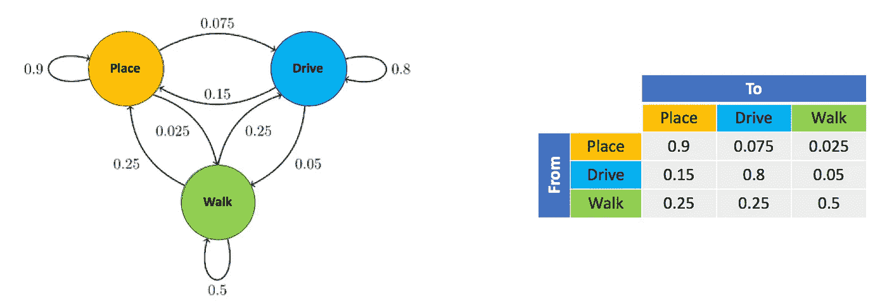
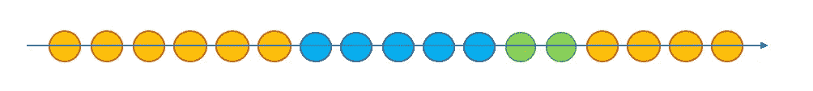
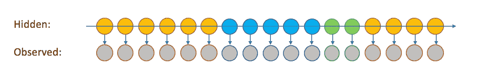
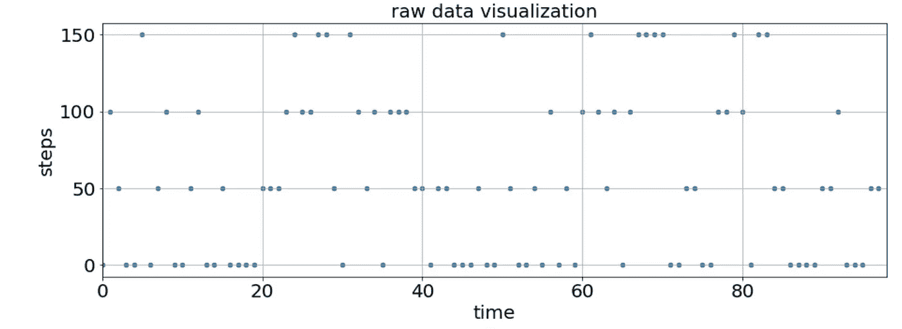
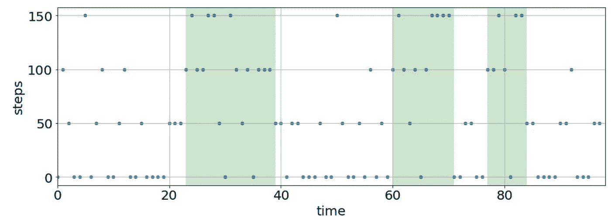
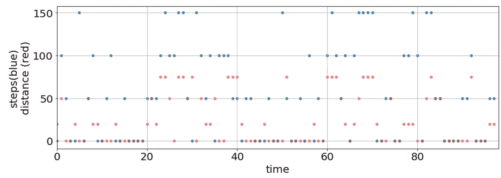
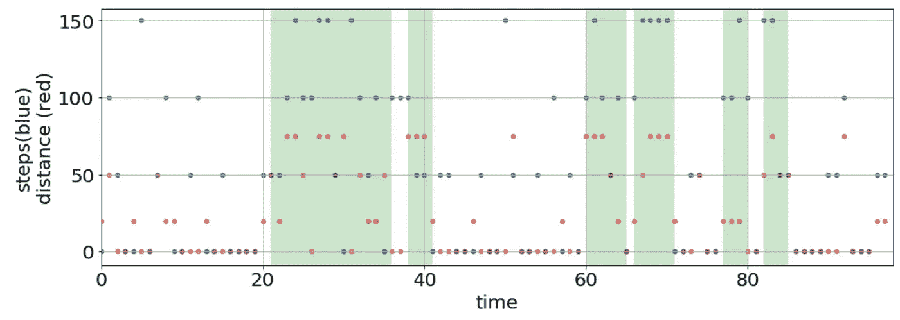

# 多维分类数据的隐马尔可夫模型

> 原文：<https://medium.com/analytics-vidhya/hmm-for-multidimensional-categorical-data-68b1091c9d66?source=collection_archive---------13----------------------->

多维苏格兰(由我拍摄)

您正在处理顺序数据吗？你喜欢经典的机器学习吗？您是否听说过隐马尔可夫模型(HMM)但没有机会在您的数据上进行尝试？在 Python 中找到一个像样的 HMM 包有困难吗？如果你对以上问题中的至少一个回答“是”，我邀请你阅读这篇文章。

我将首先解释一下 HMM 模型，然后用代码示例展示一个很棒的 Python 包。

# 解释 HMM 结构—以用户行为为例

HMM 是一种模型，它允许您在给定数据的情况下找到最可能的状态序列(如果不清楚，请遵循示例)。该模型被广泛应用于各种领域:声音处理、语言模型、遗传学等等。

在下面的例子中，我将展示如何使用 HMM 来预测用户行为——步行或驾驶活动的片段。该预测基于来自蜂窝传感器的数据，如步数计数器、GPS 位置、WiFi 连接等。

要使用 HMM，我们首先需要将世界的统计模型形式化，我们对世界的所有了解将总结为两个小矩阵:**转移矩阵**和**排放矩阵**。下面是一个简单的例子，说明如何构建这些矩阵，并使用它们来预测蜂窝传感器的用户行为:

让我们假设一个用户可以处于三种状态中的一种——驾驶、行走或就位。让我们假设我们已经标记了数据，用户每分钟报告他们一天中的状态。例如:

*   08:00 —地点
*   08:01 —地点
*   08:02—步行
*   08:03 —开车
*   等等。

## 跃迁矩阵

状态 A 和状态 B 之间的转移概率是一个人从状态 A 转移到状态 B 的概率。我们可以从标记数据中找到转移概率。例如，***处*** 和 ***处*** 之间的转移概率将是数据中*处 ***处*** 后的 ***处*** 分钟的总数。*

*我们可以用两种方式来描述转移概率——图表或**转移矩阵:***

**

*左图:转移概率的图示。右图:相同概率的转移矩阵。*

## *马尔可夫链*

*找到概率后，我们可以基于转移矩阵建立一个[马尔可夫链](https://en.wikipedia.org/wiki/Markov_chain)。*

*我们将从其中一个事件开始这个链，让我们选择 ***地点*** 。然后我们将“掷骰子”，意思是我们有 90%的机会再次获得 ***位置*** ，7.5%的机会获得*驱动，2.5%的机会获得 ***行走*** 。由于概率的原因，我们可能会再次得到 ***位置*** ，我们继续掷骰子，直到到达另一个状态，比如说 ***驱动*** 。然后我们把“放置骰子”放到一边，使用“驱动骰子”:80%继续 ***驱动*** ，15%获得 ***放置*** ，5%获得*。***

***一天结束时，当我们掷出不同的骰子 1440 次(每天的分钟数)时，我们将得到一系列事件:***

******

***这个链还没有与我们从我们的特征中获得的任何信息联系起来(请记住，我们有来自蜂窝传感器的数据)，但它已经存储了关于我们数据性质的非常基本的见解，如每个状态的典型持续时间和典型的状态序列。***

## ***发射矩阵***

******

***在我们的问题世界中，状态是**隐藏的**，我们需要根据**观察到的**特征来找到它们，这些特征是手机传感器输出(移动、计步、连接到 wifi 等)。).***

***为了在我们的模型中包含这些特征，我们将构建**发射矩阵**。***

***以下是二元要素(只能获得真/假值的要素)的概率矩阵示例:***

******

***构建矩阵的方式也非常直接——例如，在 ***位置*** 状态下看到 wifi 连接的概率是用户在 ***位置*** 状态下连接 wifi 的分钟数除以所有 ***位置*** 状态下的分钟数。***

**现在我们已经有了**跃迁矩阵和发射矩阵**，我们可以进入 python 的实际部分了！**

# **嗯 Python 包**

**当我着手这个项目时，我很难找到一个能够处理多维分类数据的 Python 包。我确信我会在我心爱的 [sklearn](https://scikit-learn.org/stable/) 中找到它，但是我遇到了三个问题:**

1.  **[sklearn.hmm](http://scikit-learn.sourceforge.net/stable/modules/hmm.html) 模块早就不推荐使用了。**
2.  **[GaussianHMM](https://ogrisel.github.io/scikit-learn.org/sklearn-tutorial/modules/generated/sklearn.hmm.GaussianHMM.html) 模块支持多种特性，但不支持分类特性。**
3.  **[多项式 HMM](https://ogrisel.github.io/scikit-learn.org/sklearn-tutorial/modules/generated/sklearn.hmm.MultinomialHMM.html) 模块支持单个分类特征，但不支持多个特征。**

**所以在谷歌上搜索了一下，我找到了[石榴](https://pomegranate.readthedocs.io/en/latest/HiddenMarkovModel.html)——一个伟大的 Python HMM 包，作者是 Jacob Schreiber。该软件包非常灵活，易于使用，它支持多种分类和连续的功能！网站上有一些很棒的教程，我想在这里介绍一个关于我如何在我的案例中使用它的小教程。**

# **代码示例**

## **(1)一维分类数据**

**我们这里的数据是我根据真实数据创建的虚拟数据集。有 98 分钟，每一分钟我们都有一个计步器。我创建了每分钟 4 箱步数[0，50，100，150]步。本例中的目标是将分钟分为两种状态: ***行走*** 和 ***静止*** 。**

****

**这些数据证明了检测行走部分的挑战，因为我们看到它是有噪声的。**

## **步骤 1:初始化模型并设置排放概率**

**为每个状态设置步骤通道的分布:**

*   **注意:HiddenMarkovModel()、DiscreteDistribution()和 State()都是石榴包的类—不需要实现任何东西:)**

## **步骤 2:设置转移概率和烘焙模型**

**在这里，我还添加了开始概率，这是从每个状态开始链的概率。**

## **预测的可视化**

****

**绿色表示“行走”的片段，白色表示“静止”的片段**

## **(2)多维分类数据**

**现在，我们可以增加一些复杂性，并为我们的数据增加一个通道(并在以后使用相同的代码添加任意多的通道)。**

**除了计步器之外，我们将增加用户位置在前一分钟和当前分钟之间的距离(以米为单位)。让我们将距离分成 4 个区间:[0，20，50，75]。**

**我们的数据现在看起来像这样:**

****

**传感器输出与时间的关系。步数用蓝色表示，距离用红色表示，紫色点实际上是红色上面的蓝色**

## **步骤 1:初始化模型并设置排放概率**

**这里，我们为每个特性和每个状态创建单独的分布，然后使用 IndependentComponentsDistribution 组合这些特性。**

## **步骤 2:设置转移概率和烘焙模型**

**一模一样…**

## **预测的可视化**

**预测考虑了来自两个特征的数据:步数和距离。**

****

**绿色表示“行走”的片段，白色表示“静止”的片段**

**请注意，我们不必绑定我们的数据——软件包允许我们使用连续分布，如高斯分布。我们甚至可以将某些特性的离散分布和其他特性的连续分布结合起来。**

**我希望你已经发现这个帖子清晰而有用，如果你有任何问题，我很乐意听到你的！**

**我想感谢**