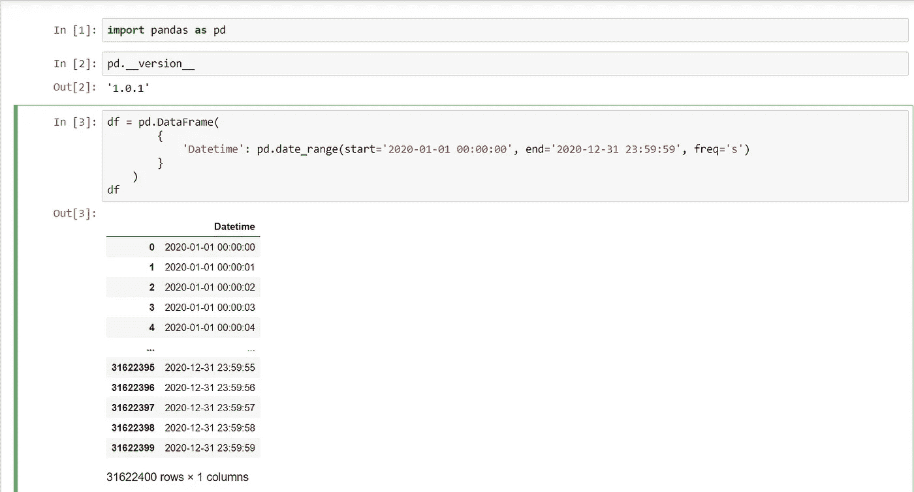

# 节假日、事件和其他日期时间功能工程提示。

> 原文：<https://medium.com/analytics-vidhya/holidays-events-and-other-datetime-feature-engineering-tips-a7678974897f?source=collection_archive---------18----------------------->

## 如何让 Datetime 列告诉你更多关于它本身的信息！！

你好，我将告诉你更多关于我自己的事情

**Datetime** 在任何数据集中都是一个重要的列，因为它可以用更有见地的信息丰富您的数据，这些信息可以帮助您证明数据中的行为和模式。

在本文中，我们将讨论如何使用 [**熊猫**](https://pandas.pydata.org/about/index.html) 和用户自定义函数([**UDF**](https://www.w3resource.com/python/python-user-defined-functions.php)**)**从 datetime 列中提取一些有用的特征。

首先，我们将创建一个虚拟的**数据帧**，它有一个日期时间列，模拟数据集中的日期时间列。

> 您可以在此 访问整个[**示例代码**](https://gist.github.com/MuhammedMaher/48930983bc2304a8f6ff55e52fa61aa0)

然后使用 [**赋值**](https://pandas.pydata.org/pandas-docs/stable/reference/api/pandas.DataFrame.assign.html) ，我们将生成类似于(**年、月、日、工作日、Q、周末 _FLG 和事件**)的派生列

使用 **Pandas** 函数，比如**年、月、日、工作日和季度**列，其中一些列可以直接从日期导出。

熊猫内置日期时间组件

注意，如果我们有一个带有类似于**日期时间的**值的列，那么您可以通过( [**)来访问这些属性。dt 访问器**](https://pandas.pydata.org/pandas-docs/stable/getting_started/basics.html#basics-dt-accessors) )。

像( **Weekend_FLG 和 Event)** 这样的其他列需要用户或开发人员预定义的逻辑，所以我们将使用**UDF 来定义它的逻辑。**

只是为了证明概念( **POC** )，我们将一些**埃及**事件硬编码到 Python 字典中。

假日词典

然后我们会添加我们需要的所有新列..

使用 assign 添加新列

让我们看看我们有什么..

最终数据帧样本

完整示例请访问[**Github Gist**](https://gist.github.com/MuhammedMaher/48930983bc2304a8f6ff55e52fa61aa0)**..**

谢谢，我希望这篇文章对你有所启发。

对于任何意见、建议或反馈，请在下面的回复部分告诉我。

你也可以查看之前的文章
[使用谷歌生态系统](/analytics-vidhya/an-easy-way-to-create-your-portable-data-science-project-environment-46a2c2ec889a)创建云同步数据科学项目的简单方法。还有 **LinkedIn** 发帖[这里](https://www.linkedin.com/feed/hashtag/?keywords=%23MM_Tip)。