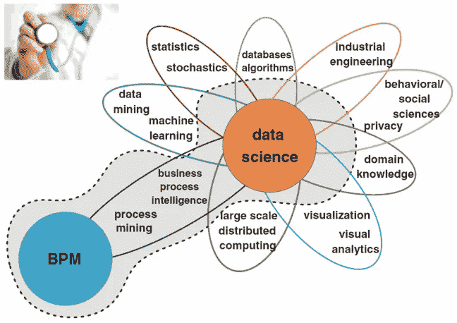
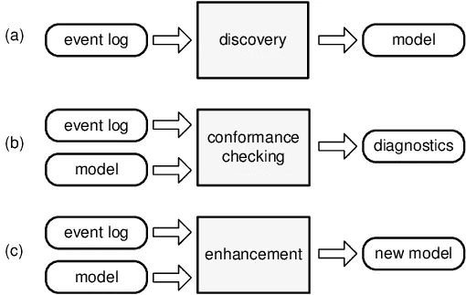

# 全面了解流程挖掘|用途、应用和工具

> 原文：<https://medium.com/analytics-vidhya/holistic-understanding-of-process-mining-uses-applications-and-tools-763f92a31b26?source=collection_archive---------26----------------------->

> ***流程挖掘*** *使企业了解自己的* ***流程*** *对企业成功至关重要。*

过程挖掘是一种分析任何情况下的过程的技术。在每个组织中，流程管理都扮演着重要的角色。由于糟糕的流程管理，一些公司经历了破产和亏损。许多商业领袖把过程作为成功的关键。然而，结果也取决于外部因素。但是从长远来看，更好的过程会产生更好的结果。

尽管流程很重要，但公司关于流程运行情况的数据有限。数据的积累确保了对过程的分析不能凭直觉，相反，我们需要适当的计算和基于事实的数字来支持我们的主张。

# 为什么要进行流程挖掘？

由于各种业务流程非常复杂，因此我们使用流程挖掘技术来提高流程的效率。组织可以从他们的竞争中获得额外的利益。它有助于做出数据驱动的决策。

# **它是如何工作的？**

每个公司都有事件日志，没有流程挖掘工具很难进行分析。因此，一旦信息系统收集了活动序列数据，就可以将其与 ProM 之类的流程挖掘工具集成，以便进行进一步的分析。

下一步，我们将了解流程之间的**变化。**这些变化是由于人工改变或过程中的错误而发生的。

在对每个案例的活动序列进行分析之后，流程挖掘工具开始合并这些序列。随着变化的发生，实际的过程将比计划的过程更加复杂。通过此输出，公司将了解流程变化发生在哪里。

# 从传统到现代的方法:

按照传统的方法，需要分析和设计流程**，使用流程建模工具显式构建**。但是这种方法的缺点是它导致了实际过程和设计者所理解的过程之间的差异。另一个原因是它消耗了大量的时间，从而造成混乱。

通过现代方法，它的目的不是从手工流程设计开始，而是从**“流程执行日志”**中提取序列数据。诸如 [**阿尔法算法**](https://en.wikipedia.org/wiki/Alpha_algorithm) 之类的过程挖掘技术通常假设可以顺序记录事件，使得

—每个事件指的是一个活动(即流程中定义明确的步骤)

—每个事件指一个案例(即一个流程实例)

此外，可以添加附加信息，例如:

1.  主要资源，也称为事件的发起者
2.  事件的时间戳
3.  事件的数量

模型的三种基本类型

## 阿尔法算法的简单解释

该算法检查在两个事件之间观察到的偶然关系。它太简单了，不适用于现实生活中的日志，而且也不应该作为基准。

# 任何挖掘算法的基本测试:重新发现

**原始流程→日志→挖掘算法→挖掘流程**

然后我们比较原始过程和挖掘过程。

# **流程挖掘的应用？**

1.  制造(例如，及时准确地交付给客户是最终目标)
2.  银行和金融(遵守规章制度并能够证明你已经这样做是至关重要的)
3.  医疗保健(例如，通过更好的配送流程向所有医院供应)
4.  零售业(例如，零售业的成功来自供应链、仓储、预测等方面的高效业务运营)
5.  电信(例如，它有助于创建地理上分散的运营的可见性，识别瓶颈并确保客户按时收到产品和服务)
6.  等等。

# 利益

1.  过程标准化
2.  降低成本
3.  优化交付时间、反应时间、相互依赖的流程
4.  更便宜、更快速的审计
5.  基于数据的决策
6.  对不合规的流程做出更快的反应
7.  供应链中更快的交付

这就是博客的范围。我会在未来的博客中分享先进的技术。如果你觉得有帮助，请与你认为会感兴趣的朋友分享。

*尽管和*[*LinkedIn*](https://www.linkedin.com/in/ronak-jain-6002b1155/)*打招呼，我总是很乐意和这个领域的其他专业人士交流。*

*一如既往:欢迎评论、提问和分享！❤️*

进一步研究的链接:

*   [https://www.qpr.com/blog/what-is-process-mining](https://www.qpr.com/blog/what-is-process-mining)，[https://hypersonix . ai/resources/ai-for-retail-ideal-weapon-win-battle-profitable-growth/？UTM _ source = LinkedIn&UTM _ medium = post&UTM _ campaign = blog](https://hypersonix.ai/resources/ai-for-retail-ideal-weapon-win-battle-profitable-growth/?utm_source=linkedin&utm_medium=post&utm_campaign=blog)
*   [http://www . process mining . org/_ media/presentations/processminingtutorialessscass-2009 . pdf](http://www.processmining.org/_media/presentations/processminingtutorialesscass-2009.pdf)