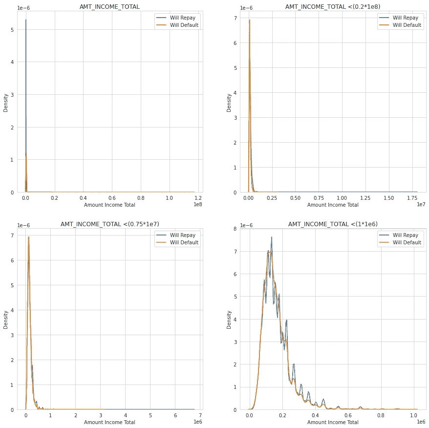
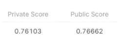

# 住房信用贷款违约风险？

> 原文：<https://medium.com/analytics-vidhya/home-credit-loan-default-risk-7d660ce22942?source=collection_archive---------2----------------------->

> 这个项目是一个端到端的案例研究，它将让你体验真实世界的数据科学问题，你如何从一个业务问题开始，最终拥有一个使用最佳模型的成熟的 web 应用程序。我知道这个博客有点长，因为我想和你分享我尝试过的一切。希望你喜欢阅读这篇文章！！！👍

图片来自[https://blog.bankbazaar.com/](https://blog.bankbazaar.com/)

我最近看到一句谚语，

> "及时归还贷款使得第二次借款变得更加容易."

遵守上面的谚语，如果你不想让我的模型预测你是一个违约者🤣。

**目录:**

1.  商业问题
2.  对数据科学的需求
3.  数据来源
4.  现有方法
5.  探索性数据分析和特征工程
6.  第一次切割溶液
7.  处理缺失值的技术
8.  CIBIL 评分和标准化
9.  模特培训
10.  模型比较
11.  使用 Streamlit 进行部署
12.  结论
13.  未来的工作
14.  轮廓
15.  参考

## **1。商业问题**

我们正在研究的业务问题是给定一个家庭信贷客户的贷款申请，我们能否预测该客户是否能够偿还贷款。此外，我们有一些客户的过去数据，对于一些客户，我们需要使用他们可用的数据来创建它。

## 2.对数据科学的需求

为什么我们在这个问题上需要数据科学？

*   一个人能不能还贷的决策，只要拿到客户之前的数据就可以决定。但是仍然使用现有的技术，有些违约者在一开始就不能被发现。
*   如果我们使用统计和机器学习方法来做出这些预测，在借钱给比单身更好的人之前，这将是双重确认。
*   可能会有一些客户缺少一些数据，这就变得很困难，所以我们可以通过对可用数据进行训练，使用预测模型对他们进行估算。
*   另外，我们可以发现一些由充当违约者的人观察到的共同趋势，这是人工很难观察到的。

使用哪个指标来验证我们的模型性能？

*   对于能够偿还贷款的人，数据的 target = 0；对于不能偿还贷款的人，数据的 target = 1。
*   数据是不平衡的，因为与违约客户相比，偿还贷款的客户数量很高。(图 5.1)
*   如果模型预测在两种情况下是错误的，住房信贷将面临损失。如果模型预测客户将偿还贷款，但实际上他已经违约(场景 1)。如果模型预测客户将违约，但他实际上可以偿还贷款，应得的候选人得不到贷款，银行在利息回报方面有损失(情景 2)。
*   但是在场景 1 中损失会更大，即如果模型预测客户会偿还贷款，但实际上他违约了。
*   所以我们想知道所有实际为正的点中，有多少预测为正。
*   **准确性**不能用于不平衡数据，因此在我们的情况下没有帮助。
*   **精度**将告诉所有被预测为正的点，其中有多少实际上是正的。精度不考虑，实际上为正的点和预测为正的点。
*   **回忆**很重要，因为它会告诉所有实际上为正的点，其中有多少被预测为正。所以回忆对确定场景 1 很重要。如果召回率高，意味着违约者被正确预测为违约者
*   **F1-得分**是精确度、召回率和精确度的几何平均值，如果召回率和精确度高，则得分高。因为我们在这里没有使用精度，F1 分数或微观 F1 分数或宏观 F1 分数并不重要。
*   在 **ROC-AUC** 评分中，我们有真阳性率和假阳性率，
*   真实肯定率与回忆率相同，因此场景 1 涵盖在内。
*   假阳性率是指所有实际上为阴性的点中有多少被预测为阳性场景 2。
*   因此 ROC-AUC 得分是一个重要的指标，因为它涵盖了家庭信贷可能遭受损失的两种情况。ROC-AUC 得分应该大于 0.5，这意味着您的模型做得对。

## 3.数据来源

这些数据可以在家庭信用违约风险卡格尔竞赛中获得，

 [## 住房信贷违约风险

### 你能预测每个申请人偿还贷款的能力吗？

www.kaggle.com](https://www.kaggle.com/c/home-credit-default-risk/data) 

表的实体关系

3.0 表的实体关系

*   应用程序 _{train|test}。csv:这是主表，分为训练(有目标)和测试(无目标)两个文件。
*   bureau.csv:由其他金融机构提供并向信用局报告的所有客户以前的信用记录(对于我们样本中有贷款的客户)。
*   bureau_balance.csv:信用局中以前信用的每月余额。
*   POS_CASH_balance.csv:以前 POS(销售点)的每月余额快照和申请人的家庭信贷现金贷款。
*   credit_card_balance.csv:申请人以前拥有的家庭信用信用卡的每月余额快照。
*   previous_application.csv:在我们的样本中有贷款的客户的所有以前的住房信用贷款申请。
*   分期付款 _ 付款. csv:与我们示例中的贷款相关的家庭信贷中以前支付的信贷的还款历史。

## 4.现有方法

Home Credit 目前正在使用各种统计和机器学习方法来进行这些预测，他们正在挑战 Kagglers，以帮助他们释放数据的全部潜力。这样做将确保有能力还款的客户不会被拒绝，并且贷款的本金、到期日和还款时间表将使他们的客户获得成功。

我正在尝试的事情:

*   使用轻梯度增强模型分别改善 7 个表上的 ROC-AUC 分数，从而改善组合表的分数。
*   使用中位数和岭回归法输入缺失值。
*   用我最好的两个模特做一套定制服装
*   使用我们的模型构建一个成熟的 web 应用程序并托管它。

## **5。探索性数据分析**和特征工程

让我们一张一张地看看这些表格……

**a .应用 _{train|test}。csv** :这是主表，分为训练(有目标)和测试(无目标)两个文件。

5.0 应用列车车头

5.1 目标计数

如果客户将偿还贷款，目标变量为 0，如果客户将违约，目标变量为 1。从图中可以清楚地看到，数据集是**不平衡的**。

探索的一些功能…

*额度(贷款的额度)*:额度是申请人申请的额度。

5.2 信用额度

**分析**

*   对于能够支付贷款和支付贷款有困难的两类申请人来说，贷款额低于 10⁶的密度较高。
*   图表看起来向右倾斜了。

**结论**

*   很明显，能够按时还贷的人和还贷有困难的人之间的数据高度重叠。
*   所以用处不大。

*金额收入合计(客户收入):*

5.3 收入金额

**分析**:

*   AMT_INCOME_TOTAL 是客户的收入。
*   两类客户的收入都低于 20000000.0，只有一个客户的收入为 117000000.0，但仍无力偿还贷款。
*   如果我们把它去掉，画一张金额收入总额的图表
*   After plotting AMT_INCOME_TOTAL

**结论**:

*   由于这两个类中这些特征的大多数值都是重叠的，因此该特征没有多大用处。

*就业天数(年)*

5.4 天工作时间(年)

**分析**:

*   在绘制了雇佣年数之后，两个目标中都有一些客户工作了 1000 年，这是一个异常值。
*   除去 365243 这一数值后，现在一个人工作 50 年的最大年限。
*   显而易见，拥有不到 10 年经验的客户在偿还贷款方面有困难。

**结论**:

*   两个目标值的最大密度重叠稍少。
*   所以这个功能会很有用。

*天数 _ 出生(年)*

出生 5.5 天(年)

**分析**:

*   大多数年轻人(20-40 岁)在偿还贷款方面有困难。
*   随着年龄的增长，我们看到年龄组(50-70 岁)偿还贷款的比例最大。

**结论**:

*   两个目标值的最大密度重叠稍少。年轻的客户更有可能违约
*   所以这个功能会很有用。

在这类问题中，特征工程是一项重要的技能，但创造实际影响目标变量的特征更为重要。我的主要任务是找到每个表中影响目标变量的特性。

**让我们看看有能力偿还贷款的人和没有能力偿还贷款的人提交的文件编号**

5.6 目标 0

5.7 具体目标 1

**结论**:两者在申请过程中实际提交的文件数量比例相同。有一个客户在目标 1 部分提交了 4 个文档，这是不同的，但没有多大帮助。

5.8 标记文档 3

**分析**

*   这两种类型的客户端通常只提交一个文档，即文档 3。
*   文档 3 是申请人提交的最常见的文档。
*   FLAG_DOCUMENT_3==0 表示未提交文档 3
*   FLAG_DOCUMENT_3==1 表示提交的文档 3
*   FLAG_DOCUMENT_3 主要由能够偿还贷款的客户提交，而不是由不能偿还贷款的客户提交，但是这也是可能的，因为数据是不平衡的。

**结论**

*   所以 FLAG_DOCUMENT_3 可能是一个有用的特性。

*外部 _ 源 _1、外部 _ 源 _2、外部 _ 源 _3* (来自外部数据源的标准化分数)

5.9 外部来源

**分析**

*   外部源 1 < 0.4 then the client will default and External source 1 > 0.4 客户端将偿还，两个类之间有明显的分离。
*   外部源 2 < 0.5 then the client will default and External source 2> 0.5 客户端将偿还，两个类之间存在可见的分离。
*   外部来源 3 < 0.4 then the client will default and External source 3 > 0.4 客户端将偿还，两个类之间存在可见的分离。

**结论**

*   EXT_SOURCE_1、EXT_SOURCE_2、EXT_SOURCE_3 这些功能非常有用

**分类值的编码:**

标签编码器主要有两种编码方式，一种是热编码。标签编码器给变量一个序数值，例如 1、2、3 等，这在该数据的分类列中无效，所以我使用了**一个热编码**。

一个热门的编码可以使用 pandas.get_dummies 完成..

**如何找到特征与目标变量的关系？？**

*   第一种方法:**皮尔逊相关系数**，找出与目标负相关或正相关的前 20 个特征。

5.10 应用培训数据与目标变量的 Pearson 相关性

*   第二种方法:在没有任何超参数调整的情况下，简单地对数据训练模型，并获得特征重要性。我知道有两个库在做这个，一个是随机森林，另一个是光梯度增强机制。我选择了轻度梯度增强，因为它在训练数据上给了我一个高 ROC-AUC 分数。

> Light GBM 是基于决策树算法的快速、分布式、高性能梯度 [boosting](https://courses.analyticsvidhya.com/courses/ensemble-learning-and-ensemble-learning-techniques?utm_source=blog&utm_medium=which-algorithm-takes-the-crown-light-gbm-vs-xgboost) 框架，用于排序、分类等多种机器学习任务。

*在应用程序培训数据上培训 LGBM 后的前 30 个功能*

5.11 应用程序培训数据的 Lgbm 前 30 名功能

我优先考虑第二种方法，因为在两个连续的数据变量之间发现了相关性，但这里我的目标变量是离散的，即{0，1}，所以结果不完全可信，当我使用第二种方法的顶级特征创建一些新特征时，我们可以看到 ROC-AUC 得分有所提高，这在使用第一种方法时没有发生。

当仅用 LGBM 模型对应用程序训练数据进行训练时，给出的 ROC-AUC 得分为:0 . 46486 . 38638686661

让我们看看图 5.11 中 lgbm 最重要的特征，即支付率倒数

*支付率倒数:*

就是额度信用(房屋信用给的额度)和额度年金(每月要还的额度)的比例。

5.12 支付率倒数

**分析:**

*   价值小于 12 的客户将偿还贷款。
*   值大于 12 小于 18 的客户端将是默认客户端。
*   支付范围在 22 和 35 之间，客户偿还贷款的可能性也很高。

**结论:**

支付率反向功能非常有用。

**b . bureau . CSV&bureau _ balance . CSV**

bureau_balance.csv:

信用局以前信用的每月余额。此表中有一行记录了每个月向征信机构报告的信用历史记录。

5.13 局 _ 余额头

该表中的两个特征是:-

*   MONTHS_BALANCE:-相对于申请日期的余额月份(-1 表示最新的余额日期)
*   状态:-当月信用局贷款的状态(活跃、已关闭、DPD 0–30，… [C 表示已关闭，X 表示状态未知，0 表示无 DPD，1 表示 1–30 月间的最大 did，2 表示 DPD 31–60，…，5 表示 DPD 120+或出售或注销])

我在 bureau_balance.csv 上应用了一些聚合，比如 min、max、sum。

状态==C 的月累计，表示在特定月数内关闭的信用账户数。

bureau.csv:

由其他金融机构提供并向信用局报告的所有客户以前的信用记录(对于在我们的样本中有贷款的客户)。对于我们样本中的每一笔贷款，都有客户在申请日期之前在信用局拥有的信用数。

5.14 局长

有些特征是从局表中创建的

*   安全贷款和无担保贷款也算:一笔**安全贷款**要求借款人提供抵押品，而一笔**无担保贷款**则不要求。

*   债务百分比:它是信用局信用的当前债务与信用局信用的当前信用额的比率

*   一些简单的聚合(如平均值、最大值、最小值)被应用于这些特征。
*   根据活动信用和已结信用对数据进行分组，然后对其应用聚合。所以我们了解了两种情况下的客户行为

*DAYS_CREDIT_MIN*

*   客户在当前申请之前申请信用局信用的最少天数

5.15 最少信用天数

**分析**

*   如果最小天数小于-2000，则 target==0(可以偿还贷款)
*   如果平均天数大于-1500，则 target==1(无法偿还贷款)
*   特征 DAYS_CREDIT_MEAN 显示正相关性，因为这里的天数为负，否则相关性将为负

**结论**

*   DAYS_CREDIT_MIN 这个特性非常有用。

*对 LGBM 进行局数据培训后的前 30 个特征*

5.16 关于统计局数据的 Lgbm 前 30 名特征

当只对 bureau 和 bureau_balance 数据进行训练时，LGBM 模型给出的 ROC-AUC 分数为:0。46660.68668686661

负债百分比均值是最重要的特征。债务百分比平均值是信用局信用的当前债务与信用局信用的当前信用额的平均比率。

**c . previous _ application . CSV:**

在我们的样本中有贷款的客户的所有以前的家庭信用贷款申请。在我们的数据示例中，与贷款相关的每个先前的应用程序都有一行。

5.17 在先申请

*   应用于数据最小值、最大值、平均值的聚合

*   利率和单利:

*   根据以前贷款的状态(已批准、已拒绝或已取消)进行分组，然后应用聚合平均值、最小值、最大值。

*PREV _ DAYS _ FIRST _ DRAWING _ 均值*

*   相对于当前申请的申请日期，所有其他先前申请的客户平均值，先前申请的第一次支付是在什么时候
*   支出是从公共或专用基金中支付的一种形式。或者，它是指代表客户向第三方支付的款项，随后要求客户偿还。

5.18 前一天第一次提款平均值

**分析**

*   先前申请的第一次提款的平均天数小于-2000 天，客户偿还贷款的可能性很大
*   先前申请的首次提款的平均天数大于-500 天，客户拖欠贷款的可能性很高
*   在-2000 和-500 之间，你看到两个目标类发生的机会相等

**结论**

*   PREV_DAYS_FIRST_DRAWING_MEAN 是一个非常有用的功能

*对 LGBM 进行前 _ 应用数据培训后的前 30 个特征*

5.19 Lgbm 前 30 个功能的先前应用程序数据

当只对以前的应用数据进行训练时，LGBM 模型给出的 ROC-AUC 分数为:0 . 46386 . 38686868661

前一天最后到期 IST 版本最大值是最大值，相对于前一次申请的第一次申请日期而言。

**d. POS_CASH_balance.csv**

申请人以前的 POS(销售点)和家庭信贷的现金贷款的每月余额快照。此表中有一行记录了家庭信用中每个月的信用历史记录。

5.20 pos _ 现金 _ 余额

*   对数据应用的一些聚合是最小值、最大值、平均值和总和

*   按月汇总数据

*   根据有效和已完成的合同状态进行分组，然后应用汇总

*在 POS_CASH_balance 数据上训练 LGBM 后的前 30 个特征*

5.21 Lgbm top 现金余额数据的前 30 大特征

当只对 POS_CASH_balance 数据进行训练时，LGBM 模型给出的 ROC-AUC 分数是:0.665676768786

POS_MONTH_BALANCE_MEAN 是最重要的功能，它是相对于当前申请日期的余额月份的平均值

**e . credit _ card _ balance . CSV**

申请人以前拥有的家庭信用信用卡的每月余额快照。此表中有一行记录了家庭信用中每个月的信用历史记录。

5.22 信用卡余额头

*   人们提取的金额低于他们实际信用额度的 30%、60%或 90%。

*   应用最小值、总和、平均值等聚合

*   根据月份对数据进行分组，然后应用聚合操作

*对 LGBM 进行信用卡余额数据培训后的前 30 个特征*

5.23 关于信贷余额数据的 Lgbm 前 30 名特征

当只对信用卡余额数据进行训练时，LGBM 模型给出的 ROC-AUC 分数是:0 . 6260 . 638638686665

CRED _ AMT _ CREDIT _ LIMIT _ ACTUAL _ MEAN 是最重要的功能，它是前一个信贷月份信用卡限额的平均值。

**f .分期付款 _ 付款. csv**

与我们样本中的贷款相关的住房信贷中以前支付的信贷的还款历史。a)每笔已支付的款项占一行，b)每笔未支付的款项占一行。在我们的示例中，一行相当于一次分期付款的一次支付，或者一次分期付款对应于一次与贷款相关的先前住房信贷的一次支付。

6.0 分期付款 _ 付款

*   让客户在之前的分期付款中完成延期付款。

*   减少客户在以前分期付款中的付款。

*   应用简单的聚合，如最小值、最大值、总和、平均值

*   根据输入付款的天数对数据进行分组，然后应用聚合

*对 LGBM 进行分期付款 _ 支付数据培训后的前 30 个功能*

5.24 分期付款数据上的 Lgbm 前 30 个功能

当只对信用卡余额数据进行训练时，LGBM 模型给出的 ROC-AUC 分数是:0 . 7260 . 388686868665

INST _ 金额 _ 付款 _ 平均是最重要的特征，它是客户在这次分期付款中实际支付的先前信用的平均值

**最终组合表**

**应用 _ {训练|测试}。CSV+bureau . CSV+bureau _ balance . CSV+POS _ CASH _ balance . CSV+credit _ card _ balance . CSV+previous _ application . CSV+credit _ card _ balance . CSV)**

## **6。第一次切割方法**

1.  获取合并数据，并使用中位数进行估算。
2.  在 0-1 之间标准化每个的值。
3.  使用逻辑回归训练数据。
4.  计算 ROC-AUC 分数。

## 7.处理缺失值的技术

用于查找具有缺失值的列和缺失值百分比的代码

7.0 缺少值的列

**删除缺失值超过 75%的列:**

**缺失值中位数插补低于 30%的列**

7.1 缺失值少于 30%的列

有两种类型的插补均值和中值，但均值的问题是它会受到异常值的影响，因此使用中值插补。

**使用岭回归进行缺失值插补，缺失值大于 30 且小于 75%的列**

7.2 缺失值大于 30%且小于 75%的列

首先，我创建一个缺失列的临时副本，其中包含原始列中的非缺失值，缺失值由相应列中的值列表中的随机值填充。所以现在我们开始在岭回归中使用缺失列的估算形式。因此，我们现在不会遗漏具有遗漏值的列中存在的值。

应用岭回归..

现在，在他们的工作完成后，删除我们创建的临时列。

## 8.CIBIL 评分和标准化

[*https://www . bank bazaar . com/cibil/cibil-score-calculation . html*](https://www.bankbazaar.com/cibil/cibil-score-calculation.html)

CIBIL 分数是多少？

CIBIL 分数是一个 3 位数的数字，用来评估你的信誉。它的范围从 300 到 900 不等，由 TransUnion CIBIL 信用局在考虑了几个因素后计算得出。

8.0 用于计算 CIBIL 分数的值的比例

我试图利用现有的数据创建等效的特征..

*   3365_LATE_PAYMENT_FLAG_MEAN:在过去 3 年的到期日之后付款的次数。贡献 30%的支付历史。
*   CRED_FLAG_LESS_30_MEAN:使用信用额度 30%以下的客户。贡献 25%的信用风险。
*   ABS_YEAR_CREDIT_MAX:此人拥有信用历史记录的最大年份。贡献 5%的信用类型和期限
*   UNSEC_LOAN_COUNT_SUM:过去获得的无担保贷款的数量，例如信用卡。贡献 10%的信用类型和期限
*   SEC_LOAN_COUNT_SUM:过去担保贷款的数量。例如住房/汽车贷款)。贡献 10%的信用类型和期限
*   AMT_REQ_CREDIT_BUREAU_WEEK:过去进行的信用查询次数。贡献 20%的其他因素

分子的值与分数成正比

> num = 0.1 * UNSEC _ LOAN _ COUNT _ SUM+0.1 * SEC _ LOAN _ COUNT _ SUM+0.05 * ABS _ YEAR _ CREDIT _ MAX+0.25 * CRED _ FLAG _ LESS _ 30 _ MEAN

分母的值与分数成反比，加 1 是为了避免被零除

> den = 0.30 * 3365 _ 延迟 _ 付款 _ 标志 _ 平均值+0.20 *金额 _ 请求 _ 信用 _ 局 _ 周+1

最后的分数是两者的除法

> 最终分数=数量/密度

**使用最小-最大标量进行标准化**

使所有列值在 0 和 1 之间…

在没有任何超参数调整的情况下训练了一个随机森林，并获得了前 30 个特征

8.1 组合数据上的随机森林前 30 个特征

我们发现我们新创建的功能相当于 731 个功能中前 40 名的 **CIBIL 评分**，这意味着我们创建了一些有用的东西。

## **9。模特培训**

拆分数据:

**a .逻辑回归:**

超参数调整阿尔法参数，这是正则项。

9.0 训练和交叉验证曲线

使用 alpha 的最佳值进行培训

ROC-AUC 得分:

9.1 训练和 CV ROC-AUC 评分

Kaggle 分数:

9.2 卡格尔分数

**b .线性支持向量机**

超参数调整阿尔法，这是正则项。

9.3 训练和交叉验证曲线

使用 alpha 的最佳值进行培训

ROC-AUC 得分:

9.4 训练和 CV ROC-AUC 评分

Kaggle 分数:

9.5 卡格尔分数

c.**随机森林**

随机森林中决策树的超参数调整数。

9.6 培训与交叉验证

使用最佳数量的树训练随机森林:

ROC-AUC 得分:

9.7 ROC_AUC 得分

随机森林中使用的前 30 个功能:

9.8 使用随机森林的前 30 个功能

Kaggle 分数:

9.9 随机森林卡格尔分数

**d .光梯度增强机构**

超参数调整贝叶斯优化

> **贝叶斯优化**是一种不采用任何函数形式的黑盒函数全局**优化**的顺序设计策略。它通常用于**优化**评估代价高的函数。

最佳 ROC-AUC 评分在第 10 次迭代时获得。

9.11 贝叶斯优化迭代

使用 LGBM 参数的最佳值，我们进行 10 倍交叉验证。

> **交叉** - **验证**是一个重采样过程，用于在有限的数据样本上评估机器学习模型。该过程有一个称为 k 的参数，它指的是给定数据样本要被分成的组的数量。因此，该程序通常被称为 k 倍**交叉** - **验证**

ROC-AUC 得分:

912 ROC-AUC 评分

9.13 使用 lgbm 的 30 大功能

Kaggle 分数

9.14 卡格尔分数

**e .定制套装**

在这里，我尝试使用我的两个最好的模型 LGBM 和逻辑回归，并创建一个系综。

将数据分成训练和测试:

用代码片段解释定制模型:

I .将训练数据分成两半

二。获取目标 0 和目标 1 的索引值

三。决定基本估计数的数量和两种类型目标的大小

四。对目标 1 的 100%和目标 0 的 20%进行采样。由于我们有大量的目标 0 样本，这使得它某种程度上是均匀的。

动词 （verb 的缩写）用采样数据训练 k 模型，但是记住这只是我们使用的数据的一半..

不及物动词对我们开始时创建的其余 50%的数据进行预测。

七。现在，在通过使用 k 个基本估计量获得的 k 个预测上训练元模型。

八。使用基础和元模型对测试数据进行预测。

ROC-AUC 得分:

9.15 自定义 ROC-AUC 得分

Kaggle 分数:

9.16 卡格尔分数

## 10.模型比较

10.0 型号比较

**Kaggle 排行榜分数:**

10.1 kaggle 最好成绩

我最好的 ROC-AUC 分数是 0.79322，排名 958

958/7190=0.13324

所以你可以把我的模型算在私人排行榜的前 15%里。😎

10.2 Kaggle 私人领袖委员会

## 11.使用 Streamlit 进行部署

**使用 Stream-lit 库创建并在 Stream-lit 上部署的模型的最终部署。**

> [Streamlit](https://streamlit.io/) 是一个开源的 Python 库，可以轻松创建和共享漂亮的、定制的机器学习和数据科学 web 应用。

11.0 简化版徽标

11.1 简化应用程序演示

链接到 web 应用程序:

[https://share . streamlit . io/wins 999/home _ credit _ loan _ prediction/main/final _ app . py](https://share.streamlit.io/wins999/home_credit_loan_prediction/main/final_app.py)

## 12。结论

我们几乎涵盖了任何人解决数据科学问题所需的所有步骤。我们对 7 个表进行了特征工程，并使用光梯度增强机制模型特征重要性找出了有用的特征。我们通过诸如删除、中位数插补和岭回归等技术填补了缺失值。我们已经实现了一个叫做 CIBIL score 的重要功能，许多银行都使用它来解决这个问题。我们使用超参数调整进行了模型训练，发现轻梯度增强机制模型是我们的最佳模型，ROC-AUC 得分为 0.79322，使我们在私有 leader board 中排名前 15%。我们用最好的模型制作了一个成熟的网络应用。

## 13。未来工作

目前的项目很棒，但为了增加我的 kaggle leader board 分数，我想了解更多关于金融领域的知识，并获得更多功能。我还会尝试在项目中加入一些深度学习，并努力提高我在 kaggle leader board 中的地位。

> 对于代码，只要从下面提到的 github 链接中叉出我的项目，如果有任何问题或改进，您可以建议我发表评论或在 LinkedIn 或 mail 上联系我。
> 
> 邮件:winston23fernandes.wf@gmail.com

## **14 简介**

 [## 温斯顿·费尔南德斯-顾问包实施- LTI -拉森&图布罗信息技术|…

### 一年多来，我一直在使用一款名为 Oracle 电子商务套件的 Oracle-ERP，主要是解决…

www.linkedin.com](https://www.linkedin.com/in/winston-fernandes-a14a89145/)  [## wins 999/Home _ Credit _ Loan _ Prediction

### 给定客户数据，预测客户是否会偿还贷款 GitHub 是超过 5000 万开发者的家园…

github.com](https://github.com/wins999/Home_Credit_Loan_Prediction) 

## **15 参考文献**

*   [https://www.appliedaicourse.com/](https://www.appliedaicourse.com/)
*   [https://www . ka ggle . com/willkoehrsen/start-here-a-gentle-introduction](https://www.kaggle.com/willkoehrsen/start-here-a-gentle-introduction)
*   [https://www . ka ggle . com/jsa guiar/light GBM-with-simple-features？select=bureau.csv](https://www.kaggle.com/jsaguiar/lightgbm-with-simple-features?select=bureau.csv)
*   [https://www . ka ggle . com/shashankasubrahmanya/missing-data-插补-使用-回归](https://www.kaggle.com/shashankasubrahmanya/missing-data-imputation-using-regression)
*   [https://www . ka ggle . com/c/home-credit-default-risk/discussion/64821](https://www.kaggle.com/c/home-credit-default-risk/discussion/64821)
*   [https://data science . stack exchange . com/questions/14356/is-a-correlation-matrix-隽永-for-a-binary-class ification-task](https://datascience.stackexchange.com/questions/14356/is-a-correlation-matrix-meaningful-for-a-binary-classification-task)
*   [https://machinelingmastery . com/what-is-Bayesian-optimization/](https://machinelearningmastery.com/what-is-bayesian-optimization/)
*   【https://www.streamlit.io/ 
*   [https://blog.bankbazaar.com/](https://blog.bankbazaar.com/)