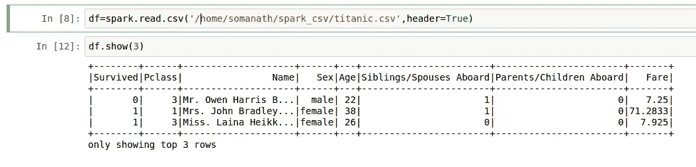
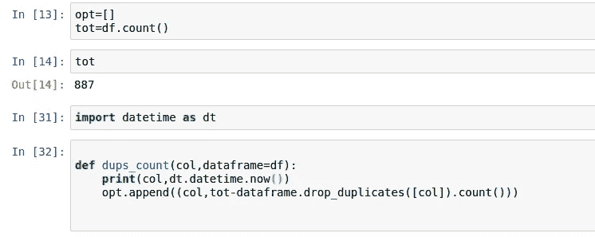
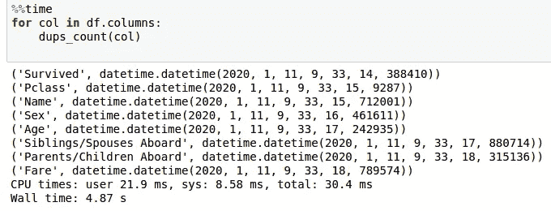
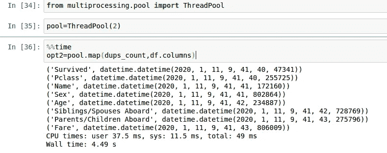
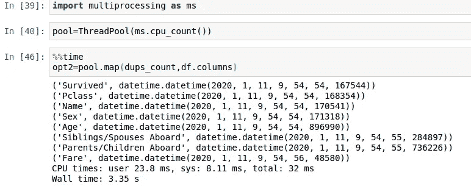
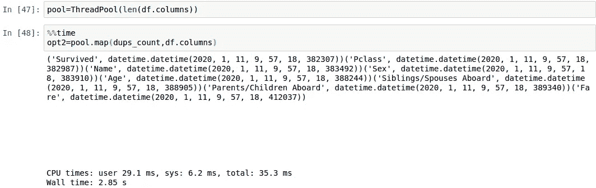

# Pyspark 的水平平行度

> 原文：<https://medium.com/analytics-vidhya/horizontal-parallelism-with-pyspark-d05390aa1df5?source=collection_archive---------2----------------------->

这是我的星火深潜系列中的一个系列。

在 [Unsplash](https://unsplash.com?utm_source=medium&utm_medium=referral) 上由[手工摄影](https://unsplash.com/@artisanalphoto?utm_source=medium&utm_medium=referral)拍摄

 [## 索玛纳特·桑卡兰培养基

### 阅读索马纳特·桑卡兰在媒介上的作品。对 python 和 spark 感兴趣的大数据开发者。每天，索马纳特…

medium.com](/@somanathsankaran) 

Spark 是一个分布式并行计算框架，但仍然有一些功能可以用 python 多处理模块并行化。

让我们详细看看下面的步骤。

1.  Pyspark 函数的顺序执行
2.  线程池的水平并行性
3.  它是如何工作的
4.  利用水平并行的用例

**py spark 功能的顺序执行**

有很多函数会导致闲置的执行器。例如

让我们考虑一个简单的函数，它在一个列级别上接受 dups 计数

我们会有一个样本泰坦尼克号数据集

这些函数获取列，并将获得每一列的重复计数，并将存储在全局列表 opt 中。我已经加了时间去找时间

让我们调用函数

如果我们看到上面的结果，我们可以看到 col 将被依次调用，尽管我们有更多的 executor 内存和内核。

*注意:由于数据集很小，我们看不到更大的时间差*

**线程池的水平平行度**

为了克服这个问题，我们将使用 python 多重处理并执行相同的函数

现在，我们已经使用了 python multi processing 中的线程池，进程数=2，通过查看时间的最后两位数，我们可以看到该函数在 2 列中成对执行。

*注意:小差异我怀疑可能是由于打印功能的副作用*

**工作原理:**

只要我们调用该函数，多个任务将同时从 pyspark-driver 并行提交给 spark executor，只要我们有足够的内核，spark executor 将并行执行这些任务

**注意，只有当我们需要执行器内核来执行并行任务时，这才会起作用**

例如，如果我们有 100 个执行核心(执行核心数=50，核心数=2 将等于 50*2)，并且我们有 50 个分区，如果我们有 2 个进程的线程池，使用这种方法将会减少大约 1/2 的时间。但是另一方面，如果我们指定 3 个线程池，我们将具有相同的性能，因为我们将只有 100 个执行器，所以同时只有 2 个任务可以运行，即使 3 个任务已经从驱动程序提交到执行器，也只有 2 个进程将运行，并且第三个任务将仅在两个任务完成时由执行器选择。

例如，在上面的函数中，大多数执行器都是空闲的，因为我们只处理一列。

为了提高性能，我们可以增加进程数=驱动程序上的内核数，因为这些任务的提交将从驱动程序机器中进行，如下所示

我们可以看到墙壁时间略微减少到 3.35 秒

由于这些线程不做任何繁重的计算任务，我们可以进一步增加进程

我们可以进一步看到墙壁时间减少到 2.85 秒

因此，这取决于两个因素

1.  驱动程序计算机上可用的线程数
2.  可用的执行者和核心数量

**利用水平并行的用例**

我们可以在下面的用例中使用它

1.  在列级处理的完全独立的函数
2.  将数据写入 diff 分区

今天就到这里吧！！:)

***注意:还有其他多处理模块，如池、进程等，也可以通过 python*** 进行并行化试验

Github 链接:[https://github . com/SomanathSankaran/spark _ medium/tree/master/spark _ CSV](https://github.com/SomanathSankaran/spark_medium/tree/master/spark_csv)

***请给我发 spark 中我必须涉及的话题，并给我改进写作的建议:)***

**学习并让别人学习！！**