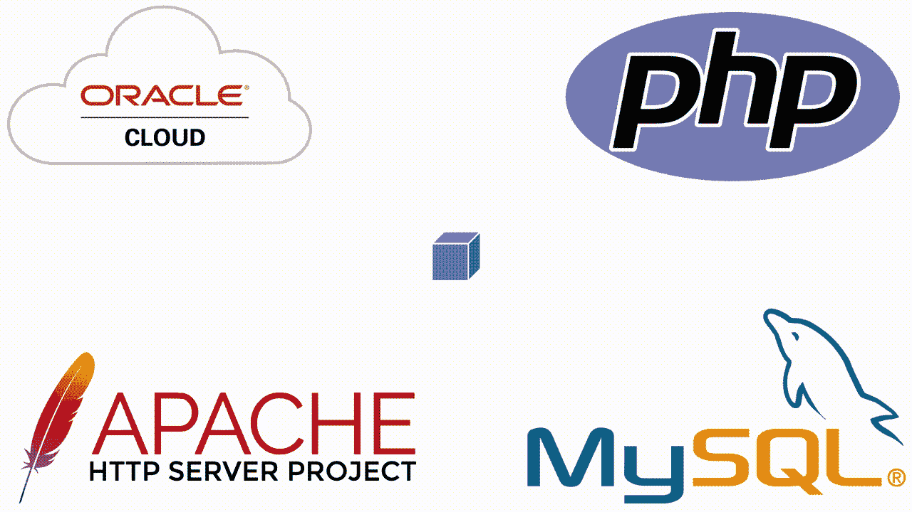
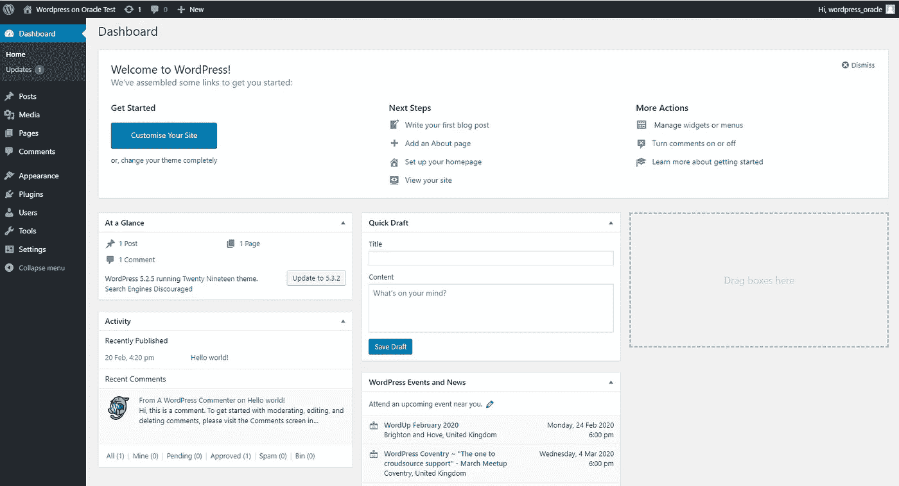
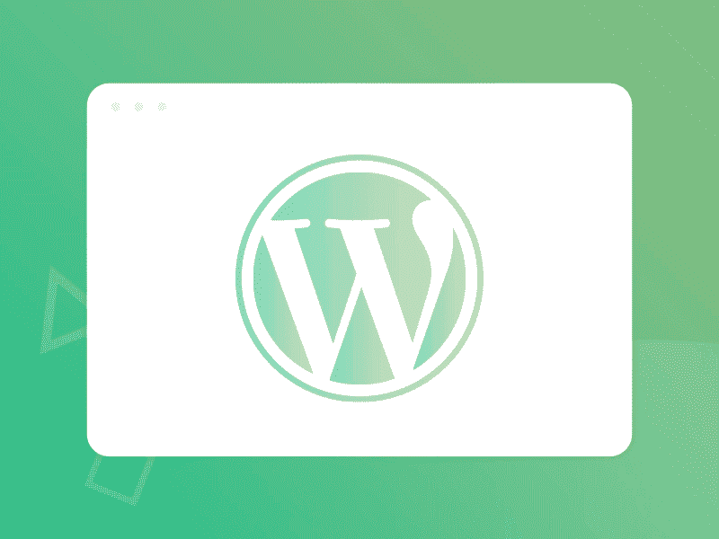

# 在甲骨文云上免费托管 WordPress

> 原文：<https://medium.com/analytics-vidhya/host-wordpress-for-free-on-oracle-cloud-a31d079a8cbc?source=collection_archive---------3----------------------->



您刚刚注册了 Oracle 的免费层云，您想知道可以用它做什么。或者你可能正在寻找一个免费的 WordPress 站点托管解决方案(5.2 版)。无论哪种方式，这都是 Oracle 云可以做的事情，而且做得很好。

如果你想要 TLDR，给我我的 WordPress-now 版本；我将快速向您展示如何使用我编写的 bash 脚本来自动化设置过程，这将需要对 Linux 有最低限度的了解。然后，我将为那些对它的工作原理感到好奇的人一一解释。

# 我的 WordPress 在哪里？！

让我们开始吧！如果您还没有在云上设置您的虚拟机，请查看本文中的[“设置虚拟机”部分，并注意](/analytics-vidhya/cloud-web-scraper-the-setup-c542ca77c6ae?source=friends_link&sk=440ff7edb3753d9f78fb9bbc15b6baa4)[如何通过 SSH](/@hugh.t.j.gallagher/ssh-access-to-oracle-virtual-machine-ec6ceed6fe9d?source=friends_link&sk=db12900a1ddc97bc373d6f8ba743340e) 访问虚拟机。

远程访问虚拟机后，运行以下代码下载 bash 脚本:

这将下载' wordpress_setup.sh '到你的主目录。从这里开始，您有两种选择来运行它；要么使用“bash”命令，要么使脚本可执行。

要使用 bash 命令，只需运行以下命令，确保您位于主目录中:

```
bash wordpress_setup.sh
```

相反，使脚本可执行是一个两行的过程:

```
chmod +x ./wordpress_setup.sh
./wordpress_setup.sh
```

这两种方法都会导致 WordPress 被设置，所以这取决于你想做什么。

在脚本快结束时，系统会提示您输入一些信息:

*   MySQL 数据库上 root 用户的新密码
*   你的 WordPress 数据库的名称
*   WordPress 数据库上新用户的名字
*   和新用户的密码

一旦您提供了所有这些，并且脚本已经完成运行，虚拟机将重新启动。一旦它完成重新启动(这可能需要大约一分钟)，您就可以获取机器的公共 IP 地址，并通过浏览器导航到它。在那里你可以找到你的 WordPress 站点的最后几个设置步骤；例如，给它起一个名字，建立一个管理帐户，等等。



禁止使用第三方服务为您的新网站设置域名，就是这样！是时候把一些内容放到这个网站上了！简单，不是吗？

# 那么剧本在做什么？

[我会把你链接到我的脚本](https://github.com/HughGDA/WordpressOnOracle/blob/master/wordpress_setup.sh)，而不是把整个东西都扔在这里。如果您打算手动执行此操作，有相当多的行可以跳过。所以我只提相关的行号。

从第 11 行开始，你会看到一个元组“先决条件”。这些是(按顺序):

MySQL 存储库信息在 web 上的位置

[1]我的 SQL 存储库文件

[2]PHP for Oracle 知识库。

使用以下命令将括号中的数字替换为上述先决条件。若要使用这些，必须使用“wget [0]”命令下载[0]，然后使用“sudo yum localinstall -y [1]”安装[1]。最后对[2]使用普通安装；sudo yum install -y [2]'。


第 12 行是另一个元组；“包装”。对于其中的每一个，使用“sudo yum install -y [tuple item]”来安装它们。第一项是 Apache web 服务器包。这允许虚拟机提供浏览器可以解释和显示的网页。另请参见第 22 行，该行更改防火墙以允许入站 http 流量，即其他设备可以从虚拟机请求网页。最后一项是将运行我们数据库的 MySQL 服务器，这两项之间的项目是托管 WordPress 站点所必需的各种 PHP 包。

在撰写本文时，已经安装了上述软件的以下版本:Apache Server 版本 2.4、MySQL 版本 8.0、PHP 版本 7.2。虽然 WordPress 版本 5.2 不是最新的版本，但是我们可以使用的 PHP 版本是一个限制因素。MySQL 版本 8.0 和更高版本也有一个小问题，我们需要解决。


在 8.0 版本中，默认的认证加密被改变了，但是 WordPress 仍然依赖于使用旧版本的认证加密。幸运的是，这很容易通过取消一个 MySQL 文件中的一行注释来解决。脚本的第 23 行解决了这个问题。在您喜欢的文本编辑器中打开“/etc/my.cnf”。应该有一个注释文本块，以行' # default-authentic ation-plugin = MySQL _ native _ password '结束(如果您使用 nano 作为编辑器，您可以使用 ctrl+w 搜索该行)。只需取消该行的注释并保存文件。

接下来，查看第 17–21 行，我们将下载 WordPress 文件，并将它们放在 Apache 服务器的目录中。使用第 17 行的 wget，WordPress 5.2 版本的文件将被下载。下载的文件必须解压缩，使用' tar -xzvf …'命令。解压缩后的文件将被移动到默认的 apache 目录中，用户“Apache”将获得这些文件的所有权。

要启动 MySQL 服务器，运行第 24 行。您需要这样做才能继续安装过程。现在运行' sudo grep ' temporary password '/var/log/mysqld . log '，获取分配给 root 用户的临时密码。你需要这个来使用 MySQL 服务器。



运行以下程序；sudo mysql_secure_installation '将提示您输入临时密码。一旦您提供了密码，您就必须设置一个新密码，然后回答一系列 y/n 问题。这些都涉及到删除测试表/用户，以及撤销远程查询。对每个问题回答“是”将为您提供更安全的设置。

现在我们需要为 WordPress 创建一个新的数据库和相关的用户。这可以完全通过命令行或者登录 mysql 来完成。我将在这里展示后者。

```
$ mysql -u root -p
     [you will be prompted for the password now]
mysql> CREATE DATABASE [DATABASE NAME];
mysql> CREATE USER [USER NAME]@localhost IDENTIFIED BY '[PASSWORD]';
mysql> GRANT ALL PRIVILEGES ON [DATABASE NAME].* TO [USER NAME]@localhost;
mysql> FLUSH PRIVILEGES;
mysql> EXIT;
```

用您选择的名称和密码替换上面的[数据库名称]、[用户名]和[密码]。

我们差不多完成了。首先使用第 59 行将'/var/www/html/WP-config-sample . PHP '重命名为'/var/www/html/wp-config.php '。接下来在你选择的文本编辑器中打开'/var/www/html/wp-config.php '。我们需要给 WordPress 一些信息，以便它可以访问数据库。我们现在要做一些查找和替换工作。找到以下三行:

```
define( ‘DB_NAME’, ‘database_name_here’ )
define( ‘DB_USER’, ‘username_here’ )
define( ‘DB_PASSWORD’, ‘password_here’ )
```

将“数据库名称在此处”替换为您在上面选择的[数据库名称]，将“用户名在此处”替换为[用户名]，将“密码在此处”替换为[密码]。但是一定要保留引号。

最后，使用第 69–72 行重新启动 web 服务器和 MySQL 服务器，并使它们能够在虚拟机启动时启动。立即重新启动虚拟机。现在在网络浏览器中进入虚拟机的公共 IP，将显示启动和运行你的 WordPress 站点的最后几个步骤！

我希望你觉得这很有用，并喜欢用精彩的内容填充你的新网站！

如果你想联系我，请在 LinkedIn 上找到我！

> **所有观点均为本人观点，不代表甲骨文**