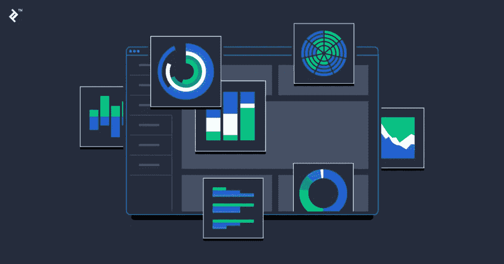

# 在 VPS 上托管 Dash 应用程序。

> 原文：<https://medium.com/analytics-vidhya/hosting-a-dash-app-on-a-vps-7cb56fa310b9?source=collection_archive---------7----------------------->

作为数据科学家，我们似乎普遍依赖 Jupyter 笔记本。尽管我非常喜欢 Jupyter 笔记本电脑的便利性、灵活性和易用性，但有时您需要更具活力的解决方案。

Jupyter 笔记本有些静态，需要手动运行。它们也不是最容易分享的；它们是一种专门的数据科学工具，但在很大程度上可能会很麻烦，很难分享，尤其是与非技术受众分享。

通常，开发一个在线托管的分析仪表板是很方便的，它有一个易于使用的基于浏览器的用户界面。这允许人们快速访问图表和数据并与之交互。它还允许我们自动化一些事情，比如通过调用 API 或定期抓取来更新数据。

通常，制作 web 应用程序意味着使用 html、javascript、Angular 等 JS 框架或 Django 或 Flask 等 python 框架等工具和框架进行全面的 web 开发。数据科学家通常更关注数据工程和机器学习之类的东西，可能没有时间投资学习这些框架，这可能是相当可观的。

幸运的是，有一个名为 Dash 的协同平台，允许人们快速构建丰富的、以数据为中心的 web 应用程序，而无需太多代码或巨大的学习曲线。Dash 建立在 Plotly 库之上，这是一个令人惊叹的数据可视化库，现在已经成为我的默认库，甚至当我在 Jupyter 笔记本上工作时。我不会详细介绍如何使用 plotly 或 Dash，但有很多优秀的教程。Dash 文档本身非常全面，易于理解。我强烈推荐哈里森·金斯利(又名 Sentdex)的 Dash 教程系列(也可以看看他的其他东西，他有一些很棒的材料！).

这篇文章的主要重点是将 web 应用程序部署到互联网上，以及通过 cronjobs 自动更新数据的过程。Dash 上的大多数教程都侧重于上传到基于容器的平台，比如 Heroku。虽然对于简单的应用程序来说，这可能是一个很好的选择，但这损失了灵活性和功能范围。特别是，启用自动数据更新和登录即使不是不可能，也是非常困难的。

我更喜欢使用虚拟专用服务器，因为它给我更多的控制和灵活性。虚拟专用服务器正是他们听起来的样子；它是一个由提供商托管在他们自己服务器上的虚拟机。他们通常运行基于 Linux 的操作系统。设置好之后，您只需使用 ssh 实用程序从本地计算机访问它，就可以访问虚拟服务器的命令行。

注意:大多数基于 Linux 的带有 bash 终端的机器都内置了 ssh(或者很容易安装)。在 windows 中使用 ssh 曾经是一件棘手的事情，你必须使用一种叫做 puTTY 的东西。然而，最近几年，windows 通过为 linux 启用 windows 子系统，然后从 windows marketplace 下载像 Ubuntu 这样的 linux 操作系统，使得在 Windows 中运行 Linux 实例变得更加容易。这里有一个简单的指南来帮你做到这一点。当然，你也可以使用 git bash。

我首选的 vps 服务是数字海洋。你可以以每月 5 美元的价格建立一个虚拟服务器，这对于小规模的项目或演示来说是非常棒的。他们称他们的副总裁为“水滴”。我之前在《如何在线托管 Jupyter 服务器》一文中写了一篇关于如何设置 Droplet 的[帖子](https://www.texasanalytics.net/2019/12/jupyter-on-your-phone-or-anywhere-really.html)，所以去看看吧，随时关注它，不要安装或配置 Jupyter。

正如我提到的，大多数关于部署 dash 的指南都关注于使用基于容器的平台，比如 Heroku，因为它们更容易。然而，有一些关于如何部署 Flask 应用程序的很好的指南，由于 Dash 是在 Flask 的基础上构建的，所以我们基本上可以遵循这些指南，只需稍加修改。我使用的凯瑟琳·朱尔的[指南](https://www.digitalocean.com/community/tutorials/how-to-serve-flask-applications-with-uswgi-and-nginx-on-ubuntu-18-04#step-5-%E2%80%94-creating-a-systemd-unit-file)是我主要遵循的一个优秀且全面的资源。我将对其进行阐述和扩展，并指出如何使其适应 Dash 应用程序。

让我们花一点时间来讨论托管一个 web 应用程序意味着什么。web 应用程序本质上是一个交互式网站，可以通过浏览器在互联网上访问。它必须被托管在一个服务器上，也就是我们刚刚制作的 droplet。当用户在浏览器中输入一个网址时，它会联系服务器，检索应用程序并在浏览器中显示。当用户与应用程序交互时，浏览器将用户的输入和请求传递给服务器，服务器反过来为浏览器“提供”更新和功能。因此得名“服务器”。

从技术上来说，“服务器”实际上是托管 web 应用程序的计算机上的一个应用程序，它监听互联网上的请求并根据需要做出响应。这就是 Kuell guide 让我们安装和配置的“nginx”应用程序(或者更确切地说，让我们参考一个单独的[指南](https://www.digitalocean.com/community/tutorials/how-to-install-nginx-on-ubuntu-18-04)来这样做)。

然而，为了提供一个基于 python 的 web 应用程序，我们必须安装一个额外的应用程序来弥合 python 和 nginx 之间的差距。这是 uwsgi 应用程序。uwsgi 应用程序充当 Flask 应用程序和 nginx 服务器之间的中介。Flask 应用又是 Dash 应用的开发平台。Dash 启动一个 Flask 实例，将您编写的 Dash 应用程序的代码翻译成 Flask app。

到目前为止，我们可以将应用程序的数据流总结如下:

浏览器/HTTP←→nginx←→uws gi←→Flask←→Dash

我知道这看起来很复杂。但是相信我，一旦你的应用部署完成，除了初始设置之外，你真的不需要处理 nginx 或 uwsgi 或 Flask。

Kuell 指南的重点是部署 Flask 应用程序。幸运的是，我们只需要做一点小小的修改就可以为 Dash 应用服务了。正如您在创建示例应用程序一节中看到的，在 Flask 应用程序的主体中，您包括了以下行:

这将在一个变量中捕获 Flask 应用程序。稍后，这个 app 变量被导入到 wsgi 入口点模块中，并在 uwsgi 配置文件中被引用。

为了服务我们的 Dash 应用程序，我们只需要在一个变量中捕获底层 Flask 应用程序。至少，对我来说是这样的。当你写一个 Dash 应用的时候，你写一个和 Flask 类似的行(app = dash。破折号(__name__))。然而，将它导入到 uwsgi 入口点模块似乎不起作用。为了捕获底层 Flask 实例，只需添加以下代码行:

这相当于 app = Flask(__name__)行。现在，只需将 Kuell 指南中出现的“应用程序”替换为“服务器”。所以您的 wsgi 入口点现在看起来应该是这样的:

您的 wsgi 配置文件(myproject.ini)将如下所示:

瞧啊。您现在将使用 Dash 应用程序。

我还想在 systemd 单元文件上添加一个词，Kuell 指南已经为您设置了。这基本上是一种自动启动应用服务器并监控其状态的方法。它基本上激活 uwsgi，并让它按照。ini 文件。正如 Kuell 所说，这不仅可以在服务器启动时自动启动服务，还可以在需要时轻松重启服务。如果您对包含 Dash 应用程序本身的 myproject.py 文件中的核心应用程序代码进行更改，您将需要这样做，否则更改不会生效。有了 systemd 单元文件，您只需在命令行中运行以下命令就可以做到这一点:

> *sudo systemctl 重启我的项目(或者你给你的 systemd 单元文件起的名字)*

我决定部署到服务器而不是容器的主要原因是，这样我可以自动更新我的数据。也就是说，我希望我的应用程序能够经常自动检查相关的 API，检索任何新数据，并将其添加到我的应用程序的数据库中。

为了将自动更新添加到我的 web 应用程序中，我简单地创建了一个包含 python 代码的. py 文件，当执行该文件时，将运行 SQL 查询来获取数据库中的最后一个条目，检查相关 API 以获取数据库中最后一个条目之后添加的数据，检索该数据并将其添加到我的数据库中。一旦写好了。我只是需要它每 15 分钟运行一次。这就是克朗进来的原因。

Cron 是一个 Linux 实用程序，可以根据指定的时间表执行终端命令。它应用广泛，特别是在 linux 机器上运行日常维护。这里有一个方便的[参考指南](https://ostechnix.com/a-beginners-guide-to-cron-jobs/)。在命令行中键入 crontab -e，然后简单地写出一个终端命令来执行您的脚本，cron 将在每个指定的时间间隔运行它。

这听起来很容易，但对我来说，这是一件非常棘手的事情。我最终设法让它工作起来，主要是[和我朋友](https://www.youtube.com/watch?v=tfLyK2DVVUU)的一点帮助。这是我想在这里谈论它的一个很大的原因，希望能为其他人省去一些我经历过的头痛。

因此，这里是我遇到的一些陷阱

1.确保实际安装了 cron。

2.此外，确保 cron 守护进程确实在运行。我和我的一个朋友花了几个小时试图找出 cron 作业不运行的原因，检查脚本及其所有依赖项，结果发现$*&%^(*@守护进程甚至没有运行。

可以通过运行以下命令来启动守护程序:

根据您使用的 linux 发行版，文件路径可能会略有不同。

3.当您想要在命令行中执行 python 文件时，您可以激活 python 环境，然后键入:

但是，当您编写 crob 作业时，您必须指定环境中 python 二进制文件的完整路径以及脚本的位置，从主目录开始。因此，cron 作业将看起来像这样:

/home/用户名/project folder/environment folder/bin/python/home/user/project folder/script . py

所以在我的例子中，它看起来像是:

因此，该脚本在上午 9 点到晚上 11 点之间每 15 分钟运行一次。

4.Cron 对语法非常挑剔。确保你严格遵守那些规则。在不同的时间段之间留出空间等。

6.您还可以告诉 cron 将脚本的常规打印输出或任何错误输出到日志文件中。同样，只需确保指定日志所在的完整文件路径。

你有它！希望本指南能帮助你将数据表示技巧提升到一个新的水平。如果你有任何问题，请在评论中联系我们！

*最初发表于*[*【https://www.texasanalytics.net】*](https://www.texasanalytics.net/2020/12/hosting-dash-app-on-vps.html)*。*