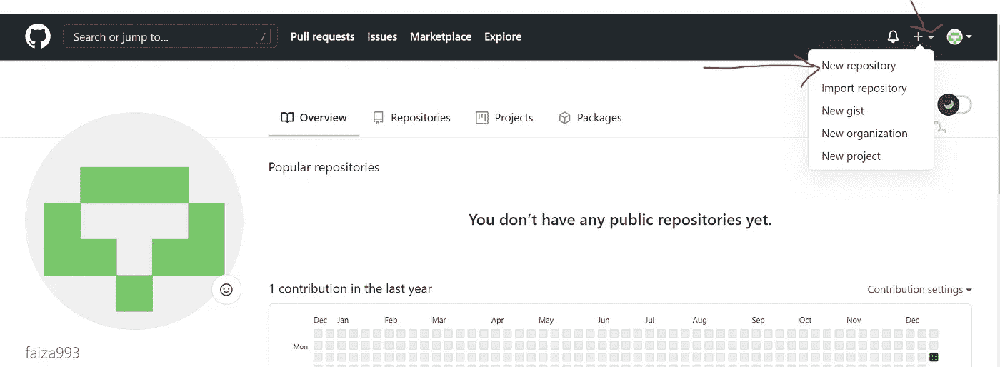
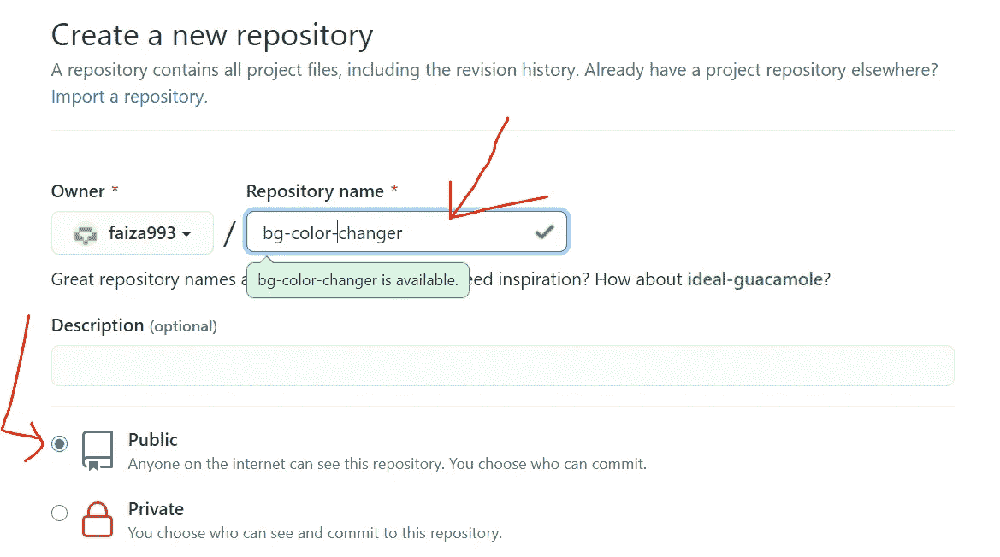
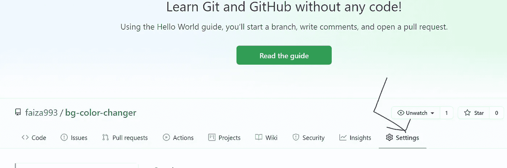
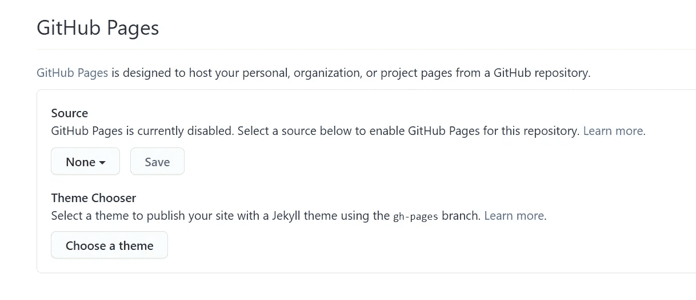
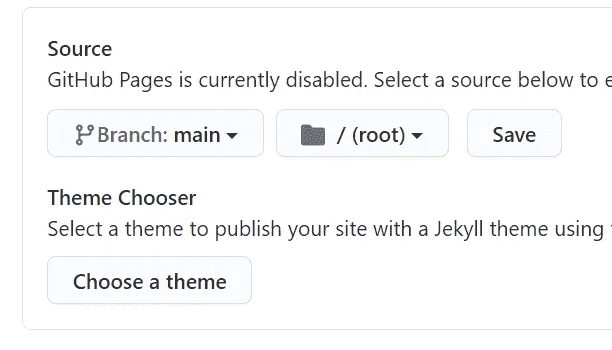
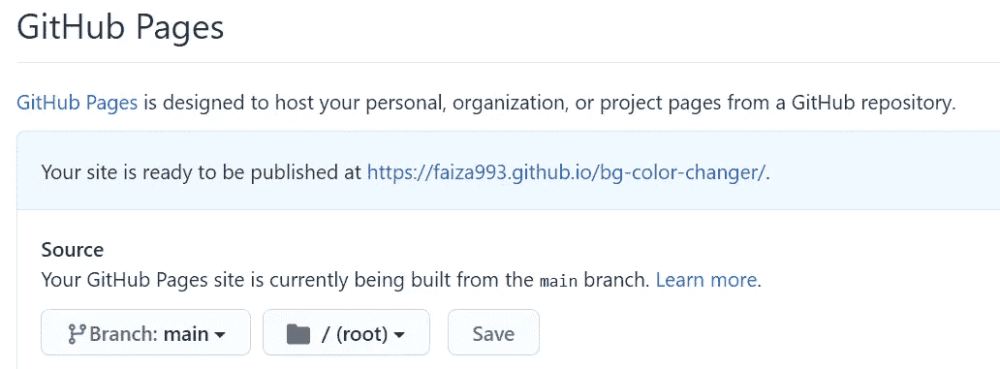
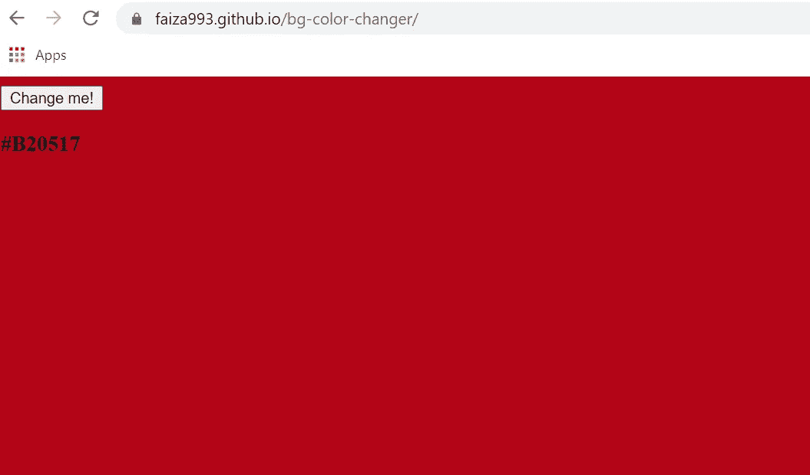

# 在 github 页面上免费托管一个网站。

> 原文：<https://medium.com/analytics-vidhya/hosting-a-website-for-free-on-github-pages-9f6c308278b0?source=collection_archive---------14----------------------->

问候我的开发伙伴们！

在这里，我们将回顾一下在 github pages 上免费托管一个站点需要遵循的程序！术语“过程”在这里可能看起来有点牵强，因为为了完成这个任务，我们需要做的事情实际上非常简单明了。现在让我们开门见山，开始吧！

# 步骤 1:创建 Github 帐户

这一步是给定的，你需要做你的 github 账号。如果您已经有帐户，请跳过这一步，转到第 2 步。要创建帐户，请前往 https://github.com/的[](https://github.com/google)****，然后注册并使用您的帐户登录。****

# ****步骤 2:创建新的存储库****

********

****点击顶部的**“+”**图标，然后**点击新建存储库。******

# ****步骤 3:命名您的存储库****

********

****给你的存储库取一个合适的和相关的名字，并确保在描述中将它设置为 **Public** 。最后点击屏幕底部的“创建存储库”按钮。****

# ****步骤 4:将文件推送到存储库****

****这一步仅仅包括将您的网站代码推送到存储库。为此，我建议使用[**git bash**](https://git-scm.com/downloads)**。只需在您的代码目录中打开 git bash，然后首先执行以下命令:******

```
****git init
git add .
git commit -m "Initial upload"****
```

******现在引入您的存储库链接，并执行以下命令:******

```
****git remote add origin https://github.com/faiza993/bg-color-changer.git****
```

******这里的术语“[https://github.com/faiza993/bg-color-changer.git](https://github.com/faiza993/bg-color-changer.git)”指的是我们的 github 库链接。******

******现在执行这个:******

```
****git push -u origin main****
```

******现在，这是最后上传你的代码到远程仓库。******

# ******步骤 5:启用 Github 页面:******

## ******I)首先，通过以下方式转到存储库的设置******

************

******存储库设置******

## ******ii)其次，向下滚动到“ **github 页面”**部分******

## ******iii)第三，将“无”改为“主要/主”******

************************

## ******iv)点击保存。******

# ******关键时刻:打开你的页面******

******最后，当您在上一步中点击保存时，github 页面部分将显示如下内容:******

************

******打开已经生成的新 url，亲自在 github 上查看您的托管站点！******

************

******这对于用 html、css、js 构建的静态网站非常有效，它们也可以用于托管基于 React、Angular 等框架和库构建的网站。步骤稍有不同，gh-pages 可用于该目的**。********