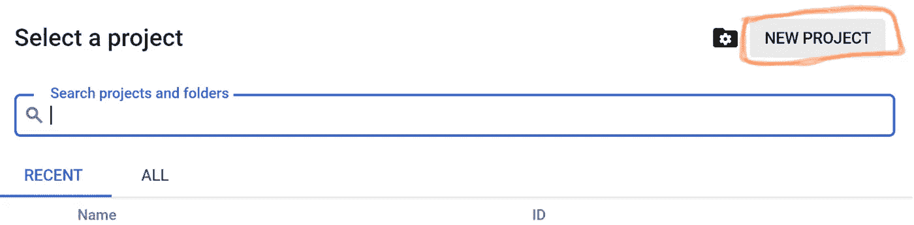

# 在 GCP 上用 FastAPI 托管你的文本生成填充微服务

> 原文：<https://medium.com/analytics-vidhya/hosting-your-text-generating-infilling-micro-service-with-fastapi-on-gcp-ecf92f9d3c0f?source=collection_archive---------17----------------------->

这种微服务允许在上下文中人工生成多个单词的填充。斯坦福的研究人员解决了这个问题。我通过应用编程接口(API)使他们的工作可用。

下面的文章解释了如何实现为填充而训练的 NLP 架构。它为给定的上下文生成不同的填充文本。本文的结构包括模型的演示、如何部署它的解释以及对底层代码概念的快速探究。

深度神经网络自动生成填充。这些是对 _ slot 的建议。

# 1.测试填充微服务

有了这个微服务，只需添加一个“_”标记，就可以在特定的上下文中生成填充。这种填充可以用单词、n 元语法(多个单词)或句子来完成。

> 文本填充的任务是预测与前面和后面的文本一致的文本的缺失范围。

这种微服务基于填充语言模型(ILM)框架，该框架在 Donahue 等人(2020)的 ACL 2020 论文 E[nabling Language models to fill the blanks](https://arxiv.org/abs/2005.05339)中进行了概述。

如果你想测试填充模型，点击[这里](https://ilmapi.uc.r.appspot.com/docs)。

-如何使用这项服务的指南可以在[这里](https://seduerr91.github.io/blog/ilmapi-instructions)找到。

-带有源代码的 git 存储库存储在[这里](https://github.com/seduerr91/ilm-api)。

这就是这个微服务的样子。你可以在那里试试！

# 2.在 Google 云平台上部署自己的填充微服务

为了部署您自己的填充微服务，只需遵循以下简单的七个步骤。

1.要自己部署这项微服务，请在[谷歌云平台](https://cloud.google.com/) (GCP)上创建一个新项目。对于要创建的新项目，您必须选择一个*项目名称*、*项目 ID* 、*计费账户*，然后点击*创建*。

开始一个新项目。

2.接下来，激活谷歌位于 GCP 右上角的*云外壳*，执行几行代码来托管 ILM API。

激活云壳。

3.现在，我们从 GitHub 克隆了[ILM API 库](https://github.com/seduerr91/ilm-api)。Fort that，在云 Shell 中键入以下命令:

**git 克隆**[https://github.com/seduerr91/ilm-api.git](https://github.com/seduerr91/ilm-api.git)

4.下一步，我们安装需求。这些项目相关的库位于文件 *requirements.txt.* 中。要一次性安装所有这些模块，请运行以下命令:

**pi P3 install-r requirements . txt**

5.为了准备在 Google App Engine 上部署 FastAPI 微服务，我们需要创建一个 gcloud 应用。注意:通过执行下一个命令，将提示您选择一个区域。只需选择离您的消费者访问这项微服务的地理位置最近的地区。在云外壳中，键入以下命令创建应用程序:

**gcloud app 创建**

6.*你快到了*！现在，我们实际上在 GCP 应用引擎上部署了 FastAPI 应用。在 shell 中运行下一个命令时，会提示您继续。按 Y 并按回车键继续。执行以下操作后，托管服务需要一些时间(例如 3-5 分钟):

**g cloud app deploy app . YAML**

7.现在，您可以浏览到您的微服务。通常，您的应用程序部署在以下格式的 URL 上:your-project-id.appspot.com。如果您不确定项目 id 是什么，请键入以下命令在 web 浏览器中查看您的应用程序:

**gcloud app 浏览**

## 恭喜你！你刚刚通过 FastAPI 托管了你自己的基于深度神经架构 GPT-2 的填充微服务。

接下来，我们简单看一下源代码，以便更好地理解我们刚才做了什么。

# 3.关于代码文件的备注

微服务的源代码主要由填充模型和以下文件组成。

## 填充. py

推理方法被包装在“class Infiller()”中，这是我们在“main.py”中的 API 所需要的。这将加载数据模型，设置示例性的上下文，将特定的标记附加到上下文文件中，并运行推理来生成填充语句。

## main.py

我们通过‘uvicon main:app’通过 main.py 文件为 uvicon 服务器提供服务。它托管服务器查询的 POST APIs。

## requirements.txt

requirements.txt 非常简短，但是它安装了所有需要的依赖项。在这个例子中，使用了 torch (PyTorch ),但是如果您愿意，也可以使用 Tensorflow。

## app.yaml

谷歌云平台允许应用引擎根据 YAML 文件中定义的配置执行部署。为了让我们在 Google App Engine 上托管 FastAPI，YAML 配置需要具有以下配置。

## Dockerfile 文件

Dockerfile 是通过 app.yaml 执行的，它托管一个 Python3.7 容器，复制 app 的源代码，安装需要的需求，执行主 app。

# 资源

这种微服务建立在以下巨人的肩膀上:

- [通过语言建模填充 Git(ILM)](https://github.com/chrisdonahue/ilm)

- [拥抱脸管道](https://huggingface.co/transformers/main_classes/pipelines.html)

- [在谷歌云平台部署 FastAPI App](https://www.tutlinks.com/deploy-fastapi-app-on-google-cloud-platform/)

- [使用 FastAPI 构建和托管快速数据科学应用](https://towardsdatascience.com/build-and-host-fast-data-science-applications-using-fastapi-823be8a1d6a0)

- [部署变压器型号](https://chatbotslife.com/deploying-transformer-models-1350876016f)

- [如何正确运输和部署您的机器学习模型](https://towardsdatascience.com/how-to-properly-ship-and-deploy-your-machine-learning-model-8a8664b763c4)

- [设置虚拟环境](https://docs.python.org/3/tutorial/venv.html)

# 承认

感谢 Javier 和让我主持微服务的叙事团队。此外，非常感谢多纳休先生周围的斯坦福团队。同时，感谢我的妻子，我现在正和她一起过着数字游牧生活。这是一群非常了不起的人。我正在远程进行我的研究和教育。

## 我是谁？

我是塞巴斯蒂安，NLP 深度学习研究科学家。在我以前的生活中，我是奥地利最大银行的经理。我喜欢研究 NLP 问题。

如果你想联系我或者有任何问题，请给我发消息。谢谢你给我你的意见。