# 基于 R Prophet 和加权平均标度的酒店需求预测

> 原文：<https://medium.com/analytics-vidhya/hotel-demand-forecasting-using-r-prophet-and-weighted-mean-scale-eb0d739b0cc9?source=collection_archive---------10----------------------->

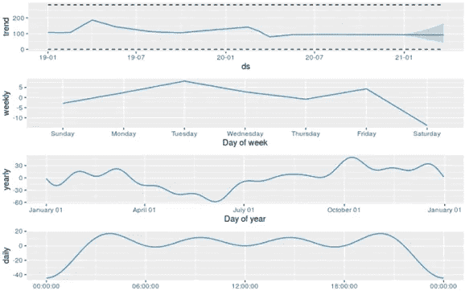

**摘要**

预测是根据过去和现在的数据对未来做出预测的过程，在酒店业务中，预测是帮助做出重要决策和风险管理的重要角色。如今，准确的预测过程比以往任何时候都更加重要。然而，预测酒店需求一直具有挑战性，原因有几个，如独特的需求模式或独特的变化点，选择正确的历史数据，移动季节。

1.  **简介**

预测是收入经理每月甚至每周工作的主要目标之一，预测需求会影响收入经理的所有其他目标，如定价、团队管理、目标设定、收入战略等。

由于具有预测能力，阅读模式和利用趋势是收入经理最有效的工具之一。

如今，由于全球疫情，阅读趋势和发现模式比以往任何时候都更加困难，因为有太多的变量可以改变结果。此外，收入经理必须适应新挑战的变化和性质。新常态要求收益经理使用能够简单高效地处理大量数据的特定软件来学习更多的数据知识(数据工程、数据可视化和预测分析)。

当涉及到数据组织、清理和操作，然后运行分析时，数据科学家通常使用 R，当涉及到时间序列分析时，许多可以帮助的库/包之一是(Prophet)。

> **2。先知*肖恩·j·泰勒&本杰明·雷森**

该库使用时间序列模型，对于各种业务时间序列足够灵活，但可由非专家配置，这些专家可能具有关于数据生成过程的领域知识，但对时间序列模型和方法知之甚少。

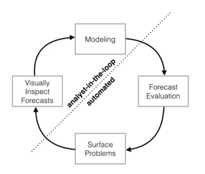

该库模型基于 4 个主要元素，可从其预测方程中看出:

> y(t) = g(t) + s(t) + h(t) +e(t)

其中 g(t)是对时间序列值的非周期性变化进行建模的趋势函数，s(t)表示周期性变化(例如，每周和每年的季节性)，h(t)表示在一天或多天内可能不规则的时间表上发生的假期的影响。误差项

表示模型不适应的任何特殊变化；后面的模型将作出正态分布的参数假设。

Prophet 已经放弃了使用诸如 ARIMA 的生成模型的一些重要的推理优势。这个公式提供了许多实际优势:

A.灵活性:我们可以很容易地适应多个时期的季节性，并让分析师对趋势做出不同的假设。

B.与 ARIMA 模型不同，测量值不需要有规律的间隔，我们也不需要对缺失值进行插值，例如去除异常值。

C.拟合速度非常快，允许分析师以交互方式探索许多模型规格，例如在闪亮的应用程序中(Chang 等人，2015 年)。

D.预测模型具有易于解释的参数，分析师可以更改这些参数来对预测进行假设。此外，分析师通常具有回归的经验，并且能够很容易地扩展模型以包括新的组件。

**3。预测**

将数据导入 **R** 后，第一行代码用于通过选择两个主要变量来清理数据

1.时间(ds)

2.历史数据(y)

然后，我们使用 prophet 的内置参数将新数据框拟合到 prophet 中，并指定增长、季节性、变化点先验尺度和季节性先验尺度。

然后，我们继续进行预测框架和绘图，其中模型将识别变化点，并尝试反映历史趋势。Prophet 将为指定的地平线创建初始预测。

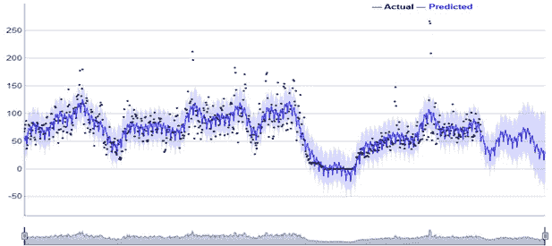

**3。交叉验证**

生成初始预测后，我们需要两个主要因素，它们将被插入到生成最终预测或调整预测的最终等式中。

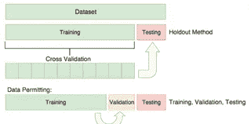

**1。MAPE**

平均绝对百分比误差是初始预测和实际之间的误差百分比，通过将给定数据分为两组 A)训练数据 B)测试数据。

如果我们有一个 365 天的样本量，这都是实际的，我们将我们的训练数据设置为 300 天，并将 65 天设置为测试数据。因此，代码将进行所有的分析，并生成初始预测，与测试数据的实际值进行比较，并获得误差百分比的平均值。

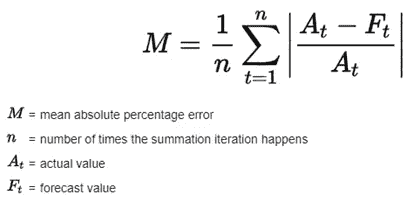

**2。MAE**

平均绝对误差是初始预测和实际之间误差空间的绝对数量。

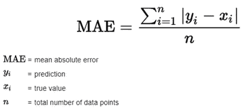

**4。调整后的预测**

在调整预测的过程中会添加更多的因素和变量到最终方程的所有成分的加权平均值中，从而对需求产生直接影响，如

**1。售出的房间**

基于历史数据趋势的初始预测，由于多种原因可能不会重复。我尝试了一些变量来改变初始预测，使其更好地响应当前趋势，并发现房间销售量是重新调整初始预测的最有效变量之一。

示例:

第(x)天的最初预测是 40 个房间，而在那一天已经售出 35 个房间；超出初始预测的可能性很高，因为当天的预订速度高于平时，这将使当天售出的房间具有更高的权重来影响初始预测。

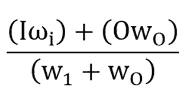

其中(I)是初始预测，(Wi)是初始预测的重量，O 是售出房间的重量，(Wo)是售出房间的重量。

客房销售重量是指定时间段内销售的客房数量除以销售的客房总数的乘积。

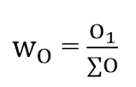

其中 O1 是特定一天售出的房间数除以指定时间段内售出的所有房间总数。这样，有更多房间售出的日子将具有更高的权重，并且在调整初始预测时将具有更大的影响。另一方面，根据每天售出的房间数而变化的动态权重使代码更适应和响应预订速度和预订曲线。

初始预测权重将等于 MAPE(平均绝对百分比误差)，这是在交叉验证阶段给出的，它确定了初始预测与之前的实际天数之间的差距。

另一个例子:

第(X4)天的初始预测是 40 个房间，而房间已经售出 35 个，该天超出初始预测的概率很高，需要生成每天的权重。

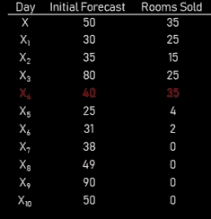

在第(X4)天售出的房间将具有比前后几天更高的权重 0.25；因为超出最初预测的概率越大。售出房间数为 0 的日子，权重将为 0，这不会对初始预测产生影响。

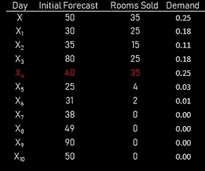

通过应用等式的这一部分:

假设初始预测的权重是(MAPE)平均绝对百分比误差，如果售出的房间是需求的权重。

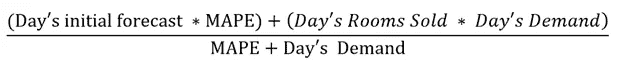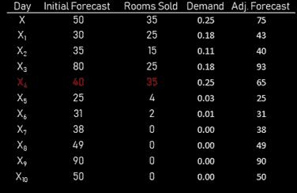

**2。去年同一天**

通过突变，使每天与前一年的同一天相匹配的数据集将另一个变量添加到等式中，即去年同一天售出的房间，该变量将用于保持季节性并反映历史总体趋势。

去年的权重将是 MAPE 平衡初始预测和去年影响的权重。

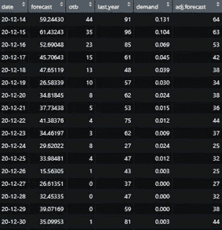

**3。平均绝对误差**

将平均绝对误差以初始预测和去年预测相同的权重注入方程，以不断修改预测，纠正绝对误差。

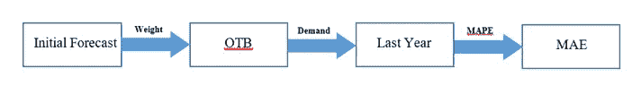

这样，最后的等式将是:

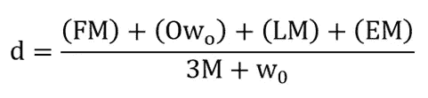

其中:

F =初始预测

M = MAPE

O =售出的房间

WO =需求

L =去年

E = MAE