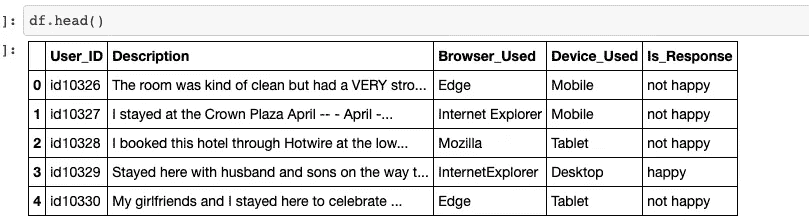
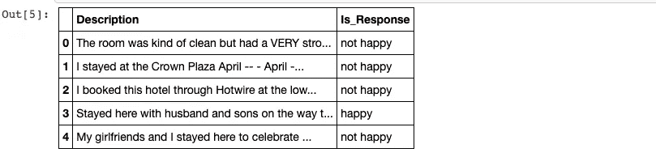
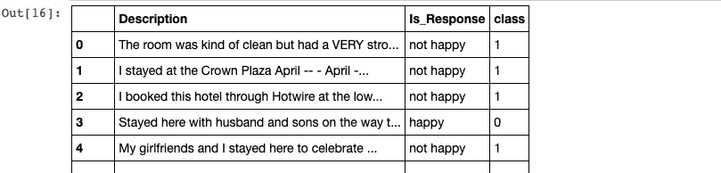
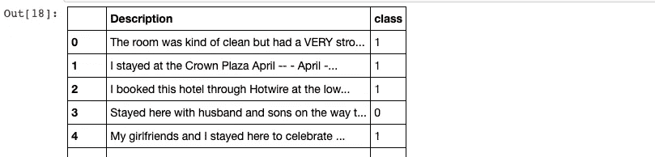
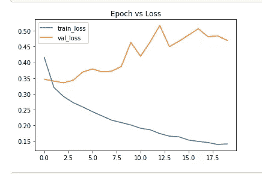
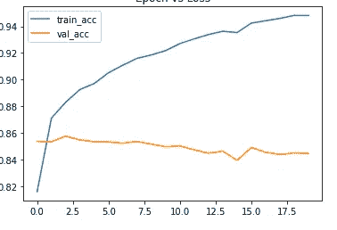
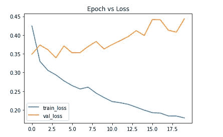
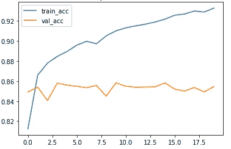

# 酒店评论情绪分析从零开始到部署，同时使用机器学习和深度学习算法

> 原文：<https://medium.com/analytics-vidhya/hotel-reviews-sentiment-analysis-from-scratch-to-deployment-with-both-machine-learning-and-deep-76ba89b14a56?source=collection_archive---------1----------------------->

你只需要知道机器学习对非结构化数据的影响

目录:

(一)问题陈述

㈡动机

㈢数据处理

㈣数据清理

(五)机器学习模型构建

(六)深度学习模型构建

㈦部署

㈧结论

㈨未来的范围

㈩参考资料


Rhema Kallianpur 在 [Unsplash](https://unsplash.com?utm_source=medium&utm_medium=referral) 上拍摄的照片

## (一)问题陈述:

我们的目标是将给定的酒店评价分为正面评价或负面评价。

所以我们的问题陈述属于二元分类问题。

## ㈡动机:

如果任何企业想在市场上维持更长的时间，那么他们的客户的评论是他们业务的关键指标。在未来，NLP 在商业中扮演着非常重要的角色，因为九分之十的人使用手机进行日常购物、社交媒体发布、电影票预订、医院预约、酒店预订等。如果我们能从这些非结构化数据中提取出一些对业务增长有用的信息，每天都会有数 Pb 的非结构化数据在网络上产生。

因此，我选择酒店领域，从非结构化数据(文本评论)中提取信息，并为社会发展贡献我的知识。

在解决酒店评论分析问题的过程中，我学到了很多东西，获得了更多的知识。

## ㈢数据处理:

我从 Kaggle 上获取数据集。【https://www.kaggle.com/anu0012/hotel-review? select=train.csv

数据集分为两个 csv 文件

第一个 csv 文件 train.csv，包含 38932 个数据点和 5 个特征

第二个 csv 文件 test.csv 包含 29404 个数据点和 5 个特征

我采用 train.csv 来训练模型

我将 train.csv 分成训练数据集和验证数据集

> **进口熊猫当 pd**
> 
> **#读取 csv**
> 
> **df = PD . read _ CSV('/content/Drive/My Drive/archive/train . CSV ')**
> 
> **df.head()**



我们的数据框包含 5 个要素

在 5 个特征中，只有两个特征对情感分析有用

描述和 Is_Response 功能仅对情感分析有用

因此，现在我们可以从数据帧中删除剩余的特征

> df.drop(['User_ID '，' Browser_Used '，' Device_Used']，axis=1，inplace=True)
> 
> #丢弃无用功能后
> 
> df.head()



现在我们在 dataframe 中有两个特性

## **(四)数据清理:**

这两个功能都有非结构化数据，现在我们需要使用文本到矢量转换技术将非结构化数据转换为结构化数据

在文本到向量的转换之前，我们需要清理描述特征，因为它包含了对情感分类没有用的特殊字符、停用词、数字

对于文本清理，我使用了' **re'** 模块

Is_Response 包含两个类，一个是**开心**，另一个是**不开心，**现在我们需要将这两个类转换成数值形式，因为机器学习模型只理解数值。

在转换之前，我们需要检查数据帧中是否存在空值

> df.isnull()。总和()

> 描述 0
> Is_Response 0

这两个特性中没有任何空值

现在我们要将 Is_Response 特征转换成数字形式

我们可以使用标签编码器来转换 Is_Response 功能，但我创建了字典并将其映射到 Is_Response 功能

> #创建字典
> 
> dict={ '快乐':0，'不快乐':1}
> 
> #将字典映射到 Is_Response 特征
> 
> df['class']=df['Is_Response']。地图(字典)
> 
> df.head()



现在我们有了**类**特性

不开心:1

快乐:2

现在我们可以丢弃 Is_Response 特性了

> df.drop(['Is_Response']，axis=1，inplace=True)
> 
> df.head()



我们成功地将一个特征转换成数字形式

现在，我们需要将描述特征转换为矢量，在矢量转换之前，我们需要清除特殊字符、标签、数字等

对于文本预处理，我使用了 **nltk**

> #文本预处理
> 
> 从 nltk.corpus 导入停用词
> 
> 从 nltk.stem.porter 导入 PorterStemmer
> 
> ps = PorterStemmer()
> 
> 语料库= []
> 
> 对于范围内的 I(0，len(df)):
> 
> 审查= re.sub('[^a-zA-Z]'，' '，df['描述'][i])
> 
> review = review.lower()
> 
> review = review.split()
> 
> review =[PS . stem(word)for word in review if not word in stop words . words(' English ')]
> 
> 评论=“”。加入(审核)
> 
> corpus.append(评论)

经过文本预处理后，我们得到了完全干净的语料库

> 文集[15]
> 
> 10 月 10 日入住，非常喜欢返程日游织女星另一个晚上未被发现出现酒店分数很高地点很棒一尘不染李干净经典的设计舒适的卧室友好的管理人员 jorg 同事前台狂欢直到发烧友帮忙推荐很棒的餐厅地点参观等管理特别是李帮忙让我们称赞房间事后检查清新甚至飞行回家漫长的一天享受南加利福尼亚的阳光

如果你观察上面的语料库，我们没有任何特殊字符，没有标签，没有数字，没有大写字母，完全词干化的单词

现在我们的描述特性已经完全清理干净了，现在我们可以应用**单词包/Tfidf 矢量器/ word2vec** 将文本转换成矢量

**TfidfVectorizer:** 将文本转换成矢量

> 从 sk learn . feature _ extraction . text 导入 tfidf 矢量器
> 
> 从 sk learn . feature _ extraction . text 导入 tfidf 矢量器

# I take ngrams = (1，3) [1 到 3 个单词的组合]

#我取前 10000 个单词(最常用)

> tfidf =矢量器(max_features=10000，ngram_range=(1，3))
> 
> tfidf_word=tfidf.fit_transform(语料库)。托阵列()
> 
> tfidf_class=df['class']

现在我们有了数字形式的两个特征

tfidf_word 是向量

tdfidf_class 是 0/1 类

> final_df['class']。值计数()

0: 26521

1: 12411

我们有不平衡的数据集

为了平衡数据集，我们可以进行上采样、下采样或创建合成数据

但是我想试验，所以我用不平衡数据集训练模型

## **(五)构建机器学习模型:**

> tfidf_word.shape，tfidf_class.shape

((38932, 10000), (38932,))

#将数据分为训练和测试数据集

> 从 sklearn.model_selection 导入训练 _ 测试 _ 拆分
> 
> x2_train，x2_test，y2_train，y2 _ test = train _ test _ split(tfi df _ word，tfidf_class，test_size=0.33)
> 
> x2_train.shape，y2_train.shape

((26084, 10000), (26084,))

> x2 _ 测试.形状，y2 _ 测试.形状

((12848, 10000), (12848,))

应用多项式朴素贝叶斯

> 从 sklearn.naive_bayes 导入多项式
> 
> 分类器 _ 2 =多项式 inb()
> 
> 分类器 _2.fit(x2_train，y2_train)

预测训练模型的测试数据

> y2 _ pred =分类器 _2 .预测(x2 _ 测试)

数组([0，0，0，…，1，0，0])

训练和测试数据集的模型得分

> #关于培训
> 
> classifier_2.score(x2_train，y2_train)

0.8793896641619383

> #测试中
> 
> 分类器 _ 2 . score(x2 _ 测试，y2 _ 测试)

0.8709526774595268

计算训练模型的混淆矩阵

> 从 sklearn 导入指标
> 
> metrics . confusion _ matrix(y2 _ test，y2_pred)
> 
> ([[8278, 480],
> 
> [1178, 2912]])

**超参数优化**

> hyper _ classifier =多项式 B(alpha=0.1)

将 numpy 作为 np 导入

# alpha 是朴素贝叶斯中的超参数

前一个分数=0

> 对于 np.arange(0，1，0.1)中的 alpha:
> 
> sub _ classifier =多项式
> 
> sub_classifier.fit(x2_train，y2_train)
> 
> y _ pred = sub _ classifier . predict(x2 _ test)
> 
> score = metrics . accuracy _ score(y2 _ test，y2_pred)
> 
> 如果分数>上一个分数:
> 
> 超级分类器=子分类器
> 
> print("Alpha: {}，Score : {} "。格式(alpha，分数))

超参数结果

阿尔法值:0.0，分数:0.8756758676876

阿尔法值:0.1，分数:0.8758658768686

阿尔法值:0.2，分数:0.8758658768686

阿尔法值:0.30000000000000004，分数:0.800000001

阿尔法值:0.4，分数:0.8758658758686

阿尔法值:0.5，分数:0.8758658758686

阿尔法值:0.600000000000001，分数:0.800000002

阿尔法值:0.700000000000001，分数:0.800000002

阿尔法值:0.8，分数:0.8758658758686

阿尔法值:0.9，分数:0.8758658768686

**我的观察:**

在训练数据集上，我们得到了 0。36860 . 68686868661

在测试数据集上，我们得到了 0。49660 . 68686868686

我们有不平衡的数据集，根据数据集中一个类支配另一个类的理论，我们的模型偏向于主要类，但我们在训练和测试数据集上得到了几乎相同的结果！。

## (六)构建深度学习模型:

在上面，我们已经将 Is_Responsible 特性转换为 class 特性

现在我想在 tensorflow 文档的帮助下将文本转换成矢量形式

> #文本预处理

移除特殊字符的功能

> def remove_special_chars(文本):
> 
> for remove in map(lambda r:re . compile(re . escape(r))，['，'，':'，" = "，" & "，"；"、' % '、' $ '、' @ '、' % '、'^'、' * '、'('、')'、' { '、' } '、'['、']'、' | '、'/'、' \\ '、'>'、'
> 
> text.replace(remove, ‘’, inplace=True)
> 
> return text

Function for removing tags

> def remove_tags(text):
> 
> return re.compile( r” ]+> "。sub("，文本)

移除数字的功能

> def remove_num(文本):
> 
> 返回“”。join(re sub(r '([0–9+])'，' '，text))

我创建了三个单独函数来清理文本

#将 df 复制到新变量中

> final_df=df.copy()

调用**移除 _ 标签**函数

> final_df。描述=final_df。description . apply(lambda x:remove _ tags(x))

调用**移除数量**函数

> final_df。描述=final_df。description . apply(lambda x:remove _ num(x))

调用 **remove_special_chars** 函数

> remove_special_chars(final_df。描述)

在调用了所有函数之后，我们从特殊字符、数字和标签中得到干净的文本。

现在我们要对句子进行分词，分词后我们得到单词

我们想把句子降得更低=真

我们用' '(空格)`Separator for word splitting.`

> Tokenizer = Tokenizer(num _ words = 5000，filters= '！"#$%&()*+,-./:;<=>？@[\\]^_`{|}~\t\n',lower=true,split='’)

# tensorflow 文档

**tokenizer . fit _ on _ texts():**

**根据文本列表更新内部词汇。**

**在文本包含列表的情况下，我们假设列表的每个条目是一个令牌。**

> tokenizer . fit _ on _ texts(final _ df[" Description "])

# tensorflow 文档

**tokenizer . texts _ to _ sequences():**

**将文本中的每个文本转换为整数序列。**

> x = tokenizer . texts _ to _ sequences(final _ df[" Description "])

填充以获得相同长度的句子，如果我们有相同长度的句子，那么我们可以使用一批数据点进行训练。它降低了时间复杂度

> X = pad_sequences(X，maxlen=100)

现在我们已经转换了矢量

文本向量

> X[500]

数组([ 0，0，0，0，0，0，0，0，0，0，0，0，0，0，0，0，26，298，2，6，47，7，3，425，14，21，3，566，71，1483，3，22，1022，12，21，133，2107，2568，4，1，179，63，6 1，123，118，651，52，94，193，70，1295，7，1，1248，496，6，289，1，12，2533，120，88]，dtype=int32)

如果我们仔细观察上面的矢量，500 个索引句转换成矢量。句子中的每个单词由语料库中的单词索引来表示

> y= final_df['class']

词汇 _ 大小

> vocab _ size = len(tokenizer . word _ index)+1
> 
> vocab_size

70925

出于部署目的，我们需要将标记器保存到 pickle 文件中。

> **导入****pickle**
> #保存
> **用**打开(' tokenizer.pickle '，' WB ')【T10])作为句柄:
> pickle.dump(tokenizer，handle，protocol=pickle。最高 _ 协议)

将数据分为训练和测试数据集

x =转换矢量

y=审查等级

> **from****sk learn . model _ selection****import**train _ test _ split
> X _ train，X_test，Y_train，Y_test = train_test_split(X，Y，test_size=0.3，random_state = 24)

构建用于训练的单层 LSTM 细胞

LSTM 模型需要嵌入层和密集层进行训练

嵌入层把正整数(索引)变成固定大小的密集向量。

我们的问题陈述属于二进制分类，因此我们需要在密集层中使用 sigmoid 激活

在 LSTM 细胞中，神经元数目是超参数，我取 100 个神经元。

我们需要指定嵌入向量输出，我取嵌入向量输出大小= 40，它也是一个超参数

优化器=adam，指标=准确性

模型结构

> embedding_vector_features = 40
> model = Sequential()
> model . add(Embedding(vocab _ size，Embedding _ vector _ features，input _ length = 100))
> model . add(LSTM(100))
> model . add(Dense(1，activation='sigmoid '))

```
Model: "sequential"
_________________________________________________________________
Layer (type)                 Output Shape              Param #   
=================================================================
embedding (Embedding)        (None, 100, 40)           2837000   
_________________________________________________________________
lstm (LSTM)                  (None, 100)               56400     
_________________________________________________________________
dense (Dense)                (None, 1)                 101       
=================================================================
Total params: 2,893,501
Trainable params: 2,893,501
Non-trainable params: 0
_________________________________________________________________
```

模型编译

> model . compile(loss = ' binary _ cross entropy '，optimizer='adam '，metrics =[' accuracy '])
> print(model . summary())

拟合模型

batch_size 和 epochs 是超参数，我手动取 batch_size =32 和 epochs=20

> history=model.fit(X_train，Y_train，batch_size=32，epochs=20，validation_data=(X_test，Y_test)，)

```
Epoch 16/20
852/852 [==============================] - 44s 51ms/step - loss: 0.0529 - accuracy: 0.9835 - val_loss: 0.7259 - val_accuracy: 0.8307
Epoch 17/20
852/852 [==============================] - 43s 51ms/step - loss: 0.0400 - accuracy: 0.9880 - val_loss: 0.8985 - val_accuracy: 0.8256
Epoch 18/20
852/852 [==============================] - 43s 51ms/step - loss: 0.0387 - accuracy: 0.9882 - val_loss: 0.8848 - val_accuracy: 0.8247
Epoch 19/20
852/852 [==============================] - 44s 51ms/step - loss: 0.0268 - accuracy: 0.9917 - val_loss: 1.0238 - val_accuracy: 0.8229
Epoch 20/20
852/852 [==============================] - 44s 51ms/step - loss: 0.0329 - accuracy: 0.9905 - val_loss: 0.8495 - val_accuracy: 0.8091
```

如果你在第 20 世末观察上述训练过程

训练精度= 0.99，val_accuracy = 0.80

训练损失= 0.032，val_loss=0.84

随着训练损失减少，验证损失增加，这意味着模型过度拟合。我们知道我们的数据集是不平衡的，如果我们在不平衡的数据集上训练一个神经网络，它偏向于主要类

我们在机器学习模型中没有太多的准确性差异，但当谈到深度学习模型时，我们清楚地了解不平衡数据集的影响

为了克服这个问题，我们可以在训练时使用退出率，退出率是神经网络中的一种正则化技术。

用新数据评估已训练的模型

> #新评论
> 
> string11= ' ' '这家酒店太棒了，我喜欢它的服务，安东尼是一个很棒的人，你可以在前台看到他！它离一切都很近，对孩子们来说很棒，我喜欢它。有史以来最好的酒店，但非常干净，质量非常好，非常适合夫妇和单身人士。''
> 
> #使用新评审评估训练模式
> 
> x _ 1 = tokenizer . texts _ to _ sequences([string 11])
> x _ 1 = pad _ sequences(x _ 1，maxlen = 100)
> model . predict(x _ 1)

输出

> 数组([[0.00015311]]，dtype=float32)
> 
> 我们知道 0:正类 1:负类

输出值接近 0，给定评论为正，模型预测也为正，因此我们的训练模型在新数据上工作良好，但我们不能断定它是广义模型。我们需要做大量的 hypreparameter 优化，然后只有我们可以得出结论。

**建立辍学率为 0.5 的 LSTM**

从上面的训练中我们知道我们的 LSTM 模型过度拟合。为了避免这种情况，我们需要进行超参数优化、辍学率和批量标准化层添加。

辍学率调整神经网络，所以为了避免过度拟合的问题，我只添加了 50%的辍学率其余网络与上述 LSTM 网络相同的辍学层。我们也可以添加批处理标准化，但是我想在数据上进行实验，所以我只取辍学率。

> #模型构建
> 
> Dropout tec embedding_vector_features = 40
> model _ 2 = Sequential()
> model _ 2 . add(Embedding(vocab _ size，Embedding _ vector _ features，input _ length = 100))
> model _ 2 . add(Dropout(0.5))
> model _ 2 . add(LSTM(100))
> model _ 2 . add(Dropout(0.5))
> model _ 2 . add(Dense(1，activation='sigmoid '))
> 
> #模型编译
> Model _ 2 . compile(loss = ' binary _ cross entropy '，optimizer='adam '，metrics =[' accuracy '])
> print(Model _ 2 . summary())

```
Model: "sequential_1"
_________________________________________________________________
Layer (type)                 Output Shape              Param #   
=================================================================
embedding_1 (Embedding)      (None, 100, 40)           2837000   
_________________________________________________________________
dropout (Dropout)            (None, 100, 40)           0         
_________________________________________________________________
lstm_1 (LSTM)                (None, 100)               56400     
_________________________________________________________________
dropout_1 (Dropout)          (None, 100)               0         
_________________________________________________________________
dense_1 (Dense)              (None, 1)                 101       
=================================================================
Total params: 2,893,501
Trainable params: 2,893,501
Non-trainable params: 0
```

#拟合模型

> history_2=model_2.fit(X_train，Y_train，
> batch_size=32，
> epoch = 20，
> validation_data=(X_test，Y_test)，
> )

```
Epoch 16/20
852/852 [==============================] - 30s 35ms/step - loss: 0.1535 - accuracy: 0.9424 - val_loss: 0.4867 - val_accuracy: 0.8491
Epoch 17/20
852/852 [==============================] - 29s 34ms/step - loss: 0.1494 - accuracy: 0.9442 - val_loss: 0.5066 - val_accuracy: 0.8455
Epoch 18/20
852/852 [==============================] - 30s 35ms/step - loss: 0.1459 - accuracy: 0.9459 - val_loss: 0.4815 - val_accuracy: 0.8439
Epoch 19/20
852/852 [==============================] - 30s 35ms/step - loss: 0.1397 - accuracy: 0.9482 - val_loss: 0.4840 - val_accuracy: 0.8450
Epoch 20/20
852/852 [==============================] - 30s 35ms/step - loss: 0.1414 - accuracy: 0.9481 - val_loss: 0.4699 - val_accuracy: 0.8447
```

如果你在 20 世纪末观察上述训练过程

训练精度= 0.9481，Val_accuracy = 0.84

训练损失= 0.1414，val_loss = 0.4699



失败



准确(性)

与没有辍学率的 LSTM 网络相比，通过添加辍学率，我们的模型 val_loss 也随着训练损失而减少。因此，通过增加辍学率，我们的模型有更少的机会过度拟合。

在不进行参数优化的情况下，仅训练 20 个时期的模型，我就获得了近 94 %的准确率

如果我进行超参数优化，并添加 Dropout 和 BatchNormalization 层，那么我可以获得一般化的模型，它可以对新数据执行更显著的操作。

在这篇文章中，我的目标是了解不平衡数据集如何影响神经网络

**我的观察**

如果没有退出率，我们的模型会因为不平衡的数据集而过度拟合

通过增加退出率，我们的模型不容易过度拟合

通过进行超参数优化和添加批处理规范化，我们可以提高模型在新数据上的性能。

**双向 LSTM :**

使用双向将通过两种方式运行我们的输入，一种是从过去到未来，另一种是从未来到过去，这种方式与单向的不同之处在于，在向后运行的 LSTM 中，您可以保存来自未来的信息，并且结合使用两种隐藏状态，您可以在任何时间点保存来自过去和未来的信息。

构建单层双向 LSTM 细胞用于训练

双 LSTM 模型需要嵌入层和密集层进行训练

嵌入层把正整数(索引)变成固定大小的密集向量。

我们的问题陈述属于二进制分类，因此我们需要在密集层中使用 sigmoid 激活

在双 LSTM 细胞中，神经元数目是超参数，我取 100 个神经元。

我们需要指定嵌入向量输出，我取嵌入向量输出大小= 40，它也是一个超参数。

我以 0.65 的辍学率添加了辍学层

优化器=adam，指标=准确性

> #模型构建
> 
> embedding_vector_features = 40
> model _ 3 = Sequential()
> model _ 3 . add(Embedding(vocab _ size，Embedding _ vector _ features，input _ length = 100))
> model _ 3 . add(Dropout(0.65))
> model _ 3 . add(双向(LSTM(100)))
> model _ 3 . add(Dropout(0.65))
> model _ 3 . add(Dense(1，activation='sigmoid '))
> 
> #模型编译
> Model _ 3 . compile(loss = ' binary _ cross entropy '，optimizer='adam '，metrics =[' accuracy '])
> print(Model _ 3 . summary())

```
Model: "sequential_3"
_________________________________________________________________
Layer (type)                 Output Shape              Param #   
=================================================================
embedding_3 (Embedding)      (None, 100, 40)           2837000   
_________________________________________________________________
dropout_4 (Dropout)          (None, 100, 40)           0         
_________________________________________________________________
bidirectional_1 (Bidirection (None, 200)               112800    
_________________________________________________________________
dropout_5 (Dropout)          (None, 200)               0         
_________________________________________________________________
dense_3 (Dense)              (None, 1)                 201       
=================================================================
Total params: 2,950,001
Trainable params: 2,950,001
Non-trainable params: 0
```

#拟合模型

> history_2=model_3.fit(X_train，Y_train，
> batch_size=32，
> epochs=20，
> validation_data=(X_test，Y_test)，
> )

```
Epoch 16/20
852/852 [==============================] - 36s 42ms/step - loss: 0.1928 - accuracy: 0.9258 - val_loss: 0.4412 - val_accuracy: 0.8521
Epoch 17/20
852/852 [==============================] - 36s 42ms/step - loss: 0.1915 - accuracy: 0.9270 - val_loss: 0.4410 - val_accuracy: 0.8501
Epoch 18/20
852/852 [==============================] - 36s 42ms/step - loss: 0.1840 - accuracy: 0.9300 - val_loss: 0.4129 - val_accuracy: 0.8537
Epoch 19/20
852/852 [==============================] - 36s 42ms/step - loss: 0.1836 - accuracy: 0.9290 - val_loss: 0.4079 - val_accuracy: 0.8492
Epoch 20/20
852/852 [==============================] - 35s 42ms/step - loss: 0.1787 - accuracy: 0.9329 - val_loss: 0.4438 - val_accuracy: 0.8545
```

如果你在 20 世纪末观察上述训练过程

训练精度= 0.9329，val_accuracy= 0.85

训练损失= 0.17，val_loss = 0.44



失败



准确(性)

如果你观察以上结果，双向 LSTM 比 LSTM 好一些什么

通过进行超参数优化和添加批处理规范化，我们可以提高模型的性能

出于部署目的保存双向模型

> #保存训练模型
> 
> model_3.save('b_lstm.h5 ')

用新数据评估双 LSTM

> #用于评估培训模型的新数据
> 
> string11= ' ' '我们想找一家离电视节目《菲尔博士》拍摄地很近的汽车旅馆，于是选择了西好莱坞日落大道上的沙丘。尽管该酒店展示了 AAA 标志，但仍有许多不足之处。浴室的门框底部有碎片和刮痕，乳液容器是半满的——显然没有被客房服务人员更换。我们需要一个早期的叫醒电话，但不能使用收音机闹钟，因为房间里没有收音机。遥控器上没有电视频道列表，电视菜单上也没有，这让看电视成了一件苦差事。退房时，电视遥控器必须归还。这个地方达到了它的目的，但不是一个重游的地方。''
> 
> #使用 tokenizer 将上述文本转换为矢量
> 
> x _ 1 = tokenizer . texts _ to _ sequences([string 11])
> 
> #在转换的向量上填充
> x_1 = pad_sequences(x_1，maxlen=100)
> 
> #根据新数据评估训练模型
> model_3.predict(x_1)

输出数组([[0.98076105]]，dtype=float32)

给定的新数据是负面评论数据

我们的模型预测也遭到负面评论

所以我们训练过的模型在新数据上表现良好。

我们可以通过进行超参数优化来提高我们的模型性能。

## **(七)使用流线型框架部署经过训练的双向 LSTM:**

对于部署，我们需要经过训练的 model.h5 和 tokenizer.pkl

我已经保存了这两个文件

为了构建 web 应用程序，我使用了 streamlit 框架

现在我们可以在任何云平台上部署这个 web 应用程序，这是深度学习模型，所以我们不能在 Heroku 上部署这个 web 应用程序，因为 Heroku 只允许 500 MB 的应用程序。这个应用程序将超过 500 MB，所以请在 AWS 或 Azure 上尝试

对于部署，我们需要 requirement.txt、setup.sh、Procfile 文件

## **(八)结论:**

**没有辍学的 LSTM:**

总参数:2，893，501

在 20 世纪末期

训练精度= 0.99，val_accuracy = 0.80

训练损失= 0.032，val_loss=0.84

随着训练损失减少，验证损失增加，这意味着模型过度拟合。

**辍学的 LSTM:**

总参数:2，893，501

在 20 世纪末

训练精度= 0.9481，Val_accuracy = 0.84

训练损失= 0.1414，val_loss = 0.4699

与没有辍学率的 LSTM 网络相比，通过添加辍学率，我们的模型 val_loss 也随着训练损失而减少。因此，通过增加辍学率，我们的模型有更少的机会过度拟合。

**带压差的双向 LSTM**

总参数:2950001

在 20 世纪末

训练精度= 0.9329，val_accuracy= 0.85

训练损失= 0.17，val_loss = 0.44

如果你观察以上结果，双向 LSTM 比 LSTM 好一些什么

我这篇文章的主要目的是不平衡数据集如何影响机器学习模型

在朴素贝叶斯中，我们没有发现那么大的影响，但是当涉及到深度学习模型时，我们观察到不平衡数据集的影响

不平衡数据集的 LSTM 影响为了克服不平衡数据集的影响，我在 LSTM 模型中使用了辍学率，然后我们的模型减少了不平衡数据集的影响。我们可以进行超参数优化来提高性能。

## ㈨未来范围:

*   应用更多算法并检查不平衡数据集的影响
*   超参数优化
*   添加合成数据以平衡数据集

## ㈩参考资料:

*   [https://github.com/streamlit/streamlit](https://github.com/streamlit/streamlit)
*   [https://stack overflow . com/questions/43035827/a-bidirectional-lstm-and-an-lstm 有什么区别](https://stackoverflow.com/questions/43035827/whats-the-difference-between-a-bidirectional-lstm-and-an-lstm)