# “热门歌曲机器”:端到端机器学习分类器项目

> 原文：<https://medium.com/analytics-vidhya/hotn-pop-song-machine-end-to-end-machine-learning-classificator-project-8193538f4d76?source=collection_archive---------17----------------------->

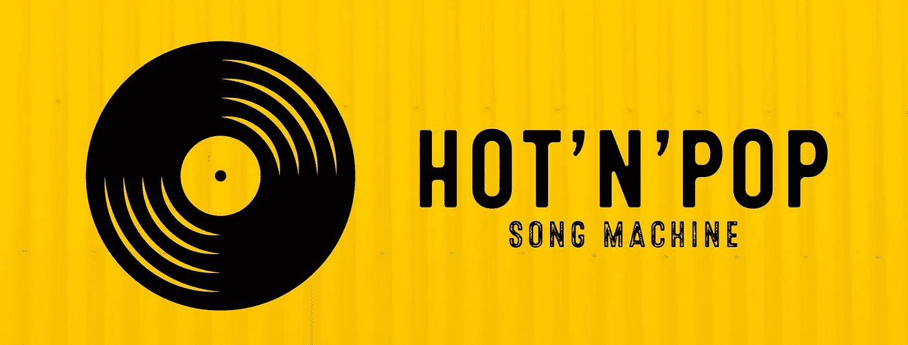

在这篇文章中，我描述了从概念到部署的**“Hot ' n ' pop Song Machine”**项目，这是我创建的一个机器学习歌曲流行预测器，它使用了 Streamlit 应用程序框架和 Heroku 上的 web 主机。希望能对其他数据科学爱好者有用。

完整的“Hot'n'Pop Song Machine”项目的 Github 库可以在[这里](https://github.com/daniel-isidro/hot_n_pop_song_machine)找到。

你可以在这里玩“热门流行歌曲机器”网络应用程序[的**现场演示**。](https://hot-n-pop-song-machine.herokuapp.com/)

# 目录

简介
方法论
需求
执行指南
数据采集
数据准备
原始数据描述
数据探索
建模
汇总
前端
结论
引用
关于我

# 介绍

当我发现自 2010 年以来存在的[百万首歌曲数据集](http://millionsongdataset.com/)时，我开始了这个项目的想法，这是一个免费提供的一百万首当代流行音乐歌曲的音频特征和元数据的集合。因为音乐是我的激情之一，所以将我的第一个数据科学项目建立在这个主题上似乎是合适的。数据集的核心由 Echo Nest 公司提供。它的创造者打算让它为消费者和开发者执行音乐识别、推荐、播放列表创建、音频指纹识别和分析。2014 年，Echo Nest [被](https://en.wikipedia.org/wiki/The_Echo_Nest) [Spotify](https://github.com/daniel-isidro/hot_n_pop_song_machine/blob/master/www.spotify.com) 收购，Spotify 将歌曲信息整合到他们的系统中。现在，这些音频功能和元数据可以通过免费的 Spotify Web API 获得。最后，我选择使用这个 API，而不是这个项目的百万首歌曲数据集，这要感谢它的灵活性和我练习使用 API 的意愿。

音乐信息检索是从音乐中检索信息的交叉学科。MIR 是一个小型但不断发展的研究领域，有许多实际应用。参与 MIR 的人可能具有音乐学、心理声学、心理学、学术音乐研究、信号处理、信息学、机器学习、光学音乐识别、计算智能或这些学科的某种结合的背景。MIR 应用包括:

*   推荐系统
*   轨道分离和乐器识别
*   自动音乐转录
*   自动分类
*   音乐一代

根据国际唱片业联合会(IFPI)的数据，2019 年全年，全球唱片市场的总收入增长了 8.2 %，达到 202 亿美元。流媒体首次占到全球录制音乐收入的一半以上(56.1 %)。流媒体的增长超过了实体收入-5.3 %的下降，低于 2018 年的水平。

能够预测哪些歌曲具有流行和流动所需的特征是音乐行业的一项资产，因为它可以在制作和规划营销活动时对音乐公司产生影响。这甚至对艺术家也是有益的，因为他们可以专注于音乐公司以后可以推广的歌曲，或者可以在公众中变得更受欢迎的歌曲。

关于 MRI 韵文的最新论文，涉及音频信号处理、音乐发现、音乐情感识别、复调音乐转录，使用深度学习工具。最近关于 MRI 的论文(2019)可以在[国际音乐信息检索学会网站](http://www.ismir.net/conferences/ismir2019.html)上找到。

# 方法学

## 机器学习技术

**分类**

在这个项目中，我们将使用监督学习分类方法，从逻辑回归方法开始，因为它是最简单的分类模型。随着我们的进展，我们将使用其他非线性分类器，如决策树和支持向量机。

**合奏学习**

我们将应用集成学习来组合简单模型，以创建比简单模型具有更好结果的新模型。在这方面，我们将尝试随机森林和梯度增强树。我们还将通过管道应用特性预处理(缩放、一键编码)。

**降维**

我们将评估使用降维从数据集中移除最不重要的信息(有时是冗余列)。我们将使用递归特征消除(RFE)和主成分分析(PCA)方法。

## 统计方法

**预测分析**

包括各种技术，如数据挖掘、数据建模等。

**探索性数据分析(EDA)**

对数据进行第一次观察，并尝试对其进行一些感觉或理解。

# 要求

我们将使用 Python 3.7.7 或更高版本的 Anaconda 虚拟环境和以下库/包:

## Anaconda Python 包

*   beautifulsoup4
*   jsonschema
*   matplotlib
*   numpy
*   熊猫
*   要求
*   scipy
*   海生的
*   sci kit-学习
*   斯波特比
*   xgboost

为了避免将来的兼容性问题，下面是所使用的密钥库的版本:

```
jsonschema==3.2.0
numpy==1.18.1
pandas==1.0.3
scikit-learn==0.22.1
spotipy==2.12.0
xgboost==0.90
```

## Spotify 帐户

您需要一个 Spotify 帐户(免费或付费)才能使用他们的 web API，然后将您的项目注册为应用程序。为此，请遵循[“Spotify 开发者指南”](https://developer.spotify.com/documentation/general/guides/app-settings/)中的说明:

1.  在[的仪表盘](https://developer.spotify.com/dashboard/)上，点击创建客户端 ID。
2.  输入应用程序名称和应用程序描述，然后单击创建。您的应用程序已注册，应用程序视图将打开。
3.  在应用程序视图中，单击编辑设置以查看和更新应用程序设置。


注意:找到你的客户 ID 和客户机密；您在身份验证阶段需要它们。

*   客户端 ID 是您的应用程序的唯一标识符。
*   客户端机密是您在 Spotify 帐户和 Web API 服务的安全呼叫中传递的密钥。始终安全地存储客户端密钥；千万不要公开透露！如果您怀疑密钥已经泄露，请通过单击“编辑设置”视图上的链接立即重新生成密钥。

## settings.env 文件

为了不将您的 Spotify 客户端 ID 和客户端机密令牌上传到 Github，您可以创建一个. env 文本文件并将其放入您的本地 Github 存储库中。在项目的根文件夹中创建一个. gitignore 文件，以便。env 文件不会上传到远程存储库。的内容。env 文本文件应该如下所示:

```
{
    "SPOTIPY_CLIENT_ID": "754b47a409f902c6kfnfk89964bf9f91",
    "SPOTIPY_CLIENT_SECRET": "6v9657a368e14d7vdnff8c647fc5c552"
  }
```

# 执行指南


要复制项目，请按指定顺序执行以下 Jupyter 笔记本。

[1。网页抓取](https://github.com/daniel-isidro/hot_n_pop_song_machine/blob/master/web_scraping/ultimate_music_database_web_scraping.ipynb)

从终极音乐数据库网站获得 1962 年至 2020 年美国每周公告牌 100 首热门歌曲和艺术家名字。

[2。从热门歌曲中获取音频特征](https://github.com/daniel-isidro/hot_n_pop_song_machine/blob/master/spotify_api/get_audio_features_hit_songs.ipynb)

从 Spotify web API 获取 2000 年至 2020 年的热门歌曲的音频功能，Spotify web API 的响应包含 JSON 格式的音频功能对象。

[3。从随机非热门歌曲中获取音频特征](https://github.com/daniel-isidro/hot_n_pop_song_machine/blob/master/spotify_api/get_audio_features_not_hit_songs.ipynb)

随机生成 10，000 首 2000 年至 2020 年的热门歌曲，并从 Spotify web API 获取其音频功能。

[4。数据准备](https://github.com/daniel-isidro/hot_n_pop_song_machine/blob/master/data_prep/data_prep.ipynb)

合并两个数据集，热门歌曲和非热门歌曲。

[5。数据探索](https://github.com/daniel-isidro/hot_n_pop_song_machine/blob/master/data_exploration/feature_selection_and_data_visualization.ipynb)

数据可视化和特征选择。

[6。ML 型号选择](https://github.com/daniel-isidro/hot_n_pop_song_machine/blob/master/modeling/modeling.ipynb)

使用平衡数据集的机器学习模型分析和度量评估。结果是一个腌模型。

[7。预测](https://github.com/daniel-isidro/hot_n_pop_song_machine/blob/master/modeling/model_predict.ipynb)

使用腌渍模型对新歌进行预测。

## 完善模型

如果您还想复制项目的第二部分，我们将使用不平衡的数据集进行探索，获取更多未命中歌曲的样本，并重新训练模型以尝试改进指标，请按照指定的顺序执行以下 Jupyter 笔记本。

[8。获得更多随机未命中的歌曲](https://github.com/daniel-isidro/hot_n_pop_song_machine/blob/master/spotify_api/get_audio_features_more_not_hit_songs.ipynb)

随机生成 20，000 多首 2000 年至 2020 年间未受欢迎的歌曲，总数达到 30，000 首，并从 Spotify web API 获取其音频功能。

[9。数据准备(不平衡数据集)](https://github.com/daniel-isidro/hot_n_pop_song_machine/blob/master/data_prep/data_prep_expanded_dataset.ipynb)

合并两个数据集，热门歌曲和非热门歌曲。现在导致不平衡的数据集，aprox。3:1 非热门歌曲对热门歌曲。

[10。数据探索(不平衡数据集)](https://github.com/daniel-isidro/hot_n_pop_song_machine/blob/master/data_exploration/feature_selection_and_data_visualization_expanded_dataset.ipynb)

机器学习模型分析和指标评估，现在具有扩展的不平衡数据集。

[11。ML 模型选择(不平衡数据集)](https://github.com/daniel-isidro/hot_n_pop_song_machine/blob/master/modeling/modeling_expanded_dataset.ipynb)

机器学习模型分析和度量评估。结果是第二个酸洗模型。

[12。预测(不平衡数据集)](https://github.com/daniel-isidro/hot_n_pop_song_machine/blob/master/modeling/model_predict_expanded_dataset.ipynb)

使用第二酸洗模型对新歌进行预测。

# 数据采集

## 网页抓取


为了获得从 1962 年到 2020 年美国所有的 Billboard 100 周热门歌曲和艺术家的名字，我们在[终极音乐数据库](http://umdmusic.com/default.asp?Lang=English&Chart=D)网站上进行网络搜集。我们抓取这个网站，而不是 Billboard.com 的官方，因为它包含相同的数据，而且格式更方便(很少的广告，没有 Javascript，没有跟踪代码)。

我们使用 [BeautifulSoup4](https://www.crummy.com/software/BeautifulSoup/) 作为我们抓取网页的 Python 库工具。

结果是一个包含三列的数据框:年份、艺术家和标题。然后，我们将数据帧保存到 CSV 文件中。

我们在网站上做几次擦边球，覆盖短短一二十年，避免被网站踢。

最后，我们将所有数据帧合并成一个最终的 CSV 文件，其中包含从 1962 年到 2020 年 6 月下旬的所有热门标题。

## Spotify Web API

**热门歌曲**

现在，我们采用上一步得到的数据框，删除所有早于 2000 年的歌曲(因为随着时间的推移，人们的偏好会发生变化，所以较老的热门歌曲可能无法预测未来的热门歌曲)，删除重复项，并用正则表达式清理艺术家和标题名称(以获得更好的搜索结果)。

然后我们使用 [spotipy](https://spotipy.readthedocs.io/) Python 库调用 Spotify Web API，获取那些热门歌曲的音频特征。


最后，我们添加一个列 success，所有行的值都是 1.0，它将在项目的建模阶段为我们服务。

生成的数据帧大约有 8，000 个条目。我们将结果存储到一个 CSV 文件中。

**非热门歌曲**

由于机器学习模型通常在平衡数据集上表现更好，我们需要获得 Spotify 目录中存在的其他 8000 首未热门歌曲。

因此，我们创建了一个生成大约 10，000 首伪随机歌曲的函数，以平衡命中/未命中歌曲数据集。

我们指定这些随机歌曲的年份范围与为热门歌曲选择的相同:从 2000 年到 2020 年。

我们将结果放在一个数据框中，然后删除重复和空值，并添加一个列 success，所有行的值都为 0.0，这将在项目的建模阶段为我们服务。

生成的数据帧大约有 9，500 个条目。我们将结果存储到一个 CSV 文件中。

# 数据准备

在这一部分中，我们将两个数据集(热门歌曲和非热门歌曲)合并到一个数据帧中，移除重复和空值，并移除超出的非热门歌曲，从而获得平衡的数据集(与 *success==0.0* 相比， *success==1.0* 的行数相同)。

结果是一个包含大约 15，700 个条目的数据帧。我们将结果存储到一个 CSV 文件中。

# 原始数据描述

## 音频功能

为了对我们将要使用的功能有一个大致的了解，让我们看看 Spotify Web API 在搜索歌曲时返回的“音频功能”JSON 对象。来自 [Spotify Web API 参考指南](https://developer.spotify.com/documentation/web-api/reference/tracks/get-audio-features/):

**持续时间 _ 毫秒**

*int*

以毫秒为单位的音轨持续时间。

**键**

*int*

轨道的估计总体基调。整数映射到使用标准[音高分类符号](https://en.wikipedia.org/wiki/Pitch_class)的音高。例如，0 = C，1 = C♯/D♭，2 = D，等等。如果没有检测到密钥，则值为-1。

**模式**

*int*

调式表示音轨的调式(大调或小调)，音阶的类型，其旋律内容来源于此。大调用 1 表示，小调用 0 表示。

**时间 _ 签名**

*int*

轨道的估计总拍号。拍号(拍子)是一种符号约定，用于指定每个小节(或小节)中有多少拍。

**声音**

*浮动*

从 0.0 到 1.0 的音轨是否声学的置信度度量。1.0 表示音轨是声学的高置信度。该特性的值分布如下所示:

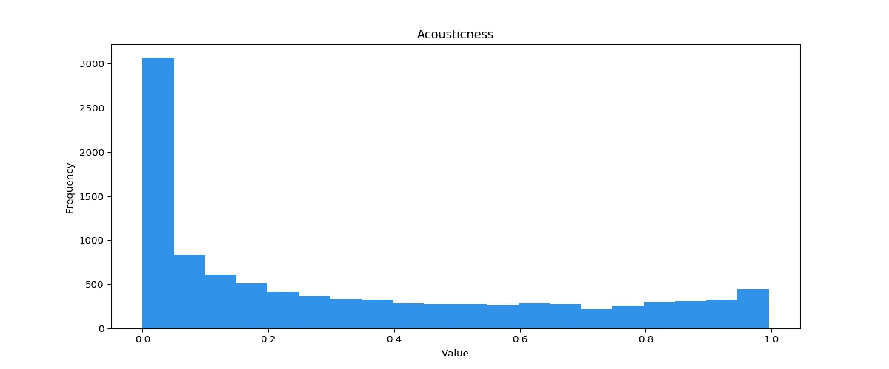

**跳舞能力**

*浮动*

可跳舞性描述了基于音乐元素(包括速度、节奏稳定性、节拍强度和整体规律性)的组合，一首曲目适合跳舞的程度。值 0.0 最不适合跳舞，1.0 最适合跳舞。该特性的值分布如下所示:


**能量**

*浮动*

能量是一种从 0.0 到 1.0 的度量，代表强度和活动的感知度量。通常，高能轨道感觉起来很快，很响，很嘈杂。例如，死亡金属具有高能量，而巴赫前奏曲在音阶上得分较低。对该属性有贡献的感知特征包括动态范围、感知响度、音色、开始速率和一般熵。该特性的值分布如下所示:

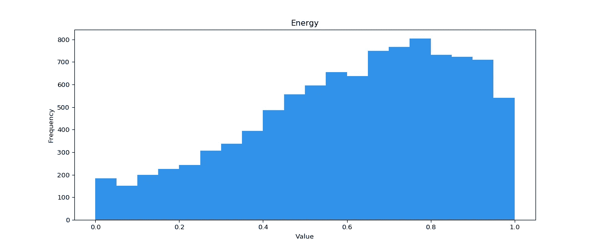

**仪器性**

*浮动*

预测轨道是否不包含人声。“Ooh”和“aah”在这种情况下被视为乐器。Rap 或口语词轨道明显是“有声的”。乐器度值越接近 1.0，轨道不包含人声内容的可能性就越大。高于 0.5 的值旨在表示乐器轨道，但随着该值接近 1.0，置信度会更高。该特性的值分布如下所示:


**活性**

*浮动*

检测录像中是否有观众。较高的活跃度值表示音轨被现场执行的概率增加。高于 0.8 的值表示该轨迹很有可能是实时的。该特性的值分布如下所示:


**响度**

*浮动*

轨道的整体响度，以分贝(dB)为单位。响度值是整个轨道的平均值，可用于比较轨道的相对响度。响度是声音的质量，是与体力(振幅)相关的主要心理因素。值的典型范围在-60 和 0 db 之间。该特性的值分布如下所示:


**语速**

*浮动*

语音检测音轨中是否存在语音单词。越是类似语音的录音(例如脱口秀、有声读物、诗歌)，属性值就越接近 1.0。高于 0.66 的值描述可能完全由口语单词组成的轨道。介于 0.33 和 0.66 之间的值描述可能包含音乐和语音的轨道，可以是分段的，也可以是分层的，包括说唱音乐。低于 0.33 的值很可能代表音乐和其他非语音类轨道。该特性的值分布如下所示:

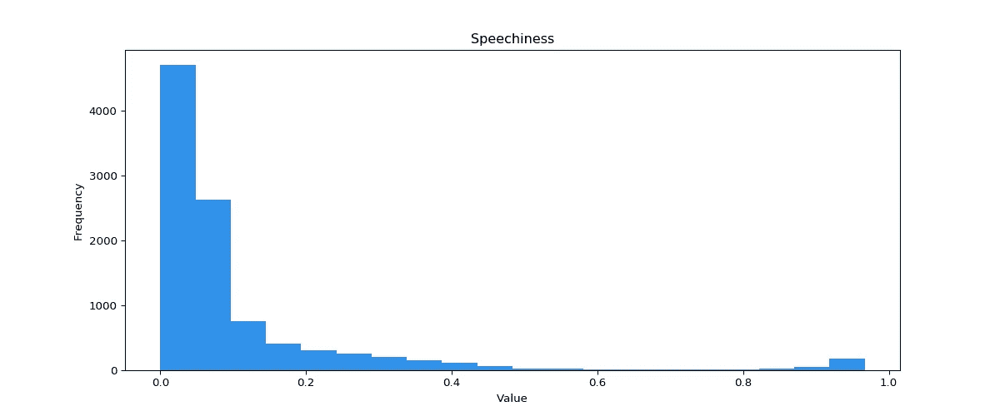

**化合价**

*浮动*

从 0.0 到 1.0 的测量值，描述轨道所传达的音乐积极性。高价曲目听起来更积极(例如，快乐、愉快、欣快)，而低价曲目听起来更消极(例如，悲伤、沮丧、愤怒)。该特性的值分布如下所示:

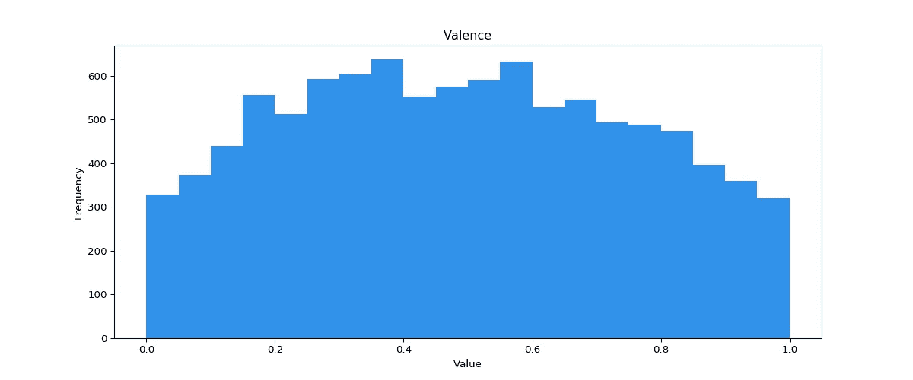

**速度**

*浮动*

轨道的总体估计速度，以每分钟节拍数(BPM)为单位。在音乐术语中，速度是给定作品的速度或节奏，直接来源于平均节拍持续时间。该特性的值分布如下所示:

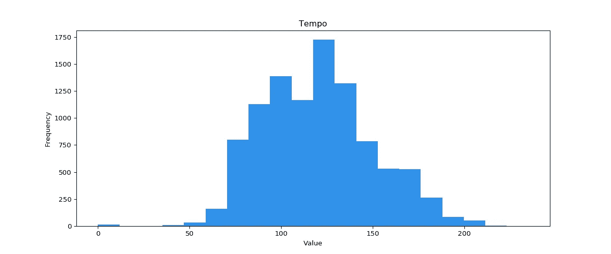

**id**

*弦*

该曲目的 Spotify ID。

**uri**

*字符串*

音乐的 Spotify URI。

**track_href**

*弦*

指向 Web API 端点的链接，提供了跟踪的完整详细信息。

**分析 _ 网址**

*字符串*

一个 HTTP URL 来访问这个音轨的完整音频分析。访问此数据需要访问令牌。

**类型**

*字符串*

对象类型:“音频特征”

## 统计说明

**1。先看**

我们来看一下运行上面的执行指南中的步骤 1 到 4 后得到的原始数据。这是数据集的第一个条目。

```
data.head()
```


**2。数据的尺寸**

```
data.shape15714 rows × 19 columns
```

**3。数据类型**

```
data.dtypesdanceability        float64
energy              float64
key                 float64
loudness            float64
mode                float64
speechiness         float64
acousticness        float64
instrumentalness    float64
liveness            float64
valence             float64
tempo               float64
type                 object
id                   object
uri                  object
track_href           object
analysis_url         object
duration_ms         float64
time_signature      float64
success             float64
dtype: object
```

显然我们有 14 个数字特征和 5 个分类特征。但是后面我们会看到`key`、`mode`、`time_signature`和`success`也是范畴。

**4。阶级分布**

我们正在设计一个平衡的数据集。

```
df[df['success']==1.0].shape
(7857, 19)df[df['success']==0.0].shape
(7857, 19)
```

**5。数据汇总**

```
df.describe()
```


**6。相关性**

```
data.corr(method='pearson')
```

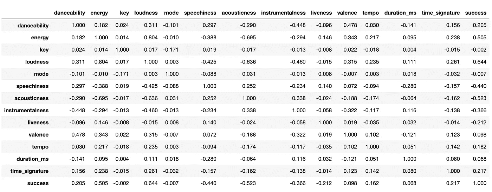

**7。偏斜度**

偏斜指的是假设为高斯分布(正态或钟形曲线)，在一个方向或另一个方向上移动或挤压。歪斜结果显示正(右)或负(左)歪斜。越接近零的值显示出越少的偏斜。

```
data.skew()danceability       -0.757
energy             -0.296
key                 0.019
loudness           -1.215
mode               -0.699
speechiness         1.310
acousticness        0.645
instrumentalness    2.301
liveness            1.978
valence             0.021
tempo               0.134
duration_ms         8.900
time_signature     -2.628
success             0.000
dtype: float64
```

# 数据探索

## 数据可视化

目标计数图

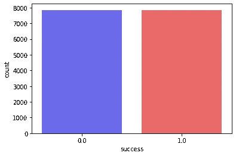

箱线图

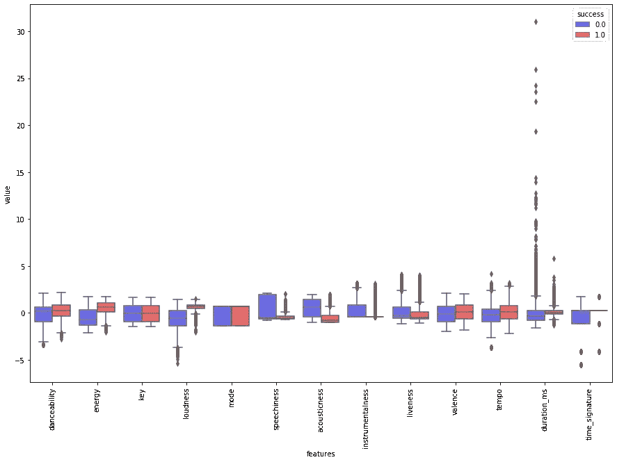

单变量分析:数值变量

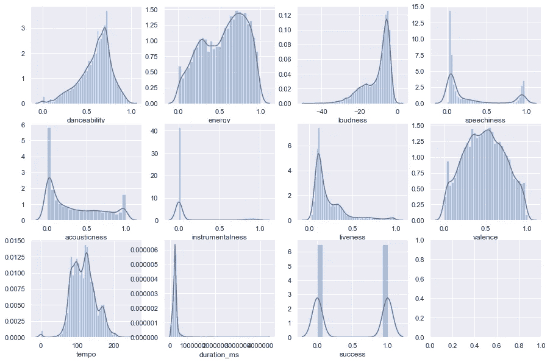

单变量分析:分类变量


多元分析:两个数值变量


多元分析:两个分类变量

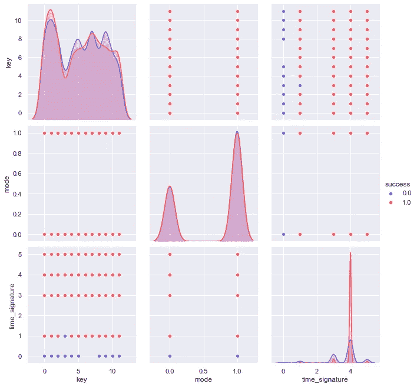

相关热图

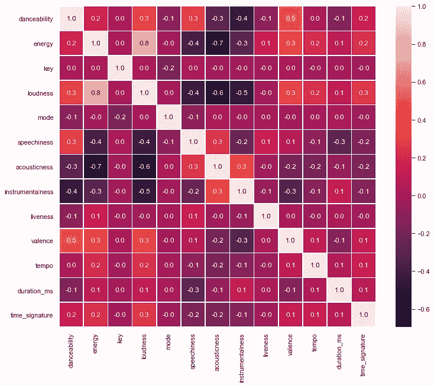

感兴趣的笔记:

*   我们正在使用一个平衡的数据集(通过设计)。
*   在非热门歌曲的 duration_ms 特征中有许多异常值。
*   热门歌曲比非热门歌曲具有更高的可跳性、能量和响度。
*   热门歌曲的语音性、听觉性、器乐性和生动性都不如非热门歌曲。
*   热门歌曲的基调、调式、效价和节奏与非热门歌曲相似。
*   大多数热门歌曲在特征语音性、工具性、持续时间和时间特征上差异很小。
*   歌曲或多或少平均分布在所有键中。
*   三分之二的歌曲是大调模式。
*   大多数歌曲都是 4 拍(4/4)拍号。
*   能量和响度具有相当强的相关性(0.8)。
*   能量和声音有中度负相关(-0.7)。

## 特征选择

我们将分析我们是否需要在建模步骤中使用所有的特性，或者我们应该删除一些特性。我们将使用 scikit-learn 中的随机树分类器作为基础模型。

**1。特征选择和随机森林分类**

使用随机树分类器，70/30 训练/测试分割，10 个估计器，我们得到 0.905 的准确度。

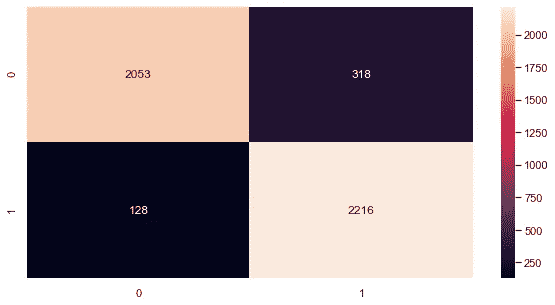

```
Accuracy is:  0.905408271474019
```

**2。单变量特征选择和随机森林分类**

我们使用模块`SelectKBest`和`f_classif`找出 5 个得分最高的特征。

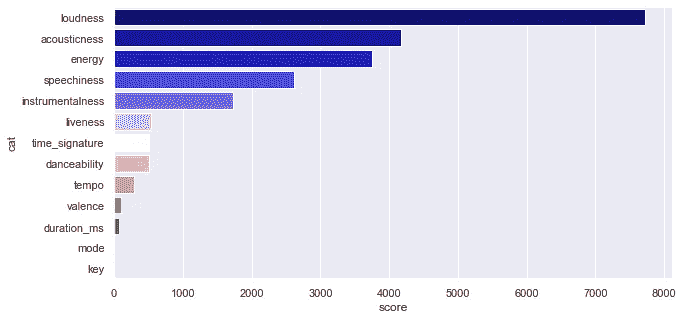

**3。使用随机森林的递归特征消除(RFE)**

```
Chosen best 5 feature by rfe:
Index(['energy', 'loudness', 'speechiness', 'acousticness', 'duration_ms'], dtype='object')
```

然后，我们只使用这 5 个特征重新训练随机森林模型。


```
Accuracy is:  0.8835630965005302
```

只有这 5 个选择的特征，精度下降到 0.884。

**4。使用交叉验证和随机森林分类的递归特征消除**

现在使用来自`sklearn.feature_selection`的模块`RFECV`,我们不仅会找到最佳特性，还会找到我们需要多少特性才能达到最佳精度。


```
Optimal number of features : 13
Best features : Index(['danceability', 'energy', 'key', 'loudness', 'mode',
   'speechiness', 'acousticness', 'instrumentalness', 'liveness', 'valence',
   'tempo', 'duration_ms', 'time_signature'], dtype='object')
```

看来我们应该使用我们所有可用的功能。

**5。基于树的特征选择和随机森林分类**

如果我们的目的实际上不是找到好的准确性，而是学习如何进行特征选择和理解数据，那么我们可以使用另一种特征选择方法。

在随机森林分类方法中，有一个`feature_importances_`属性，即特征重要性(越高，特征越重要)。

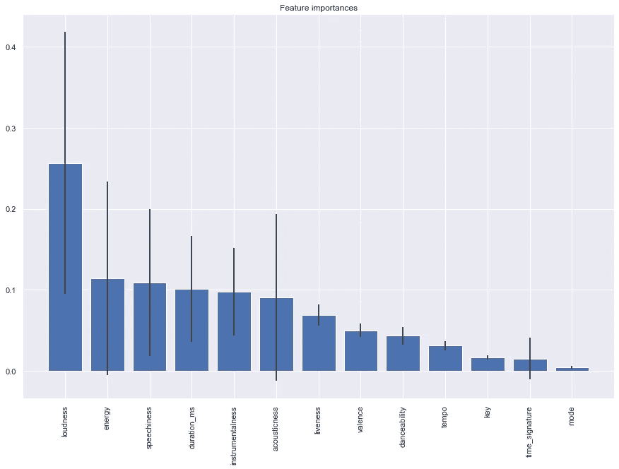

特征抽出

我们将使用主成分分析(PCA)进行特征提取。在进行主成分分析之前，我们需要对数据进行归一化处理，以提高主成分分析的性能。

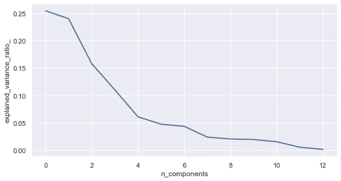

根据方差比，可以选择 5 个分量(0-4)作为最显著的分量。但是稍后我们会验证在这个项目中删除一些特性是不值得的，因为这个项目没有那么多特性，并且可能会失去预测能力。

# 建模

我们将使用几种 ML 分类器算法，主要来自`scikit-learn`:

*   逻辑回归
*   k-最近邻
*   支持向量列
*   决策图表
*   随机森林

另外:

*   XGBoost

我们将使用管道在一次传递中对列和 ML 训练执行几次转换。我们将用标准化(对于数字列)和一键编码(对于分类列)来转换列。

我们将使用逻辑回归作为基础模型。

为了标准化，我们将使用`RobustScaler()`(它比其他转换对异常值更健壮)，除了当使用涉及树的算法(通常对异常值免疫)时，我们将使用`StandardScaler()`。

对于列编码，我们将主要使用`OneHotEncoder()`，测试移除第一个带标签的列(以避免共线性)是否会改进指标。出于好奇，我们也将测试`OrdinalEncoder()`。

在模型分析中，`GridSearchCV`被合并到流水线中，将非常有助于我们找到最佳的算法参数。

## 韵律学

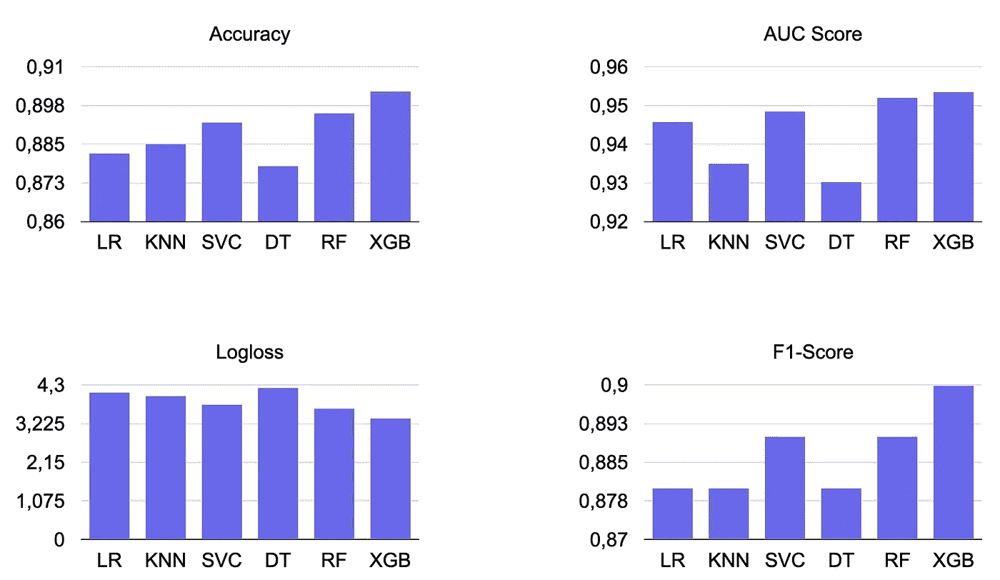

*   我们确实突出了重要性评分，其中`loudness`具有 40 %的显著性，并且由于`energy`与`loudness` (0.8)具有相当强的相关性，我们尝试改进度量标准，重新训练我们选择的模型(XGBoost，离群值已移除)，将`energy`排除在外。但是指标越来越差，模型失去了预测能力。
*   移除训练集中的 650 多个异常值似乎确实有助于改进一些指标。大多数离群值来自随机的非热门歌曲。去除异常值，这些异常值是有效的度量，并且不是来自错误，会稍微降低否定的精确度，但是会提高否定的召回率。它还提高了阳性准确率，并且没有改变阳性召回率。

在移除异常值之前增强指标:

```
precision    recall  f1-score   support 0.0        0.94      0.87      0.90      1543
     1.0        0.88      0.95      0.91      1600accuracy                            0.91      3143
macro avg       0.91      0.91      0.91      3143
weighted avg    0.91      0.91      0.91      3143
```

移除异常值后的 XGBoost 指标:

```
precision    recall  f1-score   support 0.0        0.95      0.85      0.90      1561
     1.0        0.87      0.95      0.91      1582accuracy                            0.90      3143
macro avg       0.91      0.90      0.90      3143
weighted avg    0.91      0.90      0.90      3143
```

移除异常值后的箱线图

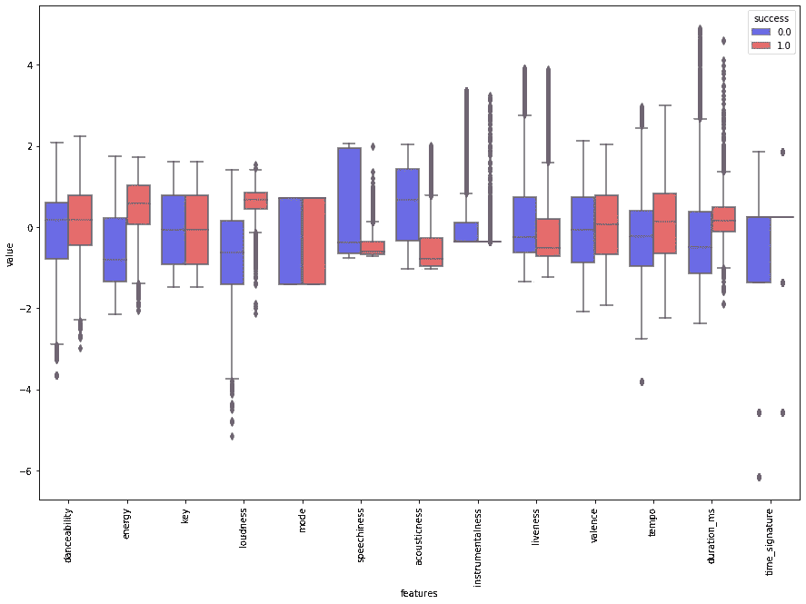

## 过度拟合

在检查过度拟合时，我们需要获得每个折叠结果的训练集和测试集之间的精确度差异。如果我们的模型给我们的训练精度很高，但是测试精度很低，那么我们的模型就是过度拟合了。如果我们的模型没有给出很好的训练精度，我们可以说我们的模型是不适合的。


要检查 GridSearchCV 找到的模型是否过拟合，可以使用`GridSearchCV`的`cv_results`属性。`cv_results`是包含细节的字典(如`mean_test_score`、`mean_score_time`等)。)对于参数网格中给定的参数的每个组合。并获得训练分数相关值(如`mean_train_score`、`std_train_score`等)。)，我们必须传递默认为假的`return_train_score = True`。

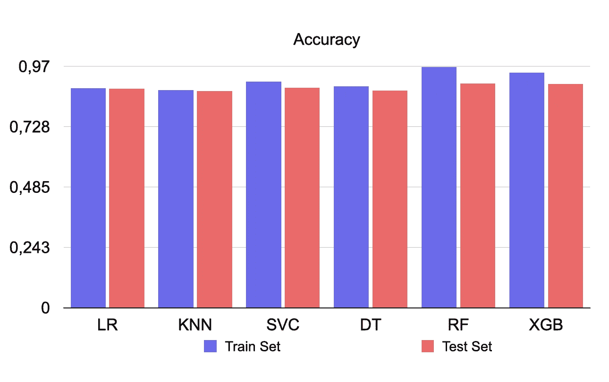

然后，比较训练和测试精度平均值，我们可以确保我们的模型是否过度拟合。我们可以在图表上看到，我们的模型都没有呈现高度过度拟合。交叉验证技术对此有所帮助。

## 完善模型

我们试图通过用 20，000 多首未命中的歌曲扩展原始数据集来改进第一个模型(执行指南中的笔记本 8 至 12)。我们用这个不平衡的数据集重新运行所有步骤，以获得新的第二个预测模型。

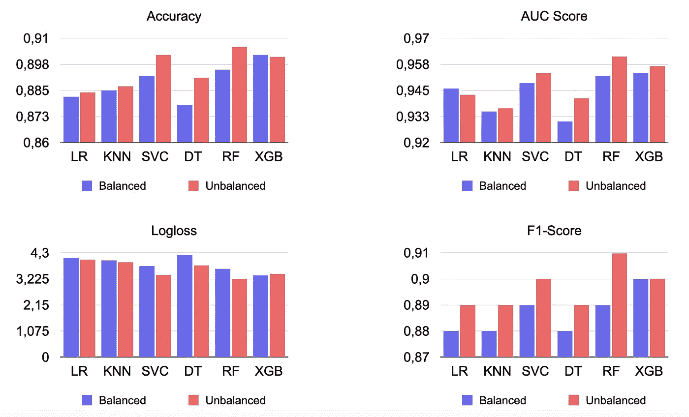

这一次，原则上，随机森林模型比平衡数据集模型获得了更好的指标。

**第一个模型—具有平衡数据集的 XGBoost 指标:**

```
AUC - Test Set: 95.35%
Logloss: 3.37
accuracy score: 0.902 precision    recall  f1-score   support 0.0        0.95      0.85      0.90      1561
         1.0        0.87      0.95      0.91      1582 accuracy                            0.90      3143
   macro avg        0.91      0.90      0.90      3143
weighted avg        0.91      0.90      0.90      3143
```

**第二个模型—带有不平衡数据集的随机森林指标:**

```
AUC - Test Set: 96.13%
Logloss: 3.23
accuracy score: 0.906 precision    recall  f1-score   support 0.0       0.95      0.93      0.94      5151
         1.0       0.78      0.83      0.80      1557 accuracy                           0.91      6708
   macro avg       0.86      0.88      0.87      6708
weighted avg       0.91      0.91      0.91      6708
```

我们发现这个新模型在预测否定时比第一个模型(使用平衡数据集)表现得更好，这意味着预测否定时更精确，召回更少(否定 f1 得分从 0.90 上升到 0.94)。但与此同时，新模型失去了很多对积极因素的预测能力(积极因素 f1 值从 0.91 降至 0.80)。

由于随机森林模型对异常值更稳健，我们在这种情况下没有删除它们。

## 成本和乐观/悲观指标

如果我们为一家音乐公司工作，并且未能预测到一首不畅销歌曲的成本很高，我们将使用第二种模型(RF)。有了它，公司可能不会把推广预算分配给一首不流行的歌曲。这对于艺术家来说也是有用的，他们将丢弃不受欢迎的歌曲以发送给营销机构进行推广。

如果我们为一家音乐公司工作，与其他公司竞争可能成功的歌曲的版权，并且不预测一首热门歌曲的成本很高，或者为一位计划将具有热门歌曲特征的歌曲发送给音乐公司进行出版的艺术家工作，那么我们会选择第一种模式(XGB)。

此外，我们可以只使用一个模型，还可以根据业务需求微调预测阈值(现在中性地设置为 50 %)，因此，例如，只有概率超过 90 %的积极因素可以被视为热门。

# 摘要

经过前面的分析，我们选择了 XGBoost 模型作为最终的预测模型，该模型具有以下特征:

*   移除异常值
*   标准缩放器()
*   OneHotEncoder()，删除第一列
*   使用所有功能

它在所有指标上都表现得相当好，没有表现出太多的过度拟合，并且在正面和负面之间给出了更一致的预测结果。

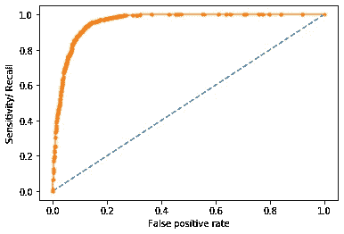

```
AUC - Test Set: 95.91%
Logloss: 3.31
best params:  {'classifier__colsample_bytree': 0.8, 'classifier__gamma': 1,
   'classifier__learning_rate': 0.01, 'classifier__max_depth': 5,
   'classifier__n_estimators': 1000, 'classifier__subsample': 0.8}
best score: 0.901
accuracy score: 0.904 precision    recall  f1-score   support 0.0       0.93      0.87      0.90      1550
         1.0       0.88      0.94      0.91      1593 accuracy                           0.90      3143
   macro avg       0.91      0.90      0.90      3143
weighted avg       0.91      0.90      0.90      3143
```

最后，我们提取了这个 XGBoost 模型，并将其用于前端 web 应用程序的 Python 脚本。

# 前端

该项目前端 web 应用的 Github 存储库使用了 Streamlit 应用框架和 Heroku 上的 web 托管，可以在这里找到。

## **流线型**

Streamlit 的开源应用程序框架是一种创建 web 应用程序的简单方法，全部用 Python 编写，免费。你可以在 [https://www.streamlit.io](https://www.streamlit.io/) 找到更多信息。

对于安装 Streamlit，根据源文档:

1.  确保您安装了 Python 3.6 或更高版本。
2.  使用 PIP 安装 Streamlit:

```
$ pip install -q streamlit==0.65.2
```

3.运行 hello world 应用程序:

```
$ streamlit hello
```

4.完成了。在接下来的几秒钟内，示例应用程序将在默认浏览器的新标签中打开。

## Heroku 部署

Heroku 是一个平台即服务(PaaS ),可以用来在云中完全运行应用程序。要部署您的应用程序，您首先需要在 [Heroku](https://signup.heroku.com/dc) 上创建一个免费帐户。

注册后，在 Heroku 仪表板中，您可以使用 Github 存储库作为 Heroku 上的部署方法。你必须将你的 Heroku 应用连接到你选择的 Github 库，然后打开“自动部署”。这样，每次在 Github 存储库上更新文件时，都会自动触发带有这些更改的 Heroku 重新部署。

您需要在 Github 存储库中拥有这些文件:

**hotnpop.py**

web 应用程序的 Python 代码。

**requirements.txt**

requirements.txt 文件一起列出了应用程序依赖项。当部署一个应用程序时，Heroku 读取这个文件，并使用 pip install -r 命令安装适当的 Python 依赖项。要在本地做到这一点，您可以运行以下命令:

```
pip install -r requirements.txt
```

注意:必须正确安装 Postgres，以便此步骤正常工作。

**setup.sh**

使用此文件，将创建一个包含 config.toml 文件的 Streamlit 文件夹。

**Procfile**

应用程序根目录中的文本文件，用于显式声明启动应用程序时应该执行的命令。

**model.pkl**

腌 ML 模型。

**hnp_logo.jpg**

网页上的顶部图像。

## **配置变量**

为了在 web 应用程序中使用您的秘密 Spotify web API 凭据，您必须在 Heroku 仪表板的设置区域中设置两个配置变量 SPOTIPY_CLIENT_ID 和 SPOTIPY_CLIENT_SECRET。


它们将充当 Python 环境变量。请输入不带引号的关键字和值。

## **网址**

Heroku 将为你的网络应用创建一个免费的子域，比如[http://webapp.herokuapp.com](http://webapp.herokuapp.com/)，但是你也可以在 Heroku 仪表盘中指定一个自定义域。

就是这样！

## 用户手册

你可以在这里玩 web app [的**现场演示**。您只需在文本框中输入歌曲名称(如 juice)，或艺术家姓名后接歌曲名称(如 harry styles 西瓜糖)，然后按回车键。](https://hot-n-pop-song-machine.herokuapp.com/)

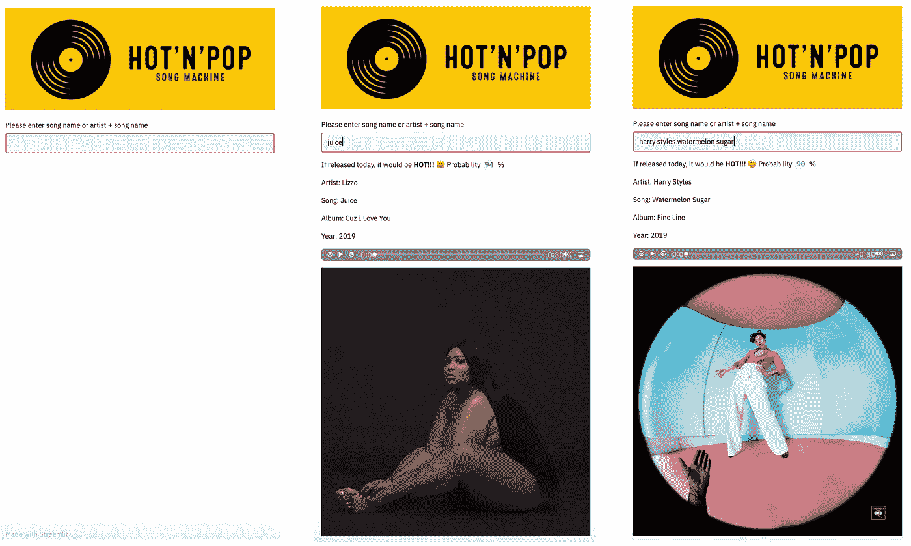

然后你就得到这首歌如果今天发行的话，它火爆流行的概率，下面你可以播放这首歌的音频样本，看到相应专辑的封面(注:部分曲目由于版权原因，不包含音频样本)。

# 结论

虽然准确预测哪些歌曲将出现在未来的热门歌曲列表中可能很困难，因为它涉及许多与歌曲本身无关的因素(推广预算、艺术家的可发现性、外部经济因素)，但我们在这个项目的最终模型中获得的相当好的指标表明，**预测**一首新歌是否具有**音频特征**以潜在地获得成功是一项可以通过机器学习完成的任务。

根据业务需求，可以应用不同的乐观和悲观模型。

网络抓取、API 和 ML 模型是对任何行业进行研究的基本工具(在这种情况下是音乐行业)。

做出关键决策(剔除异常值、RFE、成本矩阵……)需要领域知识。

创建交互式应用程序作为部署 ML 模型的一种方式，对于最终用户来说，可能是一种有趣而简单的方式来获得任何数据科学项目的内部知识。

# 参考

[IFPI——2019 年度全球音乐报告](https://www.ifpi.org/ifpi-issues-annual-global-music-report/)

[面向开发者的 Spotify 获取音轨的音频功能](https://developer.spotify.com/documentation/web-api/reference/tracks/get-audio-features/)

[机器学习精通——用 Python 中的描述性统计来理解你的机器学习数据](https://machinelearningmastery.com/understand-machine-learning-data-descriptive-statistics-python/)

[scikit-learn——Python 中的机器学习](https://scikit-learn.org/stable/index.html)

[模型评估指标](https://www.kdnuggets.com/2020/05/model-evaluation-metrics-machine-learning.html)

# 关于我

在 [LinkedIn](https://www.linkedin.com/in/daniel-isidro/) 更了解我。