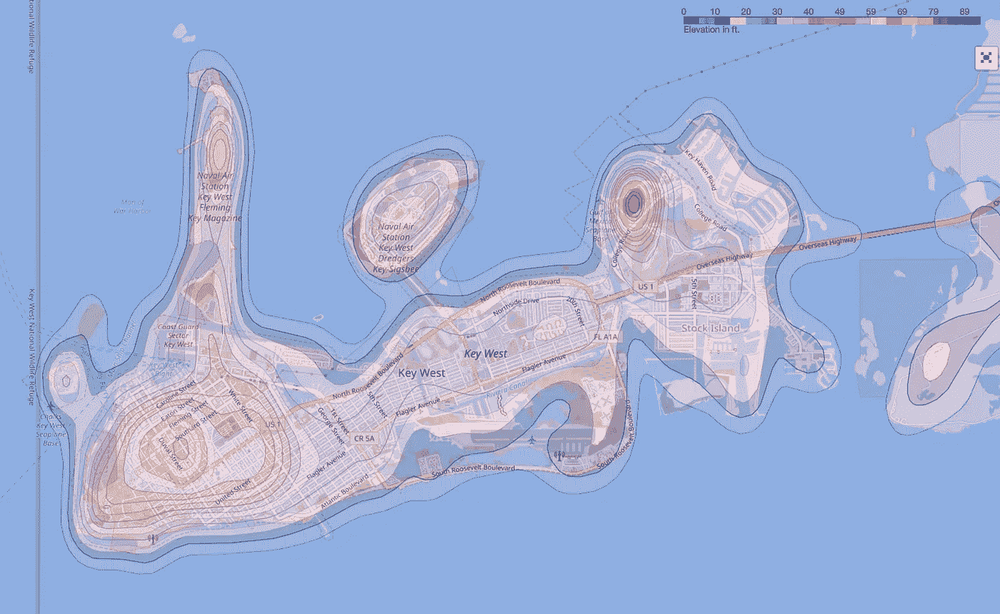
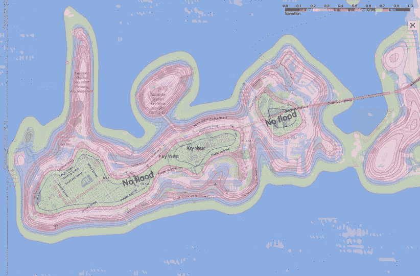
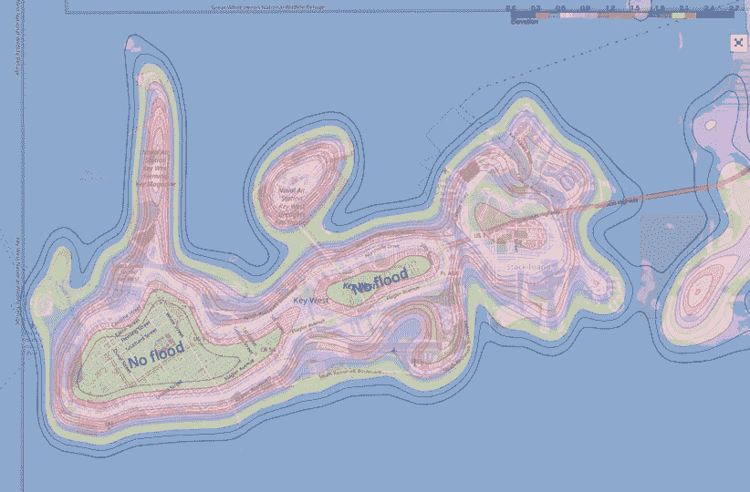

# 佛罗里达基韦斯特房价下跌

> 原文：<https://medium.com/analytics-vidhya/house-price-drop-in-key-west-florida-44b8f37d9c6a?source=collection_archive---------20----------------------->

## 买度假屋？或者…也许不是


泰莎·威尔森在 [Unsplash](https://unsplash.com?utm_source=medium&utm_medium=referral) 上拍摄的照片

去年十月，我的一个好朋友给我看了一篇关于佛罗里达基韦斯特房地产价格下跌的文章。他真的很想从马萨诸塞州搬到基韦斯特，因为自从他几年前退休以来，寒冷的冬天一直困扰着他。

作为一名水文学家，我首先想到的是，这个地区每年被洪水淹没的频率是多少？有多深？为了回答这些问题，我去了 NOAA(美国国家海洋和大气管理局)网站，调出了一些极端的海水水位。2017 年 9 月，记录的最高海平面为 4.47 英尺，2015 年至 2019 年期间的平均最高海平面为 2.73 英尺。

对于我住在马萨诸塞州的朋友来说，很难想象 4.47 英尺的海平面对于在基韦斯特买房子意味着什么。所以，我制作了一张地图，展示了几个海平面条件下的基韦斯特。

为此，我从美国国家海洋和大气管理局收集了佛罗里达州基韦斯特的数字高程模型。为了加快我的编程过程，我使用我的 GIS(地理信息系统)工具将 DEM 模型转换成经纬度格式。有了经度-纬度格式后，我编写了以下代码来创建地图。

目标是显示正常海平面(0.0)、平均最高海平面 2.73 英尺和最高记录最高海平面 4.47 英尺下的基韦斯特地图。

```
## Import librariesimport numpy as np
import pandas as pd
import folium
import branca
from folium import plugins
import matplotlib.pyplot as plt
from scipy.interpolate import griddata
import geojsoncontour
import scipy as sp
import scipy.ndimage%matplotlib inline***# Read the digital elevation  model in longitude, latitude and elevation format*** data = pd.read_csv('./DEM/Key_West_DEM_LL.xyz', header = None, names = ['longitude','latitude','elevation']) 
DEM = data.copy()
# Set all negative elevations to zero to show that they will be under the mean sea level of zero
for i in range(0,len(DEM)):
    if DEM['elevation'][i] <= 0.:
        DEM['elevation'][i] = 0.
***# Setup minimum and maximum values for the contour lines (my DEM came in meter)*** vmin = DEM['elevation'].min() * 3.280833 
vmax = DEM['elevation'].max() * 3.280833***# Setup colormap*** colors = ['blue','royalblue', 'navy','pink',  'mediumpurple',  'darkorchid',  'plum',  'm', 'mediumvioletred', 'palevioletred', 'crimson',
         'magenta','pink','red','yellow','orange', 'brown','green', 'darkgreen']
levels = len(colors)
cm     = branca.colormap.LinearColormap(colors, vmin=vmin, vmax=vmax).to_step(levels)***# Convertion dataframe to array*** x_orig = np.asarray(DEM.longitude.tolist())
y_orig = np.asarray(DEM.latitude.tolist())***# convert elevation from  m to ft*** z_orig = np.asarray(DEM.elevation.tolist()) * 3.280833***# Make grids*** x_arr          = np.linspace(np.min(x_orig), np.max(x_orig), 500)
y_arr          = np.linspace(np.min(y_orig), np.max(y_orig), 500)
x_mesh, y_mesh = np.meshgrid(x_arr, y_arr)

***# Grid the elevation values*** z_mesh = griddata((x_orig, y_orig), z_orig, (x_mesh, y_mesh), method='linear')

***# Use Gaussian filter to smoothen the contour*** sigma = [5, 5]
z_mesh = sp.ndimage.filters.gaussian_filter(z_mesh, sigma, mode='constant')

***# Create the contour*** contourf = plt.contourf(x_mesh, y_mesh, z_mesh, levels, alpha=0.5, colors=colors, linestyles='None', vmin=vmin, vmax=vmax)***# Convert matplotlib contourf to geojson*** geojson = geojsoncontour.contourf_to_geojson(
    contourf=contourf,
    min_angle_deg=3.0,
    ndigits=5,
    stroke_width=1,
    fill_opacity=0.1)

***# Set up the folium plot*** geomap1 = folium.Map([DEM.latitude.mean(), DEM.longitude.mean()], zoom_start=12, tiles="OpenStreetMap")
 # Plot the contour plot on folium
folium.GeoJson(
    geojson,
    style_function=lambda x: {
        'color':     x['properties']['stroke'],
        'weight':    x['properties']['stroke-width'],
        'fillColor': x['properties']['fill'],
        'opacity':   0.5,
    }).add_to(geomap1)

***# Add the colormap to the folium map*** cm.caption = 'Elevation in ft.'
geomap1.add_child(cm)

***# Fullscreen mode*** plugins.Fullscreen(position='topright', force_separate_button=True).add_to(geomap1)
geomap1
```



基韦斯特在正常海水水位条件下，内陆无水。

要在地图上方绘制平均最高海水水位，我们需要计算相对于地面高程的水深，并将所有高于平均最高水位的高程上的水深设置为零。以下是该计算的示例代码。

```
DEM = data.copy()
***# Set all ground elevation below zero to zero to show that under*** mean sea level of zero, they are all inundated)
for i in range(0,len(DEM)):
    if DEM['elevation'][i] <= 0.:
        DEM['elevation'][i] = 0.***# Set the areas that are not flooded (zero water depth)
# Calculate water depth (in meter) in the flooded areas***for i in range(0,len(DEM)):
    if DEM['elevation'][i] >= ((2.73-1.77)/3.280833):# set no flood area
        DEM['elevation'][i] = 0.
    else:# water depth calculation
        DEM['elevation'][i] = ((2.73-1.77)/3.280833) - DEM['elevation'][i]# ***There is 1.77 ft difference in water surface and DEM datum, it needs correction***
# ***We can create the water depth contour map using the same code as describe in the first set of codes.***
```



平均最高海平面下的基韦斯特(基准面校正为 1.77 英尺)

上述代码适用于计算任何海平面条件下的水深，例如记录的最高海平面为 4.47 英尺。只需将水深计算中的数字替换为感兴趣的水位。



2017 年 9 月 10 日最高海平面下的基韦斯特(基准面校正 1.77 英尺)

2019 年记录的最高海平面为 3.43 英尺，明显高于平均水平 2.73 英尺。一个持续的趋势是，未来海平面将继续上升。

即使你在没有洪水历史的地区买了房子，也不代表永远都是那样。其他需要考虑的是每年高达 10，000 美元的洪水保险和不断增加的税收。由于排水系统维护费用高昂，该市需要增加税收。海水入侵破坏了城市的一些排水系统。

那么，我亲爱的朋友，你还考虑搬到佛罗里达吗？

参考:

1.  [https://pypi.org/project/geojsoncontour/](https://pypi.org/project/geojsoncontour/)
2.  https://www.tjansson.dk/2018/10/contour-map-in-folium/
3.  【https://tidesandcurrents.noaa.gov/waterlevels.html? id=8724580 &单位