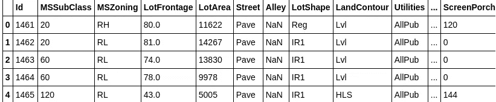
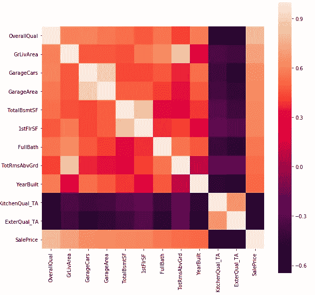
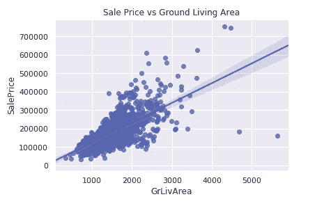
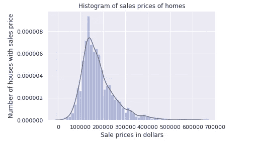
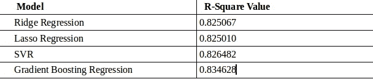

# 基于监督机器学习的房价预测

> 原文：<https://medium.com/analytics-vidhya/house-price-prediction-65787bf84906?source=collection_archive---------4----------------------->

房价预测是机器学习中最常见也是最具挑战性的问题之一。这是机器学习初学者扩展知识面的绝佳问题。在这个问题中，我们已经得到了与房子相关的各种特征，我们必须预测房子的价格。

## **数据集**

数据集由数字变量和分类变量组成。共有 79 个解释变量描述了住宅的各个方面。数据集概述:

## **探索性数据分析**

求缺失值的个数。检查每个变量的数据类型，并将分类变量和非分类变量分开。使用 desc()函数来描述数据集。

## **特色工程**

在特征工程中，我们通常会尝试借助现有特征来制造新特征，或者尝试修改现有特征。在这个问题中，我已经通过绘制相关矩阵(可以使用 df.corr()函数来绘制相关矩阵)来检查不同特征之间的相关性。因为总共有 79 个变量，所以使用相关矩阵，我已经找到了与目标值高度正相关和高度负相关的顶部特征，并且仅取这些特征用于进一步处理，而丢弃剩余的特征。

相关矩阵

**选择的功能有:** 'BsmtFinType1 '，' BsmtFinType2 '，' BsmtCond '，' BsmtQual '，' Electrical '，' MasVnrArea '，' MasVnrType '，' GarageCond '，' GarageFinish '，' GarageQual '，' GarageType '，' GarageYrBlt '，' mischaracter '，' Fence '，' PoolQC '，' PoolArea '，' Alley '，' FireplaceQu '。(**注:**这只是可能的做法之一。所选择的特征可能不同)。

在相关性分析之后，我使用散点图对所选特征进行了异常值检测。

检测异常值的散点图

例如，从上面的图中，我们可以说存在异常值，并且这些异常值需要被丢弃。所以我放弃了某些异常值。类似地，我已经制作了其他散点图，并从其他功能中删除了异常值(详细信息在代码中)。

之后，我通过绘制直方图检查了所选特征的正态性和线性。这样做是为了检查特性的偏斜度(细节在代码中)。

## **模型构建**

在数据预处理之后，我们将在数据集上执行我们的机器学习模型。我们将数据集分为 train_x 和 train_y。

我在数据集上应用的模型:

1.  线性脊模型。
2.  支持向量回归。
3.  线性套索模型。
4.  梯度推进回归器。

拟合模型后，我们将预测测试数据，预测后，我们将计算每种情况下的 R 平方。R 平方越大，模型越好(并非在所有情况下都适用)。我得到的一些 R 平方值是:

r 平方值

虽然有很多模型可以尝试，如线性模型，SVR(支持向量回归)，基于树的模型，如决策树，随机森林等。每个模型都有自己的优点和缺点，人们可以使用不同的性能矩阵来比较这些模型，如平均绝对误差(MAE)、均方根误差(RMSE)、R 平方值等。

## **结论**

我们使用不同的机器学习算法预测了不同房屋的销售价格。我们从探索数据开始解决问题，然后进行清理，在预处理之后，我们结束了模型构建步骤。这些是几乎每个机器学习预测问题的共同步骤。

完整的代码可以在我的 git-hub 仓库中找到。我正在分享完整代码的链接。

[https://github . com/anu raglal 1/House-Prices-Prediction-/blob/master/code _ 3 . ipynb](https://github.com/anuraglal1/House-Prices-Prediction-/blob/master/code_3.ipynb)

我希望你喜欢这篇文章，请随时在 LinkedIn 上联系我。

【https://www.linkedin.com/in/anuraglal77/ 

欢迎评论和反馈。

快乐学习！:)