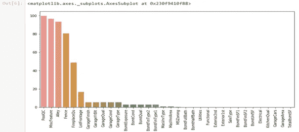

# 房价预测机器学习模型。

> 原文：<https://medium.com/analytics-vidhya/house-price-prediction-machine-learning-model-41cb1cf98914?source=collection_archive---------14----------------------->

# 每天卖出几千套房子。每个买家都会问自己一些问题，比如:这栋房子的实际价格是多少？我支付的价格公平吗？在这个项目中，提出了一个机器学习模型，根据与房子相关的数据(房子的大小、建造年份等)来预测房价。).在模型的开发和评估过程中，我展示了每个步骤所使用的代码及其输出。

注意:-这里我用的是 Jupyter 笔记本。你甚至可以使用 Google Colab 或任何其他 ID。我试图在所有的单元格中添加注释，这样你就可以很容易地理解它们。如果你还有任何疑问，你可以通过博客末尾的链接联系我。

我把博客分成了几个简单的步骤。为了让你们更清楚。

导入必要的库并加载数据。

***数据被正确扭曲，因此对其进行转换***

**可视化空值**

**特色工程**

填充缺失值

**加载库**

**建模:**

1.**梯度推进:**梯度推进是一种用于回归和分类问题的机器学习技术，它产生弱预测模型集合形式的预测模型，通常是决策树。它像其他 boosting 方法一样以分阶段的方式构建模型，并通过允许优化任意可微分损失函数来概括它们。

2.**XGBoost**:XGBoost**是一个优化的分布式梯度增强库，旨在高效**、**灵活和可移植**。**它在梯度推进框架下实现机器学习算法。**

**3.**套索**:套索回归是利用[收缩](https://www.statisticshowto.com/shrinkage-estimator/)的一种线性回归。收缩是指数据值向一个中心点收缩，就像[表示](https://www.statisticshowto.com/mean/)一样。套索程序鼓励简单、稀疏的模型。这种特殊类型的回归非常适合于显示高度多重共线性的模型，或者当您想要自动执行模型选择的某些部分时，如变量选择/参数消除。**

**4.**岭:**岭正则化是一种帮助克服机器学习模型中过拟合问题的技术。它被称为正则化，因为它有助于保持参数规则或正常。**

************

**该模型的得分为 0.12503**

****结论/结果****

**因此，我们可以说，XGBOOST 最适合这个数据集，精度为 0.107。梯度，套索，山脊模型在这个数据集上工作得非常好。为了得到更好的结果，将所有的模型集合在一起。**

****未来范围****

**将来，可以用一些更好的技术来升级模型，以获得更高和更好的精度。**