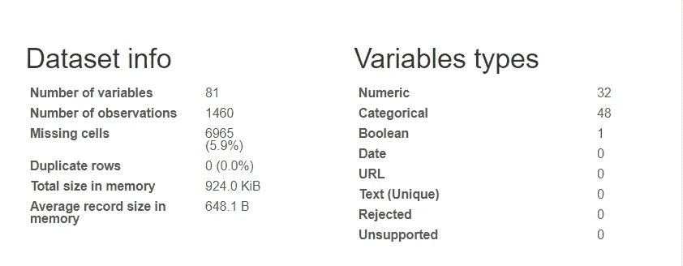
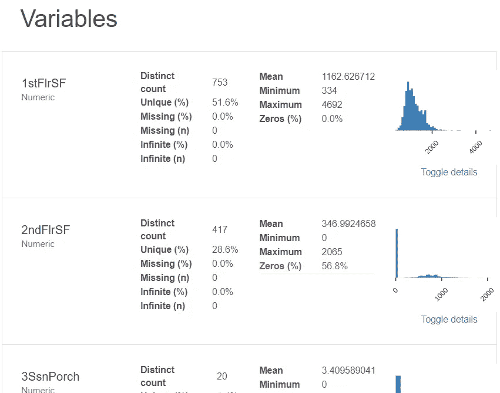
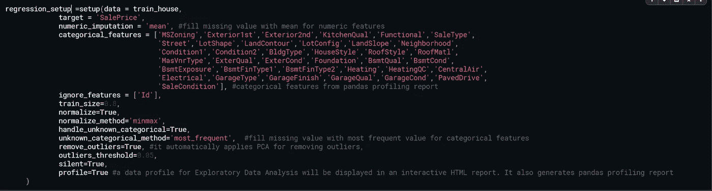
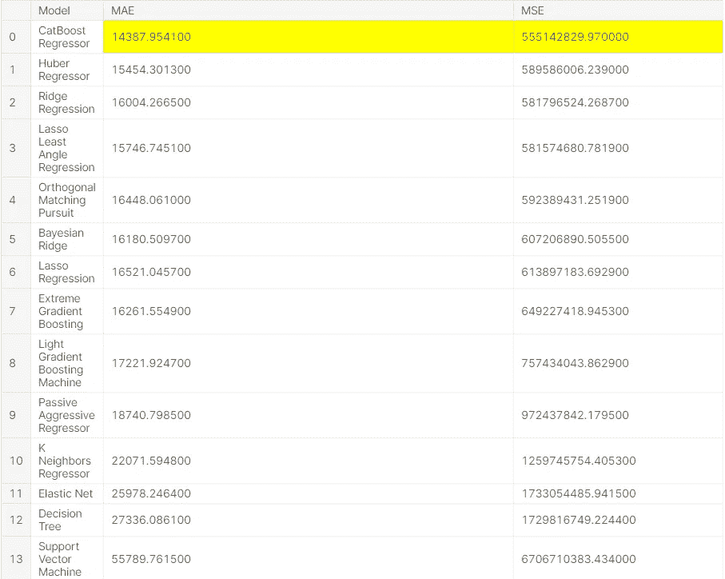
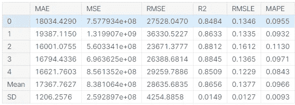

# 基于 PyCaret 的房价预测

> 原文：<https://medium.com/analytics-vidhya/house-price-prediction-using-pycaret-1c7d11d76570?source=collection_archive---------14----------------------->


# 👉🏻PyCaret 是什么？

Pycaret 是 python 中的一个开源机器学习库，用于在低代码环境中训练和部署有监督和无监督的机器学习模型。

在数据科学中，您的代码在工作流中呈指数级增长，但是使用 PyCaret，您可以在低代码环境中构建强大的解决方案。您可以使用 PyCaret 在几秒钟内构建和部署 ML 模型。

# 💻装置

```
!pip install pycaret# for data analysis
!pip install pandas_profiling
```

**导入库:**

```
import pandas as pd 
import pandas_profiling as pp
```

在这里，我们使用这个房价预测[数据集](https://www.kaggle.com/c/house-prices-advanced-regression-techniques/data?select=train.csv)来探索 PyCaret

```
train_house=pd.read_csv('../input/house-prices-advanced-regression-techniques/train.csv')test_house=pd.read_csv('../input/house-prices-advanced-regression-techniques/test.csv')
```

# 📊EDA 使用 Pandas 分析报告

Python 中的 pandas_profiling 库包括一个名为 ProfileReport()的方法，该方法生成关于输入数据帧的基本报告。

该报告包括以下内容:

*   数据帧概述，
*   定义数据帧的每个属性，
*   属性之间的相关性(皮尔逊相关性和斯皮尔曼相关性)，以及
*   数据帧的样本。

这一行代码将为您提供数据集的详细报告

```
pp.ProfileReport(train_house)
```



# 📉使用 PyCaret 回归

```
from pycaret.regression import *
```

在 pycaret 中执行任何其他函数之前，必须调用 setup()。它有两个强制参数:dataframe {类似数组的稀疏矩阵}和目标列的名称。所有其他参数都是可选的。

```
regression_setup= setup**(**data = train_house, target = ‘SalePrice’, html = **False)**
```



# 👉编写一行代码来比较模型

```
compare_models()
```

该函数训练模型库中所有可用的模型，并使用 Kfold 交叉验证对它们进行评分。输出打印一个评分网格，包括 MAE、MSE RMSE、R2、RMSLE 和 MAPE(跨折叠平均)，由折叠参数确定。该函数根据 sort 参数中定义的度量返回最佳模型。

*   **用于分类:**准确率、AUC、召回率、精度、F1、Kappa、MCC
*   **用于回归:** MAE，MSE，RMSE，R2，RMSLE，MAPE



# 模特✏️Create

在观察了 MAE、MSE RMSE、R2、RMSLE 和 MAPE 的所有模型后，下一步是为我们的数据集创建最佳模型。

```
lgbm = create_model(
    estimator='lightgbm',
    fold=5
)
```

该函数创建一个模型，并使用 K-fold 交叉验证对其进行评分。(默认值= 10 折)。输出打印一个得分网格，显示 MAE、MSE、RMSE、RMSLE、R2 和 MAPE。这个函数返回一个训练好的模型对象。



# 📝预言；预测；预告

该函数用于使用经过训练的估计器来预测新数据。

```
house_prediction =  predict_model(lgbm, data=test_house)
house_prediction.head()
```


# 📋为 Kaggle 提交生成 CSV

```
house_prediction.rename(columns={'Label':'SalePrice'}, inplace=True)
house_prediction[['Id','SalePrice']].to_csv('submission_house.csv', index=False)
```

模型调整，整体，堆叠，AutoML 功能也是可用的。

下面是 [Kaggle 代码链接](https://www.kaggle.com/hrbathia260698/house-prices-advanced-regression-techniques)

点击查看更多关于 PyCaret [的特性](https://pycaret.org/regression/#automl)

## 想分享点什么吗？我很想收到你的来信！Linkedin。