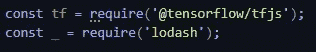

# JavaScript 机器学习在房租预测中的应用

> 原文：<https://medium.com/analytics-vidhya/house-rent-prediction-using-machine-learning-in-javascript-c62231a51e35?source=collection_archive---------7----------------------->


我们中的一些人可能会感到困惑，为什么机器学习使用 JavaScript 而不是 python。但是，当你进一步阅读这篇文章时，你会注意到，当我们拥有强大的数据结构和算法时，这与转换语言非常相似。机器学习和线性回归的主要概念仍然与预测最终答案相同。

首先理解机器学习的 JavaScript 概念:

这里用到的库有 NodeJs(对于任何一个 JavaScript 爱好者来说都很常见)，tensor flow js(tensor flow . py 的兄弟)，最后是 Lodash(计算目的，只是和 pandas、numpy 的一些常用概念)。如果我们愿意，我们还可以在任何编辑器中添加额外的 CSV 加载库。

其次是编辑，

啊！！最重要的东西(甚至比库或者概念还重要)。所以保持低期望值，我使用了 VS 代码，没有其他的。也可以使用 Atom，但是它没有预加载的终端和额外的支持。这只是一个声明，而不是两个世界一流的 JavaScript 代码编辑器的比较。

回到这个话题，这是 JavaScript 开发人员最忙碌和等待的一段时间，那就是安装库。所以正如我上面所说，我们只需要安装 3 个库。

注意:NodeJS 是必须的，应该预先安装在系统上。

㈠张量流 j

```
<script src="https://cdn.jsdelivr.net/npm/@tensorflow/tfjs@2.0.0/dist/tf.min.js"></script>
```

或者

```
npm install @tensorflow/tfjs
```

此外

```
npm install @tensorflow/tfjs-node
```

请不要忘记安装两个库(tfjs 和 tfjs-node)。我不希望任何其他人面临像我一样的问题(如果你有时间请阅读，否则就去 Lodash 安装:所以作为一名 JavaScript 开发人员，节点模块将是你整个旅程中的敌人。因此，如果没有 GPU，你已经面临一个 100 倍于⁰时间的 JavaScript 执行时间的安装周期。所以请在你有空的时候安装这些库)

㈡洛达什

```
npm i --save lodash
```

所以这是 40%的工作完成汪汪！！

虽然您可以访问下面的文档，但我不会深入了解这些库:

[tensorflowJS](https://www.tensorflow.org/js/):【https://www.tensorflow.org/js/】T2

https://lodash.com/

本预测中使用的数据集是与我在本项目中的合作伙伴一起手工收集的( [Krutarth Jaiswal](https://github.com/Krutarth08) )，因此请自担风险，否则请在互联网上搜索或使用我们的数据集(我们对此没有任何问题)。数据集可以在我的 github repo 中找到或下载(文章末尾的链接，如果你倒下了，请鼓掌，啊，只是开个玩笑)。

现在你已经安装了数据集和库，让我们开始一些编码，并预测一些测试费用。

注意:请遵循文件和代码的步骤。如果遇到任何问题，请使用我的回购作为参考(你知道链接在哪里？？，在文章末尾)

所以在这个项目中基本上有 3 个主要文件。

index.js(入口点)

linear-regression.js(算法或黑盒(软件工程的人肯定会喜欢它) )

load-csv.js(加载专门用于 js 目的的 csv 文件)

从加载 csv 开始，它是一个 JavaScript 文件，基本上将整个 CSV 文件加载到您的 JavaScript 程序中，该程序可以像 python 一样进行操作和保存。在开始主要的事情之前，load-csv.js 很容易在互联网上找到。因此，我们将主要关注 index.js 和 linear-regression.js。如果在我的 github repo 中的 load-csv.js 中遇到任何问题，您可以注释掉错误，我将在短时间内回复您。

**index.js**


图 1(加载库)

上面 3 行代码代表了 index.js 文件中包含的库，现在我们将创建要测试的变量和输入


图 2(创建变量并与其他两个文件连接)

所以在上面的代码行中，我们创建了到另外两个文件或库的链接。如果您注意到，在这些行中，我们还包含了 CSV 加载内容，正如前面提到的，这会将我们带到数据集。

这里要注意的另一件重要事情是预测点，因为我们预测价格或租金，所以我们可以直接包括数据集的定价列。为了预测，我们使用了经度和纬度，它们基本上是 access pint，帮助我们在线性回归中预测准确或接近的位置，并告诉它的价格。我们只包含了 2 个属性，你还可以使用其他属性，只是不要弄乱符号和语法。


图 3(指定事物)

这是我们决定线性回归算法学习和预测模型的学习、时期(批量)和迭代的地方。


图 4(图表)

现在这一步全靠你了。这些步骤为我们制作或绘制了一个图表，它显示了我们正在处理的量。我们也可以打印出它的 R2 值。


图 5(实际图表)

输出如下所示。

现在到了 index.js 文件的最后一步，这只是预测点，它基于提供给线性回归算法的示例或经度和纬度点。


图 6(预测)

这都是关于 index.js 的，上面截图第一行的其余内容基本上是 Lodash 如何帮助我们在 JavaScript 中创建一个变量，在执行后可以以任何方式使用。

这构成了我们项目的 10%左右。( 40 + 10 = 50 )

现在还有 50%

**线性回归. js**



图 7(包括图书馆)

所以这是同样的方式，包括机器学习的图书馆。


图 8(为线性回归创建类和构造函数)

注意:请检查原始代码的缩进和括号关闭。原始代码将在我的回购的链接在最后提到。

现在我们在这里给构造函数预定义的值和标签和特征只是我们在 index.js 中提供的经度，纬度和价格，关于梯度下降函数，对于新手来说，**梯度下降**是一种一阶迭代优化算法，用于寻找可微函数的局部最小值。为了使用**梯度下降**找到函数的局部最小值，我们采取与当前点的函数的**梯度**(或近似**梯度**)成比例的步骤。然后我们创建矩阵，它将进一步以张量的形式出现，可以预测图上的线。


图 9(训练方法)

接下来是最重要的部分，即训练我们的数据集，基本上是将数据集划分为训练和测试数据集。这里我们可以看到，我们使用了大量的 Lodash 函数来创建和操作张量形式的矩阵。我们还包括梯度下降，MSE 和学习率更新方法。对于不了解训练数据集的人来说，这是最宝贵的数据集，它被建模，然后使用测试数据进行预测。


图 10(数据规范化和标准化)

因此，以上两种方法用于操作数据集，以便在我们预测或测试数据时不会出现错误。上面这行代码要做的是，它将消除不需要的数据集和行，这些数据集和行会进一步产生歧义。


图 11(计算误差并相应更新学习率)

这些是线性回归文件中的最后步骤，有助于解决错误百分比并更新我们在 index.js 文件中手动提供的学习率。这将导致优化的输出和结果。


图 12(测试数据集)

现在是另一个重要的步骤，即操纵测试数据集，并将其带到训练数据集的最佳水平，这可以帮助我们预测租金或价格。测试特性将在同一个数据集上工作，这个数据集是我们提供给它的，我们在 index.js 文件中对它进行了拆分


图 13(预测)

哦，是的，每个人都在等着预测我们提供的值并得到输出。正如我们在 index.js 文件中看到的，预测函数基本上就是这个被调用的函数。

现在这占了我们程序的 50 %左右。

等等什么完成了这个项目。是的，你是对的，这就是在 JavaScript 中使用 TensorFlow 预测租金或定价的全部内容。

现在问题来了，如何运行程序程序，这很简单，只要进入 index.js 文件，改变你的经度和纬度值，你甚至可以添加一些其他属性，如果你想，这一切都取决于你。

在 VS 代码中打开一个终端或我们最重视的 start run 终端，并编写以下命令:


图 14

在您放置所有文件的文件夹中键入此内容，确保节点模块文件夹也包含在此文件夹中，否则将导致错误。

就这样结束了。

是的，是的，我知道，下面是我的回购和我的 github 个人资料的链接。

Github 简介:[https://github.com/vrushit](https://github.com/vrushit)

Github 回购:【https://github.com/vrushit/House-Rent-Prediction 

请评论任何面临的错误，我一定会回答他们。

谢谢，如果你喜欢，请鼓掌并开始我的回购。