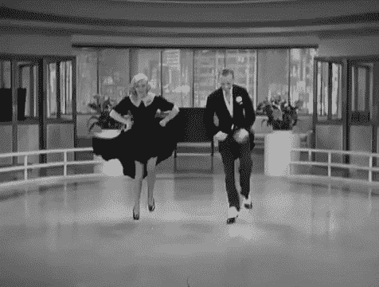
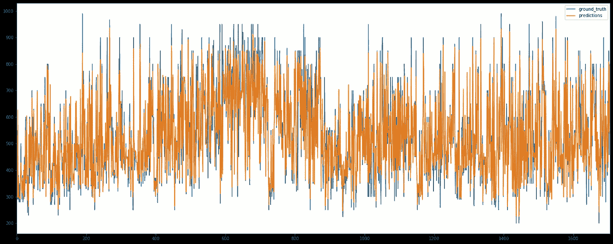
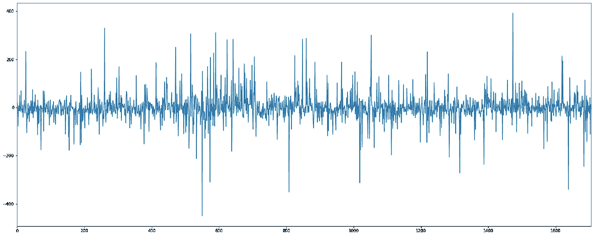
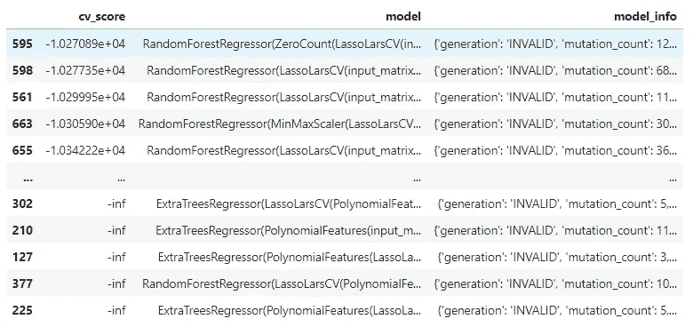
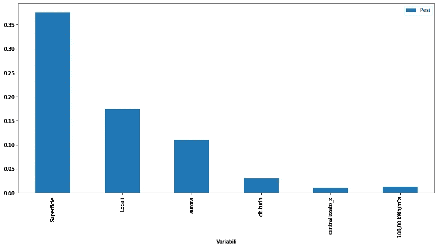
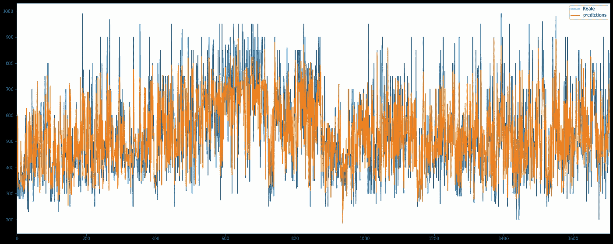
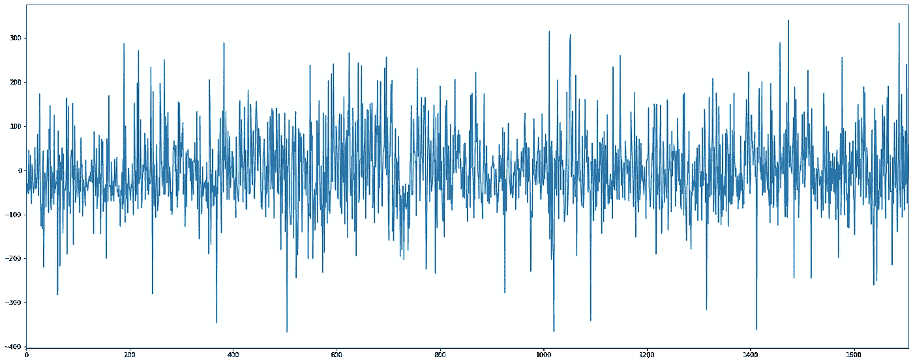

# 房屋租赁——数据科学方法第 2 部分:用 TPOT 和 Auto_ml 训练回归模型

> 原文：<https://medium.com/analytics-vidhya/house-rental-the-data-science-way-part-2-train-a-regression-model-tpot-and-auto-ml-9cdb5cb4b1b4?source=collection_archive---------14----------------------->

在前面的[章节](/@wonka929/house-rental-the-data-science-way-part-1-scrape-it-all-with-python-and-beautifulsoup-94d9d1222e32)中，我们描述了如何从一个著名的意大利网站收集来自全国各地许多中介机构的房屋销售和租赁公告，以便创建一个数据集，我们可以在此基础上训练我们的价格回归模型。在这一章中，我们将会这样做。开始吧！

# 烹饪需要一个锅…为什么不是一个锅？


什么是 TPOT？来自创作者的[网站](https://epistasislab.github.io/tpot/):

> 把 TPOT 当成你的**数据科学助理**。TPOT 是一个 Python 自动化机器学习工具，它使用遗传编程优化机器学习管道。

在实践中，TPOT 是一种机器学习专家，它使用 Scikit-learn 的 python 库来搜索最佳算法，并通过使用遗传编程来优化超参数。如果你想了解更多，网站上有很多文档。

就我们的目的而言，我们希望获得了解房屋租赁价格的结果，而不是为我们的任务建立一个如何选择最佳算法的指南，我们必须保持简单:将所有成分放入锅中，然后看看神奇的事情发生了。

# 数据集清理

呆在厨房比喻，厨师在把所有东西放在烤架上之前，必须清洗和切割食材。

了解数据集中是否有问题的最佳方式是一个简单的 pandas 函数:

```
dataset['column_name'].unique
```

熊猫。Series.unique 函数返回 Series 对象的唯一值，因此可以查看列中是否存储了与该列的性质不匹配的值。

原来，在应该由整数组成的列“Prezzo”、“Locali”和“Superficie”(英文为“Price”、“Rooms”和“Surfaces”)中，我们有不一致的值。例如，在“Prezzo”列中有一些字符串表示:“*价格待商定*”。在“Locali”中，我们可以找到一个“ *C* ”值。

为了摆脱所有这些问题，我们需要做点手脚，发布一些公告:

```
import pandas as pd#the dataset we saved in the previous chapter
dataset = pd.read_csv('dataset.csv', sep=";")#Drop some trash
dataset.drop(columns='Unnamed: 0', inplace=True)
dataset.replace('5+', 6, inplace = True)
dataset.replace('3+', 4, inplace = True)
dataset = dataset[dataset.Prezzo != 'Affitto\n                                                                                    750/mese\n                                        ']
dataset = dataset[dataset.Prezzo != 'Affitto\n                                                                                    500/mese\n                                        ']
dataset = dataset[dataset.Locali != 'C']
dataset = dataset[dataset.Prezzo != 'prezzo su richiesta']
dataset = dataset[dataset.Superficie != '250, terreno di proprietà 2.000']
dataset = dataset[dataset.Superficie != '100, terreno di proprietà 200']
dataset = dataset[dataset.Superficie != '160, terreno di proprietà 400']
dataset = dataset[dataset.Superficie != '165, terreno di proprietà 450']
dataset = dataset[dataset.Superficie != '105, terreno di proprietà 100']#Get rid of NaN
dataset.fillna(value=0, inplace=True)
```

好了，现在我们的数据集是干净的。耶！


现在，TPOT 需要两样东西:一个包含要素值的数据集和一个包含目标的列表，因此它可以根据数据训练模型以获得目标。在我们的例子中，目标是租赁价格，数据集中的所有其他信息都是我们的特征。将它们分开，并在需要的地方将它们转换为 int:

```
dataset['Prezzo'] = dataset['Prezzo'].astype(int)
dataset['Superficie'] = dataset['Superficie'].astype(int)
dataset['Locali'] = dataset['Locali'].astype(int)
dataset.drop(columns= ['Spese condominio', 'Spese riscaldamento'], inplace=True)
```

专注于流程。

现在是文章中唯一真正概念性的部分:**分类特征**

> 分类变量(有时称为名义变量)是指有两个或更多类别的变量，但这些类别没有内在的排序。例如，性别是具有两个类别(男性和女性)的分类变量，并且这些类别没有内在的顺序。头发颜色也是一个分类变量，有许多种类(金发、棕色、深色、红色等。)同样，也没有一个商定的方法来将这些从最高到最低排序。纯分类变量只是允许你分配类别，但你不能清楚地排序变量。如果变量有明确的顺序，那么这个变量就是一个序数变量。
> 
> [https://stats . idre . UCLA . edu/other/mult-pkg/what stat/what-is-the-difference-between-categorial-ordinal-and-numerical-variables/](https://stats.idre.ucla.edu/other/mult-pkg/whatstat/what-is-the-difference-between-categorical-ordinal-and-numerical-variables/)

简而言之:像房屋所在区域这样的特征不是一个数字值，甚至不可能给一个区域分配比另一个区域更高的值。房东想要提供的租赁合同也是如此。这些特征必须作为虚拟/指标变量进行管理，这可以通过熊猫来实现。这将大大增加我们问题的特征数量，从而增加数据框架的维度，但这是我们处理分类特征的唯一方法。

```
dataset = dataset.merge(pd.get_dummies(dataset['Zona']), left_index=True, right_index=True)
dataset = dataset.merge(pd.get_dummies(dataset['Piano']), left_index=True, right_index=True)
dataset = dataset.merge(pd.get_dummies(dataset['Contratto']), left_index=True, right_index=True)
dataset = dataset.merge(pd.get_dummies(dataset['Tipologia']), left_index=True, right_index=True)
dataset = dataset.merge(pd.get_dummies(dataset['Tipo proprietà']), left_index=True, right_index=True)
dataset = dataset.merge(pd.get_dummies(dataset['Anno di costruzione']), left_index=True, right_index=True)
dataset = dataset.merge(pd.get_dummies(dataset['Stato']), left_index=True, right_index=True)
dataset = dataset.merge(pd.get_dummies(dataset['Riscaldamento']), left_index=True, right_index=True)
dataset = dataset.merge(pd.get_dummies(dataset['Climatizzatore']), left_index=True, right_index=True)
dataset = dataset.merge(pd.get_dummies(dataset['Classe energetica']), left_index=True, right_index=True)dataset.drop(columns='Zona', inplace=True)
dataset.drop(columns='Piano_x', inplace=True)
dataset.drop(columns='Contratto', inplace=True)
dataset.drop(columns='Tipologia', inplace=True)
dataset.drop(columns='Tipo proprietà', inplace=True)
dataset.drop(columns='Anno di costruzione', inplace=True)
dataset.drop(columns='Stato', inplace=True)
dataset.drop(columns='Riscaldamento', inplace=True)
dataset.drop(columns='Climatizzatore', inplace=True)
dataset.drop(columns='Classe energetica', inplace=True)dataset.fillna(0,inplace=True)
```

在这里，我们创建了假人，并将其合并到我们的数据集。然后，我们去掉了仍然存在的分类列，为了确保安全，填充了所有的 NaN(不应该有任何 NaN，但是你永远不知道)。

现在，如果需要的话，只需过滤器宣布(我的意思是，通常巨大或非常昂贵的房子与普通人的房子有不同的市场模式，所以我决定只选择那些月租金低于 1000€的房子)

```
dataset = dataset[dataset['Prezzo']<1000]
target = dataset['Prezzo']
data = dataset.drop(columns= ['Prezzo'])
```

…目标和数据分开…

```
from tpot import TPOTRegressor
from sklearn.model_selection import train_test_splitX_train, X_test, y_train, y_test = train_test_split(data.values, target.values, train_size=0.75, test_size=0.25)tpot = TPOTRegressor(generations=50, population_size=20, verbosity=2, max_eval_time_mins=2, n_jobs=4)
tpot.fit(X_train, y_train)print(tpot.score(X_test, y_test))
tpot.export('tpot_torino_pipeline.py')
```

这里开始优化过程。

```
Optimization Progress: 26%
264/1020 [13:49<2:36:11, 12.40s/pipeline]Generation 1 - Current best internal CV score: -11481.139384411077
Generation 2 - Current best internal CV score: -11116.07477241672
Generation 3 - Current best internal CV score: -11116.07477241672
Generation 4 - Current best internal CV score: -10869.853396609586
Generation 5 - Current best internal CV score: -10869.853396609586
Generation 6 - Current best internal CV score: -10869.853396609586
Generation 7 - Current best internal CV score: -10869.853396609586
Generation 8 - Current best internal CV score: -10869.853396609586
Generation 9 - Current best internal CV score: -10686.280416803686
Generation 10 - Current best internal CV score: -10629.285228481005
Generation 11 - Current best internal CV score: -10540.157544616217
Generation 12 - Current best internal CV score: -10540.157544616217
...
```

这将需要一段时间，取决于您的计算机的具体情况。所以，准备一杯**真正的**茶，在客厅里跳一会儿舞。



过程完成后，保存模型并查看结果。

```
import picklewith open('tpot_faster.pickle','wb') as xx:
    pickle.dump(tpot.fitted_pipeline_,xx)with open('tpot_faster.pickle', 'rb') as xx:
    model = pickle.load(xx)
```

# 结果

理解我们的模型是否能够解释数据的最令人印象深刻的方法之一是对所有数据集进行预测，然后用价格的基本事实评估结果。

```
import matplotlib.pyplot as plotpredictions = []
for item in data.values:
    prediction = tpot.predict([item])
    predictions.append(prediction)flat_list = []
for sublist in predictions:
    for item in sublist:
        flat_list.append(item)

ground_truth = target.valuesconfronto = pd.DataFrame()
confronto['ground_truth'] = ground_truth
confronto['predictions'] = flat_list
plt = confronto.plot(figsize=(25,10))
fig = plt.get_figure()
fig.savefig("comparison.svg")
```

嗯…还不错！预测和现实有着几乎相同的趋势！那就好！



```
from scipy.stats.stats import pearsonrpearsonr(confronto['ground_truth'].values,confronto['predictions'].values)
```

皮尔森给了我们一个 0.944 的相关值。那很好。检查误差图的外观:

```
diff = confronto['ground_truth']-confronto['predictions']
diff.plot(figsize=(25,10))
```



那也行！

# 深入挖掘

```
my_dict = list(tpot.evaluated_individuals_.items())model_scores = pd.DataFrame()
for model in my_dict:
    model_name = model[0]
    model_info = model[1]
    cv_score = model[1].get('internal_cv_score')  # Pull out cv_score as a column (i.e., sortable)
    model_scores = model_scores.append({'model': model_name,
                                        'cv_score': cv_score,
                                        'model_info': model_info,},
                                       ignore_index=True)model_scores = model_scores.sort_values('cv_score', ascending=False)
print(model_scores)
```



所以，赢家是一个有很多其他参数的 RandomForestRegressor。
好吧。

```
most_valuable_features=pd.DataFrame(columns=['Variables', 'Pesi'])
most_valuable_features['Variables'] = data.columns.astype(str)
most_valuable_features['weights'] = exctracted_best_model.feature_importances_[2:228]
most_valuable_features.set_index('Variables', inplace=True)
most_valuable_features[most_valuable_features['weight']>0.01].plot(kind='bar', figsize=(15,7))
```



特性的重要性有点棘手。每种算法都使用自己的方法来训练模型。例如，在本例中，我输入了一个包含 226 个要素的数据集，要素重要性给出了一个包含 229 个项目的输出。听起来很奇怪…但是就是这样，当你使用暴力时，你可能会完成一个需要一些其他输入特性的算法。我们可以在另一篇文章中讨论它。

现在…回到我们最初的目的。我是不是花钱太多了？创建一个“我的房子”列表，然后交给模特

```
my_house =[[25,2,0,0,0,0,0,0,0,1,0,0,0,0,0,0,0,0,0,0,0,0,0,0,0,0,0,0,0,0,0,0,0,0,0,0,0,0,0,0,0,0,0,0,0,0,0,0,1,0,0,0,0,0,0,0,0,0,0,0,0,1,0,0,0,1,0,0,0,1,0,0,0,0,0,0,0,0,0,0,0,0,0,0,0,0,0,0,0,0,0,0,0,0,0,0,0,0,0,0,1,0,0,0,0,0,0,0,0,0,0,0,0,0,0,0,0,0,0,0,0,0,0,0,0,0,0,0,0,0,0,0,0,0,0,0,0,0,0,0,0,0,0,0,0,0,0,0,0,0,0,0,0,0,0,0,0,0,0,0,0,0,0,0,0,0,0,0,0,0,0,0,0,0,0,0,0,0,0,0,0,0,0,0,0,0,0,0,0,0,0,1,0,0,0,0,1,0,0,1,0,0,0,0,0,0,0,0,0,0,0,0,0,0,0,1,0,0,0,0,0,0,0,0,0,0]]tpot.predict(my_house)*-- array([382.5005])*
```

所以我的住宿费是每月 382.5€。
抱歉，我会保守秘密:)

# 另一个锅:auto_ml

[Auto_ml](https://github.com/ClimbsRocks/auto_ml) 让一切变得更简单。作者将其描述为:

> 面向生产和分析的自动化机器学习

确实很简洁。

好吧，看一下代码。

```
from sklearn.model_selection import train_test_split
from auto_ml import Predictor
from auto_ml.utils import get_boston_dataset
from auto_ml.utils_models import load_ml_model
from sklearn.model_selection import train_test_split
import pandas as pddataset = pd.read_csv('dataset.csv', sep=";")
dataset.drop(columns='Unnamed: 0', inplace=True)
dataset.fillna(0, inplace=True)dataset['Prezzo'] = dataset['Prezzo'].astype(int)
dataset['Locali'] = dataset['Locali'].astype(int)
dataset = dataset[dataset['Price']<1000]
dati = dataset.drop(columns= ['Prezzo','Spese condominio', 'Spese riscaldamento'])column_descriptions = {
    'Price': 'output',
    'Zona':'categorical',
    'Piano':'categorical',
    'Contratto':'categorical',
    'Tipologia':'categorical',
    'Tipo proprietà':'categorical',
    'Anno di costruzione':'categorical',
    'Stato':'categorical',
    'Riscaldamento':'categorical',
    'Climatizzatore':'categorical',
    'Classe energetica':'categorical'
}df_train, df_test = train_test_split(dati,train_size=0.75, test_size=0.25)ml_predictor = Predictor(type_of_estimator='regressor', column_descriptions=column_descriptions)ml_predictor.train(df_train)# Score the model on test data
test_score = ml_predictor.score(df_test, df_test.Price)
test_modello = ml_predictor.save()
trained_model = load_ml_model(test_modello)predictions = trained_model.predict(df_test)
print(predictions)
```

Auto_ml 自动处理分类特征。你总是可以创建虚拟对象，但是使用 auto_ml 你也可以只在*列描述*中写列名，比如说它是分类的，它会处理所有的事情。对于目标也是一样，只需将列名标记为*‘output’*就可以了。对于它正在做的事情，它也有一个很好的输出日志。

AAAA…**训练只花了 1 秒。**真是恶心的家伙！

```
 Total training time:
0:00:01
```


现在，再一次，找出更多关于表演的东西。
它不像 TPOT 那样给我们那么多输出去应付，所以直接走就行了。

```
valutazione = pd.DataFrame()
ground_truth = dati['Price'].values
predictions = trained_model.predict(dati)
valutazione['Reale'] = ground_truth
valutazione['predictions'] = predictionsimport matplotlib.pyplot as plot
plt = valutazione.plot(figsize=(25,10))
fig = plt.get_figure()
fig.savefig("risultato_automl.svg")
```



哇！1 秒钟的训练是非常准确的！

```
from scipy.stats.stats import pearsonrpearsonr(valutazione['Reale'].values,valutazione['predictions'].values)
```

皮尔森说:0.860
好吧，这比 TPOT 低，但是…还是印象深刻！

```
diff = valutazione['Reale']-valutazione['predictions']
print(diff.std())
diff.plot(figsize=(25,10))
```



地面真实和预测之间的差异是振荡更多，但它是确定的。

结果跟*我的 _ 房子:*

```
trained_model.predict(my_house)*-- 348.6003*
```

348€/月。足够接近 TPOT 模型结果。

回到 auto_ml 网站…

> 自动化整个机器学习过程，使其非常容易用于分析，并在生产中获得实时预测。

哦，是的，宝贝！确实如此！

所以，就这样了！厨师希望你喜欢这顿饭！
再见，伙计们！；D

*本文是教程的第二部分，你可以在这个链接找到:* [*https://medium . com/@ wonka 929/house-rental-the-data-science-way-part-1-scrape-it-all-with-python-and-beautiful soup-94d 9d 1222 e 32*](/@wonka929/house-rental-the-data-science-way-part-1-scrape-it-all-with-python-and-beautifulsoup-94d9d1222e32)