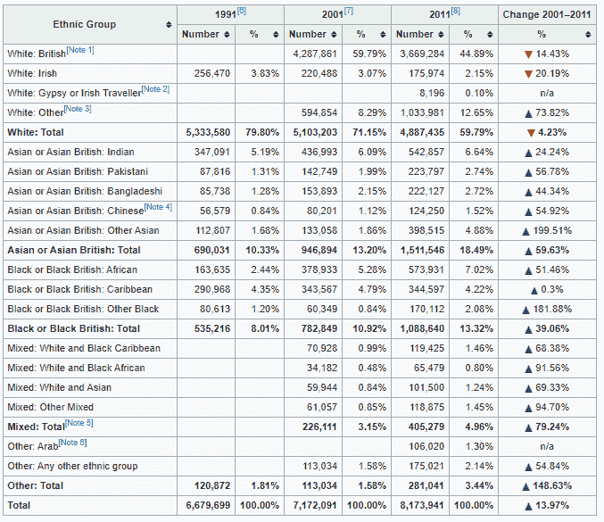
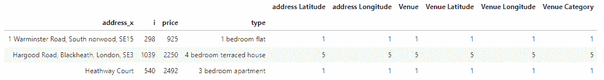

# 伦敦住房租金价格和场地数据分析——一种面向购房者的地理聚类方法

> 原文：<https://medium.com/analytics-vidhya/housing-rent-prices-and-venues-data-analysis-of-london-a-geographical-clustering-approach-for-3abbf999b02?source=collection_archive---------9----------------------->

杰米·韦芬在 [Unsplash](https://unsplash.com?utm_source=medium&utm_medium=referral) 上拍摄的照片

# 了解环境——伦敦人口 2019

# 9,176,530

对伦敦[人口的最新官方估计来自国家统计局。根据他们的数据，2016 年大伦敦地区的人口预计为 8787892 人。2019 年的地铁人口估计多达 918 万。](http://worldpopulationreview.com/world-cities/london-population/)

英国的[人口普查每十年进行一次，最近一次于 2011 年完成，这意味着我们即将进行下一次人口数据收集。](http://data.london.gov.uk/census)

伦敦的人口使其成为英国最大的城市。英国第二大城市——伯明翰[——人口 110 万，仅为首都人口的 11.98%。伦敦也是欧盟最大的城市，是都柏林的两倍，罗马的三倍。](http://worldpopulationreview.com/world-cities/birmingham-population/)

它是欧洲第三大城市，排在伊斯坦堡(1480 万人)和 T21(1030 万人)之后，也是世界上第 27 大城市。

# 种族划分

作为一个城市，伦敦比英国其他地方更加多样化。根据 2011 年的人口普查，在英格兰和威尔士，86%的人口是白人，但在伦敦，这一数字降至 59.79%。当离开市中心时，伦敦人口中的白人比例会增加。

理解人口种族的多样性如何改变我们分析住房市场的方式是很重要的。人们有不同的需求和优先事项需要满足，当需要租房时，他们更有可能在步行距离内有特定场地的地区租房。

# 介绍和业务问题演示

我认为公寓不符合顾客需求有三个主要原因:

*   *公寓看起来又旧又破*
*   *附近没有预期的商品*
*   *价格对那套公寓来说太高了，或者超出了预算*

我这项研究的目标是有一个系统的方法来分析 RightMove.co.uk 发布的招聘信息，从而绘制出该城市最佳机会的地图。如果你正在寻找一个新的单位，你喜欢你的实际居住区，这个项目可以根据你的喜好为你提供一份市场上所有最好的房产的清单。

对于这个项目，我将创建一个简单的软件，它可以抓取 RightMove 以获得可供出租的最新公寓列表，使用 Foursquare 收集和分析每个可供出租的房产附近的主要场地，并对它们进行聚类，以便在 500 米的半径内根据场地相似性将住房市场分为 20 个组。

# 方法学

让我们从数据收集过程开始。

为此，我决定花时间使用 Beautiful Soup 4 开发一个 web 抓取应用程序，但是后来我在 GitHub 上发现了一个由 toby-p 提供并可供下载的资源库，它提供了一种简单的抓取 Rightmove 的方法！

该脚本收集以下信息:

*   价格
*   类型
*   地址
*   统一资源定位器
*   代理 _url
*   邮政编码
*   数量 _ 卧室
*   搜索日期

数据集将如下所示:

地址格式为*“街道，城市，邮政编码”*，是一个非结构化字段，但出于我们的目的，我们可以保持原样。相反，邮政编码呈现一种*“有限”*格式，因为我们只有前两位/三位数字。这还不足以准确收集公寓周围场馆的有意义的数据。

为了解决这个问题，我将使用 OpenCage Geocoder API 从邮政地址查找坐标。这是一个非结构化字段变得有用的情况。

为了将每个租金报价与一个地区相关联，我将把数据表与第二个数据集连接起来，该数据集有两列:

*   地区名称
*   邮政编码

这个数据集是通过抓取维基百科表([此处可用](https://en.wikipedia.org/wiki/London_postal_district))创建的，其中包含了我进行分析所需的数据。

当数据被收集并合并到一个数据框架中时，我使用 K-Means 算法对它们进行聚类。为了可视化伦敦的地理细节和优惠分布，我使用 fluous Python 库绘制了两张有意义的地图:

*   聚类图:该图显示了聚类的分布，用颜色来区分每个聚类。
*   供暖地图:该地图显示了报价较高的区域。

为了更好地了解市场，重要的是绘制条形图，以方便地确定一室公寓、一室公寓、二室公寓、三室公寓和四室公寓的平均价格。

其中一个目标是量化位置(区域)对每个公寓类别的平均价格的影响程度，并确定最小化每月费用地理影响的卧室数量。

最后，我结束了这个项目，要求用户输入以下数据:

*   *你的地址*:这个输入用于分析你居住的邻居，并使用这个信息找到你所属的集群。
*   *您正在寻找的卧室数量*:该输入用于过滤您所属的集群的结果。
*   *最高月费(预算)*

此分析的输出是一个数据框，其中包含基于您的偏好的过滤结果列表。

# 结果

不出所料，一套公寓的价格不能只通过周围的场地来预测，但可以有效地过滤市场，以帮助购房者找到最好的房产。尽管如此，*仍有可能根据公寓*(卧室数量、浴室数量等)*、公寓所属区域以及公寓*附近的一些主要场馆的特点开发一个定价模型。关键因素的一个例子是声誉良好的超市、公共交通站、学校或大学、医院。根据最终用户的偏好，价格和这些类别之间的相关性很低，但很重要。

这个项目的主要目标是为每个人提供一个工具来分析住房市场，并确定最适合他们个人需求的报价。

# 数据探索

首先，我通过不同的查询执行可视化频率分布的数据探索，以开始了解市场。

下面的条形图显示了按卧室数量列出的报价数量。

正如我们所见，市场上最常见的产品是 2 卧室公寓，其次是 1 卧室公寓。

伦敦哪个区的优惠最多？

下面的条形图显示了按邮政编码排列的报价分布情况。

# 数据操作

为了使结果更容易阅读和解释，我决定将每个邮政编码与其相对的地区名称结合起来。这一步对于最终用户获得满意的结果至关重要。

为了定义每个地区的位置，我将使用 OpenCageData 确定每个地区中心的纬度和经度。

这个 API 允许基于纬度和经度或地址搜索和获取地理信息。我将使用每个地区的邮政编码来扩展我们的数据框架。

拥有每个地区的纬度和经度有助于未来更深入的分析，例如离市中心的距离，这是一个可能影响公寓价格的独立变量。

然而，为了这个项目的目的，更重要的是扩展属性的数据库，将每个公寓与其地理坐标合并。

# 使用 OpenCage 扩展每个单元的记录

我按照同样的过程将地理信息扩展到每个公寓。OpenCage 数据允许使用地址作为查询来收集地理规格。

为了获得准确的数据，最好收集以下详细信息:

*   公寓的纬度
*   公寓的经度
*   县
*   完整的邮编
*   州立区
*   郊区

完成这一重要步骤后，数据集如下所示:

为了确保每个地址都与正确的一系列新信息合并，我使用“I”列作为“标志”。

这个解决方案允许我再次检查以前的索引是否与新索引匹配，这意味着我删除了缺少关键数据的记录。

列说明:

*   地区名称
*   纬度*和*经度:纬度和“区名”的 lng
*   Address_y:我们将删除的原始地址的副本。我用它来确保数据帧被正确合并
*   纬度 _a *和*经度 _a:平台的纬度和 lng。
*   县
*   邮政编码 _ 完整:原始邮政编码的扩展
*   州 _ 区
*   郊区

# four square API——找到每个公寓附近最常见的场地

这一步对于聚类市场训练 K 均值模型至关重要。

我们将使用 Foursquare API 收集 Rightmove 上发布的每个公寓周围 500 米半径范围内的前 100 个最常见的场地。

# 地址和地点

下表显示了为数据集中的前三条记录收集的场馆数量:

在这种情况下，前 3 个记录对流程没有特别的意义，但是，相信我，一些地址附近有大量的场馆。

需要注意的是，我们现在使用的是分类变量。分类变量是一种变量，它可以取有限的、通常是固定数量的可能值中的一个，根据某些定性属性将每个个体或其他观察单位分配给特定的组或名义类别。

新的数据集包含与每个公寓相关的每个场馆类别的记录(这意味着在 439 个唯一的场馆类别中，每行仅包含“1”)。因此，表格的形状是 44.637 行和 443 列。

为了使分析更快，我将只考虑前 20 个最常见的场所，这些将用于开发聚类分析。

最后，我获得了一个可用于我的目的的数据集！

# 使用 K-均值聚类

现在，我已经掌握了按地理相似性细分市场所需的所有信息。是时候把它分成簇了。

我要用 K-Means 算法。

K-Means 算法是最流行的无监督机器学习算法之一。通常，无监督算法使用未标记的数据集进行推理。这种无监督机器学习技术的目标是找到数据点中的相似性，并将相似的数据点分组在一起。K-Means 聚类算法旨在将 n 个观察值划分为 K 个聚类，其中每个观察值属于具有最近均值的聚类，作为该聚类的原型。

一种确定最佳 k 的方法被称为“肘法”。

*“肘形”方法通过用一系列 k 值拟合模型，帮助数据科学家选择最佳聚类数。如果折线图类似于手臂，则“肘形”(曲线上的拐点)很好地表明底层模型最适合该点。*

不幸的是，肘部不是绝对清晰的，为“k”选择一个较高的值会对项目的目标产生反作用。经过几次测试后，我决定使用 k = 20，因为每个分类中的报价数量看起来更均匀地分布在模型中，尽管一些分类包含少量的属性。

# 伦敦集群分布图

为了显示没有通过密度或地理接近度来识别的集群，我绘制了一张市场地图。每种颜色代表一个特定的集群，每个点代表一个可用的属性及其地理位置。

# 住房市场——供暖图

绘制加热图以确定提供较高数量报价的区域是很有意义的。由于市场的高度活跃，这种特殊的观点每天都在变化。

具有历史记录时间序列的数据集可能有助于识别是否存在任何季节性现象或活动高峰。

另一个有趣的分析是调查住房市场和英国退出欧盟公告之间的关系。英国退出欧盟是否加速了房地产市场的周期，促进了大量短期租赁协议，以应对外国公民在该国未来的更大不确定性？

在我看来，看着供暖图，伦敦东区有些地方非常冷。这可能是由于 Rightmove 用于向特定用户显示优惠的算法。事实上，查询网站寻找伦敦的报价(没有任何其他附加说明)，它显示有 30，805 个结果。

实际上，每页有 25 个报价发布到用户可读的 42 页中，这意味着总共有 1050 个可用报价(与我在本报告中分析的报价数量相同)。

# 按地区划分的一居室公寓的平均价格

在对市场进行简要分析后，我相信对读者来说，对该地区 5 种最常见的公寓类型的平均价格有一个总体的了解是有帮助的。

伦敦一室公寓价格的标准差为 378，1329，平均价格为 1.233，09。我计算变异系数来比较公寓的类型和价格。

变异系数(CV)，也称为相对标准偏差(RSD)，是概率分布或频率分布离差的标准化度量。它通常用百分比表示，定义为标准偏差与平均值(或其绝对值)的比值。

在这种情况下，变异系数等于 0，306653。

# 按地区划分的一居室公寓的平均价格

伦敦一居室公寓价格的标准差为 561，9852 英镑，平均价格为 1.468，28 英镑。

变异系数等于 0，382750

# 按地区划分的两居室公寓的平均价格

伦敦一套两居室公寓价格的标准差为 949，9799 英镑，平均价格为 2.050，92 英镑。

变异系数等于 0.463196。

# 按地区划分的三居室公寓的平均价格

伦敦一套三居室公寓价格的标准差为 2.4491497，平均价格为 2.89265。

变异系数等于 0.846678。

# 按地区划分的 4 居室公寓的平均价格

伦敦一套 4 居室公寓价格的标准差为 5.1765294，均价为 4.89159。

变异系数等于 1，058249。

# 价格随卧室数量的变化趋势

在上面的图表中，我想强调的是价格的变化超过了卧室数量的比例。这意味着，对于小公寓和单间公寓，地区对月租金的影响较弱。当然，这只是对这一现象的简要分析，因为正如我们之前所显示的，公寓类型在各个地区的分布并不均匀，但仍然是对市场趋势的一个很好的洞察。

在下面显示卧室数量价格分布的箱线图中，很容易识别异常值的存在，通常与位于南肯辛顿、切尔西或梅菲尔区的公寓相关。

这种市场行为可能有几个原因:

*   与平均工资相比，一室公寓或一居室公寓的价格太高，人们很难负担得起，这一事实使其在市场上缺乏吸引力。
*   这些公寓很旧，维护很差
*   租房者更喜欢通过其他渠道发布这一特定类别的公寓

而且。

# 财富分配

对房地产市场的分析反映了伦敦金融城的财富分布。伦敦财富所有权的分配比收入分配更不均衡。为了量化社会不平等，通常使用基尼系数。

统计洞察力介于 0 和 1 之间，0 表示完全平等的人口，在这种情况下，这意味着每个人都拥有相同的财富水平，1 表示完全不平等，即所有财富都归一个人所有。换言之，基尼系数越高，不平等程度越高。伦敦的基尼系数为 0.67，而英国整体为 0.61。伦敦收入的基尼系数是 0.37，低得多。

伦敦的收入和收益与房价上涨同步吗？

[Demographia 的国际住房负担能力年度调查显示，按照国际标准，伦敦的房价倍数很高。中值倍数的计算方法是*中值房价*除以*中值家庭收入*，表示住房市场的可负担性/不可负担性。根据 2018 年第三季度的全国数据，伦敦(大伦敦当局)在 91 个主要大都市市场中排名第十，估计中位数倍数为 8.1。](http://www.demographia.com/dhi.pdf)

# 最终输入

这一分析的目的不仅是让人们了解伦敦的租房情况，还提供了一种根据他们的需求筛选市场的方法。

我上传到 GitHub 上的知识库包含一个 Jupyter 笔记本，上面有整个市场分析过程，最后还有一个单元格，允许输入一些偏好，比如用户感兴趣的场馆地址、房间数量和最大预算。

用户提交信息后，算法会分析地址，并提供一个按地点相似性过滤的报价列表。

# 结论

我开发这个项目是为了再次测试我在实现基于数据的解决方案时面对业务问题的能力。整个过程都是用 Python 开发的，所有的文档、截图和我使用的数据都可以在 GitHub 上找到。

如果人们能够做出明智的决定，他们可以取得更好的结果。提供做出明智决策的方法对于未来无资源浪费的场景至关重要。

# 谢谢大家！

参考资料:

[1]https://www.rightmove.co.uk/

[2] [维基百科伦敦邮政区](https://en.wikipedia.org/wiki/London_postal_district)

[3] [向右移动刮刀](https://github.com/toby-p/rightmove_webscraper.py)

[4] [Foursquare API](https://it.foursquare.com/)

[5] [OpenCageData API](https://opencagedata.com/)