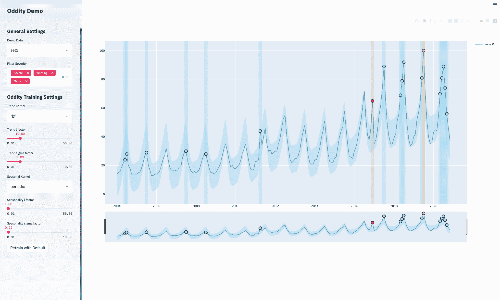
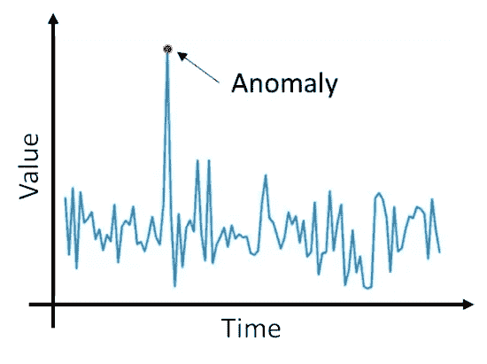
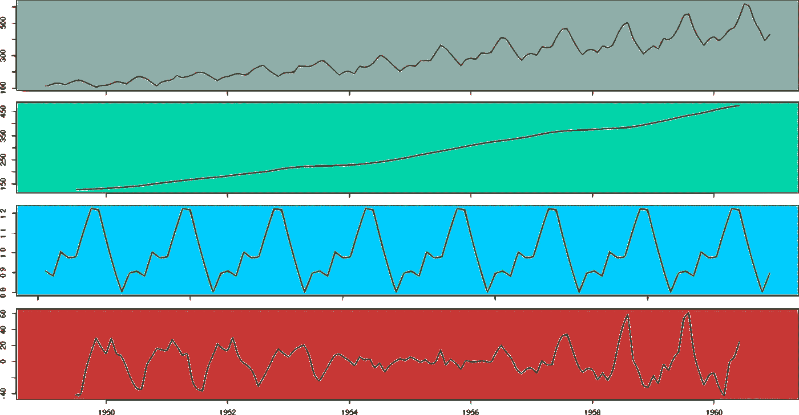
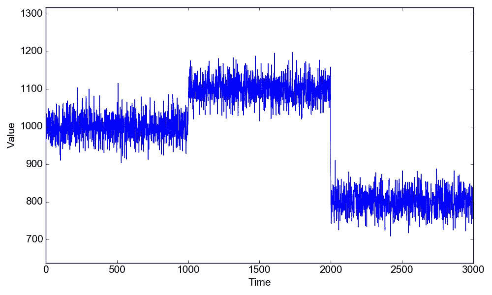
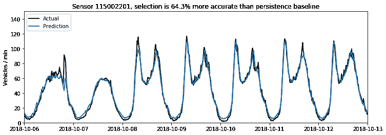
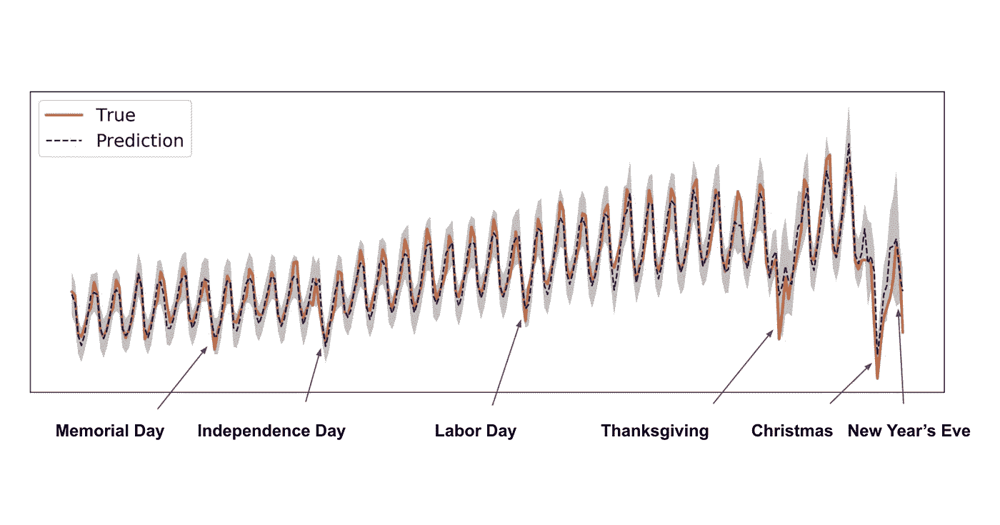
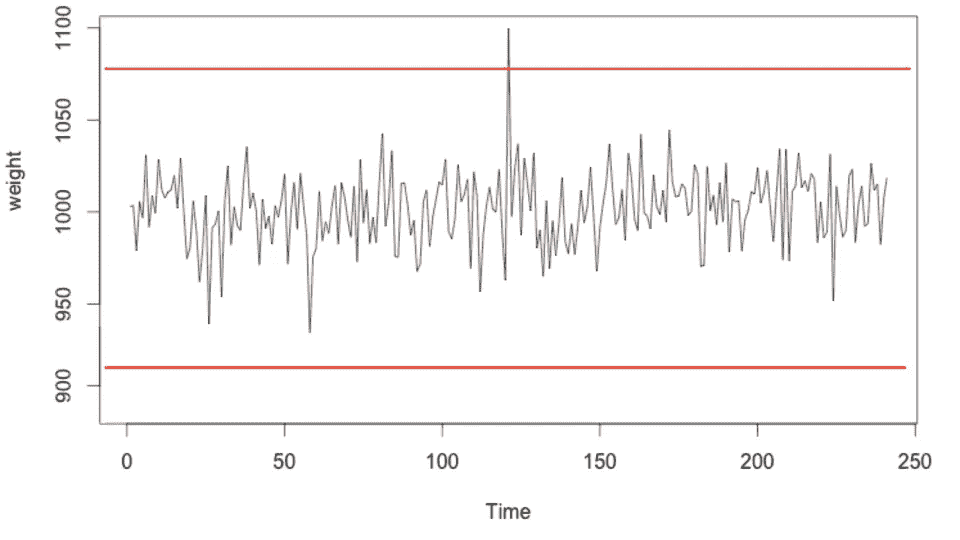
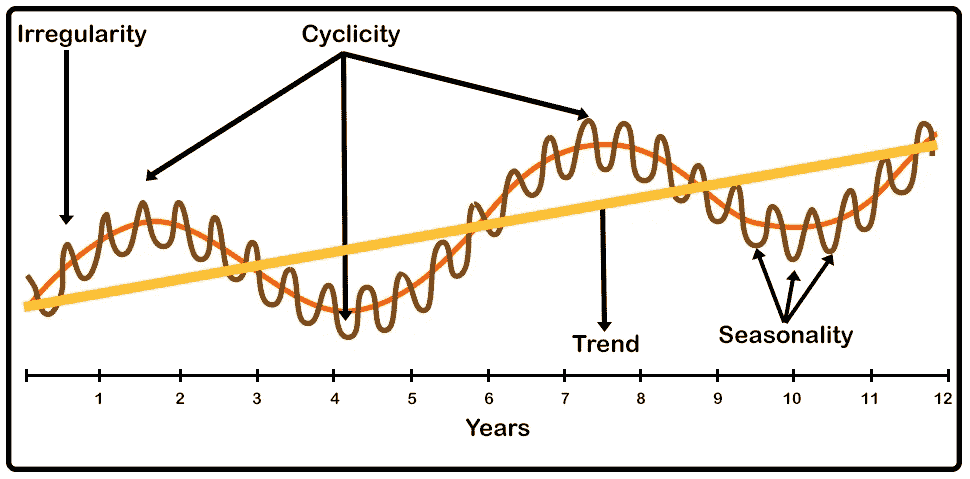
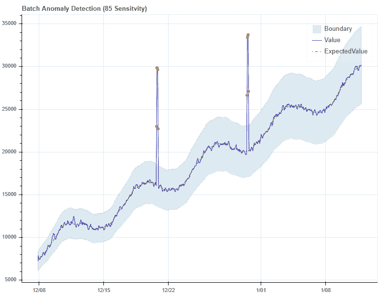
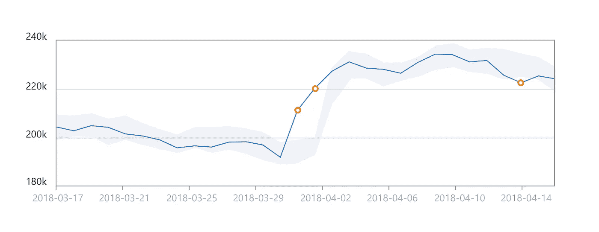

# 休斯顿，我们有个问题—时间序列异常检测

> 原文：<https://medium.com/analytics-vidhya/houston-we-have-a-problem-time-series-anomaly-detection-4ab48c10dd01?source=collection_archive---------9----------------------->

[古怪演示](https://github.com/Lleyton-Ariton/oddity-demo)

在各种应用程序中，知道什么时候出了严重的问题是极其重要的。无论是监控机器、金融交易或服务器指标的功耗，当事情变得奇怪时——这意味着麻烦。

# 背景

***异常*** 是对正常行为的意外偏离，因此通常表示某种问题。

[形象信用](https://www.pyimagesearch.com/2020/01/20/intro-to-anomaly-detection-with-opencv-computer-vision-and-scikit-learn/)

异常检测最常涉及 ***时间序列*** 数据，因为时间元素的加入允许建立某种*“正常”*行为。因此，当事物偏离它们的*“正常的”*行为时，它们就被定义为:**异常的**。

在后续帖子中，我们将利用*异常检测引擎帮助我们检测时间序列数据中的异常。*

# *建立正常行为*

*在大多数情况下，特别是在实际的实际应用中，异常检测不是一个简单的问题，需要简单的解决方案。*

*时间序列数据很难建模，为了识别异常之处，需要准确捕捉并确定序列的*“正常”*行为。本质上，需要识别一些典型行为，这通常从评估给定时间序列的 ***趋势*** 和 ***季节性*** 开始。*

**

*[形象信用](/better-programming/a-visual-guide-to-time-series-decomposition-analysis-a1472bb9c930)*

***趋势(绿色显示):**时间序列的趋势(顾名思义)是数据的总体趋势。*

***季节性(蓝色显示):**时间序列的季节性是任何具有固定周期的重复出现的模式或行为。这对于发现行为异常尤其重要。*

*时间序列的趋势和季节性被称为其组成部分，而将时间序列分解为其组成部分的过程被称为分解。趋势和季节性都被用来模拟时间序列的一般行为，因此知道了这一点，就更容易区分不跟随的东西。*

# *挑战*

*上面的例子非常清晰明了。不幸的是，现实并不那么简单，因此真正的挑战是在实际应用中，给定的时间序列可能具有高度的不可预测性和复杂性。一个时间序列数据集可能由*多个*不断变化的季节性、模式、细微差别和层次组成。*

***变点:**变点(顾名思义)是时间序列发生变化的点。这可能是任何事情，从它的水平变化，甚至是一个完全不同的季节模式。一个变化点最初可能会被标记为异常，但可能很快就会成为时间序列的新*【正常】*行为。*

**

*[图像信用](https://www.businesswire.com/news/home/20170620005440/en/New-Research-Paper-from-Numenta-Demonstrates-Results-of-Machine-Intelligence-Algorithm-on-Real-Time-Anomaly-Detection-for-Streaming-Data)*

*上面是一个有一些变化点的时间序列的例子。第一个变化(增加的电平移动)出现时，可以认为是异常的。然而，我们看到时间序列保持不变，因此成为新的*“正常”*行为。然后，时间序列再次移动(电平移动减少)。与之前的转变类似，转变点本身的精确时刻可以被认为是异常的。然而，时间序列在这个新的水平上继续，因此再次改变*“正常”*。*

***局部季节性:**一个时间序列在整体上可能不具有简单的恒定季节性。与上述变化点类似，季节性和/或时间序列中的任何重复模式(如果存在的话)也可以从一个环境到另一个环境发生剧烈变化，并存在于多个范围内。*

**

*[图像信用](/hal24k-techblog/how-to-generate-neural-network-confidence-intervals-with-keras-e4c0b78ebbdf)*

*以上是在同一时间序列中出现不同周期性的一个例子。在开始时，我们看到一个不同于其他时间序列的局部模式。*

*也可以有包含不同范围的多个季节性。例如，假设一个时间序列具有很强的每周季节性。在周模式中也可能存在一个日复一日的日模式。*

**

*[图像信用](https://eng.uber.com/neural-networks-uncertainty-estimation/)*

*以上是一个例子，说明了节假日等因素如何影响时间序列数据集中的数据点。例如，假日显然每年都会发生，黑色星期五在线商店页面请求的激增不一定是异常现象，而是一种可预测的年度模式。*

***不规则时间序列:**有些时间序列不容易分解，甚至可能没有季节或周期模式。*

**

*[形象信用](https://code-ai.mk/anomaly-detection-on-cpu-waveform-using-k-means/)*

***周期性:**周期性是一种不遵循固定周期的循环模式。这不要与 ***季节性、*** 相混淆，后者必须遵循一个固定的周期。自然，这种固定时间段的缺乏给识别数据的周期性带来了更多的困难。*

**

*[图像信用](https://www.datavedas.com/introduction-to-time-series-data/)*

*以上是给定时间序列中周期性的一个例子。一般来说，一个周期的长度大于一个季节模式的长度，例如在这种情况下，发生在几年内。*

# *多种异常情况*

*异常也不一定只是时间序列中的极端/异常值，异常也可能是完全正常的值，只是不遵循既定的模式。它们将分别被称为*【价值异常】**【行为异常】*。*

***值异常:**值异常是数据中仅仅是极值的异常。这些往往很容易识别，甚至静态阈值可能足以检测它们。*

**

*[图像信用](https://elbruno.com/tag/cognitive-services/)*

*上面可以清楚地看到异常点，其值远远超过整个时间序列中的任何其他值。*

***行为异常:**行为异常是在与某种行为相关的情境中的异常。这些很难发现，因为它们的值在数据范围内可能是完全正常的。因此，需要对给定时间序列的行为进行适当的建模和理解，以识别此类异常。*

**

*[形象信用](https://docs.microsoft.com/en-us/azure/cognitive-services/anomaly-detector/overview)*

*以上是一个行为异常的例子。显然，他们的价值观并无异常，而是与预期行为的差异让他们变得异常。*

# *一个好的异常探测器*

*一个好的异常检测器必须能够解决时间序列异常检测带来的挑战，并满足一些一般的关键要求:*

*   ***准确:**异常检测器无疑应该足够准确，以最小的误报水平识别问题，以避免警报疲劳。检测器模型还应该能够正确识别价值和行为异常。*
*   ***快:**问题就是问题，快速识别和预警很重要。大多数常见的异常检测方法不能进行真正的实时在线学习，因此采用滑动窗口方法。每个时间窗口完成的计算应该是最小的，以便几乎模拟接近实时的学习。*
*   ***Smart:** 异常检测器模型应该能够很好地学习时间序列中的季节性和/或模式，包括局部和全局模式。该模型还应该是自适应的，能够适应数据中的变化点。*
*   ***稳健:**模型应该可以辨识，但不容易受到离群值的影响。该模型应该能够在大多数情况下处理大多数数据，而不需要特殊的调整。*

*在本系列的下一篇文章中，我们将探索和描述一些用于检测时间序列数据异常的最常用的方法和算法。我们将看到如何使用 [***Oddity***](https://github.com/Lleyton-Ariton) 异常检测引擎来满足我们的需求，并帮助发现我们自己的时间序列数据中的异常。*