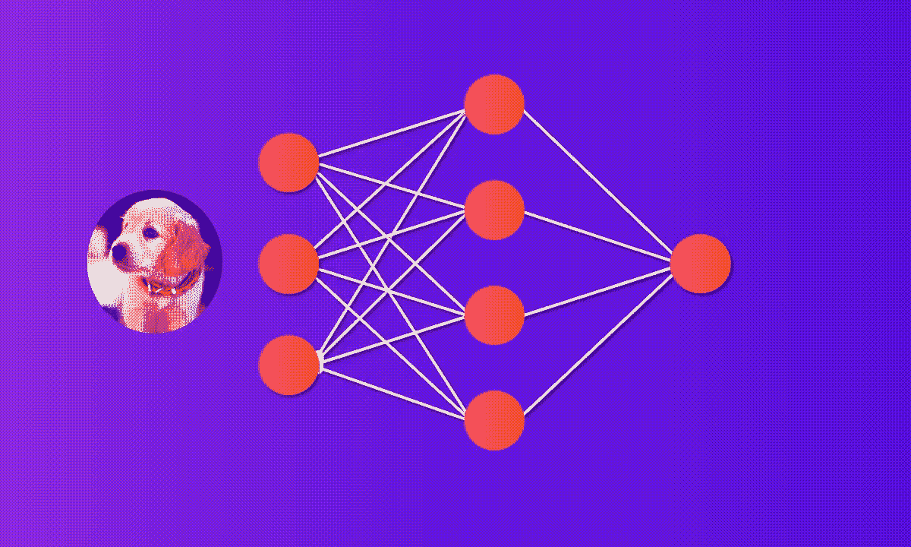

# 比特如何对世界进行分类

> 原文：<https://medium.com/analytics-vidhya/how-a-bit-classifies-the-world-5f0f0a7f141f?source=collection_archive---------17----------------------->

今天，人工智能这个术语是众所周知的。通常你会把它与《终结者》或其他类似风格的电影联系在一起。这个领域中使用的工具的一个分支是机器学习，其中有一个领域是监督学习

当一个小孩被教导关于世界的知识时，监督学习是相似的。举个例子，当你教一个孩子区分…