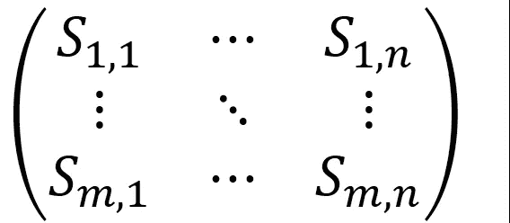
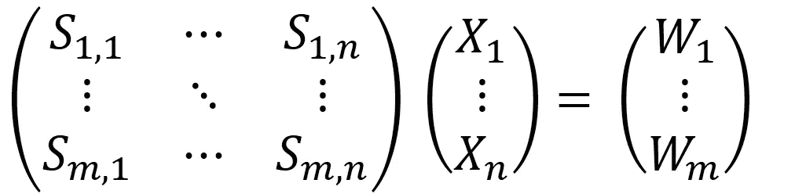

# 一个简单的算法如何将标准新冠肺炎测试的吞吐量提高 10 倍

> 原文：<https://medium.com/analytics-vidhya/how-a-simple-algorithm-can-increase-the-throughput-of-standard-covid-19-tests-10-fold-239e68216a8?source=collection_archive---------11----------------------->

上周，新冠肺炎被宣布为疫情，夺去了数千人的生命，而且还没有结束的迹象。阻止疾病传播的最关键的障碍之一是病毒检测试剂盒的可用性和成本。

检测样本中病毒存在的标准检测方法称为**(RT-PCR)。*简单来说，RT-PCR 涉及一种化学反应，如果样本中存在病毒 DNA，就会产生荧光。*

*在标准方案中，每个试管/孔分析一个样本。在一个孔中汇集几个样品是一种已经在几项研究中探索过的解决方案。在[的一项](https://europepmc.org/article/pmc/pmc4390636)此类研究中，研究显示，当在一个孔/试管中汇集多个样本时，需要的 RT-PCR 测试减少了 37%。典型的合并方法包括将每个孔中的几个样品合并，并且如果发现其中一个孔中有阳性样品(通过发出高于预定阈值的荧光信号)，则单独分析池中的每个样品，这仅导致测试次数的适度减少。*

*在这里，我提出了一个非常简单的算法，仅使用标准方案所需测试次数的 1/10，就可以从大量样本中确定哪些是阳性样本。我的方法**假设 1%的样本对病毒**呈阳性 **，考虑到已公布的数据，这是一个合理的假设。可在[此处](https://arxiv.org/abs/1007.4903)找到混合样本与阳性样本比率的成本效益分析。***

*先来确定: *1 … n* 要测试的一组样本，假设其中只有 1%是阳性。让我们确定 Xᵢ =1 当且仅当样本 I 为正时(否则为 0)。*

*给定 *m 个*井(或试管*，m = n/10 —* 记住，我们只想进行 1/10 的测试！ *)* 我们构造以下矩阵:*

**

*在上面的矩阵中 *Sᵢ,ⱼ = 1* 当且仅当样品 *i* 被放入井/试管*j*中时，我们在每口井中放入随机子集的 *n/2* 个样品(这样每行的总和= *n/2* )。在每个孔中放置 n/2 个样本是一种假设，可以在以后的实现中进行优化。*

*该矩阵允许我们构建以下线性方程组:*

**

*这里*，W₁ … W* ₘ是孔 *1 … m 中荧光信号的强度(*该孔中每个阳性样品的信号之和)，x 在上面定义为:Xᵢ =1 当且仅当样品 I 为病毒阳性时。*

*现在我们有一个方程组，这里需要求向量 x，S 矩阵和向量 W 是实验给我们的。这种表达式很容易通过像最小二乘法这样的简单算法以高精度求解。下面是一个 python 代码的例子，它采用了上述假设，得到了 100%的准确率([链接](https://gist.github.com/LiorZ/bc2c3c04778dd305b36cc10d91efd7e7)):*