# 数据科学中的数据分析与代码

> 原文：<https://medium.com/analytics-vidhya/how-a-toss-decision-in-each-city-impact-a-cricket-match-4ac3d6d2d94f?source=collection_archive---------11----------------------->

## 第 2 部分:IPL 数据分析

IPL 硬币

# 导入必要的包和数据读取

从所有特征中，我选择了四个主要特征，它们将帮助我分析每个城市的投掷对比赛结果的影响。

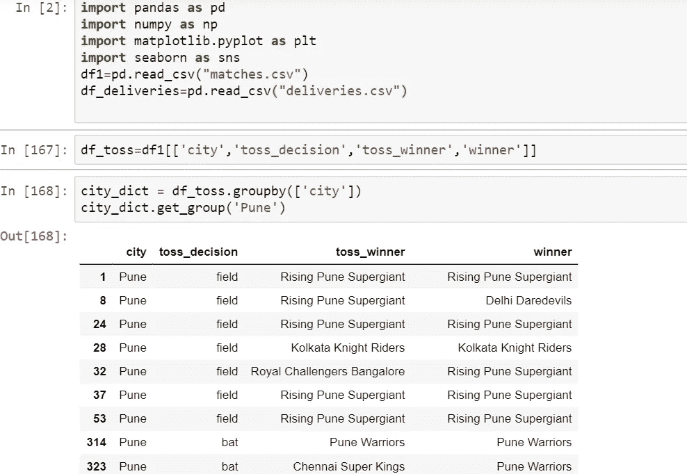

为了获得唯一的城市，我创建了一个函数，其中使用了 groupby()方法。

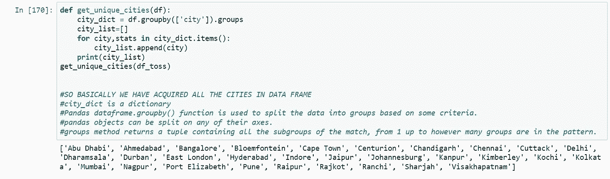

假设我想更新数据集中的一个城市名称，或者在数据收集过程中出现了拼写错误，我的第一步是尽可能地清理数据。

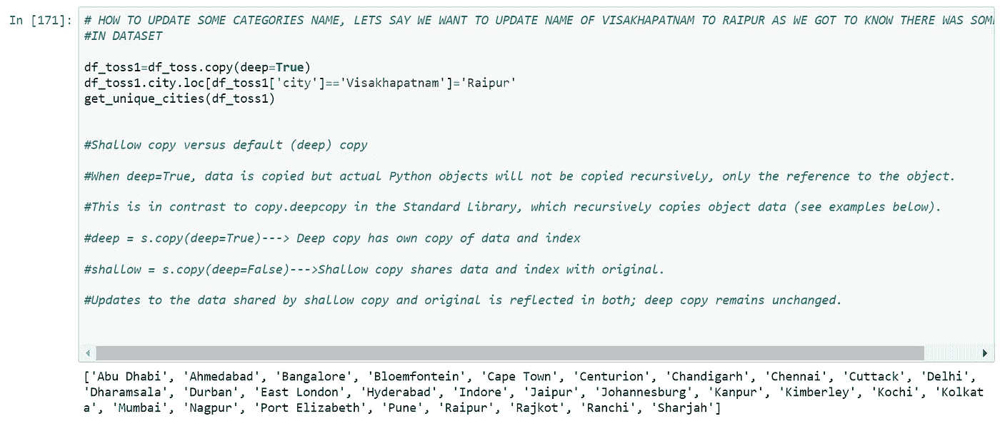

现在我检查更新后的长度，长度应该与我刚刚替换的城市名称相同。之后，我会找到独特的团队。

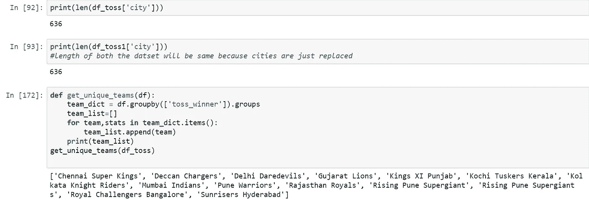

在 IPL 的不同赛季，球队有不同的名字，所以为了简化我的过程和避免混淆，让我们把他们的名字更新为一个名字。

因此，正在崛起的浦那超级巨星变成了浦那勇士，德干充电器变成了太阳升起者海得拉巴。

在那之后，我找出了唯一的获奖者，并更新了这里的名字，就像以前一样。

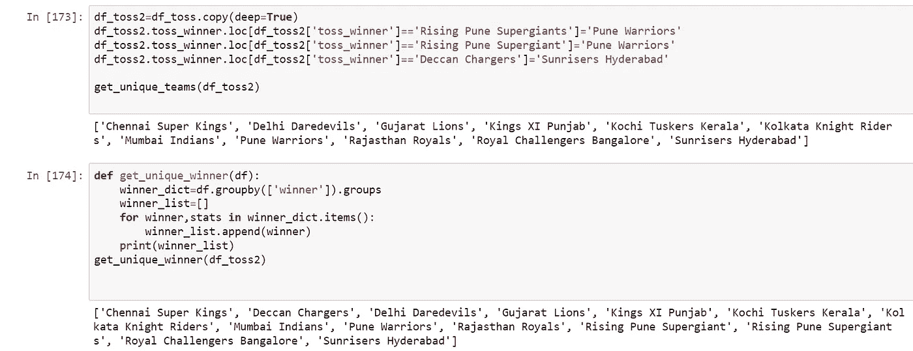

独特的团队

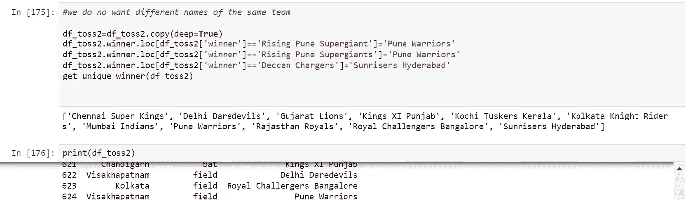

现在我需要寻找任何丢失的值并处理它。让我来看看唯一的赢家，我应该这样做，以检查是否有一个平局，因此将在 winner 中获得 NaN 值。总共有 3 场平局比赛。因此，我应该删除这些行进行分析。

孟买印度人(2018 赛季冠军)

然后我发现 city，toss_decision，toss_winner 的计数相等。

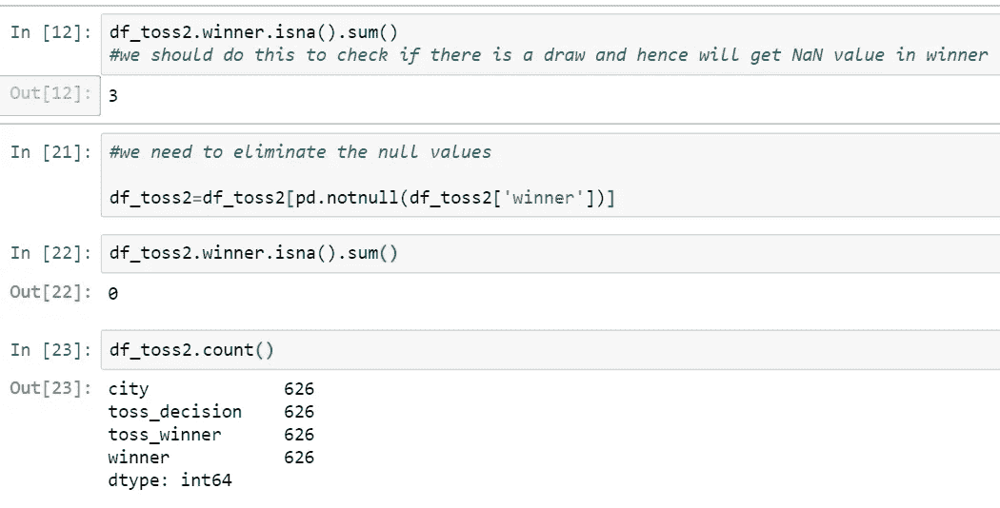

看起来很完美…！

现在，如果 *toss_winner* 是*赢家*，那么 *toss_decision* 为*真*，即决策应该与 *toss_decision* 相同，否则应该相反

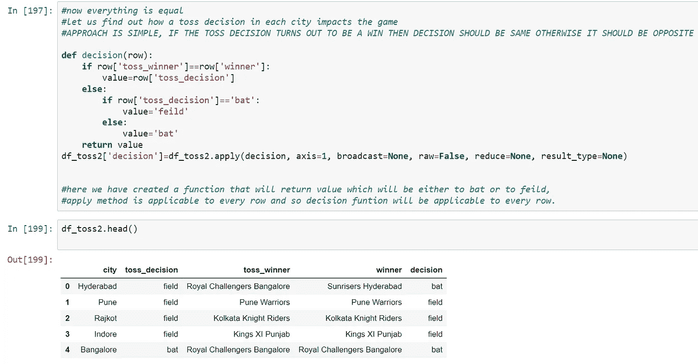

我发现有一个拼写错误，在一些数据条目中,“field”被写成了“field ”,所以我也需要纠正这个错误。然后我做了孟买市的分析，我发现孟买印度人在他们的家乡赢了 45 场比赛，这意味着在他们的主场击败他们是非常困难的。

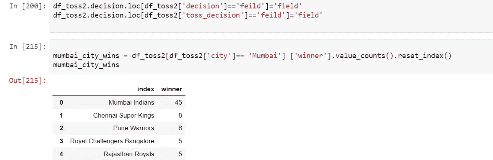

然后，我找出孟买的印度人在掷硬币中获胜的次数，并将这两个数据框合并在一起，以便更好地理解。

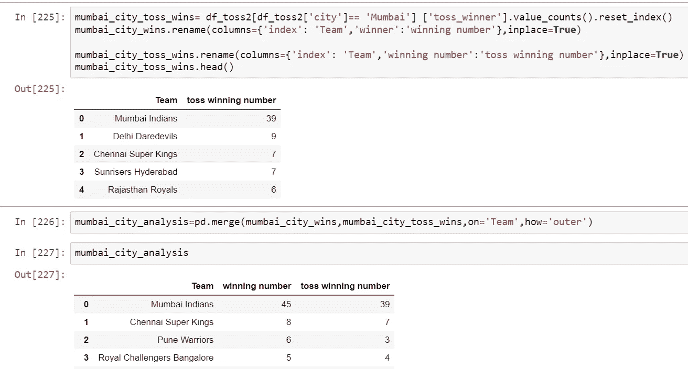

现在，从我的数据集中删除 *toss_decision* 、 *toss_winner* 和 *winner* 或者只取*城市*和*决策*列。

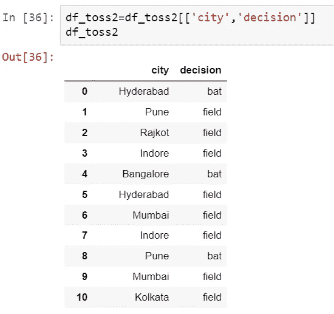

我现在必须使用一个热编码器来转换分类变量。

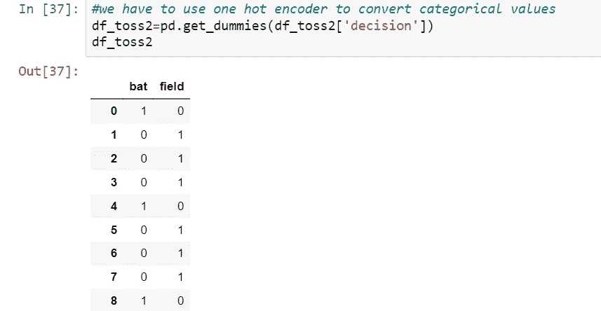

连接这两个数据框并移除决策字段，为了确认对所有要素进行计数，计数必须相等。

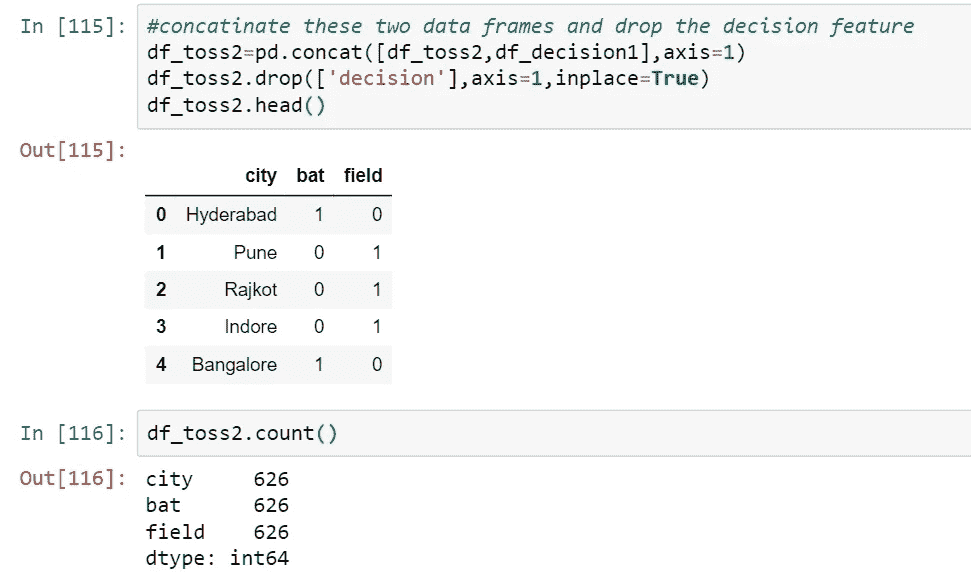

我现在必须按领域*城市*分组，并获得所有统计数据，如总数和百分比。

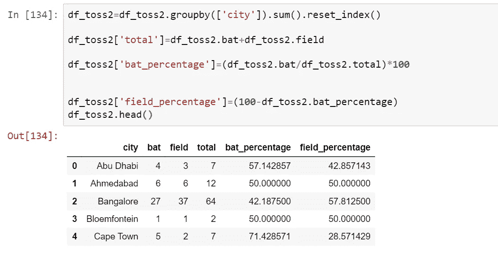

我找出击球率最高的城市，也就是"开普敦",你先击球，有 71%的机会赢得比赛。同样，我们也不确定，但是从历史数据来看，我们可以给出这个说法。

我会找出击球率最低的城市，也就是说，如果你先进入“印多尔”球场，你就有 100%的机会赢得比赛。同样，我们也不确定，但是从历史数据来看，我们可以给出这个说法。

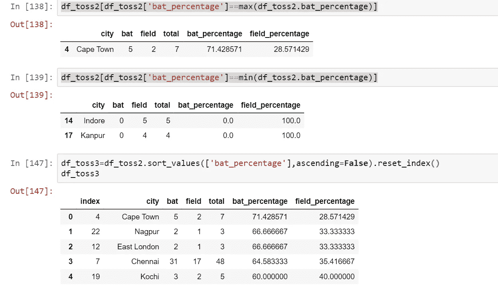

我把这些城市从最高命中率到最低命中率进行了排序。

我绘制了代表 20 个城市(最大到最小)的条形图，在这些城市中，击球首先导致赢得更多比赛。

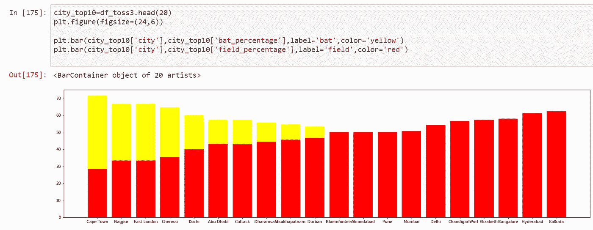

我已经把这些城市从最大投入百分比到最小投入百分比进行了排序。

我已经绘制了代表 20 个城市(最大到最小)的条形图，菲尔丁首先在这些城市赢得了更多的比赛。

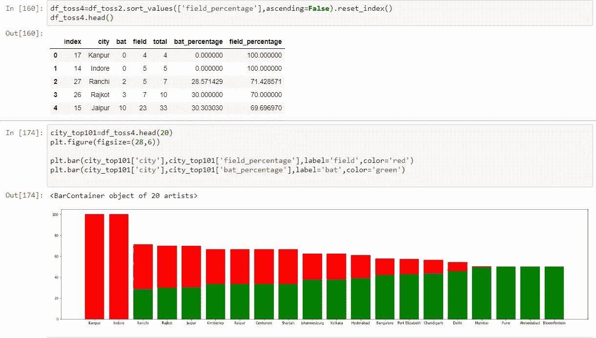