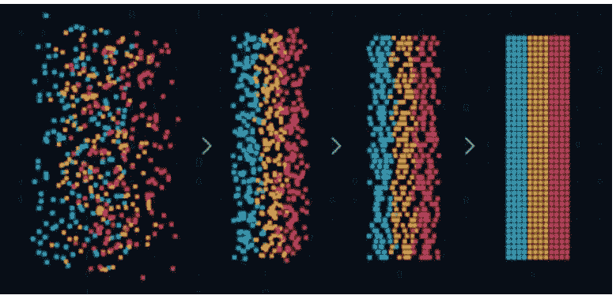

# 人工智能如何帮助自动化测试

> 原文：<https://medium.com/analytics-vidhya/how-ai-can-help-in-automation-testing-78f279f95703?source=collection_archive---------16----------------------->

我们身边的每个小工具现在都由一个移动应用程序控制。无论是电视、冰箱、虚拟现实设备、家庭自动化还是任何其他电器。为了给用户最好的体验，世界各地的软件公司都在使用最佳交付实践来每周发布软件更新。一些更新通常是错误修复，以确保产品的顺利工作。但是在测试中有一些挑战可能会阻碍频繁的发布

1.  使用手工技术的传统软件测试方法。
2.  没有足够的自动化覆盖率。
3.  古怪的自动化脚本。

## **解决方案**

拥有良好的自动化覆盖总是好的，但是如果脚本需要更多的时间来执行，并且测试覆盖大部分是低优先级的场景，那么它不是一个 100%的解决方案来确保及时的发布。随着人工智能成为市场上最新的热门词汇，让我们看看它为软件测试提供了什么

## **提高自动化稳定性**

测试自动化中常见的挑战是维护其稳定性。它受到许多因素的影响，如同步问题、定位器变化、环境变化。自动化依赖于定位元素，然后对其执行操作。如果您的 DOM 保持静态*(仅在理想世界中)*，那么您将不会面临定位器问题，但在现实中，它会随着新的实现不断变化，导致自动化脚本失败。解决方案是训练 AI 去**逻辑定位**脚本中的元素并执行动作。这样我们就不必依赖静态实现了。

## **测试数据生成**

Al 可以帮助测试团队生成测试数据，而不必手动创建它。手动创建测试数据是一个耗时的过程，并且可能由于人为错误而不准确。有许多 ML 技术可用于准备测试数据，例如:

映象分析

文本分析

情感分析

数据分析

数据过滤

预言

## **模式分析**

AI/ML 可以用来研究基于人口统计学的模式。例如，如果发布是在一个特定的区域，我们可以使用模式分析生成相关的测试数据，并开发测试套件。我们还可以根据使用的设备生成数据。生成的数据使 SDETs 能够洞察哪些测试领域需要修复，从而减少运行实际测试的时间并加快开发周期。

## **单元测试**

单元测试的一个优点是它不与应用程序的其他组件交互。我们可以通过创建存根或驱动程序，使用单元测试来独立测试一个模块。人工智能可以帮助自动化团队找到单元测试没有覆盖的代码模块。它还可以为未覆盖的模块提供输入。将来，一旦源代码改变，AI 将能够更新这些单元测试，这将增加稳定性。目前的约束是训练 AI 隔离模块，并为它们创建驱动程序。

## **API 测试**

人工智能可以在系统中使用的不同 API 调用上进行训练，然后它可以进行分析&自动开发带有多个参数的 API 调用的所有组合。随着时间的推移，该套件将变得越来越智能。

# **基于人工智能的自动化测试工具**

## Testim

这是一个基于人工智能的[工具](https://www.testim.io/test-automation-tool/)，它使用智能定位器来评估数百个属性并给它们评分，这样如果元素发生变化，测试不会中断。他们还提供测试员[认证](https://www.testim.io/blog/testim-ai-certification-build-your-testing-skills/)。

## **测试工艺**

它是一个基于人工智能的自动化测试平台，用于回归和连续测试，工作在 Selenium 之上。它还用于监控 web 应用程序。TestCraft 最好的一点是，测试人员可以使用拖放界面可视化地创建自动化的、基于 Selenium 的测试，并同时在多个浏览器和工作环境中运行它们。不需要编码技能。

## Applitools

Applitools 是一款应用可视化管理和 AI 驱动的可视化 UI 测试和监控软件。它提供了一个由 Visual AI 支持的端到端软件测试平台，可供工程、测试自动化、手动 QA、DevOps 和数字化转型团队的专业人员使用。此外，人工智能和机器学习算法完全是自适应的——它扫描应用程序的屏幕，并像人眼和大脑一样分析它们，但具有机器的力量。

## 功能化

Functionize 是一种基于云的自动化测试技术，用于功能、性能和负载测试。这个工具使用机器学习和人工智能来加速测试创建、诊断和维护。你所要做的就是用简单的英语键入你想要测试的内容，NLP 就会创建功能测试用例。它还在几分钟内从所有桌面和移动浏览器执行数千次测试。

## 酱油实验室

Sauce Labs 支持一系列全面的浏览器和操作系统、移动仿真器和模拟器以及移动设备，并且支持用户测试应用所需的速度。它提供了 800 多种浏览器和操作系统组合，200 种移动模拟器和仿真器，以及数千种真实设备。

## 美化

Autify 是一个人工智能驱动的测试自动化平台，允许在不编写代码的情况下记录测试场景。一旦记录下来，人工智能会维护你的脚本。在每个敏捷发布周期中，Autify 都会识别代码中的变化，并相应地自动更新测试场景。

# 结论

虽然 AI/ML 正在帮助测试人员以更少或零维护的方式编写脚本&帮助公司更快地发布，但它仍然是一个初始阶段，并且正在发展。

脚本维护中减少的时间可以用来保持 90%以上的自动化覆盖率。话虽如此，它并不能取代手工测试团队。我们仍然需要大量训练 AI，让它对我们更有用。

感谢你的阅读，如果你喜欢，请点击下面的掌声按钮，这对我意义重大，也有助于其他人看到这个故事。通过联系 [*Linkedin*](https://www.linkedin.com/in/yuktisrivastava) 让我知道你的想法