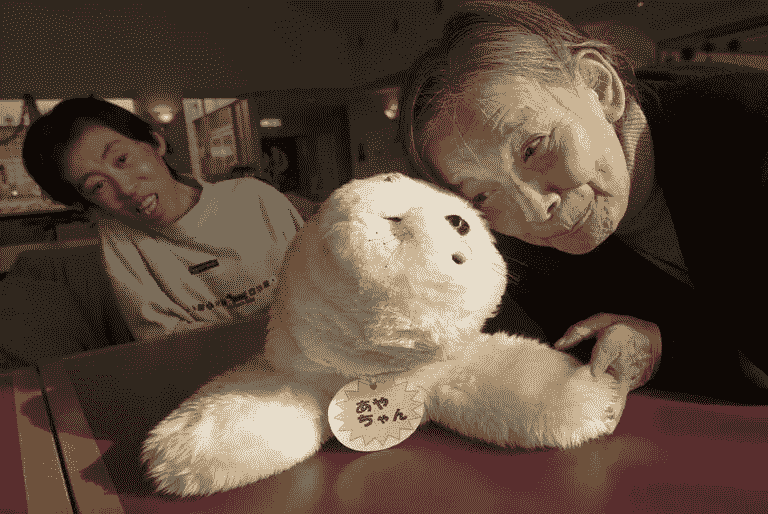
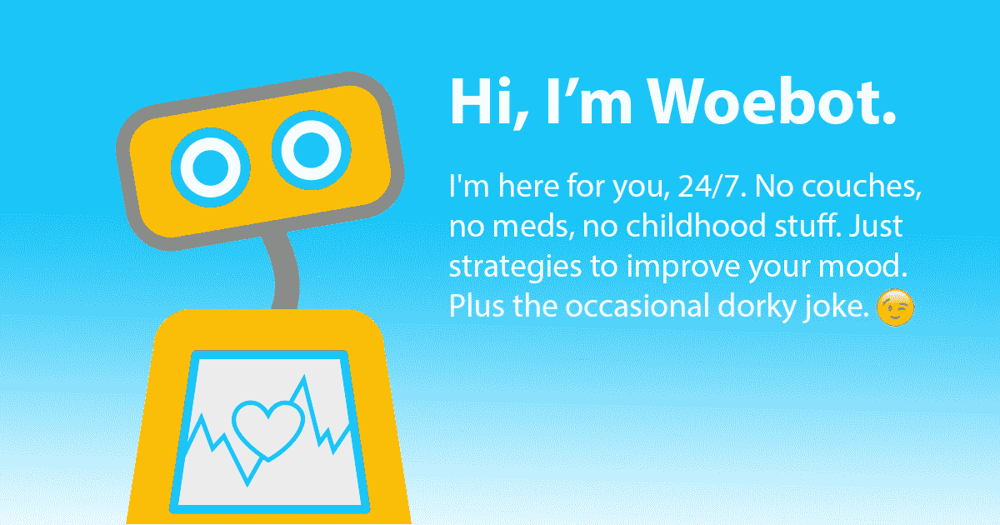
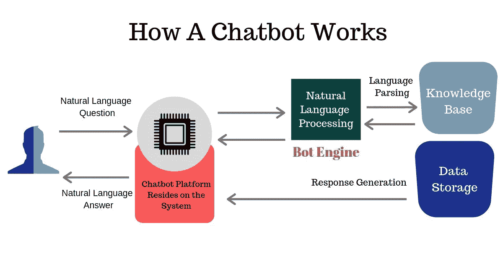

# 人工智能如何改变心理治疗的未来

> 原文：<https://medium.com/analytics-vidhya/how-ai-is-changing-the-future-of-psychotherapy-ef5c496bb217?source=collection_archive---------4----------------------->

## 治疗——无论何时何地，只要你需要！

当你在凹凸不平的沙发上来回走动时，你会发抖。你的治疗师温柔地问你这周过得怎么样。你像往常一样告诉她:学校或工作还是老样子，你有规律地锻炼，而不是每周消耗*和*许多袋薯片。你最喜欢的电视节目开始了它的最后一季，你既兴奋又悲伤。然后，你们一起完成思想练习。

几天后，你发现自己的思绪一片混乱。你坐在自己的沙发上，颤抖地拉过一条温暖的毯子盖在肩膀上，深呼吸。你拿出手机，打开你的治疗师推荐的聊天机器人应用程序。

嗨！“你今天感觉怎么样？”屏幕上的绿色文本显示，并有一个空间供您输入您的回答。

欢迎来到心理治疗的未来:人工智能是来帮助你的！

> B ut，Apurva，我们到底为什么要谈论心理健康？

在过去的十年中，患有精神疾病的人数翻了一番，每五个 T4 人中就有一个患有精神疾病。多达 74%的心理健康诊断发生在 24 岁之前，抑郁症是导致残疾的主要原因——统计数据和研究结果还在继续。

美国每年在精神健康上花费 2.4 万亿美元。如果这么多人有这些问题，而且花了这么多钱试图帮助他们，那为什么他们还在受伤害？

许多因素导致了这一点:许多人负担不起治疗和药物，很难找到一个好的治疗师。最令人担忧的是，围绕心理健康的污名如此之大，以至于许多人要么 a)没有完全意识到可能有问题，要么 b)不愿意向他人和自己承认这一点。

不管是什么情况，很明显我们需要采取更多的行动来对抗精神疾病。

进入人工智能(AI)——现在正在做什么来帮助对抗精神疾病？

# 现在正在做什么？

你会惊讶地发现，使用人工智能的技术已经被用于治疗目的。

南加州大学创新技术研究所(ICT)设计了一个名为 ***Ellie*** 的虚拟治疗师，他帮助退伍军人治疗他们与战争有关的创伤和 PTSD。埃莉的惊人之处在于，她能够捕捉到非语言线索(比如面部表情和一般的肢体语言)。

这有多棒？！

然后我们有 **PARO** ，治疗和机器人玩具海豹，它可能是我见过的最可爱的玩具海豹。

Paro 与日本老年痴呆症患者一起聊天

PARO 帮助痴呆症和老年痴呆症患者。它有五种类型的传感器(触觉、光、听觉、温度和姿势传感器)，并利用*强化学习*——例如。如果你抚摸它，PARO 会记住促使它的动作，并重复这个动作。

到目前为止，我们已经讨论了虚拟治疗师和可爱的机器海豹。

不过，现在我要向你们介绍我的朋友(*鼓点请* 🥁🥁🥁🥁)… **Woebot！**

# Woebot 的奇迹和悲哀

Woebot 由 Alison Darcey 博士于 2017 年创立，面向大学和研究生院的年轻人。它的费用约为 39 美元/月，并与脸书集成。

像任何其他聊天机器人一样，Woebot 是一种利用机器学习的人工智能(AI)形式。具体来说，它有一个基于人脑神经元设计的神经网络。

由于 Woebot 自己的神经网络似乎没有正式的图表，因此提供了这个通用图表来帮助您了解它是如何工作的。

神经网络是一套处理感觉数据的算法。随着数据的输入，Woebot 访问其知识库并给出响应。

随着数据被持续输入(对于 Woebot 来说，数据是每天的反应)，神经网络帮助人工智能识别模式——并识别何时有什么不匹配。有了 Woebot，当用户给出与几周前完全不同的回答时，就会发生这种情况。

所有聊天机器人都采用神经网络，但 Woebot 的不同之处在于它使用了**认知行为疗法。**

认知行为疗法(CBT)是一种短期治疗形式，其目标是改变人们困难背后的思维或行为模式，以改变他们的感受。

Woebot 使用以下策略来改善你的情绪:

*   要求你将一个消极的陈述换成更积极的东西(最直接的 CBT 形式)
*   提供视频和文字游戏来帮助教授认知扭曲。
*   (当然)还会偶尔给你讲一些无聊的笑话

Woebot 每天都会检查其用户，并根据这些回复跟踪用户的情绪。这些情绪显示在每周图表上。Woebot 通过用户的日常反应进行学习，并根据它创建的情绪图知道什么时候事情不太对劲。

# 暗示

不可否认，我们天生就需要与他人相处。人类是群居动物，这种支持和联系已被证明能增加幸福感，减少孤独感(还能降低血压，一点也不低！)因此，当心理健康处于低谷时，人际交往——通常以有资格提供帮助的治疗师的形式——是最有帮助的，这是有道理的。

同样不可避免的是，尽管他们尽了最大努力，但 Woebot 的对话将开始变得不那么真实，更像是照本宣科。这并不是 Woebot 独有的——所有形式的交互式人工智能都会面临这个问题——但它尤其重要*，因为* Woebot 旨在*提供帮助。*

Woebot 无意成为治疗师的替代品。Woebot 的风格不会适合所有人的需求。

然而，当谈到 CBT 时，有大约 20 多年的证明(根据 Woebot 的网站)表明，基于互联网的 DIY CBT 可以像治疗师提供的 CBT 一样有效。

我认为基于互联网的治疗之所以如此有效，是因为改变的不是治疗的形式，而是提供治疗的方式。

研究发现，我们对虚拟化身的反应和对人类的反应一样——我们更容易受到伤害，分享更尴尬的故事。这对心理治疗来说意义重大——毕竟，敞开心扉是变好的第一步。

作为一个社会，我们将不得不面对现实:人工智能将融入日常生活的所有部分，它将做我们习惯于看到人类做的事情。

但是这种改变并不全是坏事——事实上，对我们所有人来说，它让事情变得更容易，更有效率。

鉴于世界上有数百万人将永远无法获得治疗师的帮助，Woebot 提供了一种最有效的治疗方式——只需一小部分费用。

# 关键要点:

*   随着技术的进步，精神健康治疗将开始融入其中。
*   像 Woebot 这样的聊天机器人已经被证明使用认知行为疗法(CBT)进行治疗是有效的。
*   人工智能疗法不能代替人类治疗师——但是它仍然有效。

*感谢阅读本文！！如果你想联系我，我在*[*Linkedin*](https://www.linkedin.com/in/apurva-joshi-822a18192/)*上，我几乎总是可以通过电子邮件联系到:*[*writetoapurva@gmail.com*](mailto:writetoapurva@gmail.com)*。下次见！*