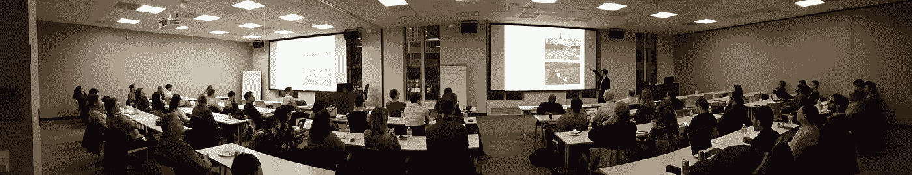

# 分析如何改善驾驶

> 原文：<https://medium.com/analytics-vidhya/how-analytics-makes-the-drive-better-d906bf1487fc?source=collection_archive---------23----------------------->

智能汽车:感知驱动的自动驾驶汽车，由芝加哥城市数据集团主办

这是我 2016 年所有分析文章的更新版本。我在演示中加入了原始帖子中没有的图片。

如果有一个关于雇佣分析专业人士的战斗口号，那肯定是自动驾驶汽车背后的研究人员发出的最响亮的声音。从这些车辆产生的数据产生大量的数据，这些数据被解释来引导车辆。我有一个…