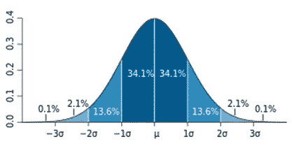

# 如何以及何时使用发行版？

> 原文：<https://medium.com/analytics-vidhya/how-and-when-are-distributions-used-bb2c6bc146bb?source=collection_archive---------19----------------------->

到目前为止，你可能已经学习了很多关于随机变量，pdf，CDFs，高斯分布，68–95–99.7%规则。但是你有没有想过我们在现实生活中如何以及何时使用所有这些概念？

让我们一起探索吧！！！

简而言之，我们学习的所有概率和统计都用于数据分析，而数据分析只不过是回答关于数据的问题。

让我们用一个例子来理解这一点。

假设你是 XYZ 一所拥有一万名学生的大学的组织负责人。

现在，你必须组织一次活动，让学院的每个学生都得到一件学院品牌的 T 恤衫，而订购和分发 T 恤衫是你的工作。一件 T 恤衫有多种尺码——小号、中号、大号、大号和 XXL 号。现在，这里的大问题是，你如何确定每种尺寸的订购数量？或者你应该订购多少件 XL 的 t 恤？

有多种方法可以做到这一点。

1.  一种方法是问每个学生的尺寸。

如果你有 100 名助手，他们应该工作一到两周来收集数据，这也许是可能的。但是我们知道，一个大学的组织领导永远不会有 100 个助手😂。所以这可能不是一个可行的选择。

2.你可以使用小的假设和统计数据来解开这个谜题！

比方说

I)身高在 180-185 厘米之间的学生穿加大码的 t 恤

ii)身高在 140-160 厘米之间的学生穿中号 t 恤

根据你的选择随机收集 500 名学生的人数(站在入口处😜).现在你有了人口的随机样本。

因为你有 500 名学生的身高和体型的数据。您可以计算样本的平均值和标准差，并估计总体的属性。

假设平均值= 150 厘米，标准偏差= 10 厘米

> 人口= 10000，样本= 500
> 
> 平均值= 150 厘米，标准偏差= 10 厘米

现在，让我们假设高度遵循正态分布。这极大地改变了一切。您可以对样本使用正态分布的属性(如 68–95–99.7 规则、CDF、PDF 等..)

因为您知道数据的平均值和标准偏差，并且您也知道数据遵循正态分布，所以您可以计算数据的 PDF 和 CDF。

现在，从图表中我们假设你得到了身高= 180 厘米的概率密度函数是 99%,这意味着一个学生身高 180 厘米的概率是 1%。(等于五百分之五)。

现在，如果你用这个来估计人口的大小，1%的人口将是 180 厘米高，因此 1%的人口将有一件 XL 号的 t 恤。

1%的人口= 100

因为你知道样本的均值和方差，你可以使用 68–95–99.7%规则来估计其他大小。

根据 68–95–99%规则，68%的值位于(平均值+ 1*标准差)和(平均值-1*标准差)之间，在您的情况下，该值在 140–160 厘米之间。因为你已经假设身高 140-160 厘米的人穿 M 号的 t 恤，你可以用它来估计人口的尺寸。

因此，68%的人穿 M 码的 t 恤，相当于 6800 件。

瞧啊。你现在知道要订购多少 XL 和 M 尺码的衬衫，同样，你也可以找到其他尺码的。

[1]: Srikanth Varma Chekuri。[https://www . applied ai course . com/lecture/11/applied-machine-learning-online-course/2871/how-distributions-used/2/module-2-data-science-explorative-data-analysis-and-data-visualization](https://www.appliedaicourse.com/lecture/11/applied-machine-learning-online-course/2871/how-distributions-are-used/2/module-2-data-science-exploratory-data-analysis-and-data-visualization)