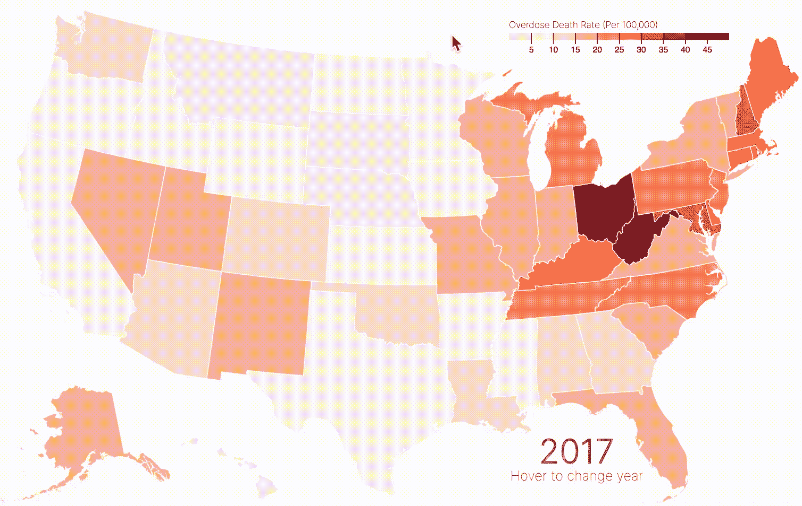
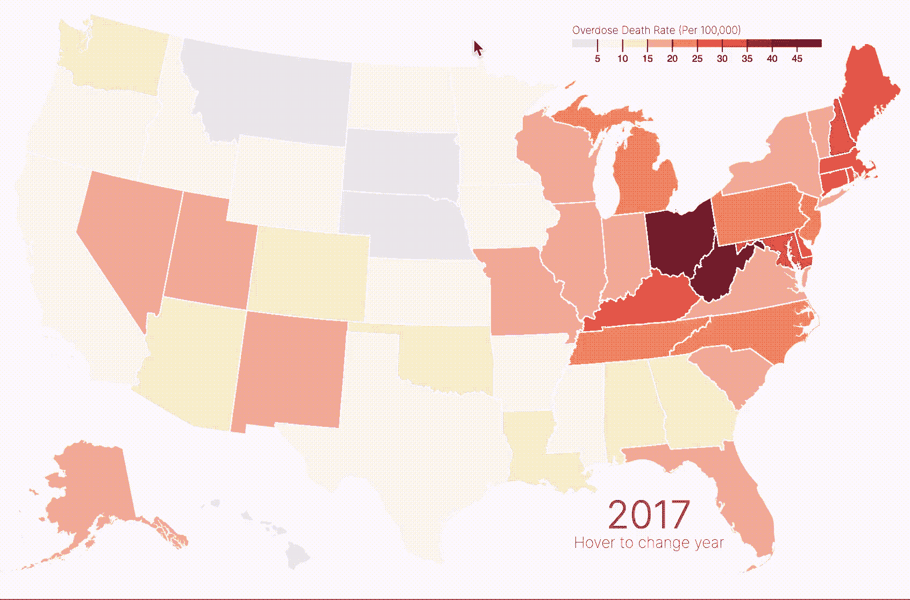
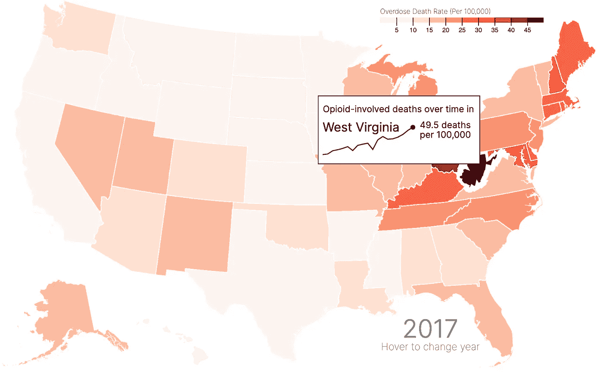

# 如何(以及为什么)将图表添加到 D3.js 工具提示中

> 原文：<https://medium.com/analytics-vidhya/how-and-why-to-add-a-chart-to-your-d3-js-tooltip-6aca4ecfd79d?source=collection_archive---------10----------------------->

工具提示是可视化中最被低估的部分之一。当用户最初对可视化感到困惑时，他们通常会将鼠标悬停在感兴趣的数据点上以获取更多信息。

不幸的是，许多工具提示并没有真正阐明我们的数据。他们经常重复已经呈现的内容，而没有澄清数据中任何令人困惑的部分。最常见的是，我看到(甚至创造😦)显示最基本信息的工具提示(在地图中，工具提示会显示州名和感兴趣的值)，除此之外别无其他！

当然，这种工具提示并没有什么错。但是他们真的做了最少的工作，结果，他们错过了工具提示的全部潜力。**如果用户通过浏览数据来主动寻找更多信息，我们应该尽可能用最有帮助和最有趣的信息来奖励他们。**

这就是为什么我最近更新了我的一个工具提示，从文本信息的静态呈现到描绘随时间变化的折线图。

我的 [choropleth 图描绘了随着时间的推移与阿片类药物有关的过量死亡](https://connorrothschild.github.io/D3.js/map-overdoses/)来自于此:



对此:



# 我为什么要做这样的改变？

以前的工具提示提供的信息相当无趣。尽管它澄清了在特定时间特定州的药物过量死亡的确切比率，但它没有做太多其他的事情。它确实提供了当前视图中的年份，但是在可视化的右下角也可以看到！它还提供了州名，但我的大多数观众可能在中学上过我们的地理课。

因此，这个工具提示是相当多余的。最好的情况是，它提供了*精确的*比率，以便查看者可以比较两个状态，或者了解关于给定状态的更多信息，而不仅仅依靠颜色编码([在涉及到定量编码](https://courses.cs.washington.edu/courses/cse442/17au/lectures/CSE442-VisualEncoding.pdf)时可能有些不可靠，就像 choropleth 图中的情况)。

新的工具提示显示了一段时间的趋势。它还显示了州名(以防你在美国地理中跳过了那一天！)，以及用药过量死亡的最新数据。因为这张地图旨在显示阿片类药物危机*是如何演变的*，在我的工具提示中显示每个州的折线图允许用户在悬停时探索每个州的趋势！这比每年在每个州徘徊并试图跟踪趋势要容易得多。

例如，在西弗吉尼亚州徘徊，该州在 2017 年似乎有最高的阿片类药物过量死亡率(如其最暗的红色阴影所示)，表明其也经历了自 1999 年以来该比率的最大长期增长之一:



# 那么，你是怎么做的呢？

很棒的问题！谢天谢地，这并不难，但回报是巨大的。由于几个[堆栈溢出答案](https://stackoverflow.com/questions/43904643/add-chart-to-tooltip-in-d3)和[在线示例](https://bl.ocks.org/maelafifi/ee7fecf90bb5060d5f9a7551271f4397)，从我的旧的、无聊的工具提示到我的新的、性感的工具提示只花了几个小时。

# 第一步:加载`d3-tip`

这个过程主要依靠`d3-tip`，你可以在这里了解更多关于[的信息。](http://labratrevenge.com/d3-tip/)

你可以用下面的代码加载`d3-tip`:

```
<script src="https://cdnjs.cloudflare.com/ajax/libs/d3-tip/0.7.1/d3-tip.min.js"></script>
```

# 步骤 2:创建工具提示对象

接下来，初始化工具提示，给它一个类(用于 CSS 样式)，并提供指定的`offset`。在我的例子中，我根据[用户的鼠标位置](https://stackoverflow.com/questions/28536367/in-d3-js-how-to-adjust-tooltip-up-and-down-based-on-the-screen-position)来定义我的偏移量。这样，如果用户悬停在一个东部州，工具提示不会从屏幕上消失！

```
// define the tooltip 
var tool_tip = d3.tip()
  .attr("class", "d3-tip")
  // if the mouse position is greater than 650 (~ Kentucky/Missouri), offset tooltip to the left instead of the right
  .offset(function() {if(current_position[0] > 650) {
  	return [-20,-120] } 
  	else { return [20,120]}
  })
  // input the title, and include the div
  .html(
  	"<p>Opioid-involved deaths over time in</p><div id='tipDiv'></div>"
  );

svg.call(tool_tip);
```

这里最重要的部分是

```
.html(
     "<p>Opioid-involved deaths over time in</p><div id='tipDiv'></div>"
);
```

在这里我们定义了创建工具提示本身的 html。在我们的例子中，我们提供了一个标题“与阿片类药物相关的死亡”，并指定工具提示应该包含的 div。

# 步骤 3:创建`tipDiv`对象

最后，我们可以创建上面代码中引用的`tipDiv`对象。该对象将在鼠标经过感兴趣的组(在我的例子中是 states)时创建。因此，代码将如下所示:

```
states = svg.append("g")
  .attr("class", "states")
  .selectAll("path")
  .data(topojson.feature(us, us.objects.states).features)
  .enter()
  .append("path")
  .attr("d", path)
  .on('mouseover', function(d) {

// define and store the mouse position. this is used to define tooltip offset, seen above.
current_position = d3.mouse(this); 				

// define current state
current_state = nameById[d.id]

// show the tooltip
tool_tip.show();
```

在初始化和`show`函数之后，我们可以定义`tipDiv`对象:

```
var tipSVG = d3.select("#tipDiv")
     .append("svg")
     .attr("width", 220)
     .attr("height", 55);

tipSVG.append("path")
     .datum(overdoses.filter(function(d) {return nameById[d.id] == current_state}))
     .style("stroke", function() {
     	if (rateById[d.id] < 10) {
     		return "grey"
     	} else {
     	return color(rateById[d.id])
     	}
 	  })
     .style("stroke-width", 1.5)
     .style("fill", "none")
     .attr("d", line)

tipSVG.append("circle")
     .attr("fill", function() {
     	if (rateById[d.id] < 10) {
     		return "grey"
     	} else {
     	return color(rateById[d.id])
     	}
 	  })
    .attr("stroke", "black")
    .attr("cx", 130)
    .attr("cy", y_tooltip(rateById[d.id]))
    .attr("r", 3)

tipSVG.append("text")
     .text(rateById[d.id] + " deaths")
     .attr("x", 140)
     .attr("y", function() {
     	if (y_tooltip(rateById[d.id]) < 15) { return 10 }
     		else { return y_tooltip(rateById[d.id]) - 7 }
     	})

tipSVG.append("text")
     .text("per 100,000")
     .attr("x", 140)
     .attr("y", function() {
     	if (y_tooltip(rateById[d.id]) < 15) { return 24 }
     		else { return y_tooltip(rateById[d.id]) + 7 }
     	})

tipSVG.append("text")
     .text(current_state)
     .attr("x", 0)
     .attr("y", 15)
     .style("font-size", 18)
     .style("font-weight", 400)
 })
.on('mouseout', tool_tip.hide)
```

这里发生了什么事？让我们一次看一块。

**首先**，我们定义对象，命名为`tipSVG`。`tipSVG`选择`#tipDiv`(在我们的 d3-tip 中定义)并附加一个 SVG。我们还定义了工具提示的宽度和高度。

```
var tipSVG = d3.select("#tipDiv")
	      .append("svg")
	      .attr("width", 220)
	      .attr("height", 55);
```

**接下来**，我们向 SVG 添加一个路径。这可以是圆形、矩形或任何其他可附加的形状。因为我在画一条简单的线，所以我们使用`path`。

```
tipSVG.append("path")
  .datum(overdoses.filter(function(d) {return nameById[d.id] == current_state}))
  .style("stroke", function() {
  	if (rateById[d.id] < 10) {
  		return "grey"
  	} else {
  	return color(rateById[d.id])
  	}
	  })
  .style("stroke-width", 1.5)
  .style("fill", "none")
  .attr("d", line)
```

在定义`d`属性时，您会看到我使用了短语`line`。这在我的代码中定义为返回每个数据点的 x 和 y 位置，以创建路径本身。

```
var x_tooltip = d3.scaleLinear()
  .domain(d3.extent(overdoses, function(d) { return d.year; }))
  .range([ 0, 130 ]);

var y_tooltip = d3.scaleLinear()
  .domain([0, 60])
  .range([ 50, 0 ]);

var line = d3.line()
  .x(function(d) {
    return x_tooltip(d.year);
  })
  .y(function(d) {
    return y_tooltip(+d.rate);
  })
```

**最后**，我们在线的末端添加一个圆圈来表示最终的数据点。我们还添加了 2017 年的文本标签。

```
tipSVG.append("circle")
  .attr("fill", function() {
  	if (rateById[d.id] < 10) {
  		return "grey"
  	} else {
  	return color(rateById[d.id])
  	}
	  })
   .attr("stroke", "black")
  .attr("cx", 130)
  .attr("cy", y_tooltip(rateById[d.id]))
  .attr("r", 3)

tipSVG.append("text")
  .text(rateById[d.id] + " deaths")
  .attr("x", 140)
  .attr("y", function() {
  	if (y_tooltip(rateById[d.id]) < 15) { return 10 }
  		else { return y_tooltip(rateById[d.id]) - 7 }
  	})

tipSVG.append("text")
  .text("per 100,000")
  .attr("x", 140)
  .attr("y", function() {
  	if (y_tooltip(rateById[d.id]) < 15) { return 24 }
  		else { return y_tooltip(rateById[d.id]) + 7 }
  	})

tipSVG.append("text")
  .text(current_state)
  .attr("x", 0)
  .attr("y", 15)
  .style("font-size", 18)
  .style("font-weight", 400)
 })
```

最后，我们隐藏 mouseout 上的工具提示:

```
.on('mouseout', tool_tip.hide)
```

感谢阅读我的(第一？)中帖！你可以在这里[亲自体验可视化和查看工具提示。](https://connorrothschild.github.io/D3.js/map-overdoses/)

*原载* [*我的网站。*](https://connorrothschild.github.io/d3js/how-to-add-a-chart-d3-tooltip)