# 异常检测是如何工作的？

> 原文：<https://medium.com/analytics-vidhya/how-anomaly-detection-works-4651f1786431?source=collection_archive---------6----------------------->

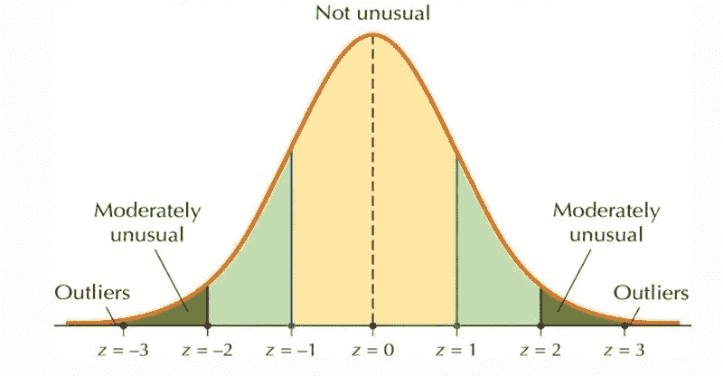

高斯分布图

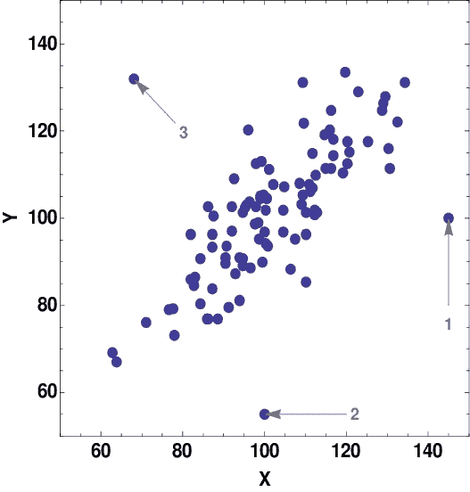

# 什么是异常？

任何不寻常的和偏离标准“正常”的都被称为**异常**或**异常值。** 检测给定数据中的这些异常称为异常检测。

图中数字 1、2、3 所指的点是一些明显的异常点

# 异常检测用在哪里？

使用异常检测的一些流行的地方有:
1。欺诈检测
2。检测制造缺陷。例如:中央处理器制造，飞机部件制造等

# 正态分布解释

最好考虑一个例子来理解正态分布

让我们考虑一个单变量的问题，即单变量正态分布

*这只是一个示例。在现实世界中，数据要比这复杂得多。*

## 用户任务完成示例:

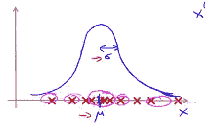

只考虑 x 轴(用户完成某项任务所花费的时间)

该图显示了一些用户完成某项任务所需时间的数据。

这里，符号代表数据的平均值， **σ** 代表数据的标准差。

在这里，我们可以观察到，接近整个数据集平均值的数据数量高于远离平均值的数据数量(这个因素借助标准差 **σ** 来描述)。
因此，这样一个数据集的概率分布遵循一个称为**正态分布**的特殊分布，形成一个钟形。

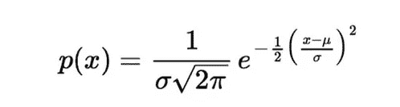

概率密度函数

我们可以从中解释的主要问题是，接近整个数据集平均值的数据比更远的数据更有可能存在，这种可能性由上述公式给出。即**速度极快的用户数量和速度极慢的用户数量非常少，这样的用户被认为是离群值**

# 异常检测—原始模型

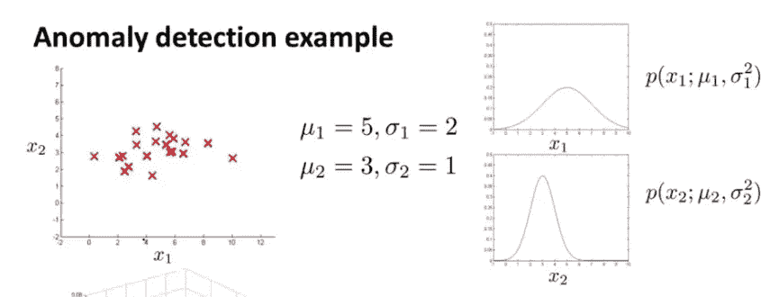

异常检测的初始模型(不再使用)

现在，让我们考虑数据中的两个变量。比如说，一个学生每天学习的时间 **(X 轴)**与一个学生玩电子游戏的时间
**(Y 轴)**(这只是一个例子。没那么显著)

给定一个数据点，我们分别找出学生在这段时间学习的概率，也分别找出学生在这段时间玩电子游戏的概率。我们使用**单变量正态分布的密度函数**
*找到这些概率。注意:记住，我们分别找到这些概率*

然后，我们检查该概率是大于还是小于特定的阈值。如果更大，那就不是异常现象了。如果少一些，那就是异常。我们如何选择这个阈值超出了本博客的范围。但是，这不是火箭科学。只是一些基本的数据分析。

# 原始模型面临的问题

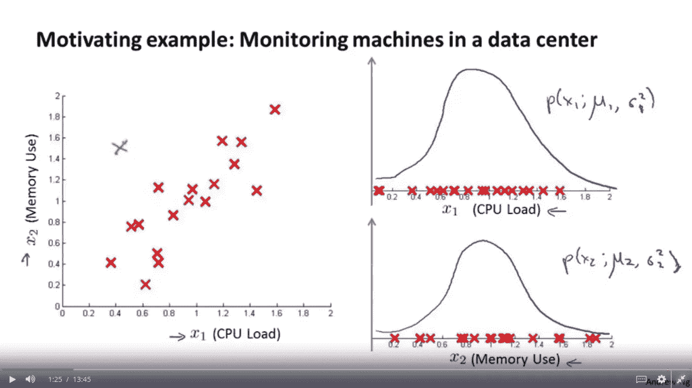

CPU 负载与内存使用图

原模型面临的问题是:
1。我们人类只要看着上面的图像就可以说绿色地块是异常的
2。但是，我们的上述模型没有认识到这一点。

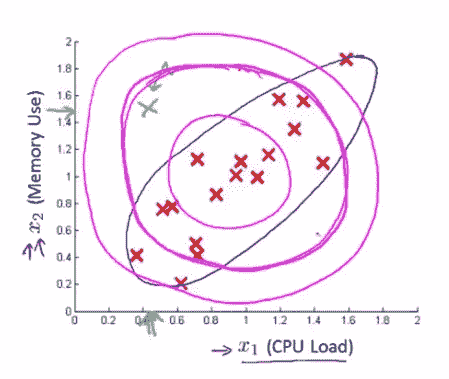

3.我们先不考虑 y 轴，只考虑 x 轴。绿点位于 0.5 到 0.6 之间。如果我们把这个点代入正常的密度函数，我们不会得到预期的低概率，因为它离中心不是很远。
4。y 轴也是如此

因此，该模型认为出现在上图所示的相同紫色环中的所有数据点具有相同的概率

# 使用多元高斯分布的异常检测

为了克服我们的模型所面临的上述问题，使用了**多元高斯分布**，而不是分别寻找**单变量概率密度**并将它们相乘。

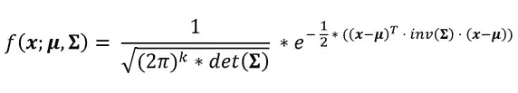

1 个以上变量的概率密度函数

σ称为协方差矩阵。
使用该模型的优势在于，它使用了协方差矩阵，因此也考虑了数据集所涉及的所有要素之间的协方差
通过利用协方差矩阵的功效，我们可以考虑 2 个或更多变量之间的关系，从而形成更加准确的正态分布图。

# 更多关于这是如何工作的直觉

下面是用不同的协方差矩阵值绘制的一些图表。随着一个变量的标准偏差值或多个变量之间的标准偏差值的变化，图形也会呈现不同的形状。

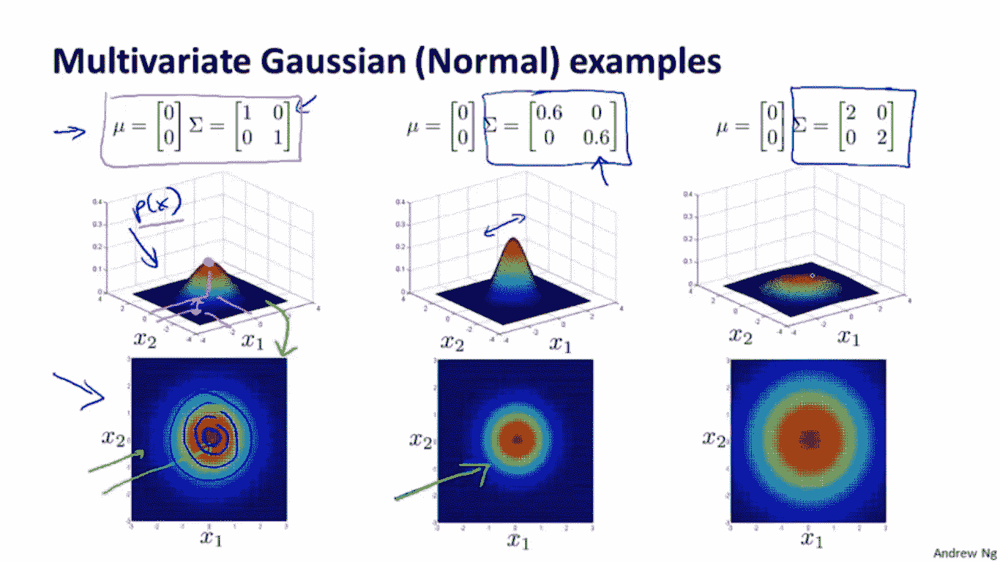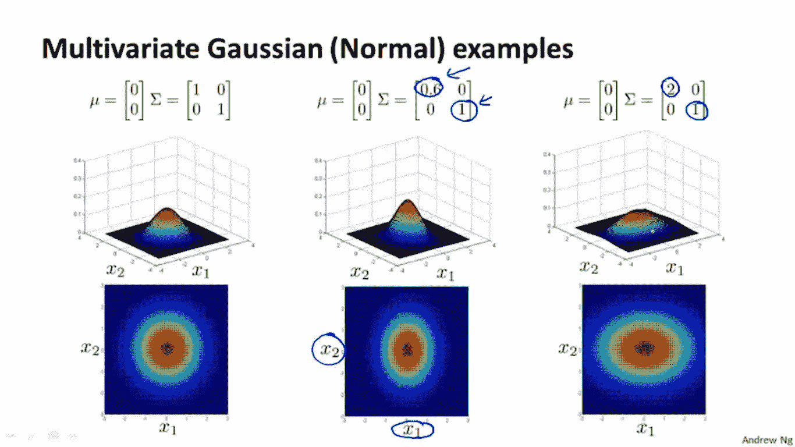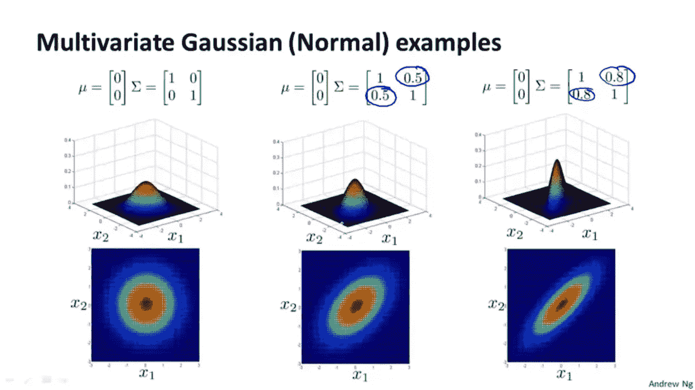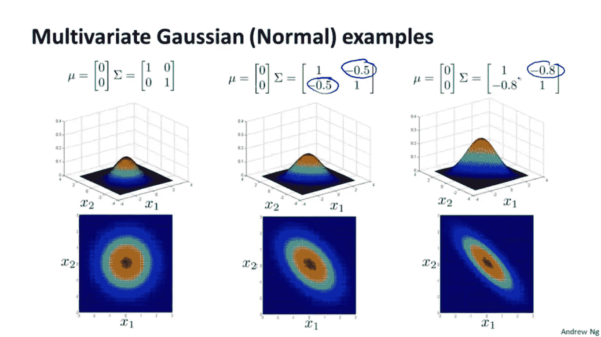

# 结论

1.  正态分布用于检测各种行业中的异常。
2.  单变量正态分布用于只有一个变量的简单异常检测
3.  当涉及两个变量时，仍然可以使用单变量正态分布，但它不能说明多个变量之间的关系，因此，当涉及多个变量时不推荐使用，有时不能发现异常
4.  多元正态分布利用协方差矩阵的幂来说明多个变量之间的关系，并证明是有效的

# 谢谢你