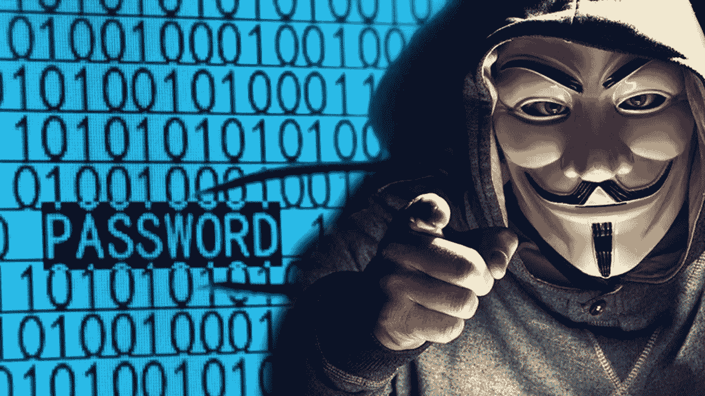
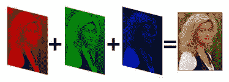
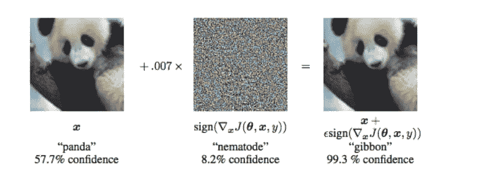
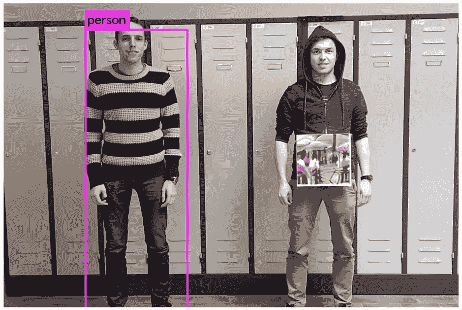
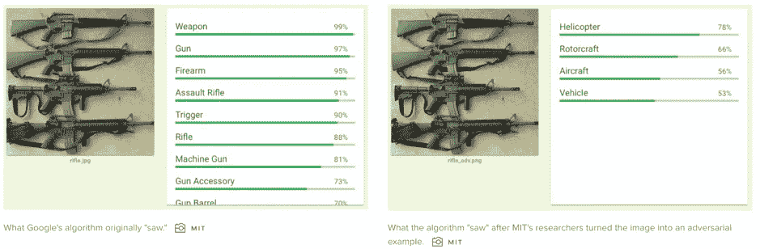

# AI 算法是怎么被忽悠的？

> 原文：<https://medium.com/analytics-vidhya/how-are-ai-algorithms-fooled-d83adf32d593?source=collection_archive---------13----------------------->

> “你的顾客是谁？(守卫者是谁？)”—拉丁谚语

人工智能无处不在，世界各地的公司都在不断地夜以继日地工作，以将更多的人工智能融入我们的日常生活。像 Alexa、Google Home、Siri 这样的产品是我们的虚拟助手，自动驾驶汽车正在竞争成为我们的司机，面部识别无处不在——从脸书照片标记到在机场更换登机牌，等等。世界各国政府正在为人工智能研究创建专门的部门。[中国已经在使用面部识别和人工智能算法对公民的各种参数进行评分](https://www.forbes.com/sites/bernardmarr/2019/01/21/chinese-social-credit-score-utopian-big-data-bliss-or-black-mirror-on-steroids/#66c7db4248b8)。已经做了很多工作，而且正在做更多的工作。在 5-10 年内，人工智能将更多地融入我们的日常生活，就像手机一样。

但问题来了——这些有多安全？它们万无一失吗？这些自主系统能以某种方式被“入侵”或“操纵”以迎合恐怖分子的邪恶企图吗？这些系统的“100%”转换是否可行且安全？最重要的是——人工智能算法本身能被用来愚弄其他最先进的人工智能算法吗？

让我们举几个人工智能算法在公共场合应用的例子。自动驾驶汽车——高效驾驶车辆，不再需要司机，通过优化交通和减少“人为错误”来缓解高速公路的拥堵。面部识别—快速安全的身份识别，更少的人力和成本。[到 2021 年，美国前 20 大机场将为“100%的国际乘客”部署面部识别功能](https://www.forbes.com/sites/kateoflahertyuk/2019/03/11/facial-recognition-to-be-deployed-at-top-20-us-airports-should-you-be-concerned/#12c891977d48)。这两个例子在很大程度上依赖于人工智能算法实时分类和识别“图像”和其他相关内容(视频、照片等)。

人工智能算法如何识别图像？

算法不像人脑那样读取图像。电脑读的是数字，不是图像。所有图像都由不同亮度的像素组成，跨越多个颜色通道。

像神经网络这样的深度学习算法在每一层上应用多个过滤器，这些过滤器在整个切片上传递，随后是激活、正则化、前向和反向传播，最后优化与每一层相关联的权重以最小化损失。在数百万和数十亿幅图像上完成训练过程后，为网络每层中的每个单元生成的优化权重现在可以应用于任何新图像，并且该算法将能够对图像进行分类。

**这些算法是如何被‘忽悠’的？**

该算法不看图像，它只是读取像素强度作为数字，并使用预先训练的权重来分类图像。如果仔细构造的噪声被添加到图像中，则权重像素相乘的结果可以被操纵以生成输出概率，使得算法将图像分类为完全不同的事物。

这种操作的一个例子是熊猫-长臂猿分类[1]。熊猫的图像被馈送到网络，网络正确地将该图像分类为熊猫的图像。现在，一个精心构建的噪声(噪声必须根据所使用的算法专门构建，但现在可以绕过这一限制，稍后将详细介绍)被添加到图像中。对于人眼来说，新图像看起来就像旧图像一样，但是对于算法来说，潜在的像素值已经改变。现在应用于新像素的权重生成了一个不同的矩阵，这迫使算法将图像分类为“长臂猿”而不是“熊猫”

图片来源:袁等[1]

Simen Thys 等人提出了另一个例子，展示了如何欺骗监控摄像头[6]。研究人员使用了一种人工智能算法，可以正确地对一个人进行分类(下图的左半部分)。现在，将一片图像放在人的身体上，算法未能将图像分类为人的图像(下图的右部)。为什么？因为图像的某个部分中的像素值已经以这样的方式被操纵，即它影响深度神经网络层中的激活，迫使它对输入图像进行错误分类，并且无法检测到图像中的人。

**含义:**想象一个拥有无人驾驶车辆网络的城市，这些车辆可以拍摄前方道路的视频，对视频中的每一帧对象进行分类(人、树、道路、交通灯等)，并做出决定(左、右、刹车、转向等)。如果有人将对抗性补丁放在交通灯上，自动驾驶汽车将无法检测到它，导致事故和死亡。或者，如果一个行人穿着一件有类似补丁的衬衫，车辆不会识别出这是一个人，车辆会碾过它。如果有人知道如何在机场这样的高安全性场所操纵面部识别算法(如前所述)——他们需要做的只是贴上一个对抗性的补丁或穿上一件带有特定图案的衬衫，他们就不会被检测到。此外，面部识别算法可能会被欺骗，认为此人不是实际的人 A，而是不同的人 b。这可能会给所有安全机构带来噩梦。

**对抗性攻击:**如果我们给任何图像添加这种噪声，它能骗过算法吗？不，这些不是随机的噪音或图案。这些是通过理解网络架构和理解网络如何被训练而产生的对立图像。待分类的图像被分析以查看哪些层或权重矩阵贡献最大，以及在改变图像的哪个部分时最终激活单元的改变是什么。这是仍然可以防止的事情，因为敌对攻击需要知道网络的细节，而这并不总是可用的或者可以被分类用于高安全性应用。

但是也有欺骗“黑盒”算法的方法。麻省理工学院的研究人员设计了一种方法来欺骗最先进的[谷歌的云视觉 API](https://cloud.google.com/vision/) ，通过瞄准图像的特定部分并操纵人眼无法检测的一些像素【3】。研究人员还发现了一种方法，可以为任何“黑箱”网络生成对立的例子，以操纵网络思考他们想要的任何东西(是的，不只是不正确的分类，而是他们想要的“任何”结果)。例如，他们通过操纵几个像素，骗过了算法，让它相信一张机关枪照片是一张直升机照片。图像在人眼看来仍然很好[4]。

这对基于人工智能的机场安检扫描仪构成了威胁，这种扫描仪可以扫描行李中潜在的武器或爆炸物。如果有人想绕过这一点，他们只需将某些其他物体放在行李的特定位置或一个对抗性的补丁，这样输入到人工智能扫描仪的图像就会失真，行李就会通过安全扫描仪

基于语音识别的物联网语音家庭助手，如 Siri 或 Alexa，正在变得越来越流行，越来越多的设备正在连接到它们。你现在可以通过向 Alexa 发出命令从亚马逊订购，或者控制灯光，或者打开你的门(以及其他许多事情)。它们将融入我们的日常生活，在我们坐下来放松时执行更复杂的任务。

《南方公园》动画系列中有一集很有趣——[它被特别制作成向 Alexa 发出某些命令，让它做某些任务——比如设置闹钟或讲笑话](https://www.theverge.com/2017/9/16/16318694/south-park-amazon-alexa-google-home)。成千上万的 Alexa 单元实际上响应了来自美国各地电视的这些命令，这表明愚弄这些机器是多么简单。

但这些机器肯定会变得更加安全，也许会使用语音识别算法，这样未经授权的用户就不会向它们发出命令。然而，他们仍然容易受到黑客的攻击，黑客可以使用更先进的生成对抗网络或 **DeepFakes** 模仿任何声音。

**通过学习愚弄另一个算法的算法——生成性对抗网络(GANs):**

gan 最初是由 Ian Goodfellow 在 2014 年提出的[7]，从那以后它们走过了漫长的道路。GAN 的架构由两个网络组成，一个是发生器，另一个是鉴别器。在图像的情况下，生成器生成图像，鉴别器将其与实际图像进行比较，并将反馈发送给生成器，生成器现在生成更接近实际图像的更好的图像。循环继续，直到生成器生成鉴别器不能从真实图像中区分的图像，从而将人工生成的图像作为真实图像。这也适用于其他领域——语音、文本、视频、音乐等。

来源:https://www . slide share . net/xavigiro/deep-learning-for-computer-vision-generative-models-and-adversarial-training-UPC-2016

不仅愚弄了人工智能算法，也愚弄了人类

这些对抗性攻击不仅仅局限于图像分类算法。在对现实世界的数据进行训练之后，生成式对抗网络可以用来“生成”全新的数据(图像、声音、文本、视频)。它可以通过对大量样本进行训练来生成全新的面孔，或者通过对语音算法进行训练来生成新的语音样本，或者生成某人的全新视频 Deepfakes 的世界[5]。Deepfakes 被吹捧为下一个大的安全噩梦，并且每天都在变得越来越好。这是一个有人模仿巴拉克·奥巴马的视频，老实说，很难判断这个视频是不是假的。这可以被用于破坏性的意图，以改变公众对任何人的看法，或煽动暴民，或伤害宗教情绪，导致骚乱和暴力！

[点击此处观看深度假奥巴马视频](https://www.youtube.com/watch?v=cQ54GDm1eL0)

**如何避免这些让 AI 更好更安全:**

这份清单并不详尽，但涵盖了一些要点。最重要的一点是，随着使用的增加，算法需要更加安全。我们可能会将目前的开源网络和技术转移到更安全和限制性更强的算法和技术平台，这些算法和技术平台将用于高安全性的环境中，并且不是每个人都可以使用。此外，深度学习算法需要在检测欺诈方面进行明确的训练，可能通过暴力方法或任何其他方法。GANs 越来越擅长生成可以愚弄人类的假图像，这些将需要特别注意。人工智能算法本身可以用来检测假图像或视频，比人类更好。此外，可以考虑难以复制的额外输入，例如，机场安全扫描仪可能会考虑面部图像、步态、身高、虹膜扫描等，以变得更加安全。

**为了构建越来越精确的人工智能算法，我们做了很多工作，但在我们开始使用这些算法并围绕这些算法构建我们的生活之前，我们需要保护它们，确保它们不容易受到欺诈。欺诈和黑客攻击仍会发生，但会更加困难。也许一个 AI 算法能更好的解决糊弄一个 AI 算法的问题。**

参考资料:

[1]袁，潘鹤，，朱，；对立的例子:深度学习的攻击和防御[https://arxiv.org/pdf/1712.07107.pdf](https://arxiv.org/pdf/1712.07107.pdf)

[2]克里斯蒂安·塞格迪、、杨青·贾、皮埃尔·塞尔马内、斯科特·里德、德拉戈米尔·安盖洛夫、杜米特鲁·埃汉、文森特·万霍克、安德鲁·拉宾诺维奇、谷歌公司；用回旋进一步深入[https://www.cs.unc.edu/~wliu/papers/GoogLeNet.pdf](https://www.cs.unc.edu/~wliu/papers/GoogLeNet.pdf)

[3]安德鲁·易勒雅斯、洛根·恩斯特罗姆、阿尼什·阿萨里、鞠波·林。具有有限查询和信息的黑盒对抗性攻击。https://arxiv.org/abs/1804.08598

[4]安尼施·阿萨里、洛根·恩斯特罗姆、安德鲁·易勒雅斯、凯文·郭。综合强有力的对抗性例子。【https://arxiv.org/abs/1707.07397 

[5]帕维尔·科尔舒诺夫，塞巴斯蒂安·马塞尔。DeepFakes:人脸识别的新威胁？评估和检测[https://arxiv.org/abs/1812.08685](https://arxiv.org/abs/1812.08685)

[6]西蒙·提斯、维贝·范·兰斯特、图恩·戈德梅、库·鲁汶。愚弄自动监控摄像头:攻击人员检测的对抗性补丁[https://arxiv.org/pdf/1904.08653.pdf](https://arxiv.org/pdf/1904.08653.pdf)

[7]伊恩·古德菲勒、让·普热-阿巴迪、迈赫迪·米尔扎、徐炳、戴维·沃德-法利、谢尔吉尔·奥泽尔、亚伦·库维尔、约舒阿·本吉奥。生成性对抗性网络[https://papers . nips . cc/paper/5423-生成性对抗性网络. pdf](https://papers.nips.cc/paper/5423-generative-adversarial-nets.pdf)