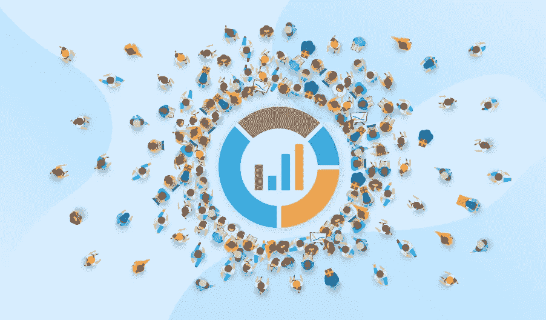
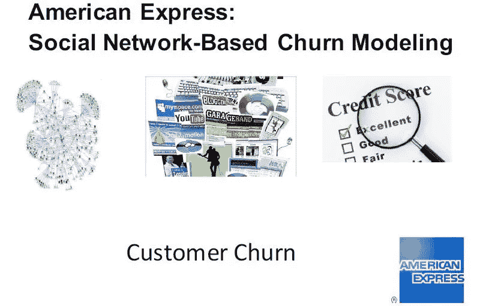
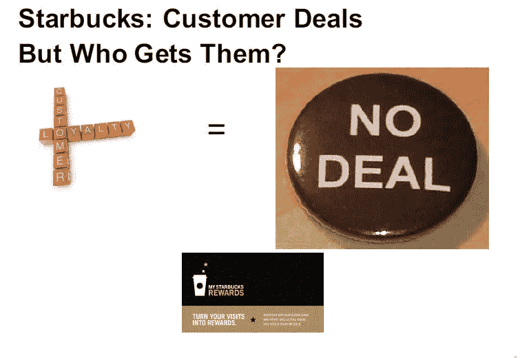
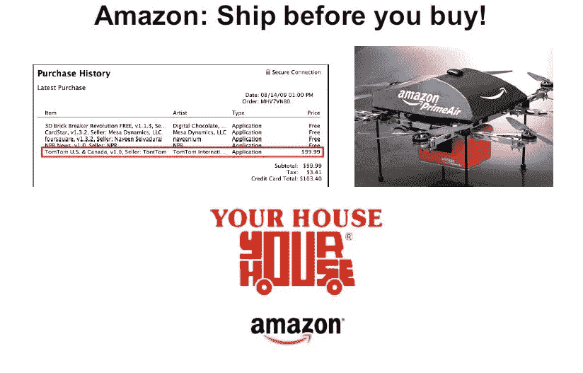

# 公司如何为他们的客户使用分析？

> 原文：<https://medium.com/analytics-vidhya/how-are-companies-using-analytics-for-their-customers-3d63b9afc44?source=collection_archive---------38----------------------->

这篇文章是关于领先公司使用的分析应用。

这些公司使用:-

1.  更好的数据
2.  更好的探索方法
3.  更好的预测方法
4.  更好的优化，以做出更好的业务决策，从而影响他们销售的产品和服务

让我从第一个开始。

# 1.科尔百货公司

美国柯尔百货公司百货大楼是一家超大型的全国性连锁百货公司。他们正在做所谓的*智能手机瞄准*。例如，当你走进他们的商店&打开你手机上的 Wi-Fi 时，他们会获得你的地理位置数据。

每个人的手机都有固定的 IP 地址，可以知道是你。如果你去过他们的网站 kohls.com，他们现在可以链接你以前浏览过的内容。

假设他们知道 X 先生站在卖鞋的过道前。他们现在可以通过文本或任何促销代码向他发送鞋子的实时折扣。他们实际上知道顾客站在哪里。

现在，**他们采取的行动是根据他的地理位置给他发送一个有针对性的或有背景的折扣。**

> 这是极其宝贵的数据。这不仅仅是向客户销售合适的产品，而是在合适的时间、合适的地点销售合适的产品。

美国柯尔百货公司在占便宜， ***在那个人到达商店前 30 分钟没有价值，30 分钟后也没有价值，当他站在那里的时候就有价值了*** 。他们可以利用这些数据来做决策，并且他们会对此进行合理化的解释。

这是另一个，

# 2.出租 DVD（网站）

让我告诉你网飞在做什么。**网飞正在做所谓的元数据标记**当然，当你登录网飞时，他们知道你在看什么。这是客户分析的极致。

他们可以逐个评估客户在看什么。但这也是他们正在做的。你看的每个节目都有所谓的元标签，比如属性或描述符。

所以他们知道 X 先生是否看过发生在 20 世纪 70 年代一个温暖城市的警察节目。想象一下，拥有来自数百万客户的数据。

现在，与其说我们能创作出什么样的节目？

现在，想象主管坐在那里说，我看到了数据告诉我的东西。人们非常喜欢发生在 20 世纪 70 年代温暖城市的警匪片。嘿，让我们从 20 世纪 70 年代的温暖天气中创造一个警察秀。

> 因此，像网飞这样的公司正在做的是，他们使用数据挖掘和客户分析方法来创建内容。

# *3。美国运通*

美国运通今天面临的一个大问题是客户流失建模。他们想知道谁会放弃他们的美国运通卡，为什么？客户流失是客户终身价值的一大部分。如果有人通过美国运通进行交易，美国运通在他们进行交易后不会从中获得任何收入。

> 所以你会说，美国运通需要分析做什么？

你申请了一张美国运通卡，你填写了大量数据，当美国运通发现*你的社交网络数据是你是否会流失的一个非常强有力的预测器。*因此，美国运通正在做的事情也是今天许多公司正在做的事情。

**他们合法地从万维网上搜集数据**比如说，X 先生，他们把这些数据作为额外的变量加入预测他是否会流失。

比如说，如果 X 先生今天在脸书上发帖。

> 哦，天啊，我破产了，还丢了工作。

> 这很可能预示着他是否会流失或者可能不会偿还他的美国运通卡。

更好的数据，公司可以管理和收集这些数据。他们可以通过 ***自然语言处理*** 技术量化数据，从发布在网络上的材料中提取文本数据。他们将这些数据转化为数字数据，并将其纳入数字流失模型。

**这是非常有价值的数据，现在是分析领域的一部分。**

# 4.星巴克

星巴克实际上是一家比人们认为的更出色的分析公司。上面的两张图片看起来矛盾，好像它们不搭配，好像顾客忠诚等于没有交易。

***什么叫顾客忠诚等于不成交？***

公司给他们忠诚的顾客最好的交易，对吗？不，这是不对的。你应该提供最佳交易的人是那些通过提供交易改变他们购买/购买行为的人。

一个每天都光顾星巴克的人。你认为如果他们给他一笔交易，他会在星巴克停下来吗？

> 但是你不会把交易给你最好的客户，你会把投资回报率最高的交易给你的客户。

星巴克通过他们的忠诚计划认识到了这一点。他们想给那些濒临忠诚边缘的人交易。

他们想把不忠诚或不经常光顾的顾客变成常客。因此，他们将分析提升到了一个新的高度。

高价值客户已经很忠诚了，他们已经买了很多东西，公司可能已经从他们的钱包中分得了很多份额。你应该瞄准那些不常见的，星巴克知道这一点。

# 5.亚马逊河

***亚马逊，先发货再购买。*** 你在这里看到一张某人购买历史的图片，你可以看到一张购买无人机的图片。

亚马逊能做的是，他们可以提前预测 X 先生会买什么。他们可以把它运送到他家附近的当地零售商那里。所以如果他订购了，他会在当天收到。

> 想象一下，如果你在中午前订购，产品将在今天下午 5 点前送到你家，你可以建立的可能性和客户终身价值。

想想你愿意为此付出多少。现在，又是什么让亚马逊做到这一点？

1.  他们获得了非常好的数据，因为他们在个人客户层面跟踪数据。
2.  他们有一个预测模型的推荐引擎。所以他们可以预测 X 先生未来会买什么。
3.  他们在各地都有大量的当地零售商。
4.  他们有能力对此采取行动并收费，我们称之为*亚马逊 Prime* ，它可能是免费送货，但如果你当天想要它，你需要支付额外的费用。

想象一下分析给这类公司带来的力量。我想和你分享的是技术与管理和营销科学的结合。

你觉得这篇博客有帮助吗？请在下面的评论区分享你的观点/想法。🙂