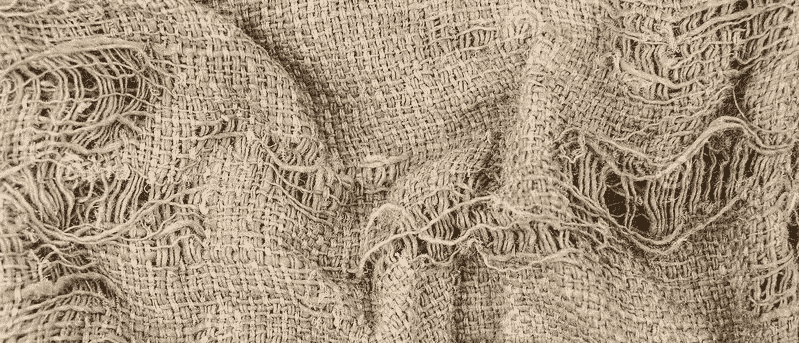
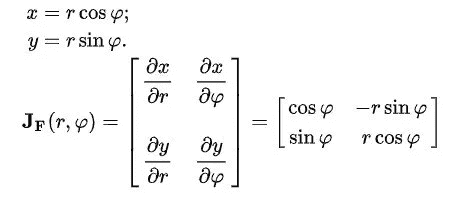
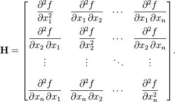
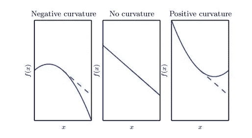

# 二阶导数如何用于多维优化:深度学习

> 原文：<https://medium.com/analytics-vidhya/how-are-second-derivatives-used-for-multidimensional-optimisation-deep-learning-72650700d6a4?source=collection_archive---------11----------------------->

我们都知道数学中的导数，它表示一个量相对于另一个量的变化量。这形成了机器/深度学习的基本指标之一，其中我们使用成本函数中的导数来减少损失，以获得最佳预测。梯度只是这些导数的多变量推广。在深度学习中，我们使用梯度下降优化，这是一种在标量值输入的情况下最小化损失的技术。虽然导数可以定义在单个变量的函数上，但是对于多个变量的标量函数，我们可以使用梯度优化。

有些函数不仅仅使用标量输入，比如向量输入。这就是二阶导数发挥作用的地方。

> 这篇文章用两分钟的时间简单解释了二阶导数如何用作优化中的输入，以及它们在确定最小损失/成本函数的路径中如何有用。

雅可比矩阵是接收输入向量并给出输出向量的矩阵。当我们遇到值不再是标量的情况，我们有向量值函数，我们就不能使用正常的梯度下降。输入需要以不同的形式表示，我们将使用雅可比矩阵来表示这种矢量输入函数。**雅可比矩阵相当于向量值的梯度函数。**我们会得到函数的一阶导数。考虑有两个输入，x 和 y 是函数。雅可比矩阵由函数 x 和 y 的一阶导数形成，如下所示:

雅可比矩阵及实例

当我们有多个输入维度时，我们倾向于采用标量函数的二阶导数。这些放在一起形成一个类似于雅可比矩阵的矩阵，称为海森矩阵。如果你看到，黑森矩阵是一个对称矩阵。对于实函数，它有实本征向量。要了解更多特征向量，请阅读[我以前的文章](/@mr.vigneshwarilango/meet-mr-eigenvalue-and-mr-eigenvector-from-svd-76c322cbcd24)。**海森可以看得更像一个梯度的梯度或者一个梯度的雅可比(这是一个向量)。**

海森矩阵

如果你看矩阵，我们有输入函数的二阶导数。

# **为什么我们在 Hessian 矩阵中使用二阶导数，它对成本函数有何帮助？**

二阶导数告诉我们，当我们改变输入时，一阶导数会如何变化。这有助于我们确定多大程度的梯度步长会导致仅基于梯度的改进。

## 二阶导数帮助我们测量**曲率**。

假设我们有一个二次函数，那么如果我们计算二阶导数，我们可以推断出梯度的以下信息:

该图描述了具有各种曲率的二次函数。虚线表示我们在下坡时仅基于梯度信息所期望的成本函数值。

1.  如果二阶导数为零，那么就没有曲线，它只是一条直线(正如你在中间的图片中所看到的)，它的值只能通过使用梯度来预测。如果梯度为 1，成本函数在负梯度中减少一个小的量，比如 x。换句话说，我们可以只依赖于梯度。梯度正确地预测了下降。
2.  如果二阶导数为负，则函数向下弯曲，成本函数下降超过 x。成本函数实际上比梯度预测的下降更快。(如左图所示)
3.  如果为正，则函数向上弯曲，成本函数下降小于 x。函数下降比预期慢，最终开始增加，因此过大的步长实际上会无意中增加
    函数。

因此，二阶导数显示了不同形式的曲率如何影响由梯度预测的成本函数值和真实值之间的关系。

现在，您可以看到二阶导数是如何在 Jababians & Hessians 和其他约束优化中使用的。祝您愉快！

*参考文献:* [*数据驱动的科学与工程*](https://www.amazon.com/Data-Driven-Science-Engineering-Learning-Dynamical/dp/1108422098/)

如有任何进一步的讨论，请随时联系:
**LinkedIn**:[https://www.linkedin.com/in/vigneshwarilango/](https://www.linkedin.com/in/vigneshwarilango/)
**Gmail**:mr.vigneshwarilango@gmail.com

> *问候，
> Vigneshwar Ilango*