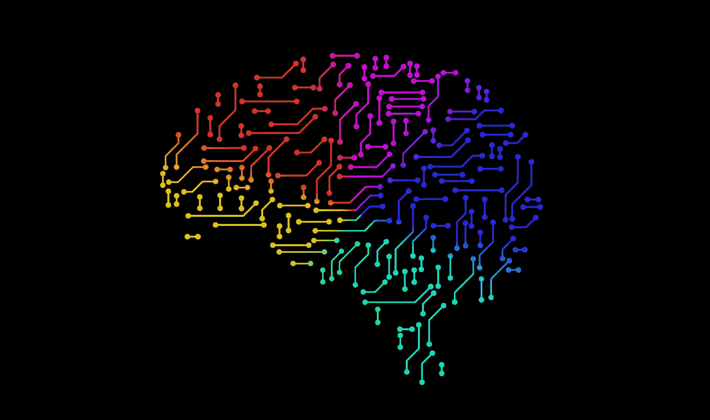
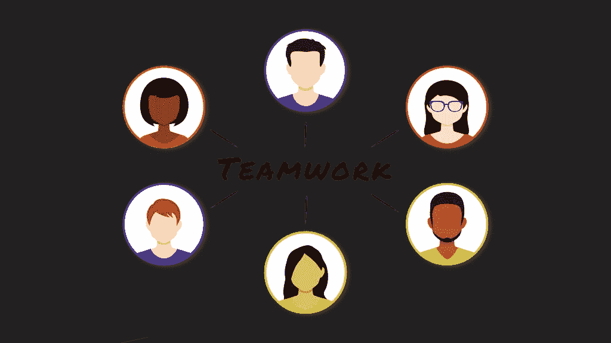

# 人工智能如何塑造人力资源的未来

> 原文：<https://medium.com/analytics-vidhya/how-artificial-intelligence-is-shaping-the-future-of-human-resource-598b7ed185be?source=collection_archive---------27----------------------->

## 机器学习在人力资源中的应用

毫无疑问，人工智能正在彻底改变每个行业。在其行业中采用 it 应用的组织在许多任务上看到了效率的提高和时间的减少。在这场像风暴一样席卷每个行业的 AI 浪潮中，人力资源专业人士并没有被冷落。在这篇文章中，我们将深入探讨人工智能在人力资源领域的一些应用。我们将看到它在以下方面的应用:

*   工作推荐
*   员工招聘
*   采访
*   员工入职
*   员工敬业度
*   员工流失
*   员工发展
*   性能管理

## 工作推荐

有一些解决方案可以帮助求职者进行工作推荐和职业发展。他们能够根据一个人的个性和以前的经验推荐工作和职业道路。这一点很重要，因为它确保候选人不会发现自己走上了自己不喜欢的职业道路。这也有助于人力资源专业人员将候选人安排在他们最有可能表现良好的岗位上。这将降低雇佣新员工的成本，因为员工讨厌这个职位并辞职的可能性降低了。

[来源](https://unsplash.com/photos/GOMhuCj-O9w)

## 员工招聘

在招聘中，人工智能被用来获得符合角色和组织文化的候选人。考察潜在员工的文化契合度至关重要，因为就技能而言，一些员工适合某个角色，但不会很好地融入组织的文化。人工智能系统通过计算每个候选人的合适分数来做到这一点。该系统还可以预测候选人在特定角色中的表现，从而使招聘经理更容易做出招聘决定。

这些系统还可以从博客和社交媒体档案中提取外部数据，以便能够全方位了解候选人。这些系统对于消除招聘过程中的人为偏见至关重要。为了减轻安排与候选人会面的负担，人工智能助理也可以代表招聘经理执行这项任务。这些助理通过与候选人协调来找到适合他们和招聘经理的时间。

## 采访

人力资源专业人员可以使用基于代理的面试，尤其是当他们需要面试很多人的时候。这可以解放人力资源职业去做其他事情。这些面试机器人能够确定候选人的情绪，他们是否说实话，以及他们的穿着。然后他们给候选人打分。

然后，人力资源专业人员可以浏览筛选出的候选名单，节省他们在面对面面试中花费的大量时间。使用这些面试机器人的优势包括他们能够同时面试许多候选人，并保持时间。这方面的一个主要挑战是在面试过程中缺乏人情味。

[来源](https://unsplash.com/photos/bwki71ap-y8)

## 员工入职

在入职过程中，员工通常会有许多问题。虚拟助理可以用来搭载员工。在这个过程中，聊天机器人可以解决他们可能有的任何问题。这些问题可能包括福利登记、休假、公司政策、个人成长等等。

在此过程中，虚拟助理还可以收集员工对面试和入职过程的反馈。这个反馈可以用来使整个过程变得更好。这样做的好处是，员工不需要在办公室开始入职流程，入职流程可以全天候进行。

[来源](https://unsplash.com/photos/GwOqUzrDSRM)

## 员工敬业度

不言而喻，一个更投入工作的员工可能比一个不投入的员工在一份工作上呆的时间更长。随着计算机视觉和语音识别工具的发展，人工智能可以用来确定员工的参与度。计算机视觉工具可以用来从员工的面部表情来评估他们的参与度。例如，如果员工看起来有压力，该工具可以推荐一些压力管理资源，甚至建议休息一天。

分析员工的声音也有助于确定他们对某项任务的参与程度。值得一提的是，这种分析会带来严重的隐私问题。如果你选择了这条路，那么请务必小心行事。

## 员工流动

员工培训通常是大多数组织预算中的一项大开支。因此，他们希望确保训练有素的员工尽可能长时间地留在组织中。然后，组织想知道员工离开组织的概率。

他们也想知道为什么优秀员工会离开公司。有了这些信息，一个组织就能够对未来进行充分的规划，并想出激励措施来留住优秀的员工。员工离职的可能性可以通过满意度调查以及他们与组织系统的互动来计算。

## 员工发展

员工成长和发展是大多数员工和组织关心的主要问题。员工更有可能留在一个他们觉得自己作为个人正在成长的组织中。组织可以部署一个系统，根据员工的兴趣、市场趋势和组织的需求向员工推荐课程。例如，在一些职业中，如与技术相关的职业，事物变化如此之快，让员工了解组织想要使用的新技术是很重要的。这种个性化对于确保每个员工的个人发展都得到关注至关重要。这些应用程序的美妙之处在于，它们还可以为每个员工提供个性化的指导。个性化辅导将使员工在其职业生涯中不断成长。

[来源](https://pixabay.com/illustrations/training-training-course-3185170/)

## 性能管理

有效的团队对任何组织来说都是至关重要的。仅仅根据他们的个性来配对已经不够了。机器学习系统和心理测试可以用来确定在特定团队中工作的每个人的健康状况。这确保了工作的高效交付以及良好的工作关系。这些系统也可用于评估员工的绩效。这消除了可能有偏见的人工审查的需要。绩效也是实时完成的，不像我们必须等待经理来做评估。

另一个关键优势是，这些审查可以更频繁地进行，因为他们的机器现在在后台工作。这对于向员工提供频繁的反馈而不是等待季度评估非常重要。当员工经常得到反馈时，这意味着他们改进的周转时间大大减少。这些系统可以激励员工保持良好的表现。

在管理员工时，系统可以自动响应网络问题以及组织中各种应用程序的性能。

[来源](https://pixabay.com/illustrations/teamwork-hr-management-team-people-4173707/)

## 最后的想法

总而言之，人工智能在人力资源中的应用面临着偏见、隐私和缺乏职业中的人际互动等挑战。可以通过确保训练数据很好地平衡来解决偏差。隐私问题可以通过使用诸如 tensor flow Privacy 或 T2 联合学习这样的库来解决。TensorFlow Privacy 确保在训练模型时考虑到隐私。联合学习确保模型可以用分散的数据来训练。使用分散数据意味着训练数据保留在用户的设备上，例如他们的手机。

缺乏人情味的问题可以通过将人工智能系统与人工干预相结合来解决，以确保所有任务都不会留给机器。

希望这篇文章已经给了你一些如何在你的组织中开始应用人工智能工具的想法。

 [## Python 中的数据科学训练营

### 学习 Python 的数据科学，NumPy，Pandas，Matplotlib，Seaborn，Scikit-learn，Dask，LightGBM，XGBoost，CatBoost 等等…

www.udemy.com](https://www.udemy.com/course/data-science-bootcamp-in-python/?referralCode=9F6DFBC3F92C44E8C7F4)