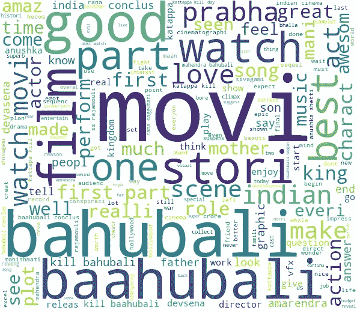
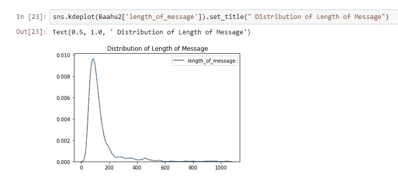
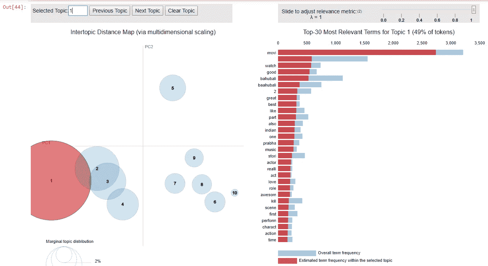

# 巴胡巴利是如何超级成名的？(第二部分)

> 原文：<https://medium.com/analytics-vidhya/how-baahubali-got-super-fame-part2-e20e57a6d90e?source=collection_archive---------19----------------------->

让我们继续我们的旅程来解决这个难题。在我之前的博客中，我已经取消了来自 Mouthshut.com.After 的[电影评论](/@kirank.isme1820/how-baahubali-got-super-fame-4905921b05dd?sk=8510d3ac1ec018b0e5c2d0a68d5e8bc0)获得评论我们的下一步是分析评论。对于电影分析，我们主要关注电影评分，电影评论 _ 内容。通过这两个变量，我们可以找到流行的原因。

电影分级会以明星的形式表现这种情绪。如果观众会喜欢，收视率会是 4 比 5。对于 Baahubali 的结论，他们得到了 4.36/5 的平均评分。

电影评论内容将显示关键词，标签。来代表他们对这部电影的感情。假设有人会喜欢德夫塞纳、安努舒卡·谢蒂、帕拉巴斯、巴尔德夫或故事主题。由于 Baahubali 1，观众心中产生了悬念。这让巴胡巴利的结论更加出名。所以，让我们开始我们的吸引力搜索磁铁。

**Baahubali 评论分析**

对于这个分析，我们将使用不同的库，比如 seaborn 和 matplotlib 用于可视化，pandas 用于数据操作，spacy 和 nltk 用于文本操作。所以让我们导入分析所需的所有库。

在 python 笔记本中导入 Baahubali CSV 文件

评论 _ 内容来自 Baahubali CSV

现在我们要进行评级分析。它的评分介于 1 到 5 之间。

**巴胡巴利电影最高收视率**

从上面我们可以看到，超过 60%的收视率下降到 5 星以下。说明观众很喜欢。这一点我们可以从上面的数据中得到验证。现在正在向他们喜欢的东西靠拢。

评论 _ 5 颗星以下的内容

评论 _ 4 星评级的内容

评论 _ 三星级以下的内容

在这里，我们有一个 3 个词的不同评级的评论内容云。因此，让我们借助电影分级变量来解决我们的难题。从上面的字云，我整理出几个字。三朵云里常见的那些话。也有助于我们的查询大纲。一开始，我们对因素做了一个假设。这可能是受欢迎的原因。所以这些词是帕拉巴斯，巴胡巴利，卡特帕杀死，性格，故事，杀死巴胡巴利，动作，图形，印度，第一部分，拉贾穆里，真的。

在结论部分之前，我想知道每个词在整个内容中的权重。评论者使用这些词的频率。为此，现在我们将分析电影评论的内容。

评论长度 _ 内容

所以评论内容的长度是正向倾斜的。大部分篇幅在 0-350 字之间。

已清理消息的标记化

主题建模

来自标记化内容的 10 个主题

**10 个主题的仪表板及其频率图**

在上面的控制面板中，我们可以看到主题 1 涵盖了 49%的令牌。这意味着主题 1 中的单词与其他 9 个主题有更多的相似之处。让我们把事情弄清楚？现在，我们将借助相似性得分(连贯性得分)来看看哪个主题更占优势，以及它与其他主题的相似性如何

标记化评论的一致性得分

在上表中，我们可以看到在所有 10 个主题中占主导地位的情况。主题号 0，1，3，4，7，8，9 都有一个支配点，支配点在 0.8 到 0.9 之间，并且具有相同类型的关键词。一致性得分为 0.39，这意味着大约。除了主导主题，每个主题中有 40%的关键词是相似的。由于关键词的相似性，主导主题将具有更高的一致性分数。

上图和每个主题的一致性分数代表相同的相似度百分比。大约多了 40%左右。

所以我们通过分析得到了一些关键词，这些关键词将帮助我们做出故事的结论。这些词是巴胡巴利，帕拉巴斯，卡特帕，杀戮，第一，印度，行动，观看，好。但是我们将只使用与查询相关的单词。因此，让我们框定我们的问题的答案。

人们喜欢它是因为巴胡巴利第一部中的悬念“为什么卡特帕要杀死巴胡巴利”。这是一个基于印度文化的故事，涵盖了母亲和儿子的爱情场景。充满行动浪漫的爱情故事。帕拉巴斯和阿努什卡之间的化学反应很好。人们也喜欢这些角色，像德夫塞纳、巴拉德夫、阿姆伦达·巴胡巴利、卡特帕等等。

成功故事的框架