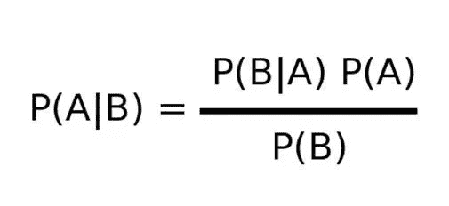
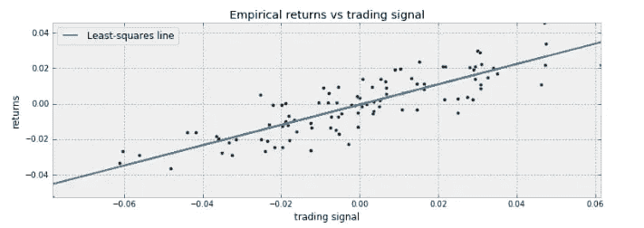
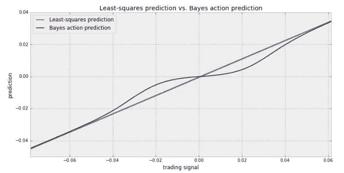

# 贝叶斯推理在数据分析中的工作原理

> 原文：<https://medium.com/analytics-vidhya/how-bayesian-inference-works-in-data-analysis-578af48ab6b8?source=collection_archive---------27----------------------->

> 我们可以通过随机实验为我们先前的信念提供证据

在高中，你可能学过贝叶斯定理，它指出，如果一个事件(随机实验)依赖于不同的其他事件(或者这里我们说信念)的概率是已知的，那么我们可以找到我们的一个信念依赖于随机实验的概率。

例如，随机实验 A 依赖于事件 B(信念),

P(A) = P(A ∩ B) + P(A ∩ notB)，这给出

P(A)= P(A | B)P(B)+P(A | notB)P(notB)

当我们知道 A 对 B 和 notB 的依赖概率时，我们就可以计算我们信念的条件概率，即 P(B)

P(B|A) = 1 - P(A|notB)/ P(A)

在贝叶斯推理中，我们把我们之前信念的概率称为**先验**，把我们随机实验的概率称为**后验**。

在真实世界场景中，后验概率是从我们想要分析的实际数据中生成的，并且我们的先验信念的概率是作为我们的后验的函数来计算的。

**概率编程**纯粹是贝叶斯推理的结果，用于预测和信心测试我们对数据科学的信念。概率编程比机器学习模型有一个优势，它显示了与预测相关的风险以及我们可以对我们的模型显示多少信心。基本上，它不是用于模型生成或在软件中实现，而是用于通过测试参数值超过一千次甚至更多次来获得洞察力或推断。

我将借助两个例子来说明贝叶斯推理是如何工作的。第一个是简单的数学难题，第二个是概率规划的介绍性例子。

假设我们有两个名为 A 和 B 的乞丐，分别装着红色和蓝色的球，袋子 A 有 5 个红色和 7 个蓝色的球，乞丐 B 有 4 个红色和 8 个蓝色的球。现在我从一个袋子里抽出一个球(不知道是哪个袋子)，发现是红色的，让我们用 X 表示这个事件。

这里，我有一个信念，球是从袋子 A 中取出的(这个信念可以是任何直觉、经验或领域知识)，让我们把从袋子 A 中取出球的事件表示为‘A’，从袋子 B 中取出球的事件表示为‘B’。从两个袋子里抽出球的可能性是一样的。

P(A)=P(B) =0.5，也

P(X|A ),即球从袋中取出时是红色的，A = 5/12

类似地，P(X|B) = 4/12

现在，假设在不同的独立抽奖中，我们发现 P(X)即红色的球是 0.3，这是我们的**后验**和我们的**先验**是 P(A|X)，为了找到它，我们将使用贝叶斯定理，

P(A | X)= P(X | A)P(A)/(P(X | A)P(A)+P(X | B)P(B))。这给了

p(A | X)=(0.5 X 5/12)/(0.5 X 5/12+0.5 X 4/12)= 0.55

这是我们先验信念的概率。根据这些结果，我们可以更新我们的信念。这就是贝叶斯推理如何塑造我们的信念。现在我们更新的信念是，如果抽一个红球，球有 55 %的机会从袋子 A 被拿走。

另一个例子来自《黑客的贝叶斯方法》这本书。它是贝叶斯方法在损失函数最小化中的应用。损失函数用于通过寻找回归线的最佳参数来使我们的回归线最佳拟合数据，例如，如果您试图将一条直线拟合到您的数据中，则该直线的方程将为:Yhat = aX +b

x 和 Y 是表示数据点坐标的变量，a 和 b 是线参数，而 Yhat(读作 Y- hat)是使用线性回归模型的预测变量。如果我们使用 MSE(均方误差)作为误差度量，我们的损失函数将看起来像，

这是我们的损失函数，用 aX +b 代替 Yhat，我们试图找出 a 和 b 的最佳值。如果我们的数据是线性的，使用线性回归是可以的，但是如果我们的数据是非线性的或者带有噪声的线性，那么线性回归不会产生好的结果。假设我们的数据看起来像这样，

这是我们的交易信号数据(模拟的)，显然我们的线性回归线不能很好地拟合数据。这里进入图片贝叶斯方法，假设我们修改我们的线的方程为 Yhat = aX +b +c

这里，我们引入了一个新的变量“c”来改善数据，c 被称为变量，因为它的值不是固定的，而是相对于 x 而变化的。c 变量说明了数据与线性的差异，并使直线更好地拟合数据。

使用概率编程，如 pyMC3，它主要用于“黑客的贝叶斯方法”一书中，我们可以生成变量 c 的样本，假设它是正态分布的。我们不去研究概率规划或 pyMC 的细节，在这里我只是告诉你，你可以使用 pyMC 建模找到我们的随机变量‘c’的最佳值。一旦我们观察到 pyMC 建模的结果，我们就可以用旧的回归线绘制新的回归线，如下所示

这里我们使用了贝叶斯推断，假设变量 c 为正态分布，这比单独使用线性回归要好得多。

霍普，你会对贝叶斯方法有所了解。