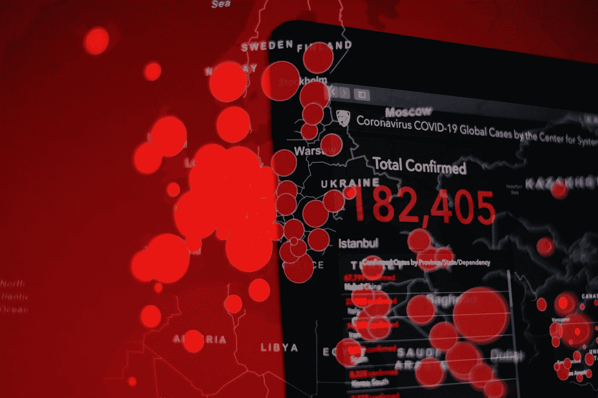
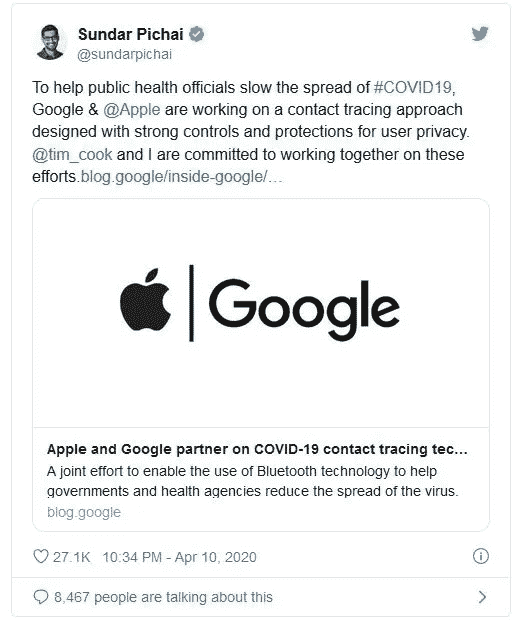
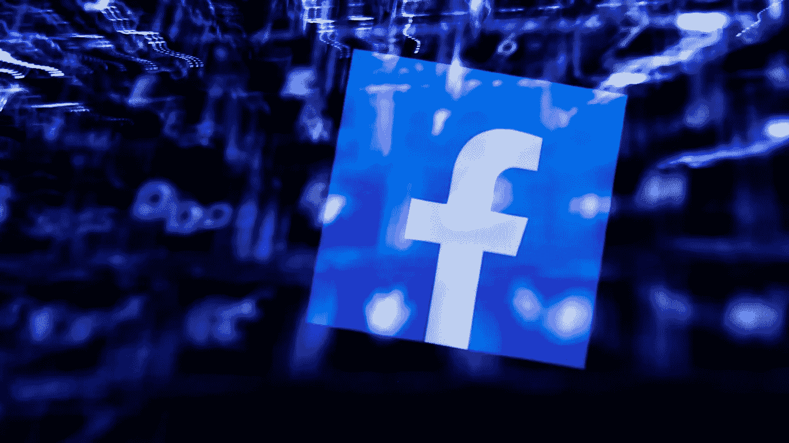

# 大数据如何帮助应对全球疫情危机

> 原文：<https://medium.com/analytics-vidhya/how-big-data-helps-combat-the-global-pandemic-crisis-e0260c9e74b8?source=collection_archive---------18----------------------->

*数据科学和大数据行业正在寻找一种方法来帮助对抗疫情。数据科学家和人工智能工程师正在帮助整个组织。*

由[布莱恩·麦高恩](https://unsplash.com/@sushioutlaw?utm_source=medium&utm_medium=referral)在 [Unsplash](https://unsplash.com?utm_source=medium&utm_medium=referral) 上拍摄的照片

自从 1918 年西班牙流感造成大破坏，导致近 1 亿人死亡，经济衰退以来，它被称为疫情袭击。同样，新冠肺炎，这种新型冠状病毒早些时候被世界卫生组织宣布为疫情，在全球范围内引发了恐慌。

新冠肺炎的后果是严重和令人不安的。全球死亡人数持续快速增长，没有减缓的迹象。意大利和法国目前处于完全封锁状态。在海外旅行的澳大利亚人被要求尽快回国。美国刚刚见证了他们在这个国家的第 100 次死亡。

世界各地的科学家和研究人员正在迅速行动，在新冠肺炎全面了解世界各地的破坏程度之前，为它开发一种疫苗。新技术有助于对抗这种致命病毒吗？根据专家的说法，这些技术可以创造奇迹，通过共享健康数据，建立数据模型，开发药物，以及实施机器人来清洁不安全的区域和治疗隔离区的人们。

令人惊讶的是，疫情的传播带来了跨越实施****的大数据分析和人工智能来对抗病毒。这涉及到医疗保健行业的各个部门，它们都在寻求减少和监控这种病毒造成的影响。****

********

******全世界都在做什么来对抗冠状病毒？******

****亚马逊、微软、谷歌、脸书和苹果等顶级公司的高管与唐宁街的官员会面，讨论他们是否有足够的能力对抗疫情。他们的重点主要是利用大数据和人工智能来跟踪与感染密切相关的人的健康状况。中国已经成功地使用**大数据分析**和人工智能来应对新冠肺炎，而世界其他地方仍在操纵他们是否可以使用相同的方法来撤回病毒。****

****中国:他们对待新冠肺炎的方式****

****中国主要城市的火车站都安装了热扫描仪。这些扫描仪使用大数据和人工智能来识别和识别那些显示发烧症状的人，然后提醒在同一车站或同一车厢旅行的人。****

****此外，如果某人要通过公共交通工具旅行，该人必须使用个人身份证明购买车票，该行为当然使得有可能获得关于乘客旅行历史的密切信息。****

****使用同样的安全措施，甚至其他国家也可以开始在公共场所安装热扫描仪和面部识别技术。****

****另一家人工智能公司表示，他们正在密切关注一种技术解决方案，结合面部拘留、身体检测和双重传感，借助红外摄像机帮助员工或工人识别高温人群。另一方面，另一家人工智能公司推出了一种基于人工智能的解决方案，以改善医疗设施，成像过程和诊断速度，提供 96%的病毒分析准确率。这可以极大地改变目前值班且装备不足的医疗保健和医务工作者的生活。****

> ****世界卫生组织(世卫组织)最近表示， [**数据科学**](https://www.dasca.org/) **和人工智能产业已经成为中国应对新冠肺炎的主要部分。******

******数据共享******

****借助 Crowdtangle 等工具，社交媒体在分析人们对疫情的反应方面发挥着重要作用。****

********

****脸书通过与哈佛大学公共卫生学院和台湾国立清华大学的研究人员合作，正在制造一场巨大的疫情，这样人们的移动数据与高分辨率密度地图一起共享，帮助他们预测病毒的传播。****

****在过去的几年里，谷歌搜索数据被用来跟踪传染病。****

****与此同时，谷歌正在开发一种小型的人体温度贴片，可以轻松地将数据传输到手机应用程序。这将帮助人们跟踪他们的健康状况。****

****这种贴片非常适合老年人群，因为老年人群的发病率和死亡率都很高。****

****今年早些时候，英国初创公司 Exscienta 是第一家将人工智能设计的药物分子投入人体试验的公司。理想情况下，算法创建它需要大约 12 个月，然而，这将需要 4 到 5 年的传统研究。****

****根据首席执行官安德鲁·霍普金斯教授的说法，人工智能在当今时代可以很容易地用于三个方面****

******👉**浏览现有药品，看是否可以改变用途。****

******👉**设计能够对抗当前和未来[冠状病毒爆发的药物。](/@taylor.mark110/how-can-data-science-be-instrumental-in-combating-corona-outbreak-2b0ef0f2f31)****

******👉**为新冠肺炎开发抗体和疫苗。****

******如上所述，实现这一目标的最快方法可能需要至少 18-24 个月。******

****遗憾的是，这比当前危机所需的时间要长得多。****