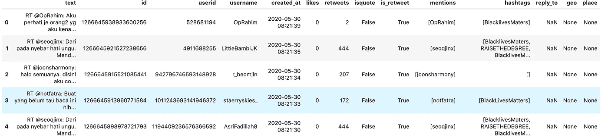
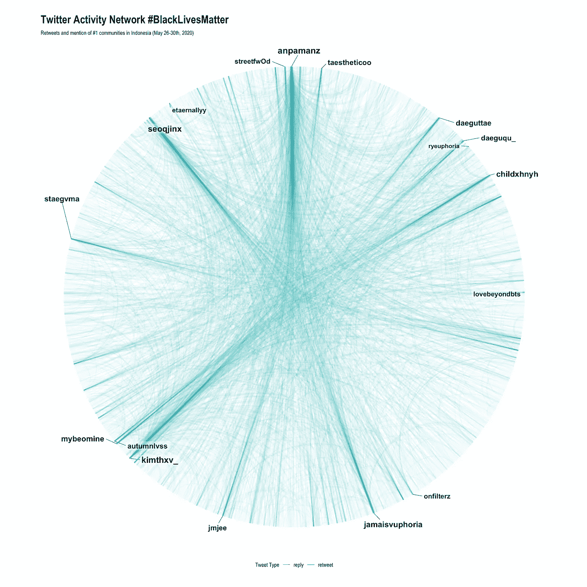
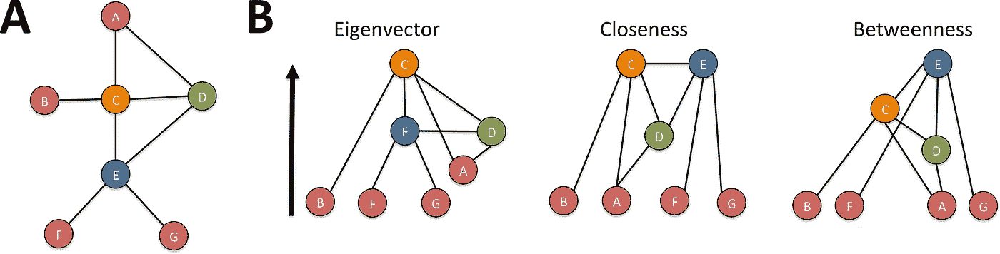
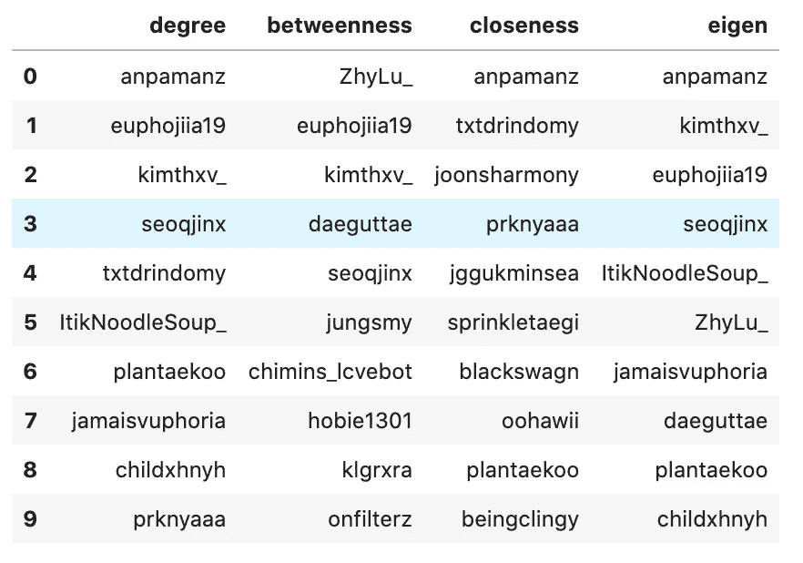

# #BlackLivesMatter 是如何迅速传播的

> 原文：<https://medium.com/analytics-vidhya/how-blacklivesmatter-went-viral-3f911378bf65?source=collection_archive---------30----------------------->

## 印度尼西亚基于 Tweets 的活动网络分析与可视化

[于切尔·莫兰](https://unsplash.com/@yucelmoran?utm_source=medium&utm_medium=referral)在 [Unsplash](https://unsplash.com?utm_source=medium&utm_medium=referral) 上的照片

我试图回答这个标签是如何迅速传播的，并找出背后的关键人物。请注意，这不是出于任何政治影响，而纯粹是为了教育目的。

## 1.获取数据

2020 年 5 月 30 日，我使用 Twitter API(Python 可以使用`tweepy`或者 R 可以使用`rtweet`)搜索“#BlackLivesMatter”标签，结果得到了近 19000 条推文。

当然，在搜索查询之外，有很多与这个问题相关的推文，但让我们假设这是我们得到的所有推文。我决定从推文中提取几个变量作为信息，这里是数据的一瞥。

数据帧格式的 Tweet 示例

## 2.建立网络

为了实现这一点，我创建了一个包含**节点**和**边的网络。**节点是数据中任何唯一的人(用户名)的表示，而边是两个节点之间的连接，表示从节点 A 到节点 b 的一个活动。

为了清楚起见，我将连接类型分为 Retweet 和 Reply，并将网络构建为定向网络。定向网络是必要的，因为转发和回复是 twitter 上的单向活动，不像脸书上的“朋友”或 LinkedIn 上的“联系”。

我还使用一种算法来自动分离社区(在更专业的帖子中，我称之为“集群”)。

给定有几个社区的网络，下面是最重要的社区网络的样子。我删掉贡献不大的用户名，强调其他的。用户名越大，他们在推特上的活跃程度就越高。

该图显示，大多数推文活动来自转发。有几个用户名具有相对较高活动性，即‘anpamanz’，‘seoqjinx’，‘kimthv _’或‘jamaisvuphoria’。

不要让自己把这些用户名误解为网络中最重要的人。即使社区#1 是网络中最大的社区，也可能存在不亚于社区#1 的其他社区。

## 3.寻找关键玩家

关键人物是在网络中扮演重要角色的人。我们可以用“中心性”来衡量一个人的重要性。相对于这个问题，有四种常用的测量方法:

来源:[普洛松](https://journals.plos.org/plosone/article/figure?id=10.1371/journal.pone.0194656.g003)

1.  在无向网络中，度是指一个节点有多少条边。在有向网络中有
    -入度:表示有多少条边指向一个节点，
    -出度:表示有多少条边来自一个节点
    考虑上面的示例网络，节点 C 和 E 具有相同的度 4
2.  介数
    介数用于检测在子网之间充当“桥梁”的节点。在上面的例子中，如果我们失去了节点 C，我们就失去了 b。但是如果我们失去了 E，我们就失去了 F 和 g。这就是为什么 E 比 C 具有更高的介数分数。

    如果你要广泛地传播消息，你需要找到具有高介数分数的节点
3.  贴近度
    测量到所有节点的平均测地线距离。最接近的节点意味着它们可以快速到达所有节点。如果你需要在你的网络中快速传播信息，找到这个人
4.  特征值从数学角度来看，通过查看其邻居的重要性来衡量一个节点的重要性。

现在我已经衡量了这 4 个中心性，以下是每个中心性的前 10 个用户名:

中心分类

由于我们正在寻找一个关键的球员，根据他们的推文活动，我们需要高度的用户，因为推文可以直接到达很多人。

我们需要高介数，因为推文可以间接到达更广泛的网络。

我们需要高度的亲密度，因为推文会很快传递到网络中。

我们需要高特征向量，以确保用户是重要用户，并给予更多的潜在影响。

最后，我用了 3 个名字:“anpamanz”、“euphojiia19”、“kimthxv _”作为主要玩家。“anpamanz”缺乏中间网络，意味着他/她没有将我们与更广泛的网络联系起来。而“euphojiia19”和“kimthxv_”弥补了不足。你可能有另一个考虑，只要它是理性的，你可以在提名关键球员时自由地做出任何决定。

## 结论

基于活动网络可视化和玩家分析，我们可以得出结论，标签主要是通过转发传播的。其中有三个关键玩家贡献最大:“安帕曼兹”、“大音希耶”和“金特西”

我的 [github](https://github.com/iqbalbasyar/black-lives-matter-tweet) 上有完整的代码。如果你对此有任何回应，请不要犹豫发表评论或通过 [LinkedIn](https://www.linkedin.com/in/iqbalbasyar/) 联系我