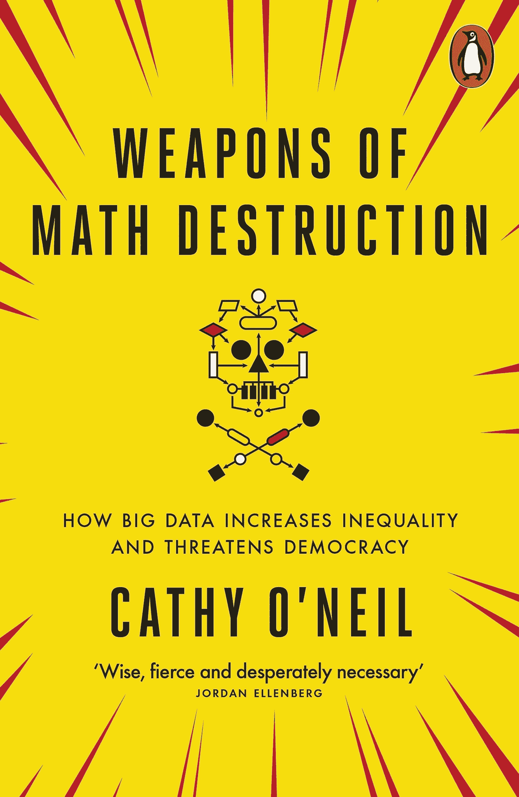
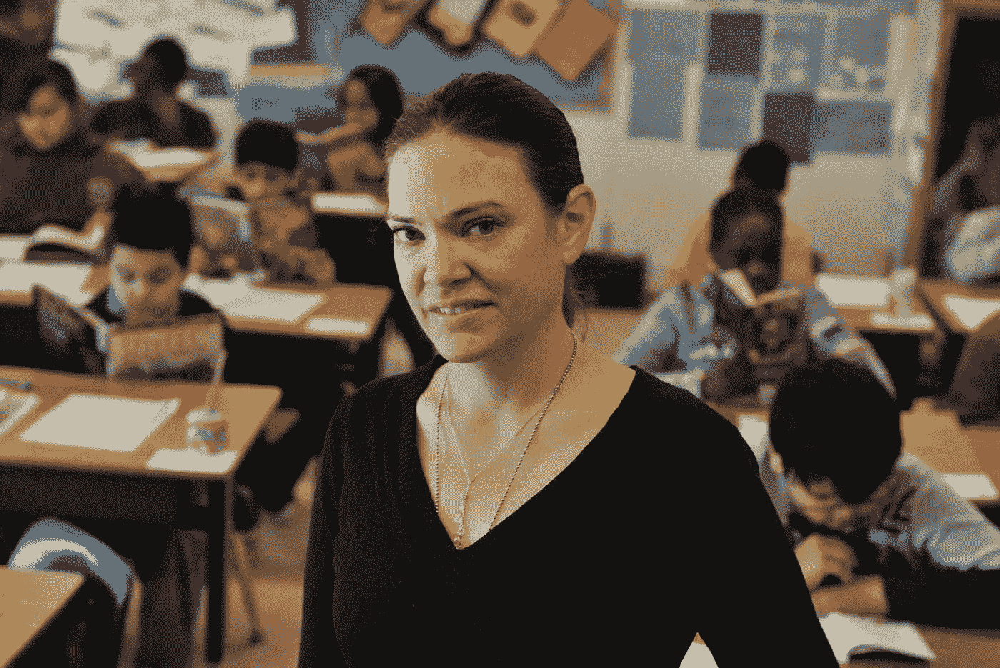

# 一个商业人类学家和一个数据分析师如何在构建算法中一起跳舞？第二部分

> 原文：<https://medium.com/analytics-vidhya/how-can-a-business-anthropologist-and-a-data-analyst-dance-together-in-building-algorithms-part-2-e96c00482931?source=collection_archive---------17----------------------->

## 什么是算法？

算法是一个问题的处理解决方案，通常在处理数据的过程中，同时期待一个输出。由于同一个问题有许多不同的解决方案，每个解决方案都可以用唯一的算法来命名。

简单来说，算法就是达到特定结果的路径。假设你想让你的电脑为你准备一杯咖啡。你如何告诉它该做什么？什么时候做？按什么顺序做？要放什么条件进去？一杯美式咖啡可能有不同的算法，拿铁玛奇朵可能有不同的算法。但最终，我们正在走向自动化。我们只想点一杯咖啡，然后把它拿在手里。我们想忘记剩下的。

对于咖啡，或者任何非人类的东西，都可以。你不会因为某一天的算法错误而介意你的拿铁玛奇朵换一杯浓缩咖啡。但如果你只是因为一个算法而被解雇了呢？还是你的安全受到威胁？如果这是生死攸关的事情呢？

> 那么，您对这些算法的信任程度如何？

Nik 的积木！

## 亚马逊如何开发算法来雇人:

经过几个月的招聘，亚马逊的机器学习专家发现了他们招聘引擎中的一个大问题。

自 2014 年以来，他们一直致力于自动化繁琐的简历审查过程，目的是为他们的工作寻找顶尖人才。

自动化是亚马逊的一个关键意义；从仓库分拣开始，到推动价格决策。但是用人工智能像亚马逊产品一样给求职者打分；一句话，*的想法适得其反*。

一年内，该公司意识到他们的算法没有以性别中立的方式对软件开发工作和其他技术职位的申请人进行评级。

你认为这很容易吗？但是在商业中，速度很重要，显然不是。

在为该算法编码时，亚马逊的计算机模型仅被训练为根据 10 年间提交给该公司的简历中的观察模式来推荐申请人。试图通过遵循以前的模式来做出这个决定，这确实是有意义的。

*能够察觉一个普通人，但不能察觉一个顶尖人才。*

技术市场瞬息万变。男性主导仍然是科技行业的主要趋势，然而，越来越多的女性正在进入这一场景。

亚马逊的系统不知不觉地惩罚了包含“女性”一词的简历，许多潜在的招聘候选人被降级。女人，因为她们是女人，只是不符合算法本身建立的先前模式。

亚马逊最终解散了整个过程，但从这次失败中可以学到很多东西，也就是反馈。

根据 career builder 2017 年的调查，美国近 55%的人力资源经理认为，人工智能、人员分析或决策智能将成为他们未来五年工作的一部分。尽管雇主长期以来一直梦想利用强大的技术来自动化人们周围的决策并减少噪音，但卡内基梅隆大学教授机器学习的计算机科学家 Nihar Shah 警告我们，还有许多工作要做。

> “如何确保算法是公平的，如何确保算法是真正可解释和可解释的——这还很遥远，”他说。

路透社是第一个在亚马逊内部报道这个问题的人，他们发现亚马逊的人工智能小组创建了近 500 个专注于特定工作功能和位置的计算机模型。

然而，这些算法学会了对 IT 求职者中常见的技能赋予很少的意义，而是青睐那些使用男性工程师简历中常见动词的候选人，如“已执行”和“已捕获”。

由于该技术开始几乎随机地返回招聘结果，亚马逊关闭了该项目，目前正在进行更深入的工作。

但是，你希望…性别偏见是唯一的问题！

## 凯茜·奥尼尔著名的中学算法案例:

Cathy O' Neil 是一名数据科学家，她获得了哈佛大学的数学博士学位，在进入私营部门之前曾在巴纳德学院任教，在那里她为对冲基金 D.E. Shaw 工作。后来，她的工作在初创公司有所不同，但她开始建立预测人们购买的模型。她的经历引自她的书*数学毁灭的武器*，

> *“为数据经济提供动力的数学应用是基于易犯错误的人类做出的选择。毫无疑问，其中一些选择是出于好意。然而，这些模型中的许多将人类的偏见、误解和偏见编码到了日益管理我们生活的软件系统中。就像神一样，这些数学模型是不透明的，除了他们领域中的最高牧师:数学家和计算机科学家，他们的工作是不可见的。他们的判决，即使是错误的或有害的，也是无可争议的或不容上诉的。他们倾向于惩罚我们社会中的穷人和受压迫者，而让富人更富。”*

她的著名案例发生在 2007 年，当时华盛顿特区的新任市长艾德里安·芬提决心评估和激励表现，以扭转该市表现不佳的学校。

几乎每两个高中生中就有一个能坚持到九年级毕业，只有 8%的八年级学生数学成绩达到年级水平。

流行的理论是学生学得不够，因为老师足够好。

因此，Fenty 聘请了一位名叫 Michelle Rhee 的教育改革家，她在 2009 年实施了一项计划，淘汰表现不佳的教师。从系统工程的角度来看，这是非常合理的:评估你的老师，淘汰最差的，把最好的放在他们能发挥最大作用的地方。运营中的经典优化案例。

Rhee 与一个软件团队一起开发了一个名为 IMPACT 的教师评估工具，在 2009-2010 学年结束时，该学区解雇了所有分数在倒数 2%的教师。第二年年底，又有 5%或 206 名教师被解雇。

莎拉·威索基是麦克法兰中学的五年级老师，凭良心说，她没什么可担心的。她只在那里呆了两年，但已经得到了校长和学生家长的高度评价。一个评价赞扬了她对孩子们的关注；另一个人说:“我接触过的最好的老师之一。”

**2010-2011 学年末，威索基被学校开除。**

在她的影响评估中，她得到了一个糟糕的分数，软件团队开发的一个新的评分系统称为增值建模，超过了学校管理员和社区的积极评价。

从逻辑上讲，我们能为算法的推理*吗？*

毕竟我们也是人，学校管理者可能会和糟糕的老师成为朋友。家长可能喜欢彬彬有礼的老师，他们看起来很好，但一点也不称职。因此，华盛顿，像许多其他学校系统一样，认为他们正走在正确的道路上，以尽量减少更多的人为偏见，并更多地关注硬结果:*数学和阅读成绩。*数字说话很清楚。

*还是他们干的？*

威索基觉得她的解雇非常不公平，她的努力完全被误判了。她想知道隐藏在增值模式背后的黑箱是什么。她了解到，这个系统是由普林斯顿的咨询公司 Mathematica Policy Research 创建的。该公司面临的挑战是衡量该地区学生的教育进步，并确定他们的进步或退步有多少是学生的功劳。

试图减少人类行为、偏见并提高绩效并不是一件容易的事情。凯茜给我们提供了一个微妙的例子，

> 为了理解 Mathematica 所面临的问题，想象一个生活在华盛顿特区东南部贫困社区的 10 岁女孩。在一个学年结束时，她参加了五年级的标准化考试。然后生活继续。她可能有家庭问题或金钱问题。也许她正从一所房子搬到另一所房子，或者担心一个惹上法律麻烦的哥哥。也许她对自己的体重不满意，或者被学校里的恶霸吓到了。无论如何，第二年她参加了另一次标准化考试，这次是为六年级学生设计的。如果你对比一下测试结果，分数应该会保持稳定，或者有希望会上升。但是如果她的成绩下降，就很容易计算出她和成功学生之间的差距。但这种差距有多少是因为她的老师？”

像这样的问题很难回答。在非人道算法的情况下，甚至更多。

[莎拉·威索基，阅读更多华盛顿邮报的文章。](https://www.washingtonpost.com/local/education/creative--motivating-and-fired/2012/02/04/gIQAwzZpvR_story.html)

像谷歌这样的公司拥有足够大的数据集，他们的研究人员可以进行不断的测试，并监控数以千计的变量。他们只需改变单个广告的字体，并在几分钟内从他们的反馈循环中优化出一个 100 万到 1000 万人的样本规模。他们可以使用该反馈来过滤信号中的噪声，并微调其操作。

在 Mathematica 的例子中，他们只有一些值和数字可以比较。他们试图像威索基一样，通过分析 25 或 30 名学生的测试结果来给老师的有效性打分，这不仅在统计上不合理，而且很可笑。

然而，结果是毁灭性的。威索基和其他 205 名教师被解雇，导致暂时失业，更紧迫的是，没有人能向他们解释为什么被解雇。算法不能听，也不能说话。他们不容易受到环境困境的影响。

[你可以在这里阅读更多关于“语境问题”的内容。](/@kamaltouhid/how-does-a-data-analyst-and-a-business-anthropologist-dance-together-part-1-5d0f991af5cf)

如果自动化系统在令人尴尬和系统化的基础上搞砸了，程序员会回去调整算法。但在大多数情况下，这些程序给出了坚定的结论，而使用它们的人只能耸耸肩说，“嘿，你能做什么？”这恰恰是 Sarah Wysocki 最终从学区得到的回应。

然而，萨拉·威索基只失业了几天。她周围有很多仁慈的人，包括她的校长，为她在北弗吉尼亚的一个富裕地区当老师做担保。

然而，正如凯茜所说，许多时间被浪费了，挫折感直线下降，一所贫困的学校失去了一位好老师，而一所富裕的学校，它不会根据学生的分数解雇人，却得到了一位好老师。

## 有效性的错觉是什么？

像亚马逊的员工招聘或凯茜的学校案例这样的调查向我们指出了人性中固有的经典认知偏见；被称为*有效性错觉。*

阿莫斯·特沃斯基和丹尼尔·卡内曼在 1973 年发表的一篇论文中首次描述了“有效性错觉”这一概念。

这种偏见的存在是因为经典的确认偏见——寻找符合我们预测的信息的愿望，以及代表性启发法——基于一种情况与其他情况的相似程度进行预测。

甚至当个体意识到他们的数据的预测能力的客观限制时，这种效应仍然存在。

**由于这个原因，一个现象在没有主观验证的情况下很可能接近准确，简单的模型在预测结果方面往往比专家意见更有效。**

在亚马逊的案例中，用于训练算法的观察模式是基于十年前的招聘决定。不足为奇的是，算法并不比人类更好，因为认知偏见已经存储在算法中，因为十年前女性软件工程师非常少。

在凯茜的学校老师的例子中，效率只是根据学生的表现来衡量的。这种有效性的幻觉不仅仅来自软件团队的逻辑感知，它甚至更深层次。分数系统、CGPAs 和其他量化教育的方法是一个长期存在的问题，教育本身从根本上来说是主观的。

## 如果一名商业人类学家和一名数据分析师出现在犯罪现场，这些问题能得到解决吗？

直到今天，公平还是一个难以捉摸的概念。而对于算法来说，则更多。随着我们学习开发越来越多的算法，法国文化理论家保罗·维里略(Paul Virilio)的一句经典名言是:

> “当你发明了船，你也发明了海难；当你发明了飞机，你也发明了飞机失事；而当你发明了电，你就发明了电刑……每一项技术都带有自己的负面性，它是与技术进步同时发明的。”

夏洛克和沃森，图片来自《每日野兽》

在开发算法时，通常根据其准确性(正确结果的百分比)、精确度(不将阴性样本标记为阳性的能力)或召回率(找到所有阳性样本的能力)来判断质量。要决定这三个衡量标准中哪一个是公平的最佳代表，需要对算法要满足的需求进行适当的情境化。

在给定的情况下，没有业务人类学家和数据分析师；即使工程师和开发人员完美地收集了数据，并将其输入到一个完美的预测机器学习模型中，该算法仍然会受到产生数据的环境中所体现的偏见的影响。

此外，随着时间的推移，与数据量相关的偏差影响将会加剧。

商业人类学家和数据分析师梳理给定的定量和定性数据，并使用适当的方法来揭示社会问题，如种族偏见、基于地理的歧视和排斥，这些问题在我们周围的世界中根深蒂固，并为我们提供上下文相关的社会解决方案。

加州大学洛杉矶分校的人类学教授杰弗里·布兰廷汉姆致力于开发一种名为 PredPol 的预测性警务系统。结果发现，尽管吸毒率相似，但黑人因涉毒犯罪被捕的比率是白人的四倍。

该算法没有考虑到，与城市中的其他地方相比，预测犯罪强度较高的社区的文盲率和经济犯罪率也较高。

*相关性总是意味着因果关系吗？你给我答案。*

## 结论:

因此，我们可以研究三个明确的挑战，一旦一个商业人类学家和一个数据分析师被引入到一个软件团队中，就可以提高算法的公平性。

首先，我们必须超越算法创造思维模式和它所产生的结果，而是转向“算法学习思维模式”,与算法正在做的事情保持同步。是学习。

一个商业人类学家有一个社会和文化的镜头，一个数据分析师有工具和技术来梳理以前从未想象过的数据。

在理想的情况下，他们都知道在软件世界中容易解释和说明的启发和偏见。

机器学习工程师不断做出逻辑决策，但有时很容易在流程图中迷失自己，当逻辑本身是上下文相关的:正如路德维希·维特斯坦根的著名解释。

其次，我们必须做得更好，以确保所用数据的质量。需要作出额外努力，建立如何解释来自代表性不足群体的数据的模型。模型也可以定期接受同行评审，类似于科学研究的协议。实施后审计不应该仅仅由工程度量来判断，还应该由谁以及如何受到影响来判断。

第三，算法是个大生意。但是，是时候重视商业伦理的研究了，因为一旦习惯了，算法可能就像灯泡一样，在我们没有意识到的情况下，不知不觉地存在并塑造着我们的生活。

*就像我们在全球消费糖一样，我们将再次生活在一个有缺陷的系统中。*

在一个由法律和惯例统治的世界里，立法者可能没有预见到算法的无处不在和强大的力量，但他们可以包括在受宪法保护的环境中知道什么数据被用作输入和输出的权利。这可能是一个开始。

坏消息是，算法远非完美。

随着我对人员分析的深入研究，在解决人才管理问题的同时，在绩效评估中，各种测试和选择方法的组合仍然留下了许多无法解释的绩效。沃顿商学院的马修·彼德维尔教授说，认知能力测试仍然不能预测超过 30%或 40%的表现差异。

但更坏的消息是，算法仍然比人强。

随着我们深入大数据时代，我确实意识到对算法的需求。

卡尼曼、泰勒和特沃斯基很好地向我们展示了人类自身的偏见。多伦多大学的米奇·霍夫曼教授已经研究了算法的实施如何减少呼叫中心的人员流动。

问题是，我们期待全世界的算法莱特兄弟使用自动驾驶仪，然而，还有许多年的工作要做。

我们仍然需要手动驾驶，还有更多的调查要做，当我们最终可以打开自动驾驶模式来为我们做出算法决定的时候。

正如一架飞机需要不断地根据周围的反馈进行修正，手动自动驾驶需要不断地意识到，我们也需要耐心，评估并希望有一个可能的未来。

为了缩小算法的现在和未来之间的差距，一个商业人类学家和一个数据分析师需要一起立即构建算法；现在。