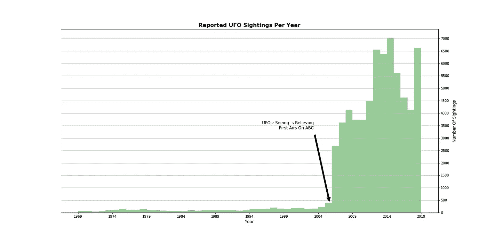
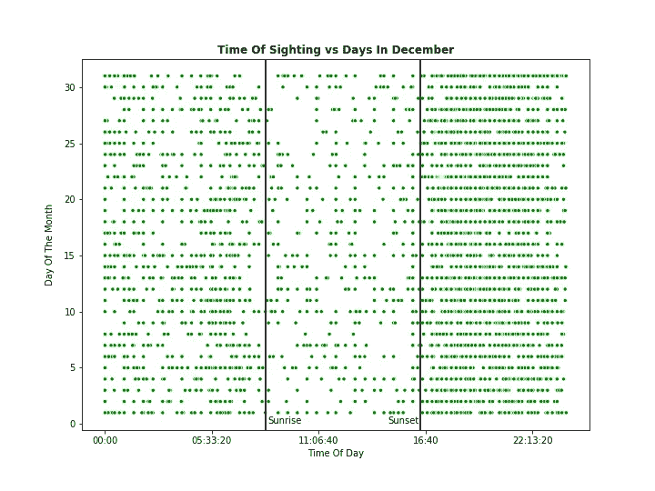
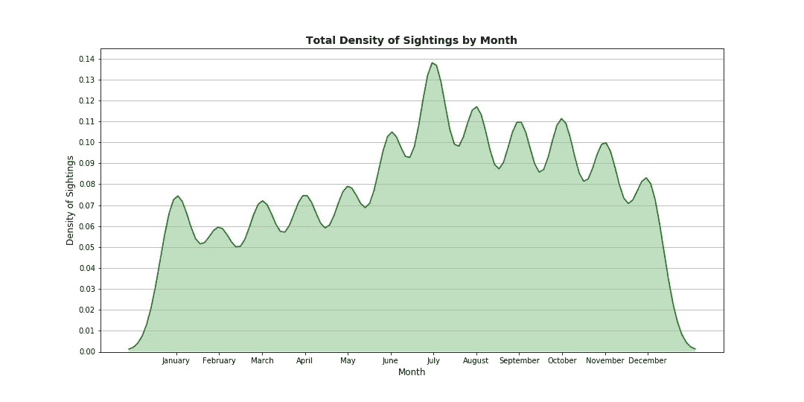
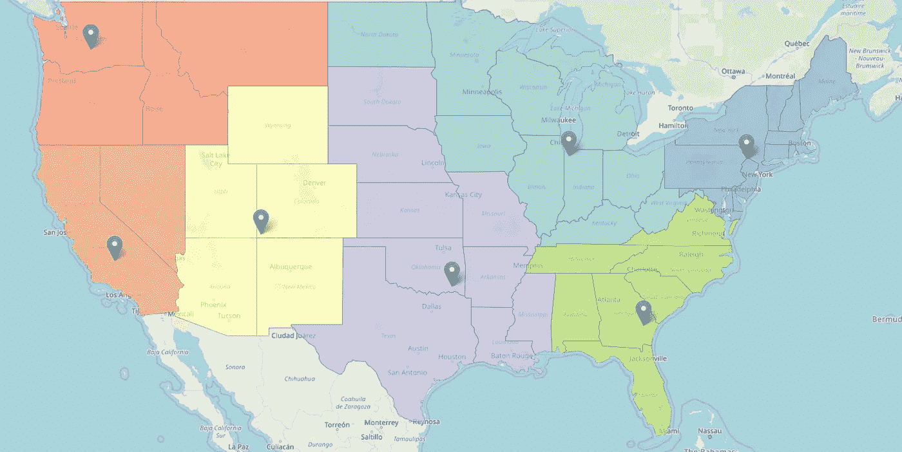
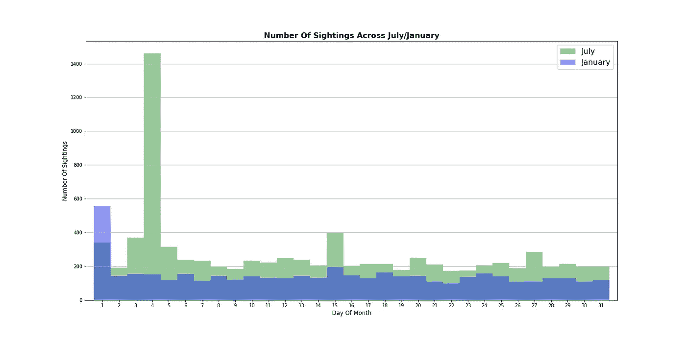
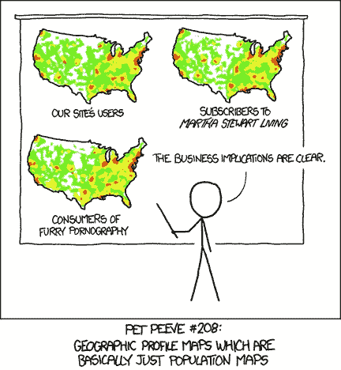
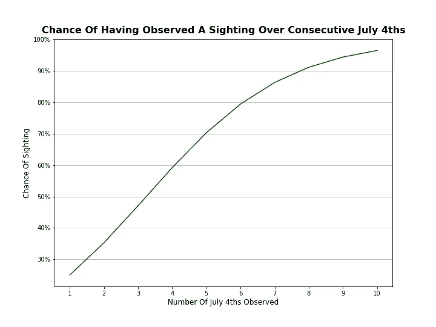
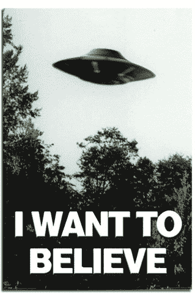

# 我怎样才能看到不明飞行物？

> 原文：<https://medium.com/analytics-vidhya/how-can-i-see-a-ufo-f8518b1e1920?source=collection_archive---------22----------------------->

## 预测目击事件的半开玩笑的方法

在过去的 50 年里，国家不明飞行物报告中心平均每年记录 1329 起不明飞行物目击事件。在过去 10 年中，这一数字上升到平均 4，914 次，最近在 2014 年报告的目击事件高达 7，022 次。这给了我们自 2010 年以来每天平均 13 次独特的目击事件，相比之下，每天平均只有 3 次独特的目击事件。

我认为，报告目击事件的增加更多地与[互联网接入](https://ourworldindata.org/internet)的增加有关，结合美国广播公司纪录片《UFO:眼见为实 *中的 NUFORC。*这部纪录片为 NUFORC 网站带来了大量流量，极大地提高了他们的知名度。那么，这种报告目击事件的增长趋势就代表了这一点；越来越多的*报道了*目击事件，而不是即将到来的外星人入侵的警告信号。

根据美国人口普查局的最新人口估计，目前美国大约有 2.54 亿成年人。20 世纪福克斯委托进行的一项 2017 年美国人对不明飞行物信仰的调查表明，近 17%的美国成年人相信他们见过不明飞行物；~ 4300 万人。用我们每年平均报告的目击次数(4914 次)除以这个数字，我们发现，在近 8800 名有目击经历的人中，只有 1 人真正报告了目击事件。

我们现在已经确定，虽然很少有人报告，但肯定有大量目击事件发生。足够了，在合适的时间，合适的地点，也许你也可以有一个！

## 如果我想亲身经历一次目击，我下一步该怎么做？

从 NUFORC 收集的数据中，我们可以立即发现一些有价值的东西。

不出所料，目击事件在夜间更为常见，在日落时急剧增加，并在整个晚上缓慢下降，直到日出时突然平静下来。

令人惊讶的是，尽管夜晚变短，目击事件似乎在夏季显著增加。

## 但是我要去哪里才能看到呢？

[这里互动](https://austiezr.github.io/Chloro)

一个快速的 K-均值聚类告诉我们东北部(约 25%的目击事件)是应该去的地方！因此，如果我计划去旅行体验一些未知的空中现象，我应该在七月拍摄一个美好温暖的夜晚，也许是在哈德逊河的岸边。但是为什么呢？

这种现象是否有一个方面是对气温升高、白昼变长做出的反应？(可能吧。)

我们只是在夏天更多的在外面吗？(大概吧。)

是否有其他天体事件发生在高峰月份，容易被误识？(当然——英仙座流星雨和德尔塔宝瓶座流星雨都发生在 7 月中旬到 8 月中旬)。

**会是什么呢？！**

事实证明，7 月 4 日的 **~7 倍于该月其他任何一天的**目击事件。1 月 1 日也有一个相应的上升(尽管小得多)——午夜烟花为新年前夜画上句号。在我处理的大约 68，000 次目击事件中，7 月份占所有报告目击事件的 12.5%，仅 7 月 4 日一天就占总数的 2%，令人震惊。最重要的是，这次目击事件的地理热图看起来可疑地像人口地图。

我认为其中的含义很清楚。

[资料来源:xkcd](https://xkcd.com/1138/)

# 不明飞行物喜欢烟火。

不幸的是，不明飞行物也碰巧看起来像烟花。经常。7 月 4 日最常报道的出现被描述为“光”(21%)和“火球”(17%)。

## 我怎么知道我看到的是 UFO 而不是烟火？

贝叶斯定理的一个快速且非常有问题的应用，假设我们之前的目击率为 17%，假阳性率为 38%(7 月 4 日在东北部的目击率最有可能是烟火)，在 10 年漫长的 7 月 4 日监视后，返回目击概率为 96.48%。也许更令人鼓舞的是，在 7 月 4 日独自度过了一个警惕的孤独之后，我们已经看到了 25%的机会。

这里的主要观点似乎是，目击者是不可靠的，绝大多数未识别的空中现象实际上是错误识别的空中现象。

或者，也许，不明飞行物喜欢烟火。

但是，如果你想有自己的个人[亲密接触](https://en.wikipedia.org/wiki/Close_encounter)，最谨慎的做法是今年 7 月 4 日前往东北，向上看，*相信*。

上面使用的[数据](https://data.world/timothyrenner/ufo-sightings)是由[蒂姆·伦纳](https://timothyrenner.github.io/)提供的，他的工作是一种激励。我排除了所有不完整的报告，即不包含目击事件的报告，不指定日期或地点的报告等。这里有我的笔记本。

如果你想了解更多关于 UFO 现象的信息，NUFORC 和 MUFON 都有很多可用的资源。Jacques Vallée 的作品一直是我个人的灵感来源。如果你认为你遇到了，并想报告，NUFORC 的提交表格是[这里](http://www.ufocenter.com/reportform.html)。